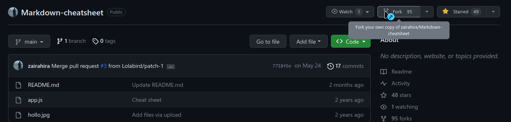
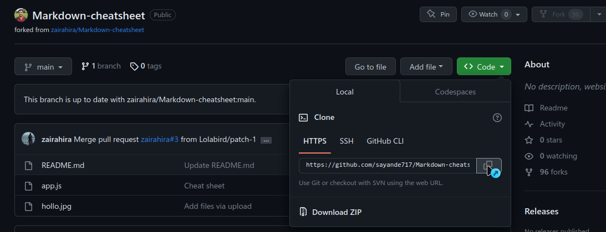
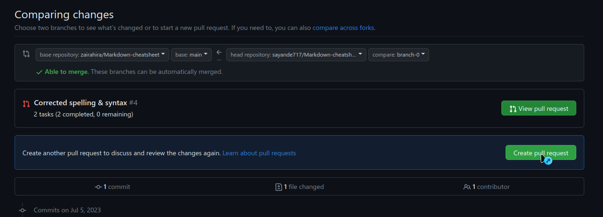
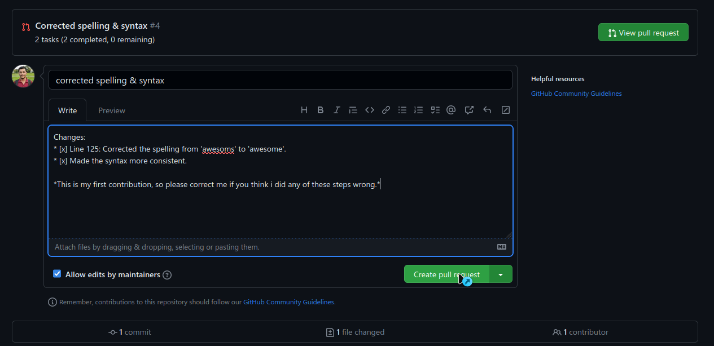

# **Git & Github** Cheat Sheet
- [Why Git?](#why-git)
- [Contribute to a repository](#contribute-to-a-repository)
- [Create your own repository and commit to it](#create-your-own-repository-and-commit-to-it)
- [Things to remember](#things-to-remember)

## Why Git?
1. You can maintain the history of your project. Afterwards, you can go back in time to check which person made which kind of change to which file in the project, what kinds of changes were made, etc.
2. It's a version control system, where you basically capture a snapshot of a project and store it as a 'version'.
3. `Git` is a version control system, and `Github` is the front-end platform that allows us to see & manage the repositories.

## Contribute to a repository
1. Fork the Repository to your own account. This creates a clone of the repository **in your own GitHub account**.
   

2. Get the HTTPS link for the forked repository, then clone it to your own system. <br>
    ```bash
    $ git clone <LINK-TO-REPOSITORY>
    ```
   
   **Note:** Once the project has been cloned, you can do everything else on your own system.

3. Check the `README.md` for the project. If it has a `CONTRIBUTING.md` guide, go through it.

4. Make the necessary changes to the files.

5. Stage your changes, then commit them. <br>
   ```bash
   $ git status # Check status
   $ git add . # Add your changes
   $ git commit -m 'MESSAGE' # Commit your changes with a message
   ```

6. You can't push your changes directly in the main branch of the repository, since it will lead to a lot of errors & conflicts. So, you need to create a new branch. Here's how you do it: <br>
   ```bash
   $ git branch <BRANCH-NAME> # Try to keep the branch name relevant.
   $ git checkout <BRANCH-NAME> # Optional, this tells git to push all future commits to this branch.
   ```

7. Finally, push your changes to the branch you created. <br>
   ```bash
   $ git push origin changes # Assuming the branch name is 'changes'.
   ```

8. The final step is to submit a pull-request. You need to do this on the Github page.
   > A pull request is a way for you to tell the project maintainers that you have made some changes and would like them to review & integrate them in the main branch of the remote repository. <br>
   > Once you submit a pull request, you will have to check up with the maintainers from time to time, and make further changes if they need you to. <br>
   - First, create a new pull request. <br>
    <br>
   - Next, write a title & description of what changes you made. Check the `CONTRIBUTING.md` (if there is one) to see if there is a syntax that must be followed here. <br>
   

9. Now that your pull request is created, you will automatically be subscribed to notifications regarding to any activity. Once the commit is reviewed by the maintainers, they will merge your commit with the original project.
   

<hr>

## Create your own repository and commit to it
> Note: Since we're pushing to a new repository we just created, we will be committing directly to the main branch. However, under normal circumstances, you should never directly commit to the main branch since the code is used by software that runs in production. You should always create your own branch and add a pull request for your code to be merged with the main branch. Check [above](#contribute-to-a-repository) for more details.

1. Create a new repository on [Github](https://github.com/) by going to `Profile` > `Your Repositories` > `New`.
   <br> 

2. Clone the repository to your local machine. This effectively creates a folder with the same name as the remote repository, and set the *checkout* branch to main.
   Note: Checkout branch: The branch git is set to push all the committed changes to, unless specified otherwise.
   ```bash
   # Put your own Repository URL here
   $ git clone https://github.com/sayande717/temp.git
   ```

3. Switch to the repository, make some changes.
   ```bash
   $ cd temp  # Change to the directory
   $ echo "hello, world!" >> file.txt # Create a new file and add a line to it
   ```

4. Add your files & commit them.
   ```bash
   $ git add .   # Add all files
   $ git commit -m 'ADD: file.txt' # Commit them with a message
   1 file changed, 1 insertion(+)
   create mode 100644 file.txt
   ```

5. Push your changes to the main branch. After this, you can see the changes in your remote repository.
   ```bash
   $ git push origin main  # Push to the main branch
   Enumerating objects: 3, done.
   Counting objects: 100% (3/3), done.
   Writing objects: 100% (3/3), 226 bytes | 226.00 KiB/s, done.
   Total 3 (delta 0), reused 0 (delta 0), pack-reused 0
   To https://github.com/sayande717/temp.git
   * [new branch]      main -> main
   ```

## Things to remember
- `git status`: Use this to check the current status at any time, as long as you're in the repository.
- `git log`: Use this to get a history of all commits you made, in your local machine.
- If you're contributing to a repository that's not yours, make sure you create a separate branch before committing (i.e. never commit to the main branch). Also, if you're working on distinct features/files within the same repositories, create separate branches for each of them.
- A pull request can be associated with only 1 branch, so if you make further changes on the same branch, git will auto-link it to your current pull request.
- Make sure you sync your forked repository from time to time to stay up-to-date with the upstream repository.