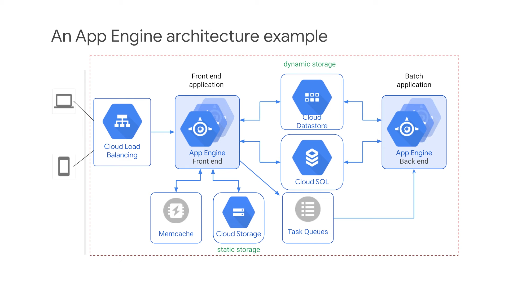

# Notes on **DevOps** 

- [Roadmap](#roadmap)
- [Notes:](#notes)
- [Sources:](#sources)
- [**TOPIC 1**: Cloud Computing](#topic-1-cloud-computing)
  - [Characteristics](#characteristics)
  - [IaaS: Infrastructure as a Service](#iaas-infrastructure-as-a-service)
  - [PaaS: Platform as a Service](#paas-platform-as-a-service)
  - [SaaS: Software as a Service](#saas-software-as-a-service)
  - [IaaS: Compute Engine](#iaas-compute-engine)
  - [PaaS: App Engine](#paas-app-engine)

## Roadmap
- Version Control
- Linux
- Coding (Atleast 1 major language)
- Agile Development (basic)
- [Cloud Computing](#topic-1-cloud-computing)
- Operations (Servers, networking)
  - Get cloud certified somewhere.
- Databases
- Docker
- Kubernetes
- Infrastructure as Code
  - Terraform
- Configuration Management
  - Example: Ansible
- CI/CD (Continuous Integration, Continuous Deploymeny)
  - Learn Jenkins, a tool that automates the testing phase.
- Monitoring solution
  - Learn how to use a monitoring tool (Elk)

## Notes:
- Develop an automation mindset, automate repetitive tasks.
- Learn Python because it's used everywhere in DevOps.
- Opinions are based around experiences, so only take advise from people who are already in the field of DevOps.

## Sources:
- [Kimo.ai](https://kimo.ai/paths/645261c965af3919a227152a)
- [NPTEL](https://onlinecourses.nptel.ac.in/noc23_cs90/)
- [Kunal Kushwaha]()

## **TOPIC 1**: Cloud Computing
### Characteristics
- A cloud is just someone else's computer.
- Remote servers handle all the processing & storage needs, so the customer does not have to invest in expensive hardware.
- Computing resources are rented out from a particular datacenter for use by the customer. The customer does not need to think about maintenance or availability of the hardware equipment. They can use the computing power to fulfill their own objectives.
- Datacenters are located in various geographical locations.

### IaaS: Infrastructure as a Service
- Raw computing instances are provided (CPU, memory, network, etc.).
- The customer manages the OS, environment as well as the application.
- Example: Compute Instance
- Model: Pay for what you allocate.

### PaaS: Platform as a Service
- The OS & Environment are managed by the cloud service provider.
- The customer manages the application only.
- Example: App Engine
- Model: Pay for what you use.

### SaaS: Software as a Service
- The OS & Environment, as well as the application are managed by the cloud service provider.
- The customer only brings in the data to the system.
- Example: Managed Services, SAP, SalesForce
- Model: Pay for what you use.

### IaaS: Compute Engine
- A Computing Engine is a dedicated piece of hardware that can be fully controlled by the user.
- It has it's own dedicated vCPU, RAM, GPU, etc and is connected to the network using a network adapter.
- Virtual Machines are useful when the service we're trying to run has specific software dependencies, or cannot be packaged into a container.

### PaaS: App Engine
- App Engine allows us to run our code while the infrastructure is managed by the service provider.
- The resources are automatically scaled as needed.
- App Engine can be run in Standard & Flexible environment.
- Standard Environment: Fully-managed by the service provider, can scale to zero, but specific versions of specific languages are supported and configuration changes are limited. We can't write to the persistent disk.
- Flexible Environment: Supports Docker containers. We can run any programming language within the container. More configuration options are available, and we can write to the persistent disk.
- **(Figure) App Engine Architecture:-**
