<!-- ID: 7 -->
<!-- Time format: MM:SS -->

# Logical Reasoning
- Syntax:
    - [Positions] ... [Change]
## Number Series
### Type 1
- Syntax:
    - [Positions] ... [Change]
    > Example
1. 544 509 474 439:
    - 1,2,3 ... $-45$
1. 14,28,20,40,32,64:
    - 1,2,3 ... $*2$
1. 80,10,70,15,60:
    - 1,3,5 ... $-10$
    - 2,4,6 ... $+5$
1. 8,6,9,23,87:
    - 1,2,3 ... $m=1 >> n*m-(m+1)=(n+1) >> m=m+1$
    > $8*1-2=6, 6*2-3=9, 9*3-4=23$

### Type 2

1. 21 25 18 29 33 18:
 - 1,4,7,... $+8$
 - 2,5,8 ... $+8$
 - 3,6,9 ... $=18$

### Type 3

1. 42 40 38 35 33 31 28:
    - 1,2,4,5 ... $-2$
    - 3,6,9 ... $-3$
1. 8 12 9 13 10 14 11:
    - 1,3,5 ... $+1$
    - 2,4,6 ... $+1$
1. 3 5 35 10 12 35 17:
    - 1,4,7 ... $+7$
    - 2,5,8 ... $+7$
    - 3,6,9 ... $35$
1. 4 7 26 10 13 20 16:
    - 1,4,7 ... $+6$
    - 2,5,8 ... $+6$
    - 3,6,9 ... $-6$
1. 16 26 56 36 46 68 56:
    - 1,2,4,5 ... $+10$
    - 3,6,9 ... $+12$
1. 17 14 14 11 11 8 8:
    - 1,2 ... $-3$
    - 2,3 ... $=$
    - 3,4 ... $-3$

### Type 4

1. 664, 332, 340, 170, \_, 89:
    - 1,2 ... $/2$
    - 2,3 ... $+8$
    - 3,4 ... $/2$
1. 70, 71, 76, \_, 81, 86, 70, 91:
    - 1,4,7 ... $70$
    - 2,5,8 ... $+10$
    - 3,6,9 ... $+10$
1. 83, 73, 93, 63, \_, 93, 43:
    - 1,4,7 ... $-20$
    - 2,5,8 ... $-20$
    - 3,6,9 ... $93$

### Type 4

1. 4, 7, 25, 10, \_, 20, 16, 19:
    - 1,2 ... $+3$
    - 3,6 ... $-5$
    - 3,4 ... $+3$
1. 0.15, 0.3, \_, 1.2, 2.4:
    - 1,2,3,4 ... $*2$

## Letter & Symbol Series
### Type 1

> Positions: In SCD, TEF, S: 1, C: 2, D: 3, T: 4, E: 5, F: 6
1. SCD, TEF, UGH, \_\_\_, WKL:
    - 1,4,7 ... $+1$
    - 2,5,8 ... $+2$
    - 3,6,9 ... $+2$

1. $B_2 CD$, \_\_\_, $BCD_4$, $B_5CD$, $BC_6D$:
    - 1,2,3 ... static
    - Subscripts:
        - 1,5,9 ... $+1$
        - 10,14,18 ... $+1$

1. FAG, GAF, HAI, IAH:
    - 123,654: reverse
    - 1,7,13 ... $+2$

1. $ZA_5$, $Y_4B$, $XC_6$, $W_3D$:
    - 1,3,5,7 ... $-1$
    - 2,4,6,8 ... $+1$
    - Subscripts:
        - 2,6,10 ... $+1$
        - 3,7,11 ... $-1$

### Type 2
1. Image obtained from [here](https://www.indiabix.com/_files/images/logical-reasoning/5-90-q-1.png)
    <br>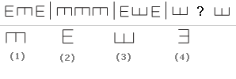<br>
    - Directions:
        - L: Left
        - R: Right
        - U: Up
        - D: Down
    - RDR, DDD, RUR, UUU ... *pattern repeats*
1. Image obtained from [here](https://www.indiabix.com/_files/images/logical-reasoning/5-89-q-1.png)
    <br>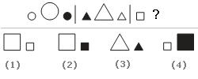<br>
    - Filled or not:
        - F: Filled
        - U: Unfilled
    - Size: 
        - s: small
        - B: big
    - suBUsf, sfBUsu, suBUsf, sfBUsu ... *pattern repeats*
1. Image obtained from [here](https://www.indiabix.com/_files/images/logical-reasoning/5-95-q-1.png)
    <br>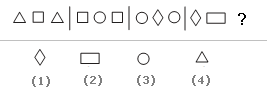<br>
    - Shapes:
        - T: Triangle
        - S: Square
        - P: Parallelogram
    - TST, SCS, CPC, PSP ...
    - The shape in the middle (S in TST) moves to the edges (S in SCS) in the next iteration, and so on.
1. Image obtained from [here](https://www.indiabix.com/_files/images/logical-reasoning/5-98-q-1.png)
    <br>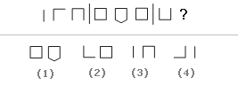<br>
    - Sides: 1,2,3,4,5
    - 123,454,321 ... *pattern repeats*
1. Image obtained from [here](https://www.indiabix.com/_files/images/logical-reasoning/5-93-q-1.png)
    <br>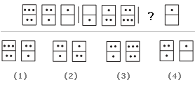<br>
    - Number of dots: 1,2,3
    - Top Row: 321,123,321,123 ... *pattern repeats*
    - Bottom Row: 210,123,210,123 ... *pattern repeats*
1. Image obtained from [here](https://www.indiabix.com/_files/images/logical-reasoning/5-94-q-1.png)
    <br>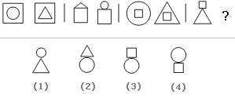<br>
    - Position:
        - i: inside another shape
        - o: outside another shape
    - Shapes:
        - C: circle
        - T: triangle
        - S: Square
    - CiS TiS, ToS CoS, SiC SiT, SoT SoC ... *pattern repeats*
1. Image obtained from [here](https://www.indiabix.com/_files/images/logical-reasoning/5-94-q-1.png)
    <br>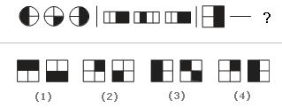<br>
    - Number of parts filled: 1,2
    - 212,212,212 ... *pattern repeats*

## Artificial Language
### Type 1
1. Here are some words translated from an artificial language.
`gorblflur` means `fan belt`
`pixngorbl` means `ceiling fan`
`arthtusl` means `tile roof`
Which word could mean "ceiling tile"?
- gorbl: fan
- pixn: ceiling
- arth: tile
- So, the word is `pixnarth`.

### Type 2
1. Here are some words translated from an artificial language.
`slar` means `jump`
`slary` means `jumping`
`slarend` means `jumped`
Which word could mean "playing"?
- y: ing
- end: ed
- So the word is `clargy`.

## Analogies
### Type 1
1. yard is a larger measure than inch.
1. quart is a larger measure than ounce.
1. elated is the opposite of dependent.
1. enlightened is the opposite of ignorant.

### Type 5
1. dalmation is a type of dog.
1. flinch is a type of bird.
1. spy acts in a cladestine way.
1. accountant acts in a meticulous way.
1. dirge is a song used in a funeral.
1. jingle is a song used in a commercial.
1. asinine means extremely silly.
1. ephemeral and immortal are antonyms.
1. feral and tame are antonyms.

## Logical Games - Discussion
1. Five roommates Randy, Sally, Terry, Uma, and Vernon each do one housekeeping task mopping, sweeping, laundry, vacuuming, or dusting one day a week, Monday through Friday.
    - Vernon does not vacuum and does not do his task on Tuesday.
    - Sally does the dusting, and does not do it on Monday or Friday.
    - The mopping is done on Thursday.
    - Terry does his task, which is not vacuuming, on Wednesday.
    - The laundry is done on Friday, and not by Uma.
    - Randy does his task on Monday.
    - What task does Terry do on Wednesday?
    - Here, Terry does his task on Wesnesday. Sally does the **dusting**, **mopping** is done one Thursday, **laundry** is done on friday, and **Terry does not vacuum**. So, in the end, **only mopping** is left to be done by Terry.


# Verbal Reasoning
## Syllogism
### Type 1
1. Some actors are singers. All the singers aredancers. Conclusion:
    ```diff
    + Some actors are dancers.
    - No singer is actor.
    ```
    
1. All cars are cats. All fans are cats. Conclusion:
    ```diff
    - All cars are fans.
    - Some fans are cars. 
    ```
    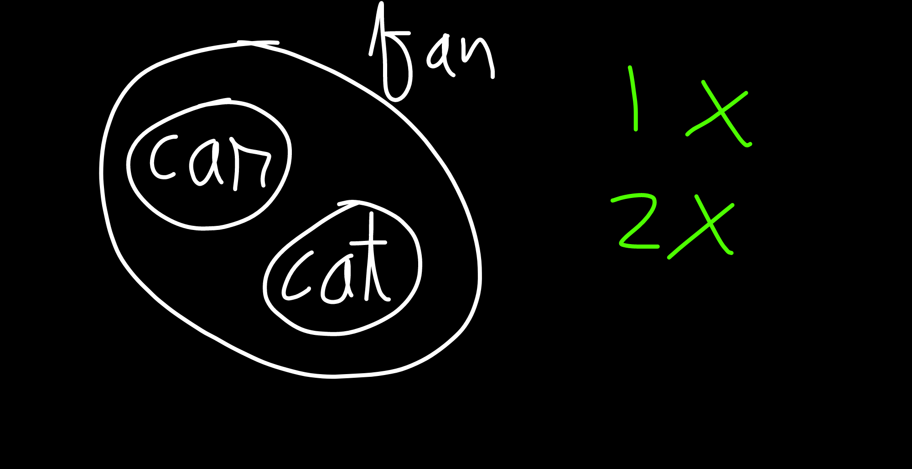
1. All the research scholars are psychologists. Some psychologists are scientists. Conclusion:
    ```diff
    - All the research scholars are scientists.
    - Some research scholars are scientists.
    + Some scientists are psychologists. 
    + Some psychologists are research scholars.
    ```
    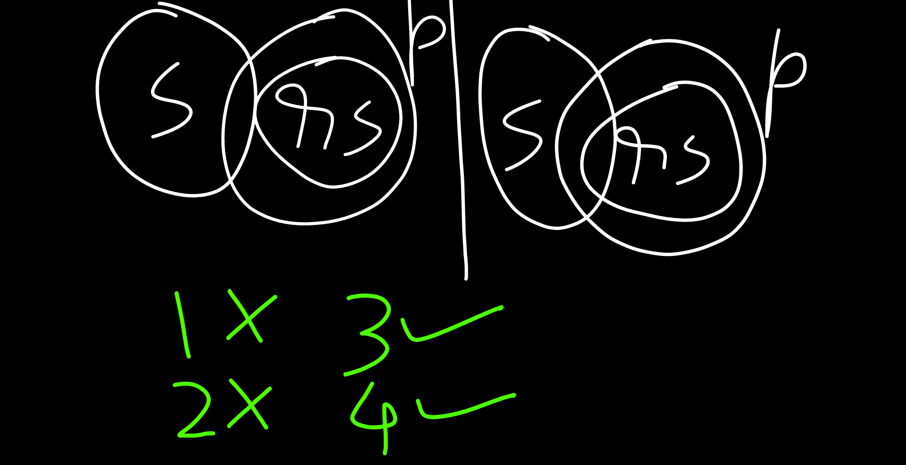
## Logical Sequence of Words
1. Newly married Couple, Family, Caste, Clan, Species
    - Relation: Belongs to
1. Si Units of measurement: 
    - Exa ($10^{18}$)
    - Peta ($10^{15}$)
    - Tera ($10^{12}$)
    - Giga ($10^{9}$)
    - Mega ($10^{6}$)
    - Kilo ($10^{3}$)
    - Hecto ($10^{2}$)
    - Deca ($10^{1}$)
    - Unit ($10^{0}$)
    - Deci ($10^{-1}$)
    - Centi ($10^{-2}$)
    - Milli ($10^{-3}$)
    - Micro ($10^{-6}$)
    - Nano ($10^{-9}$)
    - Pico ($10^{-12}$)

## Analogy
1. Carbon:Diamond::Corundum:Ruby, is used in making
1. Eye:Myopia::Teeth:Pyorrhoea, can have disease
1. Cassock:Priest::Gown:Graduate, is worn by
1. CEDH:HDEC::????:PNRV, reverse order
1. DFHJ:LNPR::TVXZ:????, D -> L: +8, while D->F,F->H,H->J: +2. So, move forward 8 steps from T, then keep adding +2.

## Arithmetic Reasoning
1. A girl counted in the following way on the fingers of her left hand : She started by calling the thumb 1, the index finger 2, middle finger 3, ring finger 4, little finger 5 and then reversed direction calling the ring finger 6, middle finger 7 and so on. She counted upto 1994. She ended counting on which finger?
    - If we take the thumb, then the numbers are counted like: $1,9,17,25$, etc.
    - The equation is $8n+1$, n starts from 0.
    - So, $8n+1=1994$, $n=249(+1)$. So, she counts till 1 finger after the thumb, ie the index finger.
1. What is the product of all the numbers in the dial of a telephone?
    - The digit `0` is included among the dial, so the product is `0`.

## Direction Sense
1. Golu started from his house towards North. After covering a distance of 8 km. he turned towards left and covered a distance of 6 km. What is the shortest distance now from his house?
    - The shortest distance is the hypotenuse of the triangle. $\sqrt {8^2+6^2}$
1. One evening before sunset Rekha and Hema were talking to each other face to face. If Hema's shadow was exactly to the right of Hema, which direction was Rekha facing?
    - If Hema's shadow was to the right of Hema, it means the sun was on the left of both of them.
    - Rekha was facing the South direction.
1. One morning Udai and Vishal were talking to each other face to face at a crossing. If Vishal's shadow was exactly to the left of Udai, which direction was Udai facing?
    - The sun is to the right of both of them. So this is the east direction.
    - If Vishal's shadow is to the left of Uday, it can only happen when Uday is facing the North and Vishal is facing the South.

# Verbal Ability 
## Spotting Errors
1. One of the members expressed doubt **that** the Minister was an atheist.
1. According to the Bible, it is **the** meek and humble who shall inherit the Earth.
1. He persisted **in doing it** in spite of my advise.
1. The reason **why** Ram is absent from his duty is because he is unwell.
1. May I **please** know who you want to see?

# Quantative Aptitude
## Power Cycle: Used to calculate powers of big numbers, like $2369^{456}$
- In $2369^{456}$, $2369$ is the base number, while $456$ is the exponent (power).
- Unit digit in base number -> unit digit in result:
    - 0,1,5,6 -> 0,1,5,6 
    - 4 -> 4 ($4^1$/odd exponent),6 ($4^2$/even exponent)
    - 9 -> 9 ($9^1$/odd exponent),1 ($9^2$/even exponent)
    - 2 -> 2 ($2^1$), 4 ($2^2$), 8 ($2^3$), 6 ($2^4$ / $2^0$) and the cycle repeats for 5,6,7,8 ...
    - 3 -> 3 ($3^1$), 9 ($3^2$), 7 ($3^3$), 1 ($3^4$ / $3^0$) and the cycle repeats for 5,6,7,8 ...
    - 7 -> 7 ($7^1$), 9 ($7^2$), 3 ($7^3$), 1 ($7^4$ / $7^0$) and the cycle repeats for 5,6,7,8 ...
    - 8 -> 8 ($8^1$), 4 ($8^2$), 2 ($8^3$), 6 ($8^4$ / $8^0$) and the cycle repeats for 5,6,7,8 ...
- The sum of the first powers of the first 100 natural numbers: $1+2+3+4+5+...+100$
- The sum of the first powers of the second 100 natural numbers: $1^2+2^2+3^2+4^2+5^2+...+100^2$
- The sum of the first powers of the third 100 natural numbers: $1^3+2^3+3^3+4^3+5^3+...+100^3$
    - The unit digit in this case will always be 0, since the result is the unit digit of $1^3+2^3+3^3+4^3+5^3+6^3+7^3+8^3+9^3+10^3 ... * 10$, which will always end with $0$.
- Example: $2367^{456}$:
    - The unit digit in the base number is $7$.
    - $456\%4=0$, which means the unit digit of the result will be $1$.
- Example: $554^{26}$:
    - The unit digit in the base number is $4$.
    - $26$ is even, which means the unit digit of the result will be $6$.

## Double Factorial
- Simple factorial: $8!=8*7*6*5*4*3*2*1=40320$
- **Double Factorial**: $8!!=8*6*4*2=384$
- To calculate the number of factors of a number:
    - Example 1: **510**
        <br>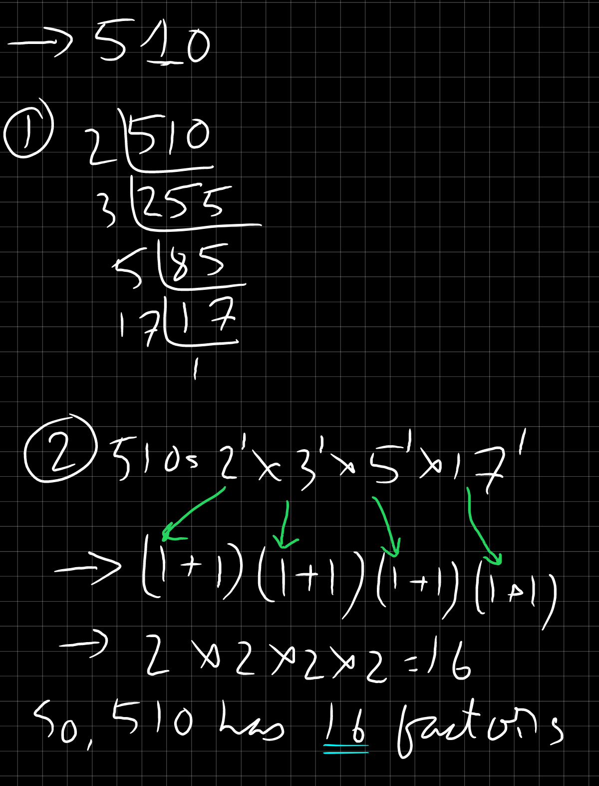
    - Example 2: **1024**
        <br>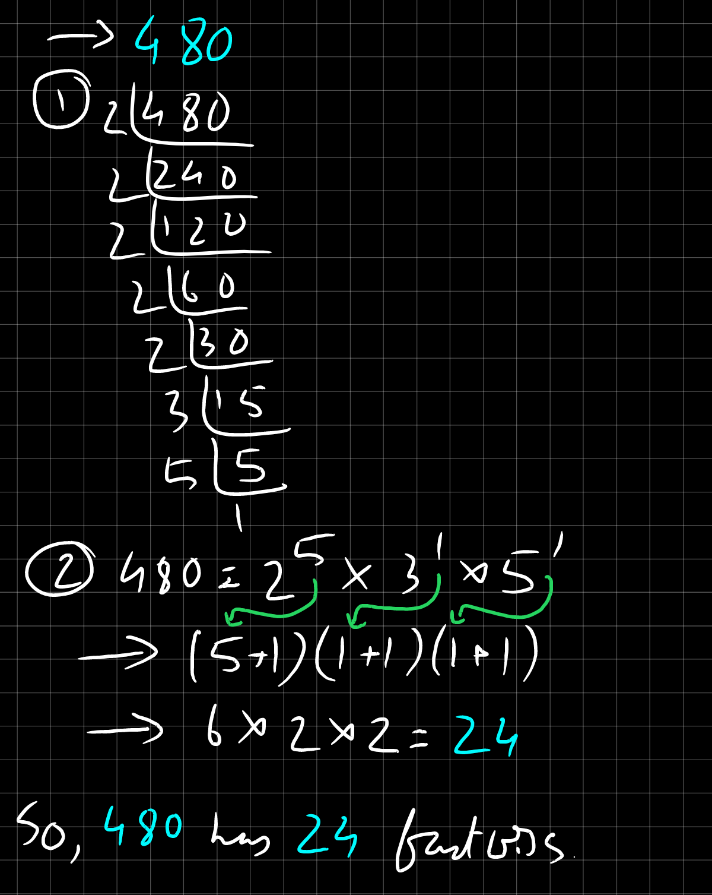

## Sum of LCM & HCF
- For LCM: Product of LCM of numerator / Product of HCF of Denominator
- For HCF: Product of HCF of numerator / Product of LCM of Denominator
- Example 1: $5 \div 18, 35 \div 9, 15 \div 63$
    <br>
    <br>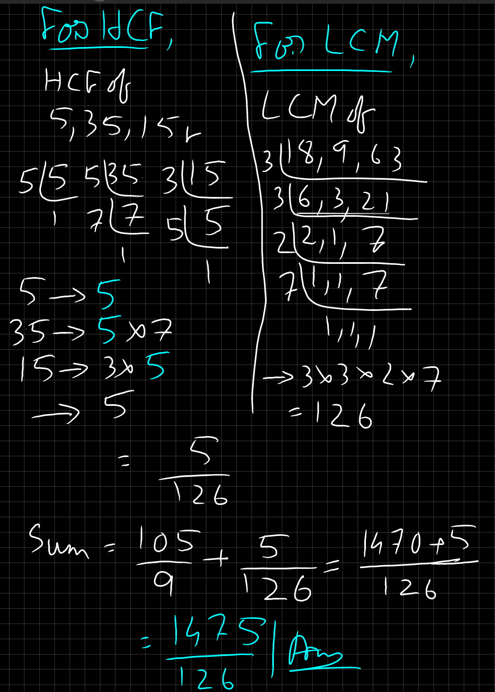

## Least Perfect Square divisible by a,b,c, etc
- For finding the least perfect squares divisible by multiple numbers,
    1. Take the LCM of those numbers.
    1. Explore the multiples of the LCM.
    1. One of the multiples will be a partial square.
    1. If it is a partial square, try appending it with $0$ to make it a perfect square.
    <br>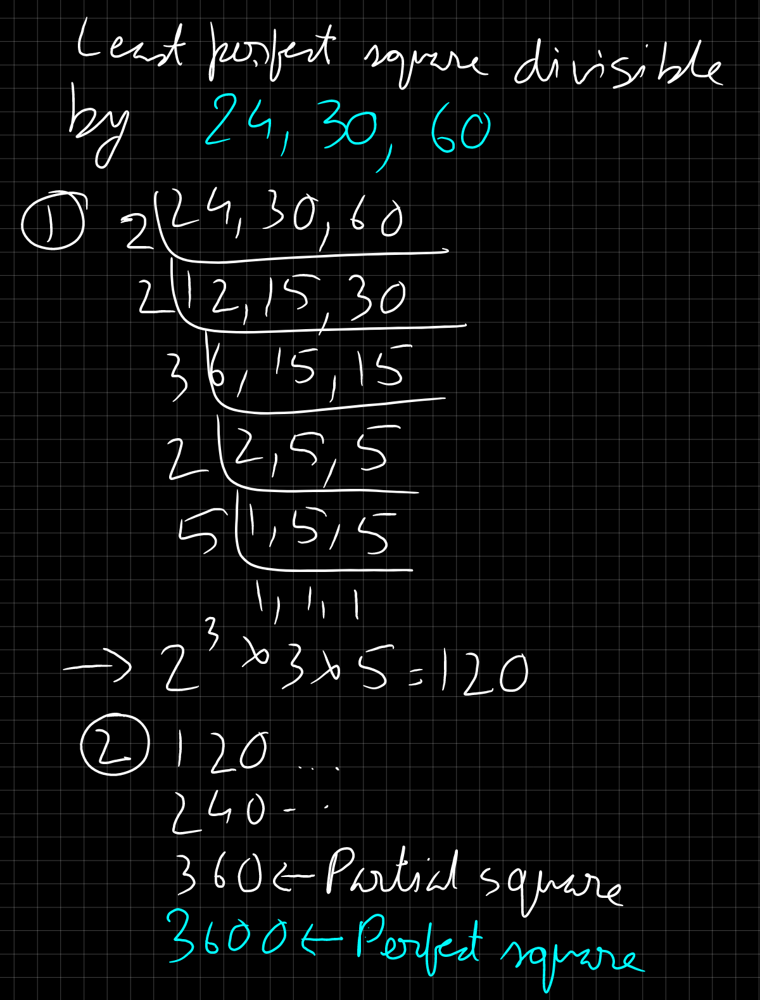

## Least x digit number divisible by a,b,c, with remainder/s
- For finding the smallest $x$ digit number divisible by multiple numbers, and leaves a remainder of $n$,
    1. Find the LCM of the numbers.
    2. **Add** $x$ to the LCM.
    1. Example 0: 
    <br>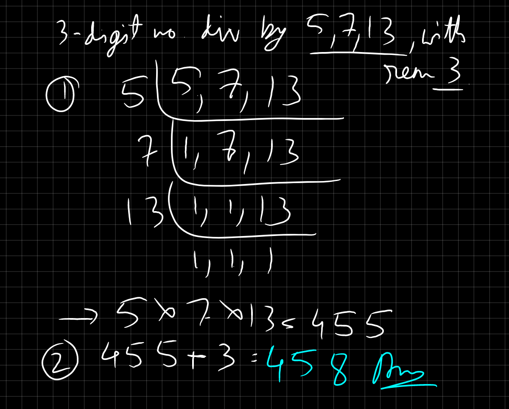

- For finding the smallest number divisible by 3 numbers, and leaves a remainder of a,b & c,
    1. Find the LCM of the numbers.
    2. Check the difference of the numbers with the remainders.
        - If the difference is same for all, **subtract** the difference to get the result.
        - If the difference is different for all, find the LCM of the differences, and **subtract** that LCM.
    3. Example 1: 
        <br>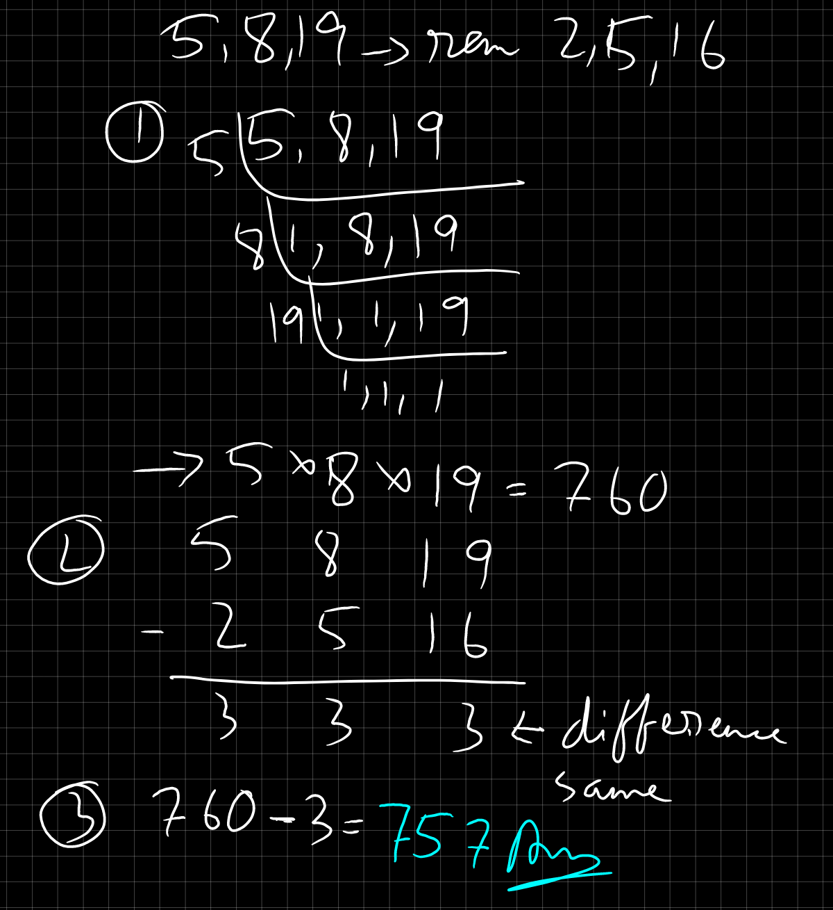

<!-- Last image: self/4.png | external/9.png -->