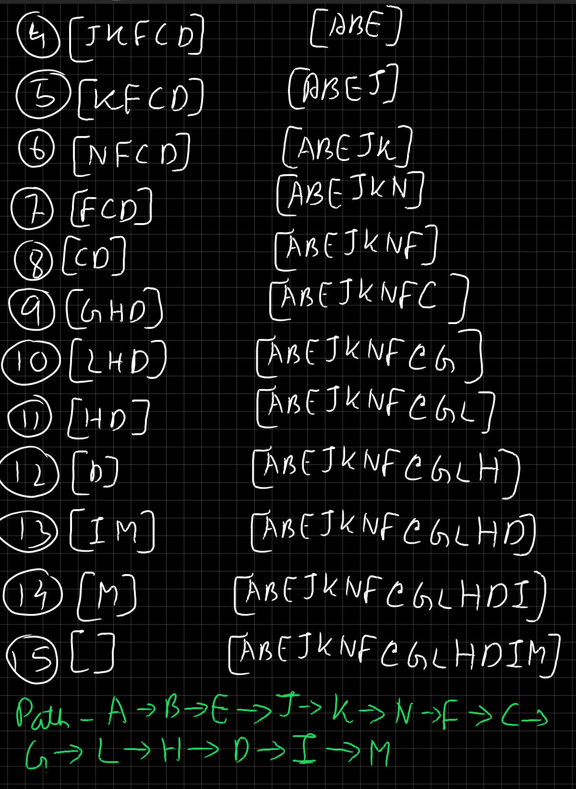

<!-- ID: 8 -->

## FRL Definitions
- **State-Space**: The set of all possible states.
- **Optimal Solution**: A solution that meets certain criteria, such as minimizing cost, maximizing utility, or achieving the best possible outcome, given a specific problem and its constraints. It is the most desirable solution among all possible solutions available for a given problem.
- **Polynomial problems**: These are problems for which the time complexity of the best-known algorithm is polynomial in the size of the input. In other words, the time taken to solve these problems grows at most polynomially with the size of the input.
- **Non-polynomial problems**: These are problems for which the time complexity of the best-known algorithm is non-polynomial in the size of the input. In other words, the time taken to solve these problems grows exponentially or faster with the size of the input.
- **Heuristic**: The term **Heuristic** originates from the Greek word "heuriskein," which means "to discover" or "to find." It is a strategy that helps to efficiently navigate complex situations or tasks, often by simplifying the problem or focusing attention on relevant information.

# Basics
- With Artificial Intelligence, our goal is to build machines and softare with intelligence similar to humans. These machines will be able to perform thinking, reasoning, decision-making, problem solving, natural language processing, just like humans.
- The main goals of an artificially intelligent system are:
    - Reasoning
    - Learning
    - Problem Solving
    - Perception
    ... like a human.
- When it comes to solving a problem, you need to represent the problem in such a way that the machine can understand it. Represent:
    - Precisely
    - In such a way that it can be analyzed
- The major branches of AI are:
    - Perceptive
    - Vision
    - Robotics
    - Expert Systems: stores knowledge, makes inferences from it
    - Learning systems
- Views of AI:
    |Thinking humanly|Thinking Rationally|
    |:---:|:---:|
    |**Acting humanly**|**Acting Rationally**|
    
- Things AI Can Do:
    - **Natural Language Processing (NLP)**: AI can understand, interpret, and generate human language, enabling applications like chatbots and language translation.
    - **Image and Video Recognition**: AI can analyze and identify objects, faces, and scenes in images and videos, useful in security and medical imaging.
    - **Predictive Analytics**: AI can analyze historical data to make predictions about future events, aiding decision-making in finance and healthcare.
    - **Robotics and Automation**: AI can control robots and automate tasks, advancing manufacturing and logistics.
    - **Recommendation Systems**: AI can personalize content and product recommendations based on user behavior, enhancing experiences on e-commerce sites and streaming services.

- Categories of Artificially Intelligent Systems:
    - **Narrow AI (Weak AI)**: These are AI systems designed to handle a specific task or a narrow range of tasks. Examples include virtual assistants like Siri and Alexa, recommendation algorithms on Netflix, and image recognition systems.
    - **General AI (Strong AI)**: This is a theoretical concept where AI possesses the ability to understand, learn, and apply knowledge across a wide range of tasks, much like a human being. General AI can reason, solve problems, and make decisions autonomously in any situation.
    - **Superintelligence**: This refers to AI that surpasses human intelligence and capabilities. It can perform tasks and solve problems beyond human comprehension, potentially leading to breakthroughs in various fields. Superintelligence is still a hypothetical concept and has not been achieved yet.

# AI Agents
- An AI Agent preceives it's environment using sensors and acts upon it's environment through actuators.
- An AI agent typically consists of the following parts:
    - **Sensors**: These are the means through which the agent perceives its environment. Sensors can vary widely depending on the application and can include cameras, microphones, temperature sensors, and more.
    - **Actuators**: These are the components that the agent uses to interact with and affect its environment. Actuators can include motors, speakers, displays, and other devices that allow the agent to perform actions.
    - **Perception**: This part involves processing the raw data collected by the sensors to interpret and understand the environment. It may include components for image recognition, speech recognition, and other forms of data analysis. 
    - **Effectors**: Effectors are components of an AI agent or robotic system that enable it to take actions and interact with its environment. They are the means through which an agent carries out its decisions and plans.
- Factors for rationality of an AI Agent:
    - **Performance measure**: Defines the criteria for evaluating the success of the agent's actions.
    - **Perceptual sequence**: The complete history of everything the agent has perceived so far.
    - **Agent's knowledge**: The information and understanding the agent has about the environment and itself.
    - **Actions available**: The possible actions the agent can take in response to its perceptions.

- **PEAS** stands for Performance measure, Environment, Actuators, and Sensors. It is used to define the setting and capabilities of an AI agent:
    - **Performance measure**: Criteria to evaluate the agent's success.
    - **Environment**: The surroundings in which the agent operates.
    - **Actuators**: The mechanisms through which the agent interacts with the environment.
    - **Sensors**: The tools used by the agent to perceive its environment.

- The types of environments for an AI agent are:
    - **Fully Observable vs. Partially Observable**:
        - **Fully Observable**: The agent's sensors provide complete information about the environment.
        - **Partially Observable**: The agent's sensors provide incomplete or noisy information about the environment.

    - **Deterministic vs. Stochastic**:
        - **Deterministic**: The next state of the environment is completely determined by the current state and the action executed by the agent.
        - **Stochastic**: The next state of the environment is not fully predictable and includes randomness.

    - **Episodic vs. Sequential**:
        - **Episodic**: The agent’s experiences are divided into atomic episodes. Each episode consists of the agent perceiving and then acting. Episodes do not depend on previous episodes.
        - **Sequential**: The current decision could affect all future decisions. The agent’s experiences are linked.

    - **Static vs. Dynamic**:
        - **Static**: The environment does not change while the agent is deliberating.
        - **Dynamic**: The environment can change while the agent is deliberating.

    - **Discrete vs. Continuous**:
        - **Discrete**: There are a finite number of distinct, clearly defined states, actions, and perceptions.
        - **Continuous**: The state space, action space, or both are continuous.

    - **Single Agent vs. Multi-Agent**:
        - **Single Agent**: The environment contains only one agent.
        - **Multi-Agent**: The environment includes multiple agents which can be competitive or cooperative.

## Searching Techniques
- Uninformed & Informed Search
- Difference: `+`: Informed, `-`: Uninformed
    ```diff
    + Utilizes specific information about the problem domain to guide the search process.
    - Lacks specific domain knowledge and relies solely on general search strategies. It is only aware of the start & goal state.
    + Generally more efficient in terms of time and space complexity.
    - May be less efficient compared to informed search algorithms, especially for complex problems.
    + Designed to provide an optimal solution.
    - May or may not provide an optimal solution.
    + Examples include A* search, heuristic search, and informed hill climbing.
    - Examples include depth-first search, breadth-first search, and uniform-cost search.
    ```

### State-Space Search
- State-Space: The set of all possible states.
- Set: {S,A,Action(s), Result(s,a), Cost(s,a)}
    - S: Start, Goal
    - A: The set of all possible actions.
    - Action(s): The action we chose to execute.
    - Result(s,a): State formed as a Result of the action.
    - Cost(s,a): Cost of execute the action. The goal is to minimize the cost.

### Breadth-First Search
- Type: Uninformed Search.
- Based on: FIFO (Queue).
- Time complexity: $O(b^d)$
    - b: Branch factor, maximum number of children of a node.
    - d: Depth: Maximum Level of the tree, root node is at Level 0.
- Optimal, provides the best solution, if costs of all nodes is the same.
- Complete, always provides a solution.

- Example 0 (Start: A, Goal: G):
    1. A
    1. ~~A~~BCD
    1. ~~B~~CDEF
    1. ~~C~~DEFGH
    1. ~~D~~EFGHI
    1. ~~E~~FGHIJK
    1. ~~F~~GHIJK
    1. ~~G~~HIJKL
    - `G` was found. Result: `ACG`.
    - Note the implementation of FIFO: Elements are removed from LHS, and inserted from RHS.
   <br>

### Depth-First Search
- Type: Uninformed Search.
- Based on: LIFO (Stack).
- Time complexity: $O(b^d)$
    - b: Branch factor, maximum number of children of a node.
    - d: Depth: Maximum Level of the tree, root node is at Level 0.
- Not Optimal, may not provide the best solution.
- Not Complete, may not provide a solution.

- Example 0 (Start: A, Goal: D):
    1. A
    1. ~~A~~BC
    1. B~~C~~FG
    1. BF~~G~~
    1. B~~F~~
    1. ~~B~~DE
    1. D~~E~~
    1. ~~D~~
    - `D` was found. Result: `ACG`
    - Sequence: `ACGFBED`
    - Note the implementation of LIFO: Elements are removed from RHS, and inserted from RHS.
   <br>

### Bi-directional Search
- Type: Depends on algorithm used.
- 2 simultaneous search, one from initial node to goal node, another from goal node to initial node.
- Time complexity: $O(b^d+b^d)=O(2b^{d/2})$
    - b: Branch factor, maximum number of children of a node.
    - d: Depth: Maximum Level of the tree, root node is at Level 0.
- Complete only in case of Breadth-First Search.
<br>

### 8-Puzzle Problem without Heuristic
- Type: Blind / Uninformed Search.
- Based on: Breadth-First Search
- Time complexity: $O(b^d)$
    - b: Branch factor, maximum number of children of a node.
    - d: Depth: Maximum Level of the tree.
- Example 0:
    - Actions (A): UP (⬆), DOWN (⬇), LEFT (⬅), RIGHT (➡)
    - Start | End:
        ||S||||G||
        |-|-|-|-|-|-|-|
        |1|2|3|..|1|2|3|
        ||4|6||4|5|6|
        |7|5|8||7|8||
    1. Step 1:
        ||0||->||⬆||||➡||||⬇||
        |-|-|-|-|-|-|-|-|-|-|-|-|-|-|-|
        |1|2|3|->||2|3|..|1|2|3|..|1|2|3|
        ||4|6|->|1|4|6||4||6||7|4|6|
        |7|5|8|->|7|5|8||7|5|8|||5|8|
    1. Step 2 (from puzzle **➡**):
        ||0||->||⬆||||⬇||||⬅||||➡||
        |-|-|-|-|-|-|-|-|-|-|-|-|-|-|-|-|-|-|-|
        |1|2|3|->|1||3|..|1|2|3|..|1|2|3|..|1|2|3|
        |4||6|->|4|2|6||4|5|6|||4|6||4|6|||
        |7|5|8|->|7|5|8||7||8||7|5|8||7|5|8|
    1. Step 3 (from puzzle **⬇**):
        ||0||->||⬅||||⬆||||➡||
        |-|-|-|-|-|-|-|-|-|-|-|-|-|-|-|
        |1|2|3|->|1|2|3|..|1|2|3|..|1|2|3|
        |4|5|6|->|4|5|6||4||6||4|5|6|
        |7||8|->||7|8||7|5|8||7|8||
    1. Step 4: Puzzle **3** is the Goal State.
    - At every step, all valid moves are executed for all states, and all resultant states are determined.

# Heuristic in Artificial Intelligence
- The term "heuristic" originates from the Greek word "heuriskein," which means "to discover" or "to find." It is a strategy that helps to efficiently navigate complex situations or tasks, often by simplifying the problem or focusing attention on relevant information.
- We use heuristic functions when we want to convert non-polynomial problems to polynomial problems (NP➡P).
    - **Polynomial problems**: These are problems for which the time complexity of the best-known algorithm is polynomial in the size of the input. In other words, the time taken to solve these problems grows at most polynomially with the size of the input.
    - **Non-polynomial problems**: These are problems for which the time complexity of the best-known algorithm is non-polynomial in the size of the input. In other words, the time taken to solve these problems grows exponentially or faster with the size of the input.
- It provides a good solution but **not an optimal solution**. This is because there may be other obstacles (like an infinite loop) in the path the algorithm has chosen. But in most cases, it provides a more efficient approach to brute-forcing our way to the solution.
- Examples of some functions:
    - **Eucledian Distance**: $\sqrt {(x_2-x_1)^2+(y_2-y_1)^2}$, using this we can find the shortest path from point a to point b.
    - **Manhattan Distance**:
        ||S||->||G||
        |-|-|-|-|-|-|-|
        |1|3|2|->|1|2|3|
        |6|5|4|->|4|5|6|
        ||8|7|->|7|8|||
        - Manhattan Distance: $0+1+1+2+0+2+2+0=8$
        - The distance is calculated by the number of steps each number needs to be moved, to reach the Goal state (G) from the Current state.

## Searching Techniques
### 8-Puzzle Problem with Heuristic
- Type: Informed Search.
- Based on: Number of misplaced tiles
- Example 0:
    - Actions (A): UP (⬆), DOWN (⬇), LEFT (⬅), RIGHT (➡)
    - Start | End:
        ||S||||G||
        |-|-|-|-|-|-|-|
        |1|2|3|..|1|2|3|
        ||4|6||4|5|6|
        |7|5|8||7|8||
        - Number of misplaced tiles, $h=3$
    1. Step 1: 
        ||0||->||⬆||||➡||||⬇||
        |-|-|-|-|-|-|-|-|-|-|-|-|-|-|-|
        |1|2|3|->||2|3|..|1|2|3|..|1|2|3|
        ||4|6|->|1|4|6||4||6||7|4|6|
        |7|5|8|->|7|5|8||7|5|8|||5|8|
        - Number of misplaced tiles, $h=4,2,4$
        - We will move forward with the lowest heuristic value.
    1. Step 2 (from puzzle **➡**):
        ||0||->||⬆||||⬇||||⬅||||➡||
        |-|-|-|-|-|-|-|-|-|-|-|-|-|-|-|-|-|-|-|
        |1|2|3|->|1||3|..|1|2|3|..|1|2|3|..|1|2|3|
        |4||6|->|4|2|6||4|5|6|||4|6||4|6|||
        |7|5|8|->|7|5|8||7||8||7|5|8||7|5|8|
        - Number of misplaced tiles, $h=3,1,3,3$
    1. Step 3 (from puzzle **⬇**):
        ||0||->||⬅||||⬆||||➡||
        |-|-|-|-|-|-|-|-|-|-|-|-|-|-|-|
        |1|2|3|->|1|2|3|..|1|2|3|..|1|2|3|
        |4|5|6|->|4|5|6||4||6||4|5|6|
        |7||8|->||7|8||7|5|8||7|8||
        - Number of misplaced tiles, $h=2,2,0$
    1. Step 4: For Puzzle **➡**, $h=0$, and it is the Goal State.
    1. We had to traverse through a lot less states to reach the Goal state (G), compared to a typical Uninformed Search Technique.

### Generate and Test
1. Generate a possible solution.
1. Test to see if this is an actual solution.
1. If a solution is found, otherwise repeat.
- Properties of Good Generators:
    - **Complete**
    - **Non-redundant**: They must not provide solutions which have already been generated in the past.
    - **Informed**: The Generator must have atleast some basic idea which it can use to generate an efficient solution.

# Machine Learning
- Artificial Intelligence: Aimed at enabling computers to perform human-like tasks and simulate human behaviour.
- Machine Learning: Tries to solve a specific problem, and makes predictions using data.
- Data Science: Attempts to find patterns and find insights from data.
## Types of Machine Learning
- Supervised: Learning where the model is trained on labeled data (all tuples have a class label associated with them) and learns to make predictions based on examples.
- Unsupervised: Learning from data without labeled responses, finding patterns and relationships on its own.
- Reinforcemend: Learning through trial and error, where an agent learns to make decisions by interacting with an environment and receiving feedback (either positive/reward or negative/penalty).
<!-- Last image: self/2.png | external/-1.jpg -->


