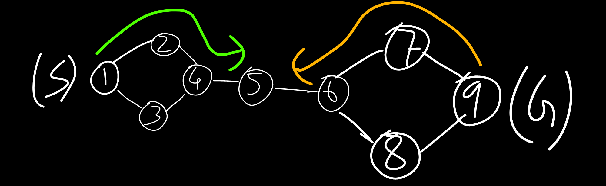

<!-- ID: 8 -->

## FRL Definitions
- **State-Space**: The set of all possible states.
- **Optimal Solution**: A solution that meets certain criteria, such as minimizing cost, maximizing utility, or achieving the best possible outcome, given a specific problem and its constraints. It is the most desirable solution among all possible solutions available for a given problem.
- **Polynomial problems**: These are problems for which the time complexity of the best-known algorithm is polynomial in the size of the input. In other words, the time taken to solve these problems grows at most polynomially with the size of the input.
- **Non-polynomial problems**: These are problems for which the time complexity of the best-known algorithm is non-polynomial in the size of the input. In other words, the time taken to solve these problems grows exponentially or faster with the size of the input.
- **Heuristic**: The term **Heuristic** originates from the Greek word "heuriskein," which means "to discover" or "to find." It is a strategy that helps to efficiently navigate complex situations or tasks, often by simplifying the problem or focusing attention on relevant information.

# Basics
- With Artificial Intelligence, our goal is to build machines and softare with intelligence similar to humans. These machines will be able to perform thinking, reasoning, decision-making, problem solving, natural language processing, just like humans.
- The main goals of an artificially intelligent system are:
    - Reasoning
    - Learning
    - Problem Solving
    - Perception
    ... like a human.
- When it comes to solving a problem, you need to represent the problem in such a way that the machine can understand it. Represent:
    - Precisely
    - In such a way that it can be analyzed
- The major branches of AI are:
    - Perceptive
    - Vision
    - Robotics
    - Expert Systems: stores knowledge, makes inferences from it
    - Learning systems
- Views of AI:
    |Thinking humanly|Thinking Rationally|
    |:---:|:---:|
    |**Acting humanly**|**Acting Rationally**|

- Things AI Can Do:
    - **Natural Language Processing (NLP)**: AI can understand, interpret, and generate human language, enabling applications like chatbots and language translation.
    - **Image and Video Recognition**: AI can analyze and identify objects, faces, and scenes in images and videos, useful in security and medical imaging.
    - **Predictive Analytics**: AI can analyze historical data to make predictions about future events, aiding decision-making in finance and healthcare.
    - **Robotics and Automation**: AI can control robots and automate tasks, advancing manufacturing and logistics.
    - **Recommendation Systems**: AI can personalize content and product recommendations based on user behavior, enhancing experiences on e-commerce sites and streaming services.

- Categories of Artificially Intelligent Systems:
    - **Narrow AI (Weak AI)**: These are AI systems designed to handle a specific task or a narrow range of tasks. Examples include virtual assistants like Siri and Alexa, recommendation algorithms on Netflix, and image recognition systems.
    - **General AI (Strong AI)**: This is a theoretical concept where AI possesses the ability to understand, learn, and apply knowledge across a wide range of tasks, much like a human being. General AI can reason, solve problems, and make decisions autonomously in any situation.
    - **Superintelligence**: This refers to AI that surpasses human intelligence and capabilities. It can perform tasks and solve problems beyond human comprehension, potentially leading to breakthroughs in various fields. Superintelligence is still a hypothetical concept and has not been achieved yet.

# AI Agents
- An AI Agent preceives it's environment using sensors and acts upon it's environment through actuators.
- An AI agent typically consists of the following parts:
    - **Sensors**: These are the means through which the agent perceives its environment. Sensors can vary widely depending on the application and can include cameras, microphones, temperature sensors, and more.
    - **Actuators**: These are the components that the agent uses to interact with and affect its environment. Actuators can include motors, speakers, displays, and other devices that allow the agent to perform actions.
    - **Perception**: This part involves processing the raw data collected by the sensors to interpret and understand the environment. It may include components for image recognition, speech recognition, and other forms of data analysis. 
    - **Effectors**: Effectors are components of an AI agent or robotic system that enable it to take actions and interact with its environment. They are the means through which an agent carries out its decisions and plans.
- Factors for rationality of an AI Agent:
    - **Performance measure**: Defines the criteria for evaluating the success of the agent's actions.
    - **Perceptual sequence**: The complete history of everything the agent has perceived so far.
    - **Agent's knowledge**: The information and understanding the agent has about the environment and itself.
    - **Actions available**: The possible actions the agent can take in response to its perceptions.

- **PEAS** stands for Performance measure, Environment, Actuators, and Sensors. It is used to define the setting and capabilities of an AI agent:
    - **Performance measure**: Criteria to evaluate the agent's success.
    - **Environment**: The surroundings in which the agent operates.
    - **Actuators**: The mechanisms through which the agent interacts with the environment.
    - **Sensors**: The tools used by the agent to perceive its environment.

- The types of environments for an AI agent are:
    - **Fully Observable vs. Partially Observable**:
        - **Fully Observable**: The agent's sensors provide complete information about the environment.
        - **Partially Observable**: The agent's sensors provide incomplete or noisy information about the environment.

    - **Deterministic vs. Stochastic**:
        - **Deterministic**: The next state of the environment is completely determined by the current state and the action executed by the agent.
        - **Stochastic**: The next state of the environment is not fully predictable and includes randomness.

    - **Episodic vs. Sequential**:
        - **Episodic**: The agent’s experiences are divided into atomic episodes. Each episode consists of the agent perceiving and then acting. Episodes do not depend on previous episodes.
        - **Sequential**: The current decision could affect all future decisions. The agent’s experiences are linked.

    - **Static vs. Dynamic**:
        - **Static**: The environment does not change while the agent is deliberating.
        - **Dynamic**: The environment can change while the agent is deliberating.

    - **Discrete vs. Continuous**:
        - **Discrete**: There are a finite number of distinct, clearly defined states, actions, and perceptions.
        - **Continuous**: The state space, action space, or both are continuous.

    - **Single Agent vs. Multi-Agent**:
        - **Single Agent**: The environment contains only one agent.
        - **Multi-Agent**: The environment includes multiple agents which can be competitive or cooperative.

## Types of AI Agents:
### Simple Reflex Agent
<br>
Image taken from [here](https://media.geeksforgeeks.org/wp-content/uploads/20240513180031/ai3-1.webp)
- **Definition**: Simple reflex agents act based solely on the current percept, ignoring the rest of the percept history.
- **Features**:
  - Direct mapping from percept to action.
  - No memory of past percepts.
  - Works best in fully observable environments.
- **Example**: A thermostat adjusting temperature based on current readings.

  - Uses a model of the world to keep track of parts of the environment that are not directly observable.
  - Capable of updating the model based on percepts and actions.
  - Can plan actions by predicting the outcomes of different sequences of actions.
- **Example**: A robot navigating through a maze using a map.

### Model-based Agent
<br>
Image taken from [here](https://media.geeksforgeeks.org/wp-content/uploads/20240423162150/Model-Based-Reflex-Agents.webp)

- **Definition**: A model-based agent maintains an internal model of the world and uses it to make decisions and plan actions.
- **Features**:
    - Utilizes a representation of the world to simulate and predict outcomes of actions.
    - Keeps track of the current state of the world and updates it based on percepts and actions.
    - Uses the internal model to reason about the effects of different actions and select the best course of action.
- **Example**: A self-driving car that uses a detailed map and sensor data to navigate and make decisions on the road.

### Goal-based Agent
<br>
Image taken from [here](https://media.geeksforgeeks.org/wp-content/uploads/20240423162301/Goal-Based-Agents.webp)

- **Definition**: Goal-based agents act to achieve specific goals, providing a clear criterion for success.
- **Features**:
  - Decisions are made by considering future consequences of actions.
  - Requires goal information to decide the best actions to take.
  - Involves search and planning to achieve goals.
- **Example**: A chess-playing AI aiming to checkmate the opponent.

### Utility-based Agent
<br>
Image taken from [here](https://media.geeksforgeeks.org/wp-content/uploads/20240423162501/Utility-Based-Agents.webp)

- **Definition**: Utility-based agents choose actions based on a utility function that ranks alternative outcomes according to their desirability.
- **Features**:
  - Uses a utility function to evaluate how desirable a particular state is.
  - Aims to maximize the utility to achieve the best possible outcome.
  - Can handle trade-offs between conflicting goals.
- **Example**: An autonomous car balancing safety, speed, and fuel efficiency.

### Learning Agent
<br>
Image taken from [here](https://media.geeksforgeeks.org/wp-content/uploads/20240420014900/Untitled-drawing-(5)-660.jpg)

- **Definition**: Learning agents improve their performance by learning from experiences.
- **Features**:
  - Consists of a learning element that modifies the agent's behavior based on feedback.
  - Incorporates a performance element, a critic, and a problem generator.
  - Capable of adapting to new and unforeseen situations.
- **Example**: A recommendation system improving its suggestions based on user feedback.
- **Terms**:
    - **Performance Element**:
        - Responsible for selecting actions based on the current percept and the agent's knowledge.
        - Executes the actions that the agent decides to perform.
        - Implements the agent's behavior in the environment.
        - Directly interacts with the environment to achieve goals.
    - **Critic**:
        - Evaluates the actions taken by the performance element to provide feedback on how well the agent is performing.
        - Measures the performance of the agent's actions based on a predefined performance standard or goal.
        - Provides feedback to the learning element about the effectiveness of the actions.
    - **Problem Generator**:
        - Suggests exploratory actions that lead the agent to new and informative experiences.
        - Encourages the agent to try new things and learn from them.
        - Aids in improving the agent's knowledge and overall performance.
        - Helps the agent to discover new ways to achieve goals and solve problems.

## Searching Techniques
- Uninformed & Informed Search
- Difference: `+`: Informed, `-`: Uninformed
    ```diff
    + Utilizes specific information about the problem domain to guide the search process.
    - Lacks specific domain knowledge and relies solely on general search strategies. It is only aware of the start & goal state.
    + Generally more efficient in terms of time and space complexity.
    - May be less efficient compared to informed search algorithms, especially for complex problems.
    + Designed to provide an optimal solution.
    - May or may not provide an optimal solution.
    + Examples include A* search, heuristic search, and informed hill climbing.
    - Examples include depth-first search, breadth-first search, and uniform-cost search.
    ```
- Types of Problems:
    - **Toy Problems**: Simplified, abstract problems designed to illustrate and test the fundamental principles of search algorithms. Examples include puzzles like the 8-puzzle, tic-tac-toe, and the traveling salesman problem. They are generally small-scale, with well-defined rules and clear objectives, making them ideal for educational purposes and for testing algorithm performance in controlled environments.
    - **Real-World Problems**: Complex, large-scale problems that occur in practical applications, often characterized by incomplete information, dynamic environments, and higher levels of unpredictability. Examples include route planning for autonomous vehicles, supply chain optimization, and natural language processing. Solving real-world problems requires robust algorithms that can handle diverse scenarios, scalability, and adaptability to changing conditions.
- **Terms**: 
    - **Initial State**: The starting point of the search algorithm from where the search begins.
    - **Goal State**: The desired end state that the search algorithm aims to reach.
    - **Current State**: The state in which the search algorithm is presently located during its execution.
    - **Successor Function**: A function that generates possible next states (successors) from the current state.
    - **Path Cost**: The total cost incurred to reach a particular state from the initial state, often used to evaluate the efficiency of a path.
    - **State Space**: The set of all possible states that can be reached from the initial state by any sequence of actions.
    - **Search Tree**: A tree representation of the state space where nodes represent states and edges represent actions leading to successor states.
    - **Transition Model**: A model that defines the rules for moving from one state to another, specifying the result of applying an action to a state.
    - **Solution**: A sequence of actions that leads from the initial state to the goal state.
    - **Optimal Solution**: The best possible solution that achieves the goal state with the least path cost or highest efficiency.
    - **Properties of a Search Algorithm**:
    - **Completeness**: A property indicating whether a search algorithm is guaranteed to find a solution if one exists.
    - **Optimality**: A measure of whether the search algorithm finds the best possible solution with the lowest cost or highest efficiency.
    - **Time Complexity**: The amount of time a search algorithm takes to find a solution, usually expressed as a function of the size of the input.
    - **Space Complexity**: The amount of memory a search algorithm requires to find a solution, typically measured in terms of the number of nodes stored in memory.

### State-Space Search
- State-Space: The set of all possible states.
- Set: {S,A,Action(s), Result(s,a), Cost(s,a)}
    - S: Start, Goal
    - A: The set of all possible actions.
    - Action(s): The action we chose to execute.
    - Result(s,a): State formed as a Result of the action.
    - Cost(s,a): Cost of execute the action. The goal is to minimize the cost.

### Breadth-First Search
- Type: Uninformed Search.
- Based on: FIFO (Queue).
- Time complexity: $O(b^d)$
    - b: Branch factor, maximum number of children of a node.
    - d: Depth: Maximum Level of the tree, root node is at Level 0.
- Optimal, provides the best solution, if costs of all nodes is the same.
- Complete, always provides a solution.

- Example 0 (Start: 1, Goal: 5):
        - Sequence: `1->2->3->6->5->4`
            - Note the implementation of FIFO (queue): Elements are inserted to RHS, and removed from LHS.
           <br>

### Depth-First Search
- Type: Uninformed Search.
- Based on: LIFO (Stack).
- Time complexity: $O(b^d)$
    - b: Branch factor, maximum number of children of a node.
    - d: Depth: Maximum Level of the tree, root node is at Level 0.
- Not Optimal, may not provide the best solution.
- Not Complete, may not provide a solution.

- Example 0 (Start: A, Goal: M):
    - Sequence: `A->B->E->J->K->N->F->C->G->L->H->D->I->M`
        - Note the implementation of LIFO (stack): Elements are inserted to LHS, and removed from LHS.
       <br>
       <br>

### Depth-Limited Depth First Search \[!CORRECT\]
- Type: Uninformed Search.
- Based on: LIFO (Stack).
- Time complexity: $O(b^l)$
    - b: Branch factor, maximum number of children of a node.
    - l: Depth limit, maximum depth to which the search is allowed to go.
- Not Optimal, may not provide the best solution.
- Not Complete, may not provide a solution.
- Example 0 (Start: A, Goal: O, Depth Limit: 2):
    <br>
    - Sequence: `A->B->F->G->C->H->D->I->M->J->N->E`
   
### TODO: Uniform Cost Search (UCS)

### TODO: Iterative Deepening Depth First Search (IDS / IDDFS)

### Bi-directional Search
- Type: Depends on algorithm used.
- 2 simultaneous search, one from initial node to goal node, another from goal node to initial node.
- Time complexity: $O(b^d+b^d)=O(2b^{d/2})$
    - b: Branch factor, maximum number of children of a node.
    - d: Depth: Maximum Level of the tree, root node is at Level 0.
- Complete only in case of Breadth-First Search.
<br>

### 8-Puzzle Problem without Heuristic
- Type: Blind / Uninformed Search.
- Based on: Breadth-First Search
- Time complexity: $O(b^d)$
    - b: Branch factor, maximum number of children of a node.
    - d: Depth: Maximum Level of the tree.
- Example 0:
    - Actions (A): UP (⬆), DOWN (⬇), LEFT (⬅), RIGHT (➡)
    - Start | End:
        ||S||||G||
        |-|-|-|-|-|-|-|
        |1|2|3|..|1|2|3|
        ||4|6||4|5|6|
        |7|5|8||7|8||
    1. Step 1:
        ||0||->||⬆||||➡||||⬇||
        |-|-|-|-|-|-|-|-|-|-|-|-|-|-|-|
        |1|2|3|->||2|3|..|1|2|3|..|1|2|3|
        ||4|6|->|1|4|6||4||6||7|4|6|
        |7|5|8|->|7|5|8||7|5|8|||5|8|
    1. Step 2 (from puzzle **➡**):
        ||0||->||⬆||||⬇||||⬅||||➡||
        |-|-|-|-|-|-|-|-|-|-|-|-|-|-|-|-|-|-|-|
        |1|2|3|->|1||3|..|1|2|3|..|1|2|3|..|1|2|3|
        |4||6|->|4|2|6||4|5|6|||4|6||4|6|||
        |7|5|8|->|7|5|8||7||8||7|5|8||7|5|8|
    1. Step 3 (from puzzle **⬇**):
        ||0||->||⬅||||⬆||||➡||
        |-|-|-|-|-|-|-|-|-|-|-|-|-|-|-|
        |1|2|3|->|1|2|3|..|1|2|3|..|1|2|3|
        |4|5|6|->|4|5|6||4||6||4|5|6|
        |7||8|->||7|8||7|5|8||7|8||
    1. Step 4: Puzzle **3** is the Goal State.
    - At every step, all valid moves are executed for all states, and all resultant states are determined.

# Global Optimization Problems
- Global optimization problems are a branch of applied mathematics and numerical analysis that focus on finding the global minimum or maximum of a function over a given set. Unlike local optimization, which seeks local minima or maxima, global optimization aims to identify the best possible solution across the entire search space.
## Genetic Algorithms
- We solve complex problems, with exponential ($2*n$) time complexity, using this algorithm.
- Steps:
  1. **Initial Population:** Get all possible solutions to the problem.
  2. **Fitness Function:** Calculate the fitness level of each solution.
     - Example:
       - Target: `Make`.
       - Here we can calculate how many alphabets are similar, to find out how close the solution is to the target.
       - Solution 1: `Take` -> Fitness=3
       - Solution 2: `Cake` -> Fitness=3
       - Solution 3: `Hide` -> Firness=1
  3. **Selection:** Select the best 2 `parents` i.e. solutions out of the generated ones, i.e. 1 & 2 here.
  4. **Crossover:** We cross over some parts of the solutions we selected. Our aim is to increase the value of the fitness function. Example of `1-Point` method:
     - Let the crossover point be after the 3rd alphabet.
     - `abcde` -> `abchi`
     - `efghi` -> `efgde`
  5. **Mutation:** This is another way to generate solutions to possibly increase the value of the fitness function. Examples are swap and bit-flip.
  6. **Stopping Criteria:** We stop running the algorithm when the optimal solution has been reached, otherwise we continue runnint **Steps 3-5**.

## Ant Colony Optimisation
- Here's how ants find the shortest path to the food, when there are multiple paths:
  - Whenever ants move, they leave a Pheromone (chemical) trace that other ants can detect.
  - The Pheromone trace will evaporate away over time, but how much of it evaporates is what matters.
    - As ants cross the longer path, less of the Pheromone trace remains when then return, since the time taken by them to cross the path is more.
    - As ants cross the shortest path, more of the Pheromone trace remains when then return, since the time taken by them to cross the path is less.
    - The overall intensity of Pheromone will be the highest in the shortest path.
  - At first, the group of ants will equally divide themselves and take all available paths.
  - As they cross the paths, the intensity of Pheromone will be equivalent to the lengths of the paths.
  - Over time, all of them will choose the path that has the highest intensity of Pheromone, i.e. the shortest path to the food.
- Steps in the algorithm:
  1. **Initialization**: A number of artificial ants are placed on a graph, where nodes represent points of interest, such as cities in the Traveling Salesman Problem (TSP).
  2. **Ant Movement**: Each ant moves from node to node, guided by two main factors:
     - Pheromone Trails: Ants leave behind pheromone trails as they move. The intensity of the pheromone trail influences the probability of future ants following the same path.
     - Heuristic Information: This could be the distance between nodes or other problem-specific metrics that guide the ant's decision.
  3. **Pheromone Update**: After all ants have constructed their solutions, the pheromone levels are updated. This involves:
     - Pheromone Evaporation: Reducing the intensity of all pheromone trails to simulate the natural evaporation process.
     - Pheromone Deposition: Adding pheromones to the paths taken by the ants, with better solutions receiving more pheromone.
  4. **Iteration**: The process is repeated for a number of iterations, with ants gradually converging on the optimal solution as the pheromone trails guide them more effectively over time.
- We can solve complex graph problems (source -> sink) using this algorithm. Example:
     - **Travelling Salesman**: Finding the shortest route to visit a set of cities.
     - **Vehicle Routing Problem**: Optimizing routes for a fleet of vehicles.
     - **Scheduling**: Allocating resources and scheduling tasks in an optimal way.

# Heuristic in Artificial Intelligence
- The term "heuristic" originates from the Greek word "heuriskein," which means "to discover" or "to find." It is a strategy that helps to efficiently navigate complex situations or tasks, often by simplifying the problem or focusing attention on relevant information.
- We use heuristic functions when we want to convert non-polynomial problems to polynomial problems (NP➡P).
    - **Polynomial problems**: These are problems for which the time complexity of the best-known algorithm is polynomial in the size of the input. In other words, the time taken to solve these problems grows at most polynomially with the size of the input.
    - **Non-polynomial problems**: These are problems for which the time complexity of the best-known algorithm is non-polynomial in the size of the input. In other words, the time taken to solve these problems grows exponentially or faster with the size of the input.
- It provides a good solution but **not an optimal solution**. This is because there may be other obstacles (like an infinite loop) in the path the algorithm has chosen. But in most cases, it provides a more efficient approach to brute-forcing our way to the solution.
- Examples of some functions:
    - **Eucledian Distance**: $\sqrt {(x_2-x_1)^2+(y_2-y_1)^2}$, using this we can find the shortest path from point a to point b.
    - **Manhattan Distance**:
        ||S||->||G||
        |-|-|-|-|-|-|-|
        |1|3|2|->|1|2|3|
        |6|5|4|->|4|5|6|
        ||8|7|->|7|8|||
        - Manhattan Distance: $0+1+1+2+0+2+2+0=8$
        - The distance is calculated by the number of steps each number needs to be moved, to reach the Goal state (G) from the Current state.

## Searching Techniques
### 8-Puzzle Problem with Heuristic
- Type: Informed Search.
- Based on: Number of misplaced tiles
- Example 0:
    - Actions (A): UP (⬆), DOWN (⬇), LEFT (⬅), RIGHT (➡)
    - Start | End:
        ||S||||G||
        |-|-|-|-|-|-|-|
        |1|2|3|..|1|2|3|
        ||4|6||4|5|6|
        |7|5|8||7|8||
        - Number of misplaced tiles, $h=3$
    1. Step 1: 
        ||0||->||⬆||||➡||||⬇||
        |-|-|-|-|-|-|-|-|-|-|-|-|-|-|-|
        |1|2|3|->||2|3|..|1|2|3|..|1|2|3|
        ||4|6|->|1|4|6||4||6||7|4|6|
        |7|5|8|->|7|5|8||7|5|8|||5|8|
        - Number of misplaced tiles, $h=4,2,4$
        - We will move forward with the lowest heuristic value.
    1. Step 2 (from puzzle **➡**):
        ||0||->||⬆||||⬇||||⬅||||➡||
        |-|-|-|-|-|-|-|-|-|-|-|-|-|-|-|-|-|-|-|
        |1|2|3|->|1||3|..|1|2|3|..|1|2|3|..|1|2|3|
        |4||6|->|4|2|6||4|5|6|||4|6||4|6|||
        |7|5|8|->|7|5|8||7||8||7|5|8||7|5|8|
        - Number of misplaced tiles, $h=3,1,3,3$
    1. Step 3 (from puzzle **⬇**):
        ||0||->||⬅||||⬆||||➡||
        |-|-|-|-|-|-|-|-|-|-|-|-|-|-|-|
        |1|2|3|->|1|2|3|..|1|2|3|..|1|2|3|
        |4|5|6|->|4|5|6||4||6||4|5|6|
        |7||8|->||7|8||7|5|8||7|8||
        - Number of misplaced tiles, $h=2,2,0$
    1. Step 4: For Puzzle **➡**, $h=0$, and it is the Goal State.
    1. We had to traverse through a lot less states to reach the Goal state (G), compared to a typical Uninformed Search Technique.

### Generate and Test
1. Generate a possible solution.
1. Test to see if this is an actual solution.
1. If a solution is found, otherwise repeat.
- Properties of Good Generators:
    - **Complete**
    - **Non-redundant**: They must not provide solutions which have already been generated in the past.
    - **Informed**: The Generator must have atleast some basic idea which it can use to generate an efficient solution.

# Knowledge Based Systems
- Knowledge: Understanding of a subject area.
- Different Types of knowledge:
    - **Procedural**: Knowledge about how to do something. It's represented as a set of rules, algorithms, or procedures. Example: A recipe for baking a cake.
    - **Declarative**: It describes facts about objects, and relationships between various objects. Example: The capital of France is Paris.
    - **Meta-knowledge**: Knowledge about knowledge itself (metadata about the object). It's used to reason about the reliability, relevance, and certainty of other knowledge.
    - **Heuristic / Shallow**: Knowledge based on experience or rule of thumb. It's used to make approximate or educated guesses.
    - **Structural**: Represents the relationships between objects or entities.

## Propositional Logic
- A Propositional Logic is the simplest form of logic where all the statements are made by propositions.
- It is a declarative statement which is either `true` or `false`.
- It is also called Booladn Logic as it works on 0 and 1.
- Propositions can be either true or false, but cannot be both.
- Propositional logic consists of:
    - An object.
    - Relations or function.
    - Logical connectives (also called logical operators).
- **Tautology**: A proposition formula which is always True. It is also called a valid sentence.
- **Contradiction**: A proposition formula which is always False.
- Examples:
    - Today is Sunday. (True)
    - The Sun rises in the West. (False)
- Types of Propositions:
    - **Atomic**: Simple propositions, consisting of a single proposition symbol. Example: 2+2=4.
    - **Compound**: Constructed by combining simpler or atomic propositions, using parenthesis and logical connectives. Example: It is raining today, and the street is wet.
- Logical Connectives:
    - **Negation (`¬`)**: Returns the Negation of the proposition.
        - `P`: Peter can play tennis.
        - `¬`P`: Peter cannot play tennis.
    - **Conjunction (`∧`)**: Returns true only if both propositions are true.
        - `P`: It is raining.
        - `Q`: The streets are wet.
        - `P∧Q`: It is raining & the streets are wet.
    - **Disjunction (`∨`)**: Returns true if at least one proposition is true.
        - `P`: DEF is a doctor. 
        - `Q`: DEF is an engineer.
        - `P∨Q`: DEF is a doctor or an engineer.
    - **Implication (`P→Q`)**: Returns false only if the antecedent is true and the consequent is false.
        - `P`: It is raining.
        - `Q`: The streets are wet.
        - `P→Q`: If it is raining, then the streets are wet.
    - **Biconditional (`P↔Q`)**: Returns true if both propositions have the same truth value.
        - `P`: I am breathing.
        - `Q`: I am alive.
        - `P↔Q`: If I am breathing, I am alive; If I am alive, then I am breathing.
    - Truth Table:
        | P | Q | ¬P (Negation) | P ∧ Q (Conjunction) | P ∨ Q (Disjunction) | P → Q (Implication) | P ↔ Q (Biconditional) |
        |---|---|---|---|---|---|---|
        | T | T | F | T | T | T | T |
        | T | F | F | F | T | F | F |
        | F | T | T | F | T | T | F |
        | F | F | T | F | F | T | T |
    - **Properties** of Logical Connectives:
        - **Commutative:**
            - Conjunction: `P ∧ Q ≡ Q ∧ P`
            - Disjunction: `P ∨ Q ≡ Q ∨ P`
        - **Associative:**
            - Conjunction: `(P ∧ Q) ∧ R ≡ P ∧ (Q ∧ R)`
            - Disjunction: `(P ∨ Q) ∨ R ≡ P ∨ (Q ∨ R)`
        - **Identity Element:**
            - Conjunction: `P ∧ True ≡ P`
            - Disjunction: `P ∨ False ≡ P`
        - **Distributive:**
            - Distribution of ∧ over ∨: `P ∧ (Q ∨ R) ≡ (P ∧ Q) ∨ (P ∧ R)`
            - Distribution of ∨ over ∧: `P ∨ (Q ∧ R) ≡ (P ∨ Q) ∧ (P ∨ R)`
        - **De Morgan's Laws:**
           - `¬(P ∧ Q) ≡ ¬P ∨ ¬Q`
           - `¬(P ∨ Q) ≡ ¬P ∧ ¬Q`
        - **Double Negation Elimination:** `¬¬P ≡ P`
- **Inference Rules**: These are the templates for generating valid arguments. They are applied to derive proofs in Artificial Intelligence.
    1. **Implication:**: `P` -> `Q`
    1. **Converse:** `Q` -> `P`
    1. Inverse (*Negation of **Implication***): `¬P` ->`¬Q`
    1. Contrapositive (*Negation of **Converse***): `¬Q` ->`¬P`
    - Types of Inference Rules:
        1. **Modus Ponens:** If P implies Q, and P is true, then Q is true, ie `P → Q, P` -> `Q`
        1. **Modus Tollens:** If P implies Q, and Q is false, then P is false, ie, `P → Q, ¬Q` -> `¬P`
        1. **Hypothetical Syllogism:** If P implies Q, and Q implies R, then P implies R, ie `P → Q, Q → R` -> `P → R`
        1. **Disjunctive Syllogism:** If P or Q is true, and P is false, then Q is true, ie `P ∨ Q, ¬P` -> `Q`
        1. **Addition:** If P is true, then P or Q is true for any Q, ie `P` -> `P ∨ Q`
        1. **Resolution:** If P ∨ Q and ¬P ∨ R are true, then Q ∨ R is true, ie `P ∨ Q, ¬P ∨ R` -> `Q ∨ R`
        1. **Simplification:** If P and Q are true, then P is true, ie `P ∧ Q` -> `P`
        1. **Conjunction:** If P is true and Q is true, then P and Q are true, ie `P, Q` -> `P ∧ Q`
- **Limitations of Propositional (First-Order) Logic**:
    1. **Expressiveness:** It is not expressive enough to represent certain concepts, such as infinite sets, real numbers, and higher-order properties.
    1. **Computational Complexity:** Reasoning with it can be computationally expensive, especially for complex domains.
    1. **Knowledge Representation:** It can be cumbersome and inefficient for representing large-scale knowledge bases, especially when dealing with uncertainty or vagueness.

# Machine Learning
- Artificial Intelligence: Aimed at enabling computers to perform human-like tasks and simulate human behaviour.
- Machine Learning: Tries to solve a specific problem, and makes predictions using data.
- Data Science: Attempts to find patterns and find insights from data.
## Types of Machine Learning
- Supervised: Learning where the model is trained on labeled data (all tuples have a class label associated with them) and learns to make predictions based on examples.
- Unsupervised: Learning from data without labeled responses, finding patterns and relationships on its own.
- Reinforcemend: Learning through trial and error, where an agent learns to make decisions by interacting with an environment and receiving feedback (either positive/reward or negative/penalty).

<!-- Last image: self/3.png | external/4.jpg -->


