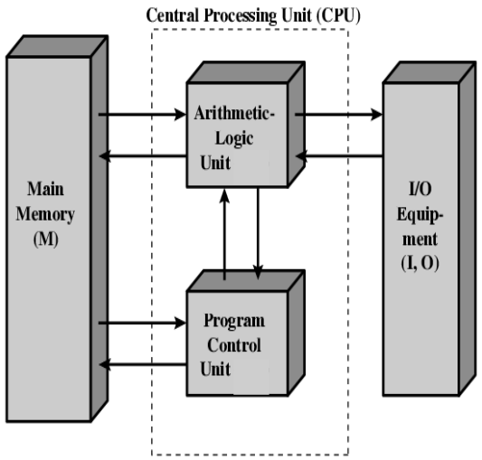
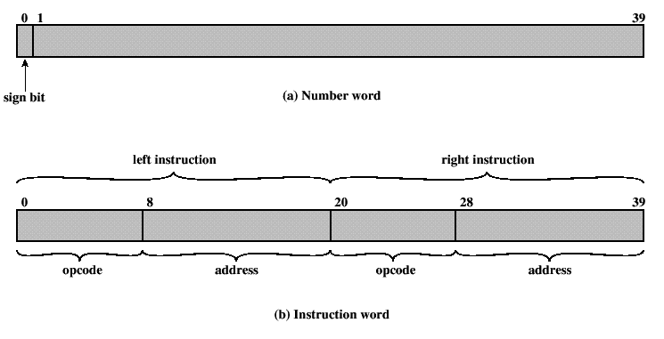
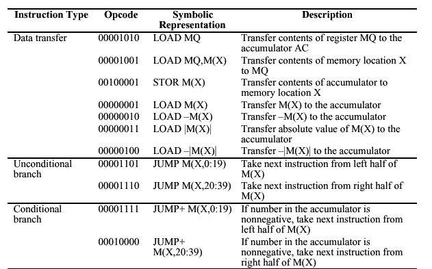
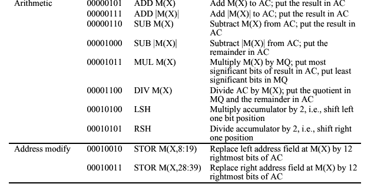
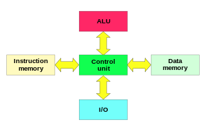

<!-- ID: 9 -->

The difference between computer architecture and computer organization can be summarized as follows:

# Computer Architecture
- **Definition**: Refers to the attributes of a system visible to a programmer or how a computer system is designed at a high level.
- **Focus**: Deals with the logical aspects of system implementation as seen by the programmer. This includes the instruction set, data formats, and addressing modes.
- **Concern**: Concerned with making decisions about the structure and behavior of the system, which impacts performance, efficiency, and cost.
- **Examples**: Instruction set architecture (ISA), microarchitecture, system design.

# Computer Organization
- **Definition**: Refers to the operational units and their interconnections that realize the architectural specifications.
- **Focus**: Deals with the physical aspects of system implementation. This includes hardware details transparent to the programmer, such as control signals, interfaces, memory technology, etc.
- **Concern**: Concerned with how the various parts of the system are interconnected and operated to achieve the architectural specifications.
- **Examples**: Control signals, data paths, hardware components, circuits, and layout.

> In essence, computer architecture is about the design and logical structure of the system from a high-level perspective, while computer organization is about the detailed physical implementation and operation of the system.

# Registers
A computer register is a small, fast storage location within a computer processor used to hold temporary data and instructions. Registers are essential components of a CPU and are used to quickly access and manipulate data during the execution of instructions.
- Types of Registers:
    - General Purpose Registers (GPRs)
        - **Accumulator (ACC)**: Used for arithmetic and logic operations. Example: The A register in many older microprocessors.
        - **Base Register (BX)**: Used to address memory. Example: BX register in x86 architecture.
        - **Count Register (CX)**: Used for loop control and string operations. Example: CX register in x86 architecture.
        - **Data Register (DX)**: Used for I/O operations. Example: DX register in x86 architecture.
    - Special Purpose Registers:
        - Index Registers:
            - **Source Index (SI)**: Used for modifying source operand addresses. Example: SI register in x86 architecture.
            - **Destination Index (DI)**: Used for modifying destination operand addresses. Example: DI register in x86 architecture.
            - **Stack Pointer (SP)**: Points to the top of the stack, used for storing return addresses, function parameters, and local variables.
        - **Base Pointer (BP)**: Points to the base of the stack frame, used for accessing parameters and local variables in a stack.
        - **Instruction Register (IR)**: Holds the current instruction being executed.
        - **Program Counter (PC)**: Also known as the Instruction Pointer (IP), it holds the address of the next instruction to be executed.
        - Status Registers/Flags:
            - **Zero Flag (ZF)**: Indicates whether the result of an operation is zero. 
            - **Carry Flag (CF)**: Indicates whether there is a carry out from the most significant bit.
            - **Sign Flag (SF)**: Indicates the sign of the result of an operation.
        - Segment Registers:
            - **Code Segment (CS)**: Used to manage the segment of memory containing the instructions. Example: CS register in x86 architecture.
            - **Data Segment (DS)**: Used to manage the segment of memory containing data. Example: DS register in x86 architecture.
            - **Stack Segment (SS)**: Used to manage the segment of memory containing the stack. Example: SS register in x86 architecture.
            - **Extra Segment (ES)**: Additional segment register for extra data. Example: ES register in x86 architecture.
        - Control Registers
            - **Control Register (CR0)**: Used to control various CPU operations. Example: CR0 register in x86 architecture.
            - **Control Register (CR3)**: Used for paging in memory management. Example: CR3 register in x86 architecture.
        - Floating Point Registers
            - **Floating Point Unit (FPU) Registers**: Used to perform arithmetic operations on floating-point numbers. Example: ST(0) to ST(7) in x86 architecture.
        - Vector Registers
            - **MMX Registers**: Used for SIMD (Single Instruction, Multiple Data) operations. Example: MM0 to MM7 in x86 architecture.
            - **XMM Registers**: Used for SIMD operations in SSE (Streaming SIMD Extensions). Example: XMM0 to XMM15 in x86 architecture.
        - **Memory Address Registers (MAR)**: Holds the address in memory where data is to be read from or written to.
        - **Memory Data Registers (MDR)**: Holds the data that is being transferred to or from memory.

# Von-Neumann Architecture
- Modern computers are based on a stored-program concept introduced by John Von Neumann. In this stored-program concept, programs and data are stored in the same memory. This novel idea meant that a computer built with this architecture would be much easier to reprogram.
- This architecture is also known as IAS 
> The Von Neumann architecture is a computer architecture model that describes a system where the CPU runs stored programs located in memory. It was proposed by John von Neumann in 1945 and forms the basis for most modern computer designs.

  
    Image taken from college notes.

## Memory of the IAS
- 1000 storage locations called words.
- Word length - 40 bits.
- A word may contain:
    - A number stored as 40 binary digits (bits) – **1 sign bit** + **39 bit** value,
      **[OR]**
    - An instruction-pair (2 instructions). Each instruction contains:
        - An opcode (**8 bits**)
        - The instruction address (**12 bits**) – designating one of the 1000 words in memory.

      
        Image taken from college notes.

## Components
- **MBR**, Memory Buffer Register[**40 bits**]: Contains the word to be stored in memory or just received from memory.
- **MAR**, Memory Address Register[**12 bits**]: Specifies the address in memory of the word to be stored or retrieved.
- **IR**, Instruction Register [**8 bits**] - contains the 8-bit opcode currently being executed.
- **IBR**, Instruction Buffer Register[**20 bits**]: Temporary store for RHS instruction from word in memory.
- **PC**, Program Counter[**12 bits**]: Stores Address of next instruction-pair to fetch from memory.
- **AC**, Accumulator & MQ, Multiplier Quotient [**40 bits**]: Holds operands and results of ALU operations.

## Limitations
- **Von Neumann Bottleneck**: The architecture limits the system's throughput by forcing a shared bus for instructions and data, causing a bottleneck as the CPU and memory compete for bus access.
- **Memory Latency**: Delays due to memory fetches can slow down the execution of instructions.
- **Single Pipeline**: Traditional von Neumann systems execute instructions one at a time, which can limit processing speed compared to parallel processing architectures.
- **Lack of Parallelism**: Not designed to handle multiple instructions simultaneously, reducing efficiency in handling complex operations.
- **Security**: Mixing data and instructions in the same memory space can lead to security vulnerabilities, such as buffer overflow attacks.

## Instruction Flow
1. **Fetch the Instruction**: PC -> MAR -> Memory -> MBR -> IR
2. **Decode the Instruction**: IR
3. **Fetch the Operands**: IR -> MAR -> Memory -> MBR -> ALU
4. **Execute the Instruction**: ALU
5. **Store the Result**: ALU -> MBR -> MAR -> Memory
6. **Update the Program Counter**: PC
7. **Repeat**: Repeat from step 1 until program completion

## Instruction Sets
  
  
    Images taken from college notes.

- Example 0: X=Y+Z, Memory locations: Y: 500, Z: 501, X: 500
    - LOAD M(500), ADD M(501) // AC << Y, AC <- AC + Z
    - STOR M(500)             // M(500) << AC
    - Data Flow:
        - **Load Y into Accumulator**
            - Fetch the instruction to load the value of Y from memory location 500 into the accumulator (ACC).
            - `MAR <- 500` (Memory Address Register is set to 500).
            - `MBR <- M(MAR)` (Memory Buffer Register fetches the value from memory location 500).
            - `ACC <- MBR` (Value of Y is loaded into the accumulator).

        - **Load Z into Memory Buffer Register (MBR)**
            - Fetch the instruction to load the value of Z from memory location 501 into the MBR.
            - `MAR <- 501` (Memory Address Register is set to 501).
            - `MBR <- M(MAR)` (Memory Buffer Register fetches the value from memory location 501).

        - **Add Z to the Accumulator (Y + Z)**
            - Add the value of Z (stored in MBR) to the value of Y (currently in ACC).
            - `ACC <- ACC + MBR` (ACC now holds the result of Y + Z).

        - **Store the Result in X**
            - Store the value in the accumulator (ACC) into memory location 502.
            - `MAR <- 502` (Memory Address Register is set to 502).
            - `MBR <- ACC` (Memory Buffer Register is loaded with the result from ACC).
            - `M(MAR) <- MBR` (The result is stored in memory location 502).

        - Component Path in One Line
            - PC -> MAR -> MBR -> IR -> Y -> ACC -> Z -> ACC + Z -> X

- Example 1: $A=(B*2)/2$, Memory locations: B: 800, A: 801
    - LOAD M(800), LSH      // AC <- M(800), Multiply by left-shift
    - RSH, STORE M(801)     // Divide by Right-shift, Store in A 
    - Data Flow:
        - PC <- 1
        - MAR <- PC
        - MBR <- M(MAR)
        - IBR <- MBR<20 ... 39> // Right Instruction
        - // Left Instruction Execution START
        - IR <- MBR<0 ... 7>    // Left Instruction Opcode
        - MAR <- MBR<8 ... 19>
        - MBR <- M(MAR)
        - AC <- MBR
        - // Left instruction Execution END
        - IR <- IBR<0 ... 7>
        - AC <- LSH(AC)
        - PC <- PC+1
        - MAR <- PC
        - MBR <- M(MAR)
        - IBR <- MBR<20 ... 39>
        - IR <- MBR<0 ... 7>
        - AC <- RSH(AC)
        - IR <- IBR<0 ... 7>
        - MAR <- IBR<8 ... 19>
        - MAR <- AC
        - M(MAR) <- MBR

# Harvard Architecture
  
    Image taken from college notes.
> The Harvard architecture is a computer architecture with separate storage and signal pathways for instructions and data. It is often contrasted with the von Neumann architecture, where program instructions and data share the same memory and pathways. This architecture is often used in real-time processing or low-power applications.
- In a Harvard architecture, there is no need to make the two memories share characteristics. In particular, the word width, timing, implementation technology, and memory address structure can differ. In some systems, instructions for pre-programmed tasks can be stored in read-only memory while data memory generally requires read-write memory. 
- In some systems, there is much more instruction memory than data memory so instruction addresses are wider than data addresses.
- Contrast with [Von Neumann Architecture](#von-neumann-architecture):
    - In a system with a pure von Neumann architecture, instructions and data are stored in the same memory, so instructions are fetched over the same data path used to fetch data. This means that a CPU cannot simultaneously read an instruction and read or write data from or to the memory.
    - In a computer using the Harvard architecture, the CPU can both read an instruction and perform a data memory access at the same time, even without a cache.
    - A Harvard architecture machine has distinct code and data address spaces: instruction address zero is not the same as data address zero.
- Modified Harvard Architecture:
    - A modified Harvard architecture machine is very much like a Harvard architecture machine, but it relaxes the strict separation between instruction and data while still letting the CPU concurrently access two (or more) memory buses.
    - The most common modification includes separate instruction and data caches backed by a common address space. While the CPU executes from cache, it acts as a pure Harvard machine. When accessing backing memory, it acts like a von Neumann machine. Example: x86 processors.
    - Another modification provides a pathway between the instruction memory and the CPU to allow words from the instruction memory to be treated as read-only data. This technique is used in some microcontrollers, including the Atmel AVR.
- Harvard Architecture vs Von Neumann Architecture:
    | Feature                        | Von Neumann Architecture                                      | Harvard Architecture                                           |
    |--------------------------------|---------------------------------------------------------------|---------------------------------------------------------------|
    | Memory                         | Shared memory for instructions and data.                       | Separate memory for instructions and data.                     |
    | Data Path                      | Single data path for both instructions and data.               | Separate data paths for instructions and data.                 |
    | Speed                          | Slower execution due to shared memory bus.                     | Faster execution as instruction and data fetch can occur simultaneously. |
    | Complexity                     | Simpler hardware design with a single memory and data path.    | More complex hardware design due to separate memory and data paths. |
    | Examples                       | Used in general-purpose computers, desktops, and laptops.      | Used in embedded systems, microcontrollers.                    |

# OpenMP
- (Open Multi-Processing) is an API (Application Programming Interface) that supports multi-platform shared memory multiprocessing programming in C, C++, and Fortran. It is designed for parallel programming, enabling developers to write code that can run efficiently on multi-core and multiprocessor systems. OpenMP uses a set of compiler directives, library routines, and environment variables to specify parallelism in the code.
## Key Features of OpenMP:
- **Simple and Flexible**: OpenMP is easy to use and provides a simple way to parallelize existing code without major modifications.
- **Compiler Directives**: It uses pragma directives to control parallel execution. These directives are simple comments in the code that the compiler interprets as instructions for parallel execution.
- **Fork-Join Model**: OpenMP follows a fork-join model of parallel execution, where the program begins with a single thread, which can fork multiple parallel threads and join back into a single thread.
- **Shared Memory Model**: OpenMP operates under a shared memory model, meaning that all threads can access shared variables and data.
- **Support for Various Constructs**: OpenMP supports constructs for parallel loops, sections, tasks, and synchronization (such as barriers, critical sections, and atomic operations).

## Benefits of Using OpenMP:
- **Ease of Use**: Allows for incremental parallelization of existing code.
- **Portability**: Supported on various platforms and compilers.
- **Efficiency**: Can lead to significant performance improvements on multi-core processors.
- **Scalability**: Easily scalable from single-core to multi-core and multi-processor systems.

## Limitations of using OpenMP:
- **Overhead**: There is overhead associated with creating and managing threads, as well as synchronizing them. For small or fine-grained tasks, this overhead can outweigh the performance benefits of parallelization.
- **Thread Safety**: Not all code is inherently thread-safe. Using OpenMP requires ensuring that shared data is properly synchronized and that race conditions are avoided, which can be complex and error-prone.
- **Debugging and Maintenance**: Parallel code can be harder to debug and maintain than sequential code. Issues like race conditions, deadlocks, and nondeterministic behavior can make debugging more challenging.
- **Compiler and Platform Dependency**: The performance and behavior of OpenMP code can vary significantly across different compilers and platforms. This can make it difficult to write portable, high-performance code.
- **Limited Control Over Threads**: OpenMP provides limited control over thread affinity and scheduling. Advanced users who need fine-grained control over thread behavior may find OpenMP's abstraction too limiting.

<!-- Last image: self/-1.png | external/3.png -->