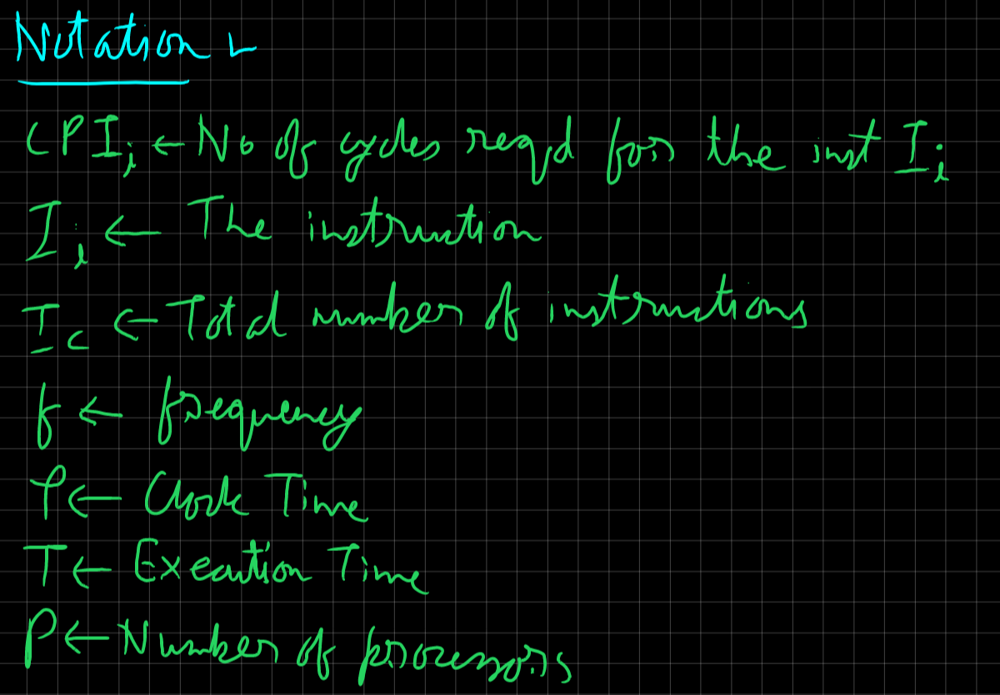
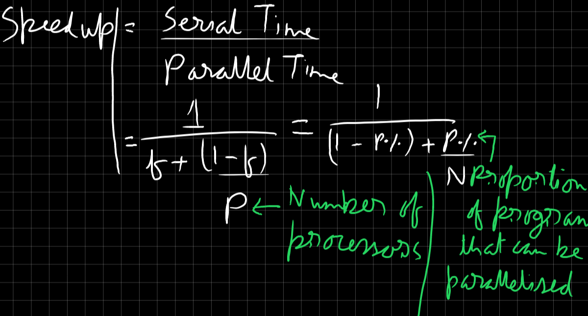

<!-- ID: 9 -->

The difference between computer architecture and computer organization can be summarized as follows:

# Computer Architecture
- **Definition**: Refers to the attributes of a system visible to a programmer or how a computer system is designed at a high level.
- **Focus**: Deals with the logical aspects of system implementation as seen by the programmer. This includes the instruction set, data formats, and addressing modes.
- **Concern**: Concerned with making decisions about the structure and behavior of the system, which impacts performance, efficiency, and cost.
- **Examples**: Instruction set architecture (ISA), microarchitecture, system design.

# Computer Organization
- **Definition**: Refers to the operational units and their interconnections that realize the architectural specifications.
- **Focus**: Deals with the physical aspects of system implementation. This includes hardware details transparent to the programmer, such as control signals, interfaces, memory technology, etc.
- **Concern**: Concerned with how the various parts of the system are interconnected and operated to achieve the architectural specifications.
- **Examples**: Control signals, data paths, hardware components, circuits, and layout.

> In essence, computer architecture is about the design and logical structure of the system from a high-level perspective, while computer organization is about the detailed physical implementation and operation of the system.

# Registers
A computer register is a small, fast storage location within a computer processor used to hold temporary data and instructions. Registers are essential components of a CPU and are used to quickly access and manipulate data during the execution of instructions.
- Types of Registers:
    - General Purpose Registers (GPRs)
        - **Accumulator (ACC)**: Used for arithmetic and logic operations. Example: The A register in many older microprocessors.
        - **Base Register (BX)**: Used to address memory. Example: BX register in x86 architecture.
        - **Count Register (CX)**: Used for loop control and string operations. Example: CX register in x86 architecture.
        - **Data Register (DX)**: Used for I/O operations. Example: DX register in x86 architecture.
    - Special Purpose Registers:
        - Index Registers:
            - **Source Index (SI)**: Used for modifying source operand addresses. Example: SI register in x86 architecture.
            - **Destination Index (DI)**: Used for modifying destination operand addresses. Example: DI register in x86 architecture.
            - **Stack Pointer (SP)**: Points to the top of the stack, used for storing return addresses, function parameters, and local variables.
        - **Base Pointer (BP)**: Points to the base of the stack frame, used for accessing parameters and local variables in a stack.
        - **Instruction Register (IR)**: Holds the current instruction being executed.
        - **Program Counter (PC)**: Also known as the Instruction Pointer (IP), it holds the address of the next instruction to be executed.
        - Status Registers/Flags:
            - **Zero Flag (ZF)**: Indicates whether the result of an operation is zero. 
            - **Carry Flag (CF)**: Indicates whether there is a carry out from the most significant bit.
            - **Sign Flag (SF)**: Indicates the sign of the result of an operation.
        - Segment Registers:
            - **Code Segment (CS)**: Used to manage the segment of memory containing the instructions. Example: CS register in x86 architecture.
            - **Data Segment (DS)**: Used to manage the segment of memory containing data. Example: DS register in x86 architecture.
            - **Stack Segment (SS)**: Used to manage the segment of memory containing the stack. Example: SS register in x86 architecture.
            - **Extra Segment (ES)**: Additional segment register for extra data. Example: ES register in x86 architecture.
        - Control Registers
            - **Control Register (CR0)**: Used to control various CPU operations. Example: CR0 register in x86 architecture.
            - **Control Register (CR3)**: Used for paging in memory management. Example: CR3 register in x86 architecture.
        - Floating Point Registers
            - **Floating Point Unit (FPU) Registers**: Used to perform arithmetic operations on floating-point numbers. Example: ST(0) to ST(7) in x86 architecture.
        - Vector Registers
            - **MMX Registers**: Used for SIMD (Single Instruction, Multiple Data) operations. Example: MM0 to MM7 in x86 architecture.
            - **XMM Registers**: Used for SIMD operations in SSE (Streaming SIMD Extensions). Example: XMM0 to XMM15 in x86 architecture.
        - **Memory Address Registers (MAR)**: Holds the address in memory where data is to be read from or written to.
        - **Memory Data Registers (MDR)**: Holds the data that is being transferred to or from memory.

# Von-Neumann Architecture
- Modern computers are based on a stored-program concept introduced by John Von Neumann. In this stored-program concept, programs and data are stored in the same memory. This novel idea meant that a computer built with this architecture would be much easier to reprogram.
- This architecture is also known as IAS (Instruction Set Architecture).
> The Von Neumann architecture is a computer architecture model that describes a system where the CPU runs stored programs located in memory. It was proposed by John von Neumann in 1945 and forms the basis for most modern computer designs.

<br><br>
    Image taken from college notes.

## Memory of the IAS
- 1000 storage locations called words.
- Word length - 40 bits.
- A word may contain:
    - A number stored as 40 binary digits (bits) – **1 sign bit** + **39 bit** value,
    <br> **[OR]**
    - An instruction-pair (2 instructions). Each instruction contains:
        - Opcode (**8 bits**)
        - Operand (**12 bits**) – designating one of the 1000 words in memory.

    <br><br>
        Image taken from college notes.


## Components
- **MBR**, Memory 300pxm college notes.

- Example 0: X=Y+Z, Memory locations: Y: 500, Z: 501, X: 502
    - LOAD M(500), ADD M(501) // AC << Y, AC <- AC + Z
    - STOR M(500)             // M(500) << AC
    - Data Flow:
        - **Load Y into Accumulator**
            - Fetch the instruction to load the value of Y from memory location 500 into the accumulator (ACC).
            - `MAR <- 500` (Memory Address Register is set to 500).
            - `MBR <- M(MAR)` (Memory Buffer Register fetches the value from memory location 500).
            - `ACC <- MBR` (Value of Y is loaded into the accumulator).

        - **Load Z into Memory Buffer Register (MBR)**
            - Fetch the instruction to load the value of Z from memory location 501 into the MBR.
            - `MAR <- 501` (Memory Address Register is set to 501).
            - `MBR <- M(MAR)` (Memory Buffer Register fetches the value from memory location 501).

        - **Add Z to the Accumulator (Y + Z)**
            - Add the value of Z (stored in MBR) to the value of Y (currently in ACC).
            - `ACC <- ACC + MBR` (ACC now holds the result of Y + Z).

        - **Store the Result in X**
            - Store the value in the accumulator (ACC) into memory location 502.
            - `MAR <- 502` (Memory Address Register is set to 502).
            - `MBR <- ACC` (Memory Buffer Register is loaded with the result from ACC).
            - `M(MAR) <- MBR` (The result is stored in memory location 502).

        - Component Path in One Line
            - PC -> MAR -> MBR -> IR -> Y -> ACC -> Z -> ACC + Z -> X

- Example 1: $A=(B*2)/2$, Memory locations: B: 800, A: 801
    - LOAD M(800), LSH      // AC <- M(800), Multiply by left-shift
    - RSH, STORE M(801)     // Divide by Right-shift, Store in A 
    - Data Flow:
        - PC <- 1
        - MAR <- PC
        - MBR <- M(MAR)
        - IBR <- MBR<20 ... 39> // Right Instruction
        // Left Instruction Execution START
        - IR <- MBR<0 ... 7>    // Left Instruction Opcode
        - MAR <- MBR<8 ... 19>
        - MBR <- M(MAR)
        - AC <- MBR
        // Left instruction Execution END
        - IR <- IBR<0 ... 7>
        // We're not doing MAR <- IBR<8 ... 19> here because LSH edits the data in-place.
        - AC <- LSH(AC)
        - PC <- PC+1
        - MAR <- PC
        - MBR <- M(MAR)
        - IBR <- MBR<20 ... 39>
        - IR <- MBR<0 ... 7>
        - AC <- RSH(AC)
        - IR <- IBR<0 ... 7>
        - MAR <- IBR<8 ... 19>
        - MAR <- AC
        - M(MAR) <- MBR

# Harvard Architecture
<br><br>
    Image taken from college notes.
> The Harvard architecture is a computer architecture with separate storage and signal pathways for instructions and data. It is often contrasted with the von Neumann architecture, where program instructions and data share the same memory and pathways. This architecture is often used in real-time processing or low-power applications.
- In a Harvard architecture, there is no need to make the two memories share characteristics. In particular, the word width, timing, implementation technology, and memory address structure can differ. In some systems, instructions for pre-programmed tasks can be stored in read-only memory while data memory generally requires read-write memory. 
- In some systems, there is much more instruction memory than data memory so instruction addresses are wider than data addresses.
- Contrast with [Von Neumann Architecture](#von-neumann-architecture):
    - In a system with a pure von Neumann architecture, instructions and data are stored in the same memory, so instructions are fetched over the same data path used to fetch data. This means that a CPU cannot simultaneously read an instruction and read or write data from or to the memory.
    - In a computer using the Harvard architecture, the CPU can both read an instruction and perform a data memory access at the same time, even without a cache.
    - A Harvard architecture machine has distinct code and data address spaces: instruction address zero is not the same as data address zero.
- Modified Harvard Architecture:
    - A modified Harvard architecture machine is very much like a Harvard architecture machine, but it relaxes the strict separation between instruction and data while still letting the CPU concurrently access two (or more) memory buses.
    - The most common modification includes separate instruction and data caches backed by a common address space. While the CPU executes from cache, it acts as a pure Harvard machine. When accessing backing memory, it acts like a von Neumann machine. Example: x86 processors.
    - Another modification provides a pathway between the instruction memory and the CPU to allow words from the instruction memory to be treated as read-only data. This technique is used in some microcontrollers, including the Atmel AVR.
- Harvard Architecture vs Von Neumann Architecture:
    | Feature                        | Von Neumann Architecture                                      | Harvard Architecture                                           |
    |--------------------------------|---------------------------------------------------------------|---------------------------------------------------------------|
    | Memory                         | Shared memory for instructions and data.                       | Separate memory for instructions and data.                     |
    | Data Path                      | Single data path for both instructions and data.               | Separate data paths for instructions and data.                 |
    | Speed                          | Slower execution due to shared memory bus.                     | Faster execution as instruction and data fetch can occur simultaneously. |
    | Complexity                     | Simpler hardware design with a single memory and data path.    | More complex hardware design due to separate memory and data paths. |
    | Examples                       | Used in general-purpose computers, desktops, and laptops.      | Used in embedded systems, microcontrollers.                    |

# CISC (Complex Instruction Set Architecture)
- The main idea is that a single instruction will do all loading, evaluating, and storing operations just like a multiplication command will do stuff like loading data, evaluating, and storing it, hence it’s complex.
- This approach attempts to minimize the number of instructions per program but at the cost of an increase in the number of cycles per instruction.
- Example: IBM 370 computer, Digital Equipment Corporation VAX computer.
- Complex instruction, hence complex instruction decoding.
- Instructions are larger than one-word size.
- Instruction may take more than a single clock cycle to get executed.
- Less number of general-purpose registers as operations get performed in memory itself.
- Complex Addressing Modes.
- Variable length Instruction Format.
- More Data types.
- **As an example**, if we have to add two 8-bit numbers, there will be a single command or instruction for this like ADD which will perform the task.

# RISC (Reduced Instruction Set Architecture)
- The main idea behind this is to make hardware simpler by using an instruction set composed of a few basic steps for loading, evaluating, and storing operations just like a load command will load data, a store command will store the data.
- This approach aimes to reduce the cycles per instruction at the cost of the number of instructions per program. 
- Example: The IBM 801, Stanford MIPS, and Berkeley RISC 1 and 2.
- Simpler instruction, hence simple instruction decoding.
- Instruction comes undersize of one word.
- Instruction takes a single clock cycle to get executed.
- More general-purpose registers.
- Simple Addressing Modes.
- Single length Instruction Format.
- Fewer Data types.
- A pipeline can be achieved.
- **As an example**, if we have to add two 8-bit numbers, will write the first load command to load data in registers then it will use a suitable operator and then it will store the result in the desired location.

# Multiprocessor Classification
## Based on Instruction and Data Streams (Flynn's Taxonomy)
### SISD (Single Instruction Single Data)
<br><br>
    Image taken from college notes.
- It is also known as a serial(non parallel) computer. This is the oldest and common type of computer.
- **Single Instruction**: Only one instruction stream is being acted upon by the CPU during any one clock cycle.
- **Single Data**: Only one data stream is being used as input during any one clock cycle.
- Examples: Older generation mainframes, Minicomputers and Workstations.
- Example Instruction:
    <br><br>
        Image taken from college notes.

### SIMD (Single Instruction Multiple Data)
<br><br>
    Image taken from college notes.

- **Single Instruction**: All processing units execute the same instruction at any given clock cycle
- **Multiple Data**: each Processing unit can operate on different data elements.
- It is best suited for specialized problems characterized by a high degree of regularity such as graphic and image processing.
- Example Instruction:
    <br><br>
        Image taken from college notes.

### MISD (Multiple Instruction Multiple Data)
<br><br>
    Image taken from college notes.

- **Multiple Instruction**: Each processing unit operates on the data independently via separate instruction stream.
- **Single Data**: A single data stream is fed into multiple processing units.
- Example: Multiple frequency filters operating on a single signal stream, multiple cryptography algorithms attempting to crack a single encoded message.
- Example Instruction:
    <br><br>
        Image taken from college notes.

### MIMD (Multiple Instruction Multiple Data)
<br><br>
    Image taken from college notes.
- **Multiple Instructions**: Each processors is executing a different instruction.
- **Multiple Data**: Each processor is working with a different input data stream.
- Examples: Most current supercomputers and networked parallel computer clusters, multi-core PC's.
- Example Instruction:
    <br><br>
        Image taken from college notes.

## Based on Coupling of the processor
### Tightly-coupled Multiprocessor
- Contain multiple CPUs that are connected at the bus level.
- These CPUs may **either** have access to a central shared memory (Symmetric Multiprocessing, or SMP), **or** may participate in a memory hierarchy with both local and shared memory (Non-Uniform Memory Access, or NUMA).
- **Example**: IBM p690 Regatta, Chip multiprocessors, also known as multi-core computing.

### Loosely-coupled Multiprocessor
- These are often referred as clusters 
- They are based on multiple standalone single or dual processor commodity computers interconnected via a high speed communication system, such as Gigabit Ethernet. 
- **Example**: Linux Beowulf cluster.

## Based on communication architectures
### Message Passing Architecture
- Separate address space for each processor
- Processors communicate via message passing
- Processors have private memories
- Focuses attention on costly non-local operations

### Shared Memory Architecture
- Processors communicate with shared address space
- Processors communicate by memory read/write
- Easy on small-scale machines
- Lower latency
- Types: Uniform Memory Access (UMA) or Non-Uniform Memory Access (NUMA)
    - Uniform Memory Access (UMA):
    - Diagram:
    <br><br>
        Image taken from college notes.
        - Access to all memory occurs at the same speed for all processors.
        - Example: Bus-based UMA.
            - Since multiple processors connect to shared memory using a single bus, bus bandwidth can becomes a bottleneck.
            - Each processor also has it's own cache to reduce the need to access memory.
            - To further scale the number of processors, each processor is given it's own private local memory.
    - Non-Uniform Memory Access (NUMA):
        - Diagram:
        <br><br>
            Image taken from college notes.
        - also known as “Distributed Shared Memory”.
        - Typically, the type of interconnection is **grid** or **hypercube**.
        - Each processor's own memory can be addressed by all other processors, but access to a processor’s own local memory is faster than access to another processor’s remote memory.
        - It looks like a distributed machine, but the interconnection network is usually custom-designed switches and/or buses.
        - It is harder to program, but scales to more processors.

### Distributed Memory Architecture
- Diagram:
<br><br>
    Image taken from college notes.
- In the distributed memory architecture, each of the processors have their own memory unit or physical memory connected via the input/output (I/O) interface.
- There is an interconnection network that links and allows the processors to communicate with each other.
- If a change is made by one of the processors in its local memory this change is not automatically reflected into the memory of the other processors.
- The programmers will need to explicitly define communication of data between the computing nodes or processors.

# Moore's Law
- Moore's Law is an observation made by Gordon Moore, co-founder of Intel, in 1965. According to Moore's Law, the number of transistors on a microchip doubles approximately every two years.
- This observation has held true for several decades and has been a driving force behind the rapid advancement of technology.

## Limitations of Moore's Law
- As transistor sizes continue to shrink, we are approaching the physical limits of silicon-based technology.
- The increasing complexity of manufacturing smaller transistors poses significant challenges in terms of cost and feasibility.
- Heat dissipation becomes a major issue as more transistors are packed into a smaller space, leading to power consumption and thermal management challenges.
- The performance gains from doubling the number of transistors may not always translate into proportional improvements in overall system performance.
- The economic feasibility of sustaining Moore's Law in the long term is uncertain, as the cost of research and development for advanced manufacturing processes continues to rise.

# Multi-Processor - Terms
- **Multithreading**: Multithreading is a programming concept where multiple threads of execution run concurrently within a single process. Each thread represents an independent flow of control, allowing for parallel execution of tasks and improved performance.
- **Multiprocessing**: Multiprocessing refers to the use of multiple processors or cores in a computer system to execute multiple tasks simultaneously. It involves dividing a program into smaller parts that can be executed independently on different processors, enabling faster and more efficient processing.
- **Multicomputers**: Multicomputers are computer systems that consist of multiple independent computers connected together, often through a network. These computers work together to solve complex problems by distributing the workload across multiple machines, resulting in improved performance and scalability.
- **Multicore**: Multicore refers to a computer processor that contains multiple independent processing units, known as cores, on a single chip. Each core can execute instructions independently, allowing for parallel processing and improved performance in multi-threaded applications.

# Instruction Level Parallelism
## Instruction Pipeline
- A pipeline is a set of data processing elements connected in series.
  - Stages in a 5-stage pipeline:
    1. **Instruction Fetch**: The processor retrieves the next instruction to be executed from memory.
    2. **Instruction Decode**: The fetched instruction is decoded to determine the operation to be performed and the operands involved.
    3. **Instruction Execute**: The processor performs the operation specified by the instruction.
    4. **Memory Access**: If the instruction involves accessing memory, the processor reads from or writes to the specified memory location.
    5. **Write Back**: The result of the instruction execution is written back to the appropriate register or memory location.

## Cycles Per Instruction
- Instruction Execution Rate: Refers to the number of instructions that a processor can execute per unit of time. It is a measure of the processor's performance and is typically expressed in terms of **instructions per second (IPS)** or **millions of instructions per second (MIPS)**.
- Processor Time: Also known as CPU time, it is the amount of time that a processor spends executing a program or a specific task. It represents the actual time that the processor is actively working on processing instructions.
- Clock Time: This is the duration of 1 clock cycle. It is measured in **seconds per cycle**.
- Frequency: This is the number of cycles a processor can execute per second, measured in Hertz (Hz). It is measured in **cycles per second**.
- MIPS (Million Instructions Per Second): MIPS is a measure of the performance of a computer system or processor. It represents the number of millions of instructions that a processor can execute per second.
- MFLOPS (Million Floating Point Operations Per Second): MFLOPS is a measure of the performance of a computer system or processor in executing floating-point operations. It represents the number of millions of floating-point operations that a processor can perform per second.
- Benchmark Programs: Benchmark programs are standardized programs or sets of tasks that are used to evaluate the performance of computer systems or processors. They provide a way to compare the performance of different systems or processors under the same workload.
- Formulae:
    <br><br>
    <br><br>

## Instruction Throughput
- Throughput refers to the number of instructions that can be executed per unit of time. It is a measure of the processing speed or efficiency of a system.
- Formula for instruction throughput is: Throughput = Instructions Executed / Time
    - `Instructions Executed` : Total number of instructions executed during a specific time period.
    - `Time` is the duration of that time period.
- Formula for increase in throughput:
    $\frac{(Final\ Throughput - Initial\ Throughput)}{Initial\ Throughput} * 100\%$

## Speed-up
- Speed-up is a measure of the performance improvement achieved by parallelizing a program or task. It quantifies how much faster a parallel version of the program executes compared to a sequential version.
- A speed-up value greater than 1 indicates that the parallel version of the program is faster than the sequential version. The higher the speed-up value, the more efficient the parallelization.
- Formulae (Amdahl's Law):
    <br><br>

## Instruction Pipeline Hazards

In an instruction pipeline, there are several types of hazards that can occur, leading to performance degradation and potential incorrect results. These hazards include:

- **Structural** Hazards: These occur when the hardware resources required by multiple instructions overlap in time. For example, if two instructions require the same functional unit at the same time, a structural hazard can occur.
- **Data** Hazards: These occur when there are dependencies between instructions that prevent them from executing in the desired order. There are three types of data hazards:
    - **Read-after-Write (RAW)** Hazard: Occurs when an instruction depends on the result of a previous instruction that has not yet produced the result.
    - **Write-after-Read (WAR)** Hazard: Occurs when an instruction writes to a register or memory location that is later read by a subsequent instruction.
    - **Write-after-Write (WAW)** Hazard: Occurs when two instructions write to the same register or memory location.
    - **Read-after-Read (RAR)** Hazard: Occurs when two instructions read the same register or memory location. **This isn't really a hazard, because data integrity isn't lost when this happens.**
- **Control** Hazards: These occur when the flow of instructions is altered due to conditional branches or jumps. There are two types of control hazards:
    - **Branch** Hazards: Occur when the branch instruction is not resolved until later in the pipeline, causing a delay in fetching the correct instructions.
    - **Jump** Hazards: Occur when a jump instruction changes the program counter, causing a potential delay in fetching the correct instructions.

# Memory Systems
## Key Characteristics
- Location:
    - CPU: Registers
    - Internal (Primary): RAM, ROM, etc.
    - External (Secondary): Hard Disk, SSD, etc.
- Capacity:
    - Size: The amount of data a memory system can store. Measured in bytes, kilobytes (KB), megabytes (MB), gigabytes (GB), etc.
    - Addressability: The smallest unit of memory that can be addressed. Typically, it's a byte or a word.
- Speed:
    - Access Time: The average time it takes to read or write a data item from or to memory. Measured in nanoseconds.
    - Cycle Time: The minimum time interval between two consecutive memory accesses.
- Volatility:
    - Volatile: Memory loses its contents when the power is turned off. Examples include RAM and cache memory.
    - Non-volatile: Memory retains its contents even when the power is off. Examples include ROM, flash memory, and hard disk drives.
- Cost: The cost of storing a single bit of data.
    - Hard disks are slower but can store larger volumes of data compared to what they cost.
    - SSD's are faster but can store smaller volumes of data compared to what they cost.
- Technology:
    - Static RAM (SRAM): Faster but more expensive than DRAM.
    - Dynamic RAM (DRAM): Slower but less expensive than SRAM.
    - ROM (Read-Only Memory): Non-volatile memory used for storing programs and data that don't need to be modified.
    - Flash Memory: Non-volatile memory that can be erased and reprogrammed.
- Organization:
    - Sequential Access: Data is accessed sequentially, like on a tape drive.
    - Direct Access: Data can be accessed directly by specifying its address.
    - Associative Access: Data is accessed based on its content rather than its address.
- Cache Memory: Faster and smaller than main memory, used to store frequently accessed data.
    - Level 1 (L1): This is the fastest and smallest cache, typically located directly on the processor chip. It has the shortest access time, but also the smallest capacity.
    - Level 2 (L2): Larger than L1 cache, it's often shared by multiple processor cores. Access times are slightly longer than L1, but still much faster than main memory.
    - Level 3 (L3): The largest and slowest cache, usually shared by all cores on a processor. It's used to store less frequently accessed data that's still more likely to be reused than data in main memory.

## Cache Memory
- A cache memory is a smaller, faster memory that stores most frequently accessed memory locations.
### Terms
- Cache Hit: Occurs when the data requested by the CPU is found in the cache memory.
- Cache Miss: Occurs when the data requested by the CPU is not found in the cache memory and must be fetched from the main memory / secondary memory.
- Hit Ratio: The percentage of memory accesses that result in a cache hit.
- Miss Ratio: The percentage of memory accesses that result in a cache miss.
- Latency: The time it takes to access data from memory.
- Bandwidth: The amount of data that can be transferred in a given amount of time.
- Blocks: The smallest unit of data that can be transferred between cache and main memory.
- Block Frame / Cache Line: A fixed-size block of memory that is used to store data in the cache.

### Block Placement
1. Direct Mapping
    - In direct mapping, each block of main memory maps to exactly one cache line. The mapping is determined by the memory address.
    - The cache line is chosen using the formula:
        $\text{Cache Line} = (\text{Block Address}) \% (\text{Number of Cache Lines})$
    - Direct mapping is simple and fast but can lead to conflicts if multiple blocks map to the same cache line. This type of mapping is also known as one-to-one mapping.

1. Set-Associative Mapping
    - In set-associative mapping, the cache is divided into several sets, and each set contains multiple lines. A block of main memory maps to a specific set, but can be placed in any line within that set.
    - The set is chosen using the formula:
        $\text{Set} = (\text{Block Address}) \% (\text{Number of Sets})$
    - Set-associative mapping provides a balance between direct and associative mapping, reducing conflicts while keeping the hardware complexity manageable.
    - $N$ way set-associative cache: There are $N$ blocks present in $1$ set.

2. Fully Associative Mapping
    - In fully associative mapping, a block of main memory can be placed in any line of the cache. There are no restrictions on where a block can be placed.
    - This mapping is determined by searching the entire cache to find an empty line or to replace an existing line.
    - Fully associative mapping provides the highest flexibility and reduces conflicts, but it requires more complex hardware to search the entire cache for each memory access.

### Locality of Reference:
- **Temporal**: If the same storage location is accessed multiple times. Example: Accessing & Incrementing a counter variable.
- **Spatial**: Spatial locality of reference refers to the tendency of a program to access data locations that are close to each other within a short period of time. This principle is based on the observation that programs often access memory addresses that are sequential or near each other. Example: Accessing array elements in succession.

### Cache Update Policies
- **Read Policies**:
    - **Look Aside**: 
      - Steps:
        1. The Application first checks the cache for the requested data.
        2. If the data is not found in the cache (cache miss), the Application fetches the data from the main memory.
        3. The fetched data is then placed in the cache for future accesses.
      - The application needs to handle cache consistency.
    - **Look Through**:
      - Steps:
        1. The CPU checks the cache for the requested data.
        2. If the data is not found in the cache (cache miss), the CPU fetches the data from the main memory.
        3. The fetched data is directly used by the CPU and also placed in the cache for future accesses.
      - The cache consistency is handled by the CPU internally, the application doesn't need to handle it.

- **Write Policies**:
    - **Write Through**: In this policy, data is written to both the cache and the main memory simultaneously. This ensures data consistency between the cache and the main memory but can result in slower write operations.
    - **Write Back**: In this policy, data is written only to the cache initially. The modified data is written back to the main memory only when it is evicted from the cache. This can improve write performance but requires additional mechanisms to ensure data consistency.
    - **Write Around**: In this policy, data is written directly to the main memory, bypassing the cache. This can be useful for write-intensive applications where caching write operations may not provide significant performance benefits.

# OpenMP
- (Open Multi-Processing) is an API (Application Programming Interface) that supports multi-platform shared memory multiprocessing programming in C, C++, and Fortran. It is designed for parallel programming, enabling developers to write code that can run efficiently on multi-core and multiprocessor systems. OpenMP uses a set of compiler directives, library routines, and environment variables to specify parallelism in the code.
## Key Features of OpenMP:
- **Simple and Flexible**: OpenMP is easy to use and provides a simple way to parallelize existing code without major modifications.
- **Compiler Directives**: It uses pragma directives to control parallel execution. These directives are simple comments in the code that the compiler interprets as instructions for parallel execution.
- **Fork-Join Model**: OpenMP follows a fork-join model of parallel execution, where the program begins with a single thread, which can fork multiple parallel threads and join back into a single thread.
- **Shared Memory Model**: OpenMP operates under a shared memory model, meaning that all threads can access shared variables and data.
- **Support for Various Constructs**: OpenMP supports constructs for parallel loops, sections, tasks, and synchronization (such as barriers, critical sections, and atomic operations).

## Benefits of Using OpenMP:
- **Ease of Use**: Allows for incremental parallelization of existing code.
- **Portability**: Supported on various platforms and compilers.
- **Efficiency**: Can lead to significant performance improvements on multi-core processors.
- **Scalability**: Easily scalable from single-core to multi-core and multi-processor systems.

## Limitations of using OpenMP:
- **Overhead**: There is overhead associated with creating and managing threads, as well as synchronizing them. For small or fine-grained tasks, this overhead can outweigh the performance benefits of parallelization.
- **Thread Safety**: Not all code is inherently thread-safe. Using OpenMP requires ensuring that shared data is properly synchronized and that race conditions are avoided, which can be complex and error-prone.
- **Debugging and Maintenance**: Parallel code can be harder to debug and maintain than sequential code. Issues like race conditions, deadlocks, and nondeterministic behavior can make debugging more challenging.
- **Compiler and Platform Dependency**: The performance and behavior of OpenMP code can vary significantly across different compilers and platforms. This can make it difficult to write portable, high-performance code.
- **Limited Control Over Threads**: OpenMP provides limited control over thread affinity and scheduling. Advanced users who need fine-grained control over thread behavior may find OpenMP's abstraction too limiting.

## Functions & Constructs
### Functions
- `omp_get_num_threads()` -> int: This routine returns the number of threads in the current team.
- `omp_get_max_threads()` -> int: This routine returns the maximum number of threads available in the system.
- `omp_get_thread_num()` -> int: This routine returns the thread number (ID) of the currently running thread. 
- `omp_get_num_procs()` -> int: This routine returns the number of processor cores available to the program.
- `omp_set_num_threads(numberOfThreads)` -> boolean: This routine sets the number of threads to be executed within the parallel scope of the program. 
- `omp_in_parallel()` -> boolean: This routine returns `true` if the call to the routine is enclosed by an active parallel region; otherwise, it returns `false`. 
- `omp_get_wtime()` -> double: Returns the current time.
- `omp_set_schedule(schedule_type,chunk_size)` -> omp_sched_t: This routine sets the scheduling clause & the chunk size, incase the scheduling clause is `runtime`. Values can be: `omp_sched_static`, `omp_sched_dynamic`, `omp_sched_guided`, `omp_sched_auto`.

### Constructs
- `#pragma omp parallel {...}`: This fundamental construct starts parallel execution. 
- `#pragma omp parallel for` {...}: The parallel loop construct is a shortcut for specifying a parallel construct containing one or more associated loops and no other statements. 
- `# pragma omp parallel for reduction(+:sum) if (parallelize) {...}`: Perform reduction on the variable `sum` only if (parallelize) is `1`/`true`.
- `# pragma omp parallel sections {...}`: Only parallelize code within the `# pragma omp section {...}`.
- `#pragma omp parallel private (tid) shared (numt)`: The scope of the variables `tid` & `numt` are defined.
- `#pragma omp parallel for schedule(static, chunkSize)`: Use static scheduling clause, with specified chunk size.
- `#pragma omp parallel for schedule(dynamic, chunkSize)`: Use dynamic scheduling clause, with specified chunk size.
- `#pragma omp parallel for schedule(guided, chunkSize)`: Use guided scheduling clause, with specified chunk size.
- `#pragma omp parallel for schedule(auto)`: Compiler & runtime system determines the scheduling clause automatically
- `#pragma omp parallel for schedule(runtime)`: Scheduling clause is decided during runtime, and `omp_set_schedule(schedule_type,chunk_size)` can be used to set the schedule.
- Thread Synchronization mechanisms:
    - `#pragma omp critical`: Critical section , only 1 thread can execute at a time.
    - `#pragma omp atomic`: Does the same task as critical, but only used for simple updates. This is more efficient than using a critical section, in this specific case.
    - `#pragma omp barrier`: A barrier is used to synchronize all threads in a team. When a thread reaches a barrier, it stops execution until all other threads in the team also reach the barrier. Once all threads reach the barrier, they can all proceed.
    - `#pragma omp single`: Only a single thread can execute this code segment, at a time.
    - `#pragma omp master`: Only the master thread can execute this code segment.

## Scope of a variable
- In OpenMP, the scope of a variable refers to the set of threads that can access the variable in a parallel block.
- Scopes:
    1. **shared**: The variable can be accessed by all the threads in the team.
    1. **private**: The variable can only be accessed by a single thread. A copy of the variable is created for each thread, and there's no connection between the copies.
    1. **firstprivate**: Same as private, but the initial value is copied from the main copy.
    1. **lastprivate**: Same as private, but the final value is copied back to the main copy.

## Scheduling Clause
- Scheduling clauses are used to control how iterations of loops are distributed among threads in a parallel region. These clauses help optimize the performance of parallel loops by specifying the strategy for assigning loop iterations to threads.
- Types of clauses:
    - **Static**: Divides the iterations into chunks of a specified size and assigns each chunk to a thread, in a Round Robin fashion. If no chunk size is specified, the iterations are divided evenly among the threads.
    - **Dynamic**: Assigns a chunk of iterations to a thread, and when a thread finishes its chunk, it is assigned the next available chunk. This can help balance the load if iterations take varying amounts of time.
    - **Guided**: Similar to dynamic, but the chunk size starts large and decreases exponentially with each successive chunk. This can reduce overhead compared to dynamic while still balancing the load. 
    - **Auto**: Leaves the decision of scheduling to the compiler and runtime system, which can choose the most appropriate scheduling strategy.
    - **Runtime**: The scheduling decision is deferred until runtime, and the schedule can be set using the `omp_set_schedule()` environment variable.

## Reduction Clause
- The reduction clause is used to perform a reduction operation on variables across multiple threads.
- Process:
    1. Each thread gets a private copy of `sum`
    1. The threads compute the result independently.
    1. All the values are combined using the specified operator `+`. </li>
- Allowed operators:
    - Arithmetic: (`+`,`-`,`*`)
    - Bitwise: (`&`, `|`, `^`)
    - Logical: (`&&`,`||`)
    - Intrinsic Functions: (`max`,`min`,`land`,`ior`,`ieor`)

# nVidia CUDA
- nVidia CUDA is a parallel computing platform and application programming interface (API) model created by NVIDIA.
- CUDA allows developers to use nVidia GPUs for general purpose processing, an approach known as GPGPU i.e. General-Purpose computing on Graphics Processing Units.
- Terms:
  - **Thread**: A Thread is the smallest unit of execution in CUDA. Each thread executes a single instance of a kernel funciton.
  - **Block**: A Block is a group of threads, all of which execute the same kernel function.
  - **Grid**: A Grid is a group of blocks, all of which execute the same kernel function.
- Functions:
  - `cudaMalloc(&memPtr, size)`: This function is used to allocate memory on the GPU.
      - **&memPtr**: Pointer to the allocated GPU memory.
      - **size**: Number of bytes to allocate.
  - `cudaMemcpy(dst, src, size, cudaMemcpyKind)`: This function is used to copy data between host and device.
      - **dst**: Destination (pointer) where the data will be copied to.
      - **src**: Source (pointer) where the data will be copied from.
      - **size**: Number of bytes to copy.
      - **cudaMemcpyKind**: Type of transfer. Types:
        - `cudaMemcpyHostToDevice`
        - `cudaMemcpyDeviceToHost`
        - `cudaMemcpyDeviceToDevice`
        - `cudaMemcpyHostToHost`.
  - `cudaFree(memPtr)`: This function is used to free the allocated memory on the GPU.
      - **memPtr**: Pointer to the GPU memory to be freed.
  - `dim3 grid_size(x,y,z)`:
    - `x`: Number of blocks in the x-dimension.
    - `y`: (optional) Number of blocks in the y-dimension.
    - `z`: (optional) Number of blocks in the z-dimension.
    - `dim3 grid_size(10)`: 
  - `dim3 block_size(x,y,z)`:
    - `x`: Number of blocks in the x-dimension.
    - `y`: (optional) Number of blocks in the y-dimension.
    - `z`: (optional) Number of blocks in the z-dimension.
    - `dim3 block_size(10)`: Creates a 1D block with 10 blocks.
  - `kernel_function<<<grid_size, block_size>>>(device_array, num_elements)`: This function is used to launch a CUDA kernel on the GPU. This specific function is related to an array.
      - **grid_size**: Number of blocks in each grid.
      - **block_size**: Number of threads in each block.
      - **device_array**: Pointer to the array on the GPU.
      - **num_elements**: Number of elements in the array.
  - CUDA Events: Used to time & synchronise CUDA programs.
    ```cpp
    // Create the start & stop event.
    cudaEvent_t start,stop;
    cudaEventCreate(&start);
    cudaEventCreate(&stop;

    // Start count here
    cudaEventRecord(start,0);
    
    // CODE HERE

    // Waits for above code to complete, then records it.
    cudaEventSynchronize(stop);
    
    // Record the elapsed time, and store it in the float variable.
    cudaEventElapsedTime(&elapsedTime, start, stop);

    // Finally, FREE the event memory.
    cudaEventDestroy(start);
    cudaEventDestroy(stop);
    ```


<!-- Last image: self/0.png | external/13.png -->
