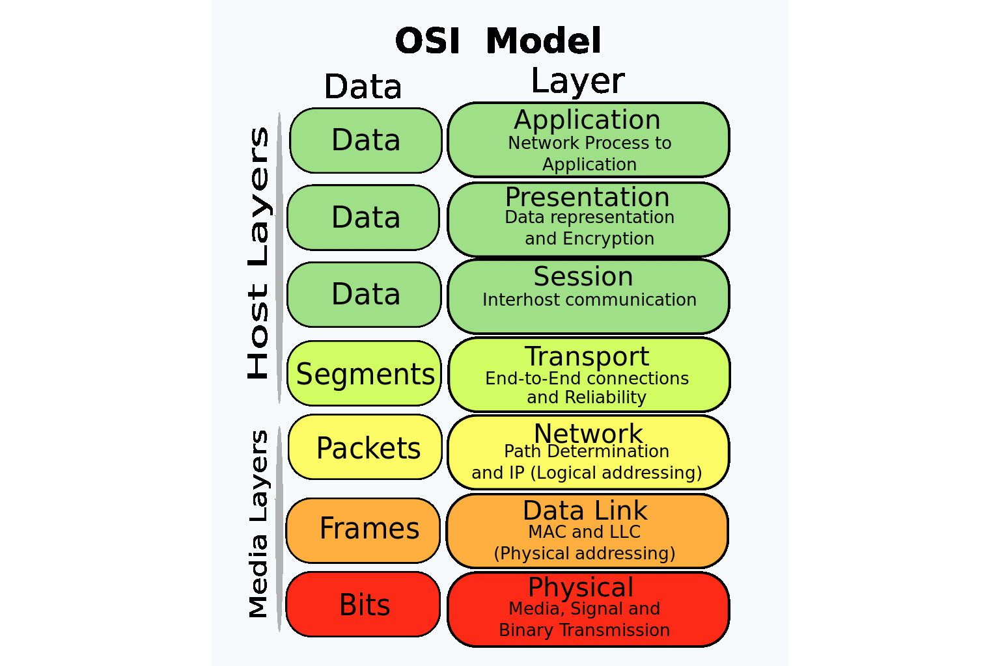
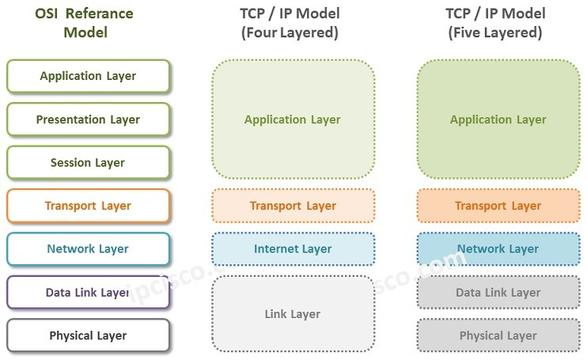

# Basics

## Network Types
- Based on Distance, the network types are:
    - PAN: Personal Area Network
    - LAN: Local Area Network
    - CAN: Campus Area Network
    - MAN: Metropolitan Area Network
    - WAN: Wide Area Network
- As distance increases, the number of devices used also increases, and we also have to put repeaters or network extenders to ensure the signal is strong enough to reach the destination.
- As distance increases, the error rates & maintainence cost also increases.

## OSI Model

Image taken from [here](https://www.lifewire.com/thmb/eaQyjAgWa-S1JKEfZxlFYoB-0V8=/1536x1024/filters:fill(auto,1)/OSImodel-8d93f19d50e543348f82110aa11f7a93.jpg)

### Why?
- There are a lot of functionalities and protocols that are necessary to send data from the client to the server, or vice versa.
- OSI is a theoritical model, ie it is not implemented in real life. But, using this model, all the other models are developed.
- OSI Model defines the layers in a network system, how the protocols are implemented in each layer, and how they work together to achieve it's primary purpose of moving data from Point A to Point B.

### Layers
- Application
- Presentation
- Session
- Transport
- Network
- Data Link
- [Physical](#physical-layer)

### Difference vs TCP/IP Model

Image taken from [here](https://ipcisco.com/wp-content/uploads/2018/10/tcpip-model.jpg)

- TCP/IP layer is an implementable model.
- It was a protocol defined by ARPANET for use by them.
- It combines the `Application, Presentation` & `Session layer` into the `Application Layer`.
- The `Network Layer` is defined as the `Internet Layer`.
- It combines the `Data Link Layer & Physical Layer` into `Network Access Layer`.

## Physical Layer
- Deals with hardware.
- Isn't concerned with security, that part is handled by the software.

### Network Topologies

Image taken from [here](https://ofbit.in/wp-content/uploads/2022/05/Full-Mesh-Topology-OFBIT.in_-1024x1024.jpg)

#### Point-to-Point Topology
- Direct communication between two devices.
- Simple and easy to implement.
- Suitable for small networks.
- Efficient and reliable communication.

#### Mesh Topology
- Every device is connected to every other device.
- Redundant paths enhance reliability.
- High fault tolerance but expensive and complex.
- Common in critical applications where reliability is crucial.

#### Star Topology
- All devices are connected to a central hub or switch.
- Easy to install and manage.
- Failure in one device doesn't affect others.
- Centralized control and potential single point of failure.

#### Bus Topology
- Single central cable to which all devices are connected.
- Simple and inexpensive.
- Limited cable length and potential for collisions.
- Suitable for small networks with low traffic.

#### Ring Topology
- Devices connected in a circular fashion.
- Each device has exactly two neighbors for communication purposes.
- Unidirectional or bidirectional communication.
- Potential for data collisions and a failure in one device can disrupt the entire network.

|↓ Parameter \| Topology →|Mesh|Star|Bus|Ring|
|---|---|---|---|---|
|Number of Cables|$(n(n-1))/2$|$n$|$n+1$|$n$|
|Number of ports|$n(n-1)$|$n$|$n$|$2n$|
|Reliability|high|low|low|low|
|Affected by noise?|no|no|yes|yes|
|Cost|high|low|low|low|
|Security|high|medium|[low](#reason-hub)|[low](#reason-cable)|low|
|P2P between devices|yes|no|no|yes|
|Multipoint|no|no|yes|no|

- Reliability = **low** means there is a single point of failure.
- #reason-hub: The hub broadcasts messages to all devices by default.
- #reason-cable: The cable cannot filter or send data to only a specific device.

## Manchester Encoding
- It is used to encode 1's and 0's.
- There are 2 variants: The one by G E Thomas, and the IEEE 802.3 version. By default, IEEE 802.3 is used.

    

    Image taken from [here](https://media.geeksforgeeks.org/wp-content/uploads/ETHERNET_1.jpg)

## Networking Devices
- Hardware only: [Cables](#cable), Repeaters, Hubs
- Hardware + Software: Router, Gateway, Firewall, Modem
- Software only: IDS

### Cable
- Used in Physical layer.
- Types:
    - Baseband: `Only 1` signal can be transmitted over the cable at any point of time.
    - Broadband: `>1` signals can be transmitted over the cable in parallel.
- Signal filtering/attenuation: Not possible, since it's purely hardware.
- Collision: A maximum of `n` collisions can occur, if there are `n` connected devices.

- **100BaseT**:
    - `100`: speed in Mbps
    - `Base`: Type of cable, Baseband / Broadband
    - `T`/`2`/`5`/`Fx`: 100/200/500 metres or Fiber Channel, range about 2km. The signal quality deteriorates beyond the range.

### Repeater
### Hub
### Switch
### Router
### Gateway
### IDS (Intrusion Detection System)
### Firewall
### Modem

### Cables & Connectors
### Networking hardware
### Transmission modes
### Multiplexing
### Encoding
