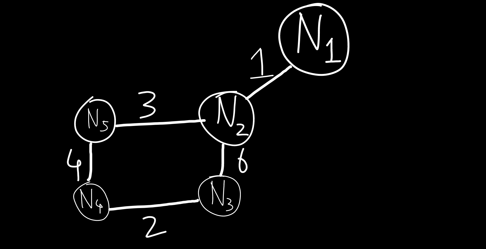

<!-- ID: 5 -->

# Formulae
## FRL Collision Domain
The maximum amount of collisions that can occur.
Number of devices = `n`
- Cable: $n$
- Repeater: $n$

## FRL Circuit Switching
- Setup Time, Tear Down time
- Transmission Time: Number of Messages / Bandwidth
- Propagation Delay: Distance / Velocity
- Total Time: Setup Time + Transmission Time + Propagation Delay + Tear Down Time

## FRL Packet Switching
- `n`: Number of intermediate devices re-transmitting the data packet
- Total time: n(Transmission Time) + Propagation Delay

## FRL Data Link Error Detection
> Window Size: Sender | Receiver
- Stop & Wait: $1$ | $1$
- Go-Back-N: $N=2^k-1$ | $1$
- Selective Repeat: $N=2^{k-1}$ | $N=2^{k-1}$
    > If we want to transmit 4 bits, $N=4=2^m=2^2$, and window size for the sender will be $2^2-1=3$ bits.
- Efficiency:
    - $T_p$: Propagation Delay, $T_t$: Transmission Time
    - Efficiency: Transmission Time / Round Trip Time (= 2* Propagation Delay)
    - $x=T_p / T_t$
    - Stop-and-Wait ARQ: $1*1/(1+2x)$
    - Go-Back-N: $(2^k-1)*1/(1+2x)$
    - Selective Repeat: $(2^{k-1})*1/(1+2x)$

## FRL Error Control 
- **Pure ALOHA**:
    - **Transmission Time** = Message Size / Bandwidth.
    - **Vulnerable Time**: 2*Transmission Time
    - **Efficiency**: $G*e^{-2G}$. Maximum Efficiency: $G=1/2$, $1/2*e^{-2*(1/2)}=1/2*e^{-1}=18.4\%$
        - G: Number of stations currently transmitting data.
- **Slotted ALOHA**:
    - **Vulnerable Time**: Transmission Time
    - **Efficiency**: $G*e^{-G}$. Maximum Efficiency: $G=$, $1*e^{-1}=36.8\%$
       - G: Number of stations currently transmitting data.
- **Carrier Sense Multiple Access / Collision Detection (CSMA/CD)**:
    - **Transmission Time** = Message Size / Bandwidth.
    - Transmission Time $\geq$ 2*Propagation Delay
    - Message Size $\geq$ 2 * Propagation Delay * Bandwidth
    - **Propagation Delay**: Distance / Velocity
    - **Efficiency** = $1 \div (1+6.44a)$, a = Propagation Delay / Transmission Time


# Basics

## Network Types
- Based on Distance, the network types are:
    - PAN: Personal Area Network
    - LAN: Local Area Network
    - CAN: Campus Area Network
    - MAN: Metropolitan Area Network
    - WAN: Wide Area Network
- As distance increases, the number of devices used also increases, and we also have to put repeaters or network extenders to ensure the signal is strong enough to reach the destination.
- As distance increases, the error rates & maintainence cost also increases.

## OSI Model


Image taken from [here](https://www.lifewire.com/thmb/eaQyjAgWa-S1JKEfZxlFYoB-0V8=/1536x1024/filters:fill(auto,1)/OSImodel-8d93f19d50e543348f82110aa11f7a93.jpg)

### Why?
- There are a lot of functionalities and protocols that are necessary to send data from the client to the server, or vice versa.
- OSI is a theoritical model, ie it is not implemented in real life. But, using this model, all the other models are developed.
- OSI Model defines the layers in a network system, how the protocols are implemented in each layer, and how they work together to achieve it's primary purpose of moving data from Point A to Point B.

### Layers
- Application
- Presentation
- Session
- Transport
- Network
- [Data Link](#data-link-layer)
- [Physical](#physical-layer)

### Difference vs TCP/IP Model


Image taken from [here](https://ipcisco.com/wp-content/uploads/2018/10/tcpip-model.jpg)

- TCP/IP layer is an implementable model.
- It was a protocol defined by ARPANET for use by them.
- It combines the `Application, Presentation` & `Session layer` into the `Application Layer`.
- The `Network Layer` is defined as the `Internet Layer`.
- It combines the `Data Link Layer & Physical Layer` into `Network Access Layer`.

## Physical Layer
- Deals with hardware.
- Isn't concerned with security, that part is handled by the software.

### Network Topologies


Image taken from [here](https://ofbit.in/wp-content/uploads/2022/05/Full-Mesh-Topology-OFBIT.in_-1024x1024.jpg)

#### Point-to-Point Topology
- Direct communication between two devices.
- Simple and easy to implement.
- Suitable for small networks.
- Efficient and reliable communication.

#### Mesh Topology
- Every device is connected to every other device.
- Redundant paths enhance reliability.
- High fault tolerance but expensive and complex.
- Common in critical applications where reliability is crucial.

#### Star Topology
- All devices are connected to a central hub or switch.
- Easy to install and manage.
- Failure in one device doesn't affect others.
- Centralized control and potential single point of failure.

#### Bus Topology
- Single central cable to which all devices are connected.
- Simple and inexpensive.
- Limited cable length and potential for collisions.
- Suitable for small networks with low traffic.

#### Ring Topology
- Devices connected in a circular fashion.
- Each device has exactly two neighbors for communication purposes.
- Unidirectional or bidirectional communication.
- Potential for data collisions and a failure in one device can disrupt the entire network.

|↓ Parameter \| Topology →|Mesh|Star|Bus|Ring|
|---|---|---|---|---|
|Number of Cables|$(n(n-1))/2$|$n$|$n+1$|$n$|
|Number of ports|$n(n-1)$|$n$|$n$|$2n$|
|Reliability|high|low|low|low|
|Affected by noise?|no|no|yes|yes|
|Cost|high|low|low|low|
|Security|high|medium|[low](#reason-hub)|[low](#reason-cable)|low|
|P2P between devices|yes|no|no|yes|
|Multipoint|no|no|yes|no|


- Reliability = **low** means there is a single point of failure.
- #reason-hub: The hub broadcasts messages to all devices by default.
- #reason-cable: The cable cannot filter or send data to only a specific device.

## Manchester Encoding
- It is used to encode 1's and 0's.
- There are 2 variants: The one by G E Thomas, and the IEEE 802.3 version. By default, IEEE 802.3 is used.

    
    Image taken from [here](https://media.geeksforgeeks.org/wp-content/uploads/ETHERNET_1.jpg)

## Networking Devices
- Hardware only: [Cables](#cable), Repeaters, Hubs
- Hardware + Software: Router, Gateway, Firewall, Modem
- Software only: IDS

### Cable
- Layer: `Physical`
- Types:
    - Baseband: `Only 1` signal can be transmitted over the cable at any point of time.
    - Broadband: `>1` signals can be transmitted over the cable in parallel.
- Signal filtering/attenuation: Not possible, since it's purely hardware.
- Collision: A maximum of `n` collisions can occur, if there are `n` connected devices.

- **100BaseT**:
    - `100`: speed in Mbps
    - `Base`: Type of cable, Baseband / Broadband
    - `T`/`2`/`5`/`Fx`: 100/200/500 metres or Fiber Channel, range about 2km. The signal quality deteriorates beyond the range.

### Repeater
- Layer: `Physical`
- It is a 2 port device.
- While an amplifier amplifies the signal (from x to 2x,3x, etc), a repeater regenerates the signal (x) and retains it's original strength.
- Signal filtering/attenuation: Not possible, since it's purely hardware.
- **Collision Domain**: A maximum of `n` collisions can occur, if there are `n` connected devices.
- **Broadcast Domain**: Any broadcast packet will reach all devices connected, on all sides of the repeater.

### Hub
- Layer: `Physical`
- A hub is a multi-port repeater.
- It has $>2$ ports.
- There is some basic functionality built-in, using which we can check if all devices are properly connected or not.
- Signal filtering/attenuation: Not possible. If `A` wants to send some data to `B`, then the others also get the message. The message is broadcasted to all connected devices.
- **Collision Domain**: A maximum of `n` collisions can occur, if there are `n` connected devices.
- **Broadcast Domain**: Any broadcast packet will reach all devices connected, on all sides of the hub.

### Bridge
- Layer: `Data Link`
- Bridges are used to connect 2 different LANs.
- A packet transmitted by a device contains the source & destination MAC address.
- Signal filtering/attenuation: Possible. If the bridge notices that some packet does not need to be forwarded to the other LAN to reach it's destination, it can filter the packet & directly send it to the destination, on the same LAN it originated in.
- 2 Types: Static & Dynamic
    - **Static**: The MAC to Port mapping table is static. The network administrator sets it up when setting up the device.
        ```diff
        - Cannot dynamically map MAC Address -> Ports.
        - If the device MAC Address changes for some reason, the mapping will need to be re-done manually.
        ```
    - **Dynamic**: The MAC to Port mapping table is dynamic. It learns about the mapping by itself, without the interference of the network administrator.
        ```diff
        + Learns and maps MAC -> Port by itself.
        - Broadcasts the message to all devices, if it doesn't know the destination.
        - Takes some time to learn about the mappings, at first.
        ```
        - Initially, it is empty.
        - When the switch cannot find the destination in the MAC to Port mapping table, it broadcasts the packet to all devices.
        - The device which has accepted it, sends back the ACK (Acknowledgement) packet. 
        - Using that packet, the bridge 'learns' about the location of the destination device and adds it to the mapping table.
- It uses Spanning Trees in the form of `Bridge Data Unit Protocol`, which ensures that data packets don't get stuck in a loop.
- **Collision Domain**: The bridge uses the `Store & Forward` strategy. It stores the incoming packet, processes it, and then sends it to the destination. There may be collisions within the networks themselves, but not across them.
- **Broadcast Domain**: Any broadcast packet will reach all devices connected, on all sides of the bridge.

### Switch
- Layer: `Data Link`
- It is a multi-port bridge.
- We connect multiple devices with a switch, which in turn is connected to the router, which in turn is connected to the Internet (optional).
- Switch provides full-duplex links to the devices.
    > Duplex: Data can be sent/Received parallely. <br>
    > Simplex: Only 1 signal can be transmitted at a time.
- **Collision Domain**: The switch uses the `Store & Forward` strategy. It stores the incoming packet, processes it, and then sends it to the destination. There may be collisions within the networks themselves, but not across them.
- **Broadcast Domain**: Any broadcast packet will reach all devices connected, on all sides of the switch.

### Router
- Layer: `Physical` `Data Link` `Network`
- It is a multi-port device. Multiple networks can be connected to it at the same time.
- Router can check for both MAC & IP addresses.
- The router receives an IP Address (usually `XXX.XXX.XXX.1`) from each network it is connected to, so that it can identify and differentiate between them.
- Forwarding/Flooding: Once the router receives a data packet containing the source & destination IP & MAC Address, it checks it's **Routing Table**.
    - If it finds the entry, it forwards it to the destination.
    - If it does not find the entry ie cannot decide where to send the packet, it floods the network ie broadcasts it to all networks.
- Filtering: If the router receives something like an ARP request, it can send it back to the same network.
    > An ARP (Address Resolution Protocol) request is a message sent by a device on a network to discover the MAC (Media Access Control) address associated with a specific IP (Internet Protocol) address.
- **Collision Domain**: The router uses the `Store & Forward` strategy. It stores the incoming packet, processes it, and then sends it to the destination. There may be collisions within the networks themselves, but not across them.
- **Broadcast Domain**: Any broadcast packet will reach all devices connected but only within the network. It will not propagate to the other networks connected to the router.

## Collision Domain & Broadcast Domain
- **Collision Domain**: A collision domain represents the network segment where collisions can occur. If multiple devices send data packets at the same time in a shared medium, the data packets will collide with each other. In the worst case, the collision domain can be $n$ if there are $n$ devices connected.
- **Broadcast Domain**: Whether all devices receive the data packet a particular device on the network sends, regardless of if it was intended for them or not.

| Device   | Collision Domain     | Broadcast Domain    |
|----------|----------------------|---------------------|
| Repeater | Unchanged            | Unchanged           |
| Hub      | Unchanged            | Unchanged           |
| Bridge   | Reduced              | Unchanged           |
| Switch   | Reduced              | Unchanged           |
| Router   | Reduced              | Reduced             |

## Switching Techniques
## Circuit Switching
- Layer: `Physical`
- Formulae: [here](#frl-circuit-switching)
<br>
- In a Telephone Exchange, the physical cables are already laid out between all devices. The Exchange themselves are connected to each other using cables.
- When we pick up the phone and dial a number, a connection is established between the sender and the receiver. The time it takes is acalled `Setup Time`.
- By establishing a connection, we're effectively reserving a portion of bandwidth and ports, for the duration of the session.
- Once the connection is established, data flows in-order and is continuous. No headers are needed since a one-to-one connection is established.
    > Header: Section within a data packet which contains source and destination address.
- Efficiency of the overall network is less, since once a connection is established, resources are reserved for it. Even if it's not being used, the resources can't be freed until the connection is terminated.
- Packet delay is minimal since the pathway is already clearly defined at the very beginning.
- Circuit Switching is good for Telephone networks, but not suitable for computer networks because of it's inefficiency.

## Message Switching
- Predessor of [Packet Switching](#packet-switching)
- Uses the Store & Forward strategy.
- Hop by hop delivery: A message first goes to the first node. It processes it, then transfers it to the next node, and so on. The message keeps hopping between various nodes, till it reaches it's destination.
- In contrast to Packet Switching, here the message is not broken down before being transmitted. It is transmitted as a whole.

## Packet Switching
- Layer:
    - Datagram: `Network`
    - Virtual Circuit: `Data Link`
- Formulae: [here](#frl-packet-switching)
<br>
- All connected switches store the received data packet, figure out which path to send it through (using Routing Tables), then send it. This is called **Store & Forward strategy**.
- If there are multiple data packets to be sent, they are sent one after the other. The sender does not wait for the current packet to be received on the other end, before sending the next packet.
- Efficiency: high, since no reserved pathways exist.
- Delay: The more the number of intermediate devices like switches, the more the delay.

### Datagram Switching
- Layer: `Network`
- Connectionless: No connection is established before tranmitting data. Resources are provided on-demand.
- No reservation takes place.
- Data is usually received out-of-order, since they're taking different paths to get to the destination.
- There is high overhead, all data packets have headers in them.
- Packet loss can take place.
- Packet Delay depends on the load on the network.
- Used in Internet

### Virtual Circuit
Layer: `Data Link`
- Connection-oriented: A global packet is sent first, which establishes a dedicated connection and resources in it's pathway.
- The pathway is reserved.
- Data packets are received in-order.
- Only the global (first) packet has a header.
- Since the connection is dedicated, there is minimal delay.
- Minimal probability of packet loss.
- Used in ATM (Asynchronous Transfer Mode)  etc.

## Cast
- The meaning of cast is to share information with a number of devices.
- **Unicast**: `one-to-one`. We're sending information from one device to another.
- **Broadcast**: The information is sent to a broad range of devices (for example, all devices within a local area network).
    - Example: Let's assume: Network `A: 90.0.0.1`, `B: 92.0.0.1`.
    - **Limited Broadcast**: A broadcast originating from network `A`, to all devices on `A`. The signal is not received by devices on network `B`. Broadcast address: `255.255.255.255`
    - **Direct Broadcast**: A broadcast originating from network `A`, to all devices on `B`. The signal is not received by devices on network `A`. Broadcast address, in this case: `92.255.255.255`.
- **Multicast**: Broadcasting to a specific group of devices.

## Data Link Layer
- Within a particular network, this layer is enough to send data between devices.
- Terminology: `Data Frame`. Data packets, received from the Network Layer, are split into equal sized Data Frames, and transmitted to Physical Layer.
- **Node-to-Node delivery**: The primary responsibility is to determine which node the data packet will hop to, next. At every step, it performs the task of moving the data packet to the next node, till it reaches the destination.
- **Flow Control**: Flow control refers to the techniques used to regulate the flow of data between two communicating devices to ensure that the sender does not overwhelm the receiver. It involves mechanisms for pacing data transmission, buffering, and acknowledgment to prevent data loss due to congestion or buffer overflow.
    > Methods: Stop & Wait, Go Back N, Selective Repeat
- **Error Control**: Error control involves techniques used to detect and correct errors that may occur during data transmission over a communication channel.
    > Cyclic Redundancy Check, Checksum (in Transport Layer), Parity (in Transport Layer)
- **Access Control**: Access control mechanisms govern the access to the communication channel by multiple devices in a network. It manages how devices contend for access to the channel, resolve contention issues, and allocate the channel efficiently to ensure fair and orderly data transmission.
    > Methods:  CSMA/CD (dontention-based), ALOHA, Slotted ALOHA, Token Ring (contention-free)
- **Physical Addressing**: It uses MAC Addresses for identifying devices.

### Stuffing
- Stuffing is done on the Data Link Layer to distinguish between 2 data frames.
- General: FLAG **ABCDE** FLAG **BCDEF** FLAG ...
    - `FLAG` is used as a delimiter, to separate 2 frames.
- **Byte Stuffing**: In byte stuffing, a special byte sequence is inserted into the data stream to mark the beginning and end of a frame or packet. When the sender encounters the special byte sequence within the data, it inserts an additional byte to distinguish it from the data. Byte stuffing helps to prevent ambiguity and misinterpretation of data frames, particularly when the data contains sequences that might be mistaken for control characters.
    - If `FLAG` itself is present in the data: FLAG **ABCDE** ESC **FLAG BCDEF** FLAG ...
        - If `ESC` precedes the `FLAG`, it is meant to be ignored, as it is a part of the data.
    - If `ESC` itself is present in the data: FLAG **ABCDE** ESC **ESC BCDEF** FLAG ...
        - If `ESC` precedes the `ESC`, it is meant to be ignored, as it is a part of the data.
- **Bit Stuffing**: Bit stuffing is similar to byte stuffing but operates at the bit level. In bit stuffing, a special bit pattern is inserted into the data stream to mark the beginning and end of a frame. When the sender encounters the special bit pattern within the data, it inserts an additional bit to ensure that the pattern does not appear in the data itself. Bit stuffing is commonly used in synchronous communication protocols, such as HDLC (High-Level Data Link Control) and Ethernet, to maintain synchronization and prevent errors in data transmission.
    - `1` after `011111` (1 followed by 0 followed by 5 1's) is a starting delimiter, used in the header. If it is a part of the data, we stuff a 0 after `011111`.
        - Example: 011111**0**11010110101110011111**0**101010010
- Data is unstuffed before being sent to the next layer.

### Error Detection and Correction
- In the `Data Link Layer`, the data is checked bit-by-bit for errors.
- Types of errors:
    - **Single Bit**: Error only occurs in 1 bit. Example: 101**0** ➡ 101**1**
    - **Burst**: Error in more than 1 bit. Example: 1**0**101**0** ➡ 1**1**101**1**
- **Length of error**: The number of bits, between the 1st and last error bit. In the previous example, it is 5 bits.

## Error Control
- Formulae: [here](#frl-data-link-error-control)
### Stop and Wait ARQ
- Formulae: [here](#frl-data-link-error-control)
- ARQ: Automatic Repeat Request
- Acknowledgement (ACK): Independent, per frame
- Maximum frames Re-tramsmitted: 1
- It is an error control technique. It is done by keeping a copy of the sent frame, and re-transmitting it when the timer expires.
- **Window size:** Sender: $1$ | Receiver: $1$
- Sequence numbers used: 0,1.
- Steps:
    1. `Frame 0` is sent by `A` to `B`.
    1. `B` receives the frame, and sends back the acknowledgement `ACK 1`. The acknowledgement states that `B` is now expecting `Frame 1`.
    1. `A` receives the acknowledgement, sends `Frame 1`.
    - If `Frame 0` is lost or the acknowledgement is lost, then `A` sends `Frame 0` again to `B`.
        - If the frame was lost, `B` accepts it.
        - If the frame was received but acknowledgement was lost, `B` discards it as a duplicate frame.
    - `A` waits for a specific amount of time (called timeout) before re-sending the frame.
    <br>
    <br>Image taken from [here](https://contribute.geeksforgeeks.org/wp-content/uploads/Stop-and-Wait-ARQ-7.png)

### Go-Back-N ARQ
- Formulae: [here](#frl-data-link-error-control)
- ARQ: Automatic Repeat Request
- Acknowledgement (ACK): Cumulative
- Number of bits used to represent window: $k$
- Maximum frames Re-tramsmitted: $2^{k}-1$
- **Window size:** Sender: $N=2^{k}-1$ | Receiver: $1$
- If we want to send $N$ bits, then size must be 1 less than it, otherwise it will accept the previously received packet again.
    <br>
- If window size of the sender is `N`, it means `N` packets can be sent to the receiver. If any acknowledgement in the middle is lost, and still the receiver expects the correct packet, it is assumed that all frames have been received properly.
    <br>
    <br>Image taken from [here](https://4.bp.blogspot.com/-Mp8qNeHkFRw/Vu5KRrdlu9I/AAAAAAAAAh4/w2zhkQ7S-hM4t4k60G_D8AY1hoaGCh5fg/s1600/go-back-n%2B2.png)

- If sender window size is $N=2$, and frames 0,1,2,3 are sent, and if `Frame 2` is lost in the middle, then Frame 3 onwards will not be accepted by the receiver (NAK 2). Afterwards, Frames 2 & 3 will have to be re-sent by the sender. So, **Frames cannot be received out of order.**
    <br>
    <br>Image taken from [here](https://media.geeksforgeeks.org/wp-content/uploads/Sliding-Window-Protocol.jpg)

### Selective Repeat ARQ
- Formulae: [here](#frl-data-link-error-control)
- ARQ: Automatic Repeat Request
- Acknowledgement (ACK): Cumulative & Independent
- Number of bits used to represent window: $k$
- Maximum frames Re-tramsmitted: $2^{k-1}$
- **Window Size:** Sender: $N=2^{k-1}$ | Receiver: $N=2^{k-1}$
- Since the receiver can receive any one of the $2^{3-1}=4$ frames that the sender sends, ie frames 0,1,2 or 3 out of 0,1,2,3,4,5,6,7 if window size for both is $2^{3-1}=4$, **frames can be received out of order**.
- Window size of receiver should not be greater than $2^{m-1}$, otherwise it will accept the previously received packet again.
    <br>
- Sliding Window will not move till all frames have been received. For example, out of frame 0,1,2,3, if 1 was lost in the way, then the receiver will accept 0,2,3 but will not send an ACK for 1. Then, sender will re-send frame 1.
- NAK: If a frame is corrupt, it can send an NAK (negative acknowledgement) for it, so that the sender re-sends it.
<br>
<br>Image taken from [here](https://4.bp.blogspot.com/-_GoNnqzwU-k/Vu5NWQywVcI/AAAAAAAAAiI/Cg-LF4EBhI0JZoSLYDKSYZ0ToeQksK2rA/s1600/selective%2Brepeat%2B1.png)

## Error Detection
### Single Bit Parity
- Least Expensive
- Number of bits added: 1
- **It can only detect errors when the number of error bits is odd.**.
- 2 types:
    - Even Parity: Number of 1's in the data word should be even.
        > Example: 1010 -> 1010**0**, 1110 -> 1110**1**
    - Odd Parity: Number of 1's in the data word should be odd.
        > Example: 1010 -> 1010**1**, 1110 -> 1110**0**
- If there is some error in the data, for example, in case of even parity, if 1**0**100 becomes 1**1**100, then the number of 1's is no longer even like it was supposed to be. Also, if **11**1**0**1 becomes **00**1**1**1, then also it can be detected.
- **Hamming Distance**: Perform a XOR operation, then count the number of 1's. Example: $1010⊕1100=0110:2$, $0000⊕1111=1111:4$.
    - If the Minimum Hamming Distance is `d`, then a maximum of `d-1` errors can be detected.
    - Example 0:
        | 0 | 1 | 2 | 3 | Even Parity |
        |---|---|---|---|-------------|
        | 0 | 0 | 0 | 0 | 0           |
        | 0 | 0 | 0 | 1 | 1           |
        | 0 | 0 | 1 | 0 | 1           |
        | 0 | 0 | 1 | 1 | 0           |
        | 0 | 1 | 0 | 0 | 1           |
        | 0 | 1 | 0 | 1 | 0           |
        | 0 | 1 | 1 | 0 | 0           |
        | 0 | 1 | 1 | 1 | 1           |
        | 1 | 0 | 0 | 0 | 1           |
        | 1 | 0 | 0 | 1 | 0           |
        | 1 | 0 | 1 | 0 | 0           |
        | 1 | 0 | 1 | 1 | 1           |
        | 1 | 1 | 0 | 0 | 0           |
        | 1 | 1 | 0 | 1 | 1           |
        | 1 | 1 | 1 | 0 | 1           |
        | 1 | 1 | 1 | 1 | 0           |
        - Here, the Minimum Hamming Distance (example between $00000$ & $00011$) is 2, so only 1-bit errors can be detected.

### Cyclic Redundancy Check (CRC)
- Based on Binary division
- Number of Redundant bits: r
- It can detect single bit, odd number of errors, and burst error of length equal to the maximum polynomial degree.
- How it works is explained using an example.
- Example 0:
    1. Data Word: $1010101010$
    1. Divisor, **tells us how many 0 bits to add at the end**:
        - If given in polynomial: $x^4+x^3+1=1.x^4+1.x^3+0.x^2+0.x^1+1.x^0$ ie $11001$, 1 if x has a degree, 0 in all the other places. Number of digits to append = degree of highest polynomial = $4$.
        - If given in binary, $11001$, then Number of digits to append = 1 less than the length of the Divisor = $4$
    1. Divide: 1010101010**0000** $\div 11011$
        - $10101⊕11001=01100$
        - $01100\ 0⊕11001=00001$ Start with the leading 1, add the same number of bits as needed to make it equal to $11001$
        - $00001\ 1010⊕11001=00011$
        - $00011\ 000⊕11001=000010$, Remainder$=000010$.
    1. Append 4 bits from the Remainder, starting from the last. So, add $0010$ to $1010101010$ to make it $10101010100010$.
    1. When we send these 14 bits to the receiver, the receiver divides this same number with the same Divisor.
    1. Receiver receives: $1010101010\ 0010$
    1. Divide: 10101010100010 $\div 11011$
        - $10101⊕11001=01100$
        - $01100\ 0⊕11001=00001$
        - $00001\ 1010⊕11001=00011$
        - $00011\ 001⊕11001=000000$
    1. **The Remainder will always be 0 for the receiver. But, if there's an error, it will be a non-zero value.**
    1. Efficiency: $10/14*100=71.42\%$

### Hamming Code
1. Data-word:
    - Parity bits are spaced out according to $2^n$, ie they're located at positions $2^0=1,2^1=2,2^2=4,2^3=8$, ie $1,2,4,8$ etc.
    - 7 bits:
        |7|6|5|4|3|2|1|
        |-|-|-|-|-|-|-|
        |$D_3$|$D_2$|$D_1$|$P_2$|$D_0$|$P_1$|$P_0$|
    - 11 bits:
        |11|10|9|8|7|6|5|4|3|2|1|
        |-|-|-|-|-|-|-|-|-|-|-|
        |$D_6$|$D_5$|$D_4$|$P_3$|$D_3$|$D_2$|$D_1$|$P_2$|$D_0$|$P_1$|$P_0$|
    - **Example**: Let data word (7 bits) be 1010:
        |7|6|5|4|3|2|1|
        |-|-|-|-|-|-|-|
        |$1$|$0$|$1$|$P_2$|$0$|$P_1$|$P_0$|
1. Calculating parity bits:
    - For $P_0$:
        - $2^0=1$. Start from 1. Take 1 bit, leave the next 1 bit, take the next 1 bit, etc.
        - Take positions $1,3,5,7$, etc.
        - $P_0=0⊕1⊕1=0$
    - For $P_1$:
        - $2^1=2$. Start from 2. Take 2 bits, leave the next 2 bits, take the next 2 bits, etc.
        - Take positions $2,3,6,7,10,11$, etc.
        - $P_1=0⊕0⊕1=1$
    - For $P_2$:
        - $2^2=4$. Start from 4. Take 4 bits, leave the next 4 bits, take the next 4 bits, etc.
        - Take positions $4,5,6,7,12,13,14,15$, etc.
        - $P_2=1⊕0⊕1=0$
1. When the receiver receives it, it calculates the parity bits too. If they match with that of the sender, there is no error.
1. **Example of error**:
    - Sent data: $10011100101$
    - Received data: $10111100101$
    1. For sender, $P_0=1⊕0⊕1⊕0⊕1=1$
    1. For receiver, $P_0=1⊕1⊕1⊕0⊕1=0$
    - Clearly, the parity bit is different, so the error is detected.

## Error Control
### MAC: Multiple Access Control
- It is only used in networks where a single link is shared by multiple devices, to transmit data, example in Bus Topology.
- **Random Access Protocol**:
    - There is no priority system between devices.
    - They can send data at any time, whenever the link is ready.
    - **Examples**: Pure ALOHA, Slotted ALOHA, CSMA/CD, CSMA/CA
- **Controlled Access Protocol**:
    - There is a controller that controls who can send data at any point in time.
    - **Examples**: Polling, Token Passing
- **Channelization Protocol**:
    - We divide the frequency bands into multiple channels, and allocate devices to specific channels.
    - **Examples**: FDMA, TDMA

#### Pure ALOHA
- Formulae: [here](#frl-error-control)
- Type: Random Access Protocol
- After the receiver receives the data packet, it sends back an acknowledgment (ACK).
- It is a LAN based protocol.
- Collision can occur if 2 or more stations transmit data at the same time, or if a station starts transmitting data before another one has finished.
- **Transmission Time** = Message Size / Bandwidth.
- **Vulnerable Time**: 2*Transmission Time
    <br>
- **Efficiency**: $G*e^{-2G}$. Maximum Efficiency: $G=1/2$, $1/2*e^{-2*(1/2)}=1/2*e^{-1}=18.4\%$
    - G: Number of stations currently transmitting data.

#### Slotted ALOHA
- Formulae: [here](#frl-error-control)
- The time is divided into slots, each slot size being the Transmission Time.
- A station can only start transmitting data at the beginning of the slot.
- Collision can only occur if 2 or more stations start transmitting data at the beginning of the same slot.
- **Vulnerable Time**: Transmission Time
- **Efficiency**: $G*e^{-G}$. Maximum Efficiency: $G=$, $1*e^{-1}=36.8\%$
   - G: Number of stations currently transmitting data.

#### CSMA (Carrier Sense Multiple Access)
- Formulae: [here](#frl-error-control)
- A particular station senses if there is any data being actively transmitted. It cannot sense the entire medium, it can only sense if there's any data transmission occuring in front of it.
- 3 Types:
    - **1-Persistent**: 
        - Station will constantly utilize resources and sense if the medium is being used.
        - Collision: If multiple stations are scanning the medium at the same time, then the moment it becomes free (idle), all of them will start transmitting data, which will lead to collisions.
        - Use-case: Wired LAN / Ethernet.
    - **0-Persistent**:
        - If the station checks the medium and it is busy, it will wait for a random amount of time before checking again.
        - Medium can get freed up before the wait time of the station expires, which would mean the station waits longer than needed.
        - Collision: Less than 1-Persistent, since all stations are waiting for distinct and random amount of time.
    - **P-Persistent**:
        - Station will constantly utilize resources and sense if the channel is being used.
        - Once medium is free, it will start transmitting data according to the value of Probability (P), which ranges between 0 and 1.
        - Hybrid approach, combines 1-Persistent & 0-Persistent.
        - Use-case: WiFi (Wireless Fidelity).
- **CSMA/CD**:
    - Formulae: [here](#frl-error-control)
    - Usage: Wired Networks
    - CSMA, with Collision Detection.
    - **No Acknowledgement is used**, because transmitting both data and acknowledgments will lead to more collisions.
    - When A is transmitting data and it receives a collision signal. Then, A knows that the data it sent, collided.
    - When A is not transmitting data (it has stopped transmission), and it receives a collision signal, A will not be able to figure out which station's data collided.
    - Transmission Time should be atleast twice the amount of Propagation Delay.
        1. `A` starts transmitting data at **12pm**. **Propagation Delay is `1 hour`**. So, it will complete transmitting data by **1pm**.
        1. At **12:59:59**, `B` senses the channel. It notices that it's free, and start transmitting data. This will cause a collision.
        1. But, the collision signal from it will take another hour to reach `A`, ie at **2pm**.
        1. If `A` stops transmitting data at **1pm**, then at **2pm** it will not be able to detect whether it was it's own data that collided, at **2pm**.
        1. This is why collision detection is only possible if Transmission Time is atleast twice the amount of Propagation Delay.
        <br>
    - Propagation Delay: The amount of time it takes for the receiver to receive the data, after the sender has sent it. 
    - **Transmission Time** = Message Size / Bandwidth.
    - Transmission Time $\geq$ 2*Propagation Delay
    - Message Size $\geq$ 2 * Propagation Delay * Bandwidth
    - Example 0: Consider a CSMA/CD network that transmits data at a rate of 100Mbps ($10^8$ bits per second) over a 1km cable with no repeaters. If the minimum frame size required for this network is 1250bytes, what is the signal speed (km/second) in the cable?
        - Transmission Time $\geq$ 2*Propagation Delay
        - Transmission Time = Message Size / Bandwidth
        - Message Size $\geq$ 2 * Propagation Delay * Bandwidth
        - Propagation Delay: Distance / Velocity
        - **We have to find Velocity**.
        1. Transmission Time = 2 * Propagation Delay
        1. Message Size = 2 * Propagation Delay * Bandwidth
        1. Message Size = 2 * (Distance/Velocity) * Bandwidth
        1. **Velocity = (2 * Propagation Delay * Bandwidth) / (Message Size)**
        1. $Velocity = (2 * 1km * 10^8) / (1250*8)=20000\ km/second$

- **CSMA/CA**:
    - CSMA, with Collision Avoidance.
    - Steps:
        1. START, set $k=0$ (k=number of attempts).
        1. Sense the carrier.
            - If medium is being used, wait.
            - If medium is idle, wait for an amount of time equivalent to IFS (Interframe Space)/DCF (Distributed Coordination Function) / DIFS (Distributed Interframe Space).
        1. In the Contention Window, **it will choose it's slot number** equal to a random number between $0\ to\ 2^k-1$. For 1st attempt, the slot number will be $0\ to\ 2^0-1$.
        1. It will sent an RTS (Ready-To-Send). This signal will be transmitted to the hub the device is connected to. Then, it'll wait for a CTS (Clear-to-send) timer.
        1. If it receives the CTS before the timeout, it waits for another IFS amount of time, **then finally sends the frame**.
            - If it receives an ACK, well and good.
            - If it does not receive an ACK, then $k=k+1$. It is checked if $k<limit$, then the station waits for $T_b$ seconds.
            - $T_b=R*T_s$ ($T_b$=Back-off time, R=Random Value, $T_s$=Slot Time).

        <br>
        <br>Image taken from [here](https://media.geeksforgeeks.org/wp-content/uploads/44-3.png)

### Ethernet Frame Format
- IEEE 802.3 | Used in Bus Topology
- Defined in Data Link Layer
- Types of Ethernet:
    - 10Base2: 10mbps, Baseband, 200 metre range (Thin)
    - 10Base5: 10mbps, Baseband, 500 metre range (Thick)
    - 10BaseT: 10mbps, Baseband, 100 metre range
    - 100BaseFx: 100mbps, Baseband, Fiber Channel
    - 10GBaseT: 10Gbps, Baseband, 100 metre range
    - ...etc
- Format:
    |Preamble (7)|SFD (1)|DA (6)|SA (6)|Length (2)|Data (46-1500)|CRC (4)|
    |-|-|-|-|-|-|-|

    - **Preamble**:
        - 7 bytes | 56 bits
        - Constant: 10101010101010101010101010101010101010101010101010101010
        - Set by the Physical Layer, it is used to alert the receiver that the sender is about to send data.
    - **SFD**:
        - 1 byte | 8 bits
        - Constant: 10101011
        - Used to alert the receiver that the sender is about to send data.   
        - Set by the Physical Layer. Initially, only SFD was used because it was assumed that the pattern will never occur within the data, but later Preamble was added.
    - **Destination MAC Address (DA)**:
        - 6 bytes | 48 bits
        - Variable
        - The function of the data link layer is to make sure the data frame reaches the next node. So, it puts the DA of the next node (hop) here.
    - **Source MAC Address (SA)**:
        - 6 bytes | 48 bits
        - Variable
        - The MAC Address of the sender is put here.
    - **Length**:
        - 2 bytes | 18 bits
        - Variable
        - Length of the data frame, that is being sent.
    - **Data**:
        - 46 - 1500 bytes | 360 - 12000 bits
        - The pure data frame that is being sent
    - **Cyclic Redundancy Check (CRC)**:
        - 4 bytes | 32 bits
        - Used for Error Detection
    - Total Size: ($6+6+2+46+4=64$ bytes) to ($6+6+2+1500+4=1518$ bytes), usually Preamble & SFD are excluded since they're added in the Physical Layer.

### Token Ring
- IEEE 802.5 | Used in Ring Topology
- Access Control method used: is **Token Passing**. The token circulates through the ring. If a node wants to send data, it grabs the token, and then sends the data. While the token is held by a node, no other node can transmit data.
- Types of Token Release:
    - **Early Release**: Token is released as soon as the sender has finished sending the data.
    - **Delayed Release**: Sender sends the data, it passes through the ring to all devices, comes back to the sender. After sender receives it, it releases the token.
- The direction is Unidirectional, either clockwise or anti-clockwise.
- Data Rate: `4mbps` & `16mbps`
- Acknowledgement: Piggyback acknowledgment is used. Acknowledgement is sent alongwith the data.
- Differential Manchester Encoding is used.
- Variable size framing is used. Data frames are of different sizes.
- A monitor station is used.
    - If some data becomes corrupt, then it will keep travelling through the ring and never get accepted by any node. So, monitor station removes it.
    - It is used for various other purposes.
- Data Frame Format:
    |SD (1) | AC (1) | FC (1) | DA (6) | SA (6) | Data | CRC (4) | ED (1) | FS (1) |
    |-|-|-|-|-|-|-|-|-|

    - **Start-Delimiter (SD)**:
        - 1 byte | 8 bits
        - Signals the start of the data frame.
    - **Access Control (AC)**:
        - 1 byte | 8 bits
        - Information related to what bits are present in the frame.
    - **Frame Control (FC)**:
        - 1 byte | 8 bits
        - Type of Frame (Data/Control Frame)
    - **Destination MAC Address (DA)**:
        - 6 bytes | 48 bits
        - Variable
        - The function of the data link layer is to make sure the data frame reaches the next node. So, it puts the DA of the next node (hop) here.
    - **Source MAC Address (SA)**:
        - 6 bytes | 48 bits
        - Variable
        - The MAC Address of the sender is put here.
    - **Data**:
        - 0 - MAX, depends on Token Holding Time
        - The pure data the sender wants to send.
        - Token Holding Time means the maximum amount of time, the node can hold onto the token.
    - **Cyclic Redundancy Check (CRC)**:
        - 4 bytes | 32 bits
        - Used for Error Detection
    - **End-Delimiter (ED)**:
        - 1 byte | 8 bits
        - Signals the end of the data frame.
    - **Frame Status (FS)**:
        - 1 byte | 8 bits

- Token Format:
    | SD (1 byte) | AC (1 byte) | ED (1 byte) |
    |-------------|-------------|-------------|
    - **Start-Delimiter (SD)**:
        - 1 byte | 8 bits
        - Signals the start of the data frame.
    - **Access Control (AC)**:
        - 1 byte | 8 bits
        - Information related to what bits are present in the frame.
    - **End-Delimiter (ED)**:
        - 1 byte | 8 bits
        - Signals the end of the data frame.
    
## Network Layer
- While Data Link layer moves data from one node (hop) to the next, Network Layer is responsible for moving data from source to destination, within a network.
- It uses logical Addressing based on IP addresses.
- Network Layer uses a variety of routing techniques to route the data, like RIP, OSPF, etc.
- Routers operate in the Network Layer.
- **Fragmentation**: If the message size than what an intermediate node can accept (intermediate node's buffer size < message size), then the message is divided into multiple fragments and transmitted further.
- **Congestion**: We try to limit the amount of data frames that can get transmitted over the network, in order to not overwhelm it.

## Classful IP Addressing
### <u>Class A</u>
- Class: IPv4 | 4 bytes | 32 bits | $2^{32}$ IP Addresses
- Representation: Dotted Decimel
- How to identify? If the first octet (1st 8 bits) lies between 0-127, it is a Class A address.
- Format: |Network ID (8 bits)| Host ID (8+8+8 bits)|
    1. Network ID:
        - 1st bit is `0`, ie constant.
        - length: 7 bits, number of ID's possible: $2^{7}=128$
        - Range: $0-128$
        - Out of 128 addresses, the first and last one as reserved as well.
        - So, 126 Network ID's are available in total.
    1. Host ID:
        - length: 24 bits, number of ID's possible: $2^{24}=16777216$
        - Out of 16777216 addresses, the first and last one as reserved as well.
         - So, 16777214 Host ID's are available in total.
    - Default Mask: $255.0.0.0$. It is used to find the Network ID.
    - $64.0.0.0$: Exmple Network ID
    - $64.255.255.255$: Example Broadcast Address

- Example 0: IP Address=$64.0.0.0$
    - $64$ is between $0-127$, so it is a Class A address.
    - $64.0.0.0$ is the `Network ID`. It represents the network.
    - $64.255.255.255$ is the `Direct Broadcast Address`. If someone wants to broadcast a data packet to all devices on a network, they will send it to this address.
    - Default Mask: $255.0.0.0$. It is used to find the Network ID from an IP address within the network. <br> **Steps** if IP Address: $64.0.0.8$:
        1. IP Address: $64.0.0.8=01000000.00000000.00000000.00001000$
        1. Default Mask: $11111111.00000000.00000000.00000000$
        1. **Perform an AND Operation**. Result: $01000000.00000000.00000000.00000000=64.0.0.0$, which is the Network ID.
    
### <u>Class B</u>
- Class: IPv4 | 4 bytes | 32 bits | $2^{32}$ IP Addresses
- Representation: Dotted Decimel
- How to identify? If the first octet (1st 8 bits) lies between 128-191, it is a Class B address.
- Format: |Network ID (8+8 bits)| Host ID (8+8 bits)|
    1. Network ID:
        - 1st 2 bits is `10`, ie constant.
        - length: 14 bits, number of ID's possible: $2^{14}=16384$
        - Range: $128-191$
        - Out of 16384 addresses, the first and last one as reserved as well.
        - So, 16382 Network ID's are available in total.
    1. Host ID:
        - length: 16 bits, number of ID's possible: $2^{24}=65536$
        - Out of 65536 addresses, the first and last one as reserved as well.
         - So, 65534 Host ID's are available in total.
    - $255.255.0.0$: Default Mask. It is used to find the Network ID.
    - $128.0.0.0$: Example Network ID
    - $128.0.255.255$: Example Broadcast address
- Example 0: IP Address=$130.2.3.4$
    - $130$ is between $128-191$, so it is a Class B address.
    - $130.0.0.0$ is the `Network ID`. It represents the network.
    - $130.255.255.255$ is the `Direct Broadcast Address`.
    - Default Mask: $255.255.0.0$. It is used to find the Network ID from an IP address within the network. <br> **Steps** if IP Address: $64.0.0.8$:
        1. IP Address: $130.2.3.4=10000010.00000010.00000011.00000100$
        1. Default Mask: $255.255.0.0=11111111.11111111.00000000.00000000$
        1. **Perform an AND Operation**. Result: $10000010.00000010.00000000.00000000=130.2.0.0$, which is the Network ID.

### <u>Class C</u>
- Class: IPv4 | 4 bytes | 32 bits | $2^{32}$ IP Addresses
- Representation: Dotted Decimel
- How to identify? If the first octet (1st 8 bits) lies between 192-223, it is a Class C address.
- Format: |Network ID (8+8+8 bits)| Host ID (8 bits)|
    1. Network ID:
        - 1st 3 bits is `110`, ie constant.
        - length: 14 bits, number of ID's possible: $2^{21}=2097152$
        - Range: $192-223$
        - Out of 2097152 addresses, the first and last one as reserved as well.
        - So, 2077150 Network ID's are available in total.
    1. Host ID:
        - length: 8 bits, number of ID's possible: $2^{8}=256$
        - Out of 256 addresses, the first and last one as reserved as well.
         - So, 254 Host ID's are available in total.
    - $255.255.255.0$: Default Mask. It is used to find the Network ID.
    - $192.0.0.0$: Example Network ID
    - $192.255.255.255$: Example Broadcast address
- Example 0: IP Address=$194.2.3.4$
    - $194$ is between $192-223$, so it is a Class C address.
    - $194.0.0.0$ is the `Network ID`. It represents the network.
    - $194.255.255.255$ is the `Direct Broadcast Address`.
    - Default Mask: $255.255.255.0$. It is used to find the Network ID from an IP address within the network. <br> **Steps** if IP Address: $194.2.3.4$:
        1. IP Address: $194.2.3.4=11000010.00000010.00000011.00000100$
        1. Default Mask: $255.255.255.0=11111111.11111111.11111111.00000000$
        1. **Perform an AND Operation**. Result: $11000010.00000010.00000011.00000000=194.2.3.0$, which is the Network ID.
- Example 1: IP Address: $201.20.30.40$
    - Range of the 1st octet: $192-223$. So, it is a Class-C address.
    - **Network ID**: Here, mask is $255.255.255.0$. Performing an AND operation on Network ID and Mask will give us the network ID. So, ID = $201.20.30.40+255.255.255.0=11001001.10100000.11110000.10100000+11111111.11111111.11111111.00000000=11001001.10100000.11110000.00000000=201.30.40.0$
    - **4th Host ID**: Host ID starts from $201.20.30.1$ - $201.20.30.254$, so the 4th Host ID is $201.20.30.4$,
    - **Last Host ID**: Host ID's end at $201.20.30.254$.
    - **Broadcast Address**: $201.20.30.255$, if a node sends a data packet to this address, it gets broadcasted to all devices connected to the network.

### <u>Class D</u>
- Class: IPv4 | 4 bytes | 32 bits | $2^{32}$ IP Addresses
- Representation: Dotted Decimel
- How to identify? If the first octet (1st 8 bits) lies between 224-239, it is a Class D address.
- Format: |Static (4 bits)| Reserved (28 bits)|
    1. Reserved:
        - 1st 4 bits is `1110`, ie constant.
        - length: 28 bits, Number of IP Addresses: $2^{28}=238435456$
        - Range: 224-239$
        - All these IP Addresses are reserved for Multicasting / Group Email / Broadcast.

### <u>Class E</u>
- Class: IPv4 | 4 bytes | 32 bits | $2^{32}$ IP Addresses
- Representation: Dotted Decimel
- How to identify? If the first octet (1st 8 bits) lies between 240-255, it is a Class E address.
- Format: |Static (3 bits)| Reserved (28 bits)|
    1. Reserved:
        - 1st 4 bits is `1111`, ie constant.
        - length: 28 bits, Number of IP Addresses: $2^{28}=238435456$
        - Range: 240-255$
    - All these IP Addresses are reserved for Military Purposes. 

### Disadvantage of Classful IP Addressing
1. Wastage of IP addresses & Inconsistency.
    - Class A has $2^{24}$ hosts per network, but only $2^7-2$ networks available.
    - Class C has $2^8$ hosts per network, but $2^{21}$ networks available.
    - So, in some classes, there are too many hosts available while the number of networks is limited, and it's opposite in other classes.
1. Maintainence is time consuming.
    - Maintainence is time consuming especially in big networks like in case of Class A.
    - We can use the concept of `sub-netting` to make maintainence easier.
1. More prone to errors.
    - In larger networks, there is a high probability of errors and collisions to take place, if not configured properly.


## Classless IP Addressing
- Also known as `Classless Inter-Domain Routing (CIDR)`.
- There is no classification here, only blocks are used.
- The IANA (Internet Assigned Numbers Authority) assigns IP Addresses according to blocks, and as per need of the customer.
- The IP addresses in the range must be contiguous.
- Number of host addresses in a block shoud be representable by $2^n$.
- Format: x.y.z.w/n, | Block/Network ID | Host ID |
    - x.y.z.w: IPv4 address
    - n: Number of bits in the block/network. Also represents the number of 1's in the subnet mask (in binary).
- Network ID must be evenly divisible with the size of the block. For example:
    - In $200.10.20.40/28$, we find below that the network ID is $200.10.20.32$.
    - Number of Host ID bits: $32-28=4$. So, $2^4=16$ IP Addresses can be represented by these bits.
    - We now need to check if the last 4 bits in the Network ID are all 0's: 200.10.20.0010**0000**. Here, they are.
    - For the Mask, Convert the IP Address to binary. Make the fixed bits `1`, and the host ID bits `0`.
- Example: $200.10.20.40/28$
    - There are 28 bits in the Block ID, and 4 bits in Host ID.
    - Network ID:
        - Method 1:
            1. Don't tamper with the Network ID. Represent the Host bits as 0: 200.10.20.001**01000** -> 200.10.20.0010**0000**.
            1. Convert it back to Decimel. This becomes the Network ID: $200.10.20.32/28$.
        - Method 2:
            1. Perform an AND of the IP Address with the Mask. Mask: $11111111.11111111.11111111.11110000=255.255.255.240$.
            1. $255.255.255.11110000+200.10.20.00101000=200.10.20.32/28$

## Sub-netting
### Classful IP Addressing
- Type: `Classful`
- Dividing the big network into smaller networks.
- Sub-netting requires internal routers within the network since we're dividing the big network into Independent smaller networks, each with their own Network ID's and Broadcast Addresses.
- Example: Network ID: $200.10.20.0$, Class C.
    1. If we want to divide it into 2 sub-nets, we reserve $2^1=2$ ie $1$ MSB from the host portion: 200.10.20.**0**0000000 & 200.10.20.**1**0000000. These become the Network ID's of the sub-nets.
    1. So, the Network ID's are $200.10.20.0$ & $200.10.20.128$.
    1. Sub-net 1:
        - Range: $200.10.20.0-200.10.20.127$.
        - Network ID: $200.10.20.0$
        - Direct Broadcast Address: $200.10.20.127$
        - Number of usable host addresses: $128-2=126$
        - Subnet Mask:
            - Number of reserved bits: $24+1=25$.
            - Put the reserved bits as 1, and rest 0.
            - So, Subnet Mask: 11111111.11111111.11111111.**1**0000000=255.255.255.128
    1. Sub-net 2:
        - Range: $200.10.20.128-200.10.20.255$.
        - Network ID: $200.10.20.128$
        - Direct Broadcast Address: $200.10.20.255$
        - Number of usable host addresses: $128-2=126$
        - Subnet Mask is same as that of the other subnets.
    1. Compared to the original network, there are 4 less host address available ($252<256$). This is because additional IP Addresses will need to be allocated for Network ID and Broadcast Address.
    1. If an IP Address is $200.10.20.15$, we perform AND with the subnet mask $255.255.255.128$. Result: $200.10.20.0$, so the internal router redirects the data packet to `Sub-net 1`.
    1. If an IP Address is $200.10.20.130$, we perform AND with the subnet mask $255.255.255.128$. Result: $200.10.20.128$, so the internal router redirects the data packet to `Sub-net 2`.

### Variable Length Subnet Masking (VLSM)
- Type: `Classful`
- Network can be divided into variable size Subnets.
- Example: Network ID: $200.10.20.0$. Divide the network into 3 subnets with atleast 100,50 and 50 hosts.
    - First divide the network into 2 equal parts.
    1. Sub-net 1:
        - Reserved bits: **200.10.20.0**0000000
        - Network ID: 200.10.20.0**0000000**$=200.10.20.0$
        - Direct Broadcast Address: 200.10.20.0**1111111**$=200.10.20.127$
        - Number of hosts: $128-2=126$. This will be our first subnet.
    1. Intermediate Sub-net 2:
        - Reserved bits: **200.10.20.1**0000000
        - Divide this subnet further.
    1. Sub-net 2:
        - Reserved bits: **200.10.20.10**000000
        - Network ID: 200.10.20.10**000000**$=200.10.20.128$
        - Direct Broadcast Address: 200.10.20.10**111111**$=200.10.20.191$
        - Number of hosts: $64-2=62$. This will be our second subnet.
    1. Sub-net 3:
        - Reserved bits: **200.10.20.11**000000
        - Network ID: 200.10.20.11**000000**$=200.10.20.192$
        - Direct Broadcast Address: 200.10.20.11**111111**$=200.10.20.255$
        - Number of hosts: $64-2=62$. This will be our third subnet.
    1. Total number of host addresses: $256-(2*3)=250$
    - We could also divide it in some other way, like dividing `Sub-net 1` further.

### Classless Inter-Domain Routing (CIDR)
- Type: `Classless`
- Example: Network ID: $192.10.20.128/26$. Divide the network into 2 subnets.
    - Number of Network/Block ID bits: $26$
    - Number of Host ID bits: $32-26=6$
    - Reserved Bits: **192.10.20.10**000000
    1. Sub-net 1:
        - Reserved bits: **192.10.20.100**0000000 (Reserve the MSB of the Host ID).
        - Number of bits reserved: $27$. The addresses will be postfixed by `/27`.
        - Network ID: 192.10.20.100**000000**$=192.10.20.128/27$
        - Direct Broadcast Address: 192.10.20.100**111111**$=192.10.20.159/27$
        - Number of hosts: $32-2=30$. This will be our first subnet.
    1. Sub-net 2:
        - Reserved bits: **192.10.20.101**0000000 (Reserve the MSB of the Host ID).
        - Number of bits reserved: $27$. The addresses will be postfixed by `/27`.
        - Network ID: 192.10.20.101**000000**$=192.10.20.160/27$
        - Direct Broadcast Address: 192.10.20.101**111111**$=192.10.20.191/27$
        - Number of hosts: $32-2=30$. This will be our second subnet.
    1. Total number of host addresses: $64-(2*2)=60$
- Example 1: CIDR receives a packed with address $131.23.151.76$. Find the interface to which the packet will be forwarded. The router's routing table has following entities:
    |Prefix|Output Interface|
    |------|----------------|
    |131.16.0.0/12|3|
    |131.28.0.0/14|5|
    |131.19.0.0/16|2|
    |131.22.0.0/15|1|
    - Here, the objective is to find the Network ID's of all interfaces. The given packet will be forwarded to the one which has the same network ID as the Prefix Interface Address.
    - $131.16.0.0/12$
        1. Number of Network ID bits: $12$
        1. Number of Host ID bits: $32-12=20$
        1. Given IP Address: $131.23.151.76=131.00010111.151.76$. Perform an AND operation with this IP Address and the Mask.
        1. Mask: **11111111.1111**0000.00000000.00000000 (Number of 1's same as the number of reserved bits).
        1. Network ID: $131.00010111.151.76+255.11110000.0.0=131.16.0.0$.
        1. The Network ID is **NOT** in the same subnet as that of the given IP Address. So, **the packet cannot be forwarded** to this interface.
    - $131.28.0.0/14$
        1. Number of Network ID bits: $14$
        1. Number of Host ID bits: $32-14=18$
        1. Given IP Address: $131.23.151.76=131.00010111.151.76$. Perform an AND operation with this IP Address and the Mask.
        1. Mask: **11111111.111111**00.00000000.00000000 (Number of 1's same as the number of reserved bits).
        1. Network ID: $131.00010111.151.76+255.11111100.0.0=131.20.0.0$.
        1. The Network ID is **NOT** in the same subnet as that of the given IP Address. So, **the packet cannot be forwarded** to this interface.
    - $131.19.0.0/16$
        1. Number of Network ID bits: $16$
        1. Number of Host ID bits: $32-16=16$
        1. Given IP Address: $131.23.151.76=131.00010111.151.76$. Perform an AND operation with this IP Address and the Mask.
        1. Mask: **11111111.11111111**.00000000.00000000 (Number of 1's same as the number of reserved bits).
        1. Network ID: $131.00010111.151.76+255.11111111.0.0=131.23.0.0$.
        1. The Network ID is in the same subnet as that of the given IP Address. So, **the packet can be forwarded** to this interface.
        1. So, **Answer: Interface `2`**
    - $131.22.0.0/15$
        1. Number of Network ID bits: $15$
        1. Number of Host ID bits: $32-15=17$
        1. Given IP Address: $131.23.151.76=131.00010111.151.76$. Perform an AND operation with this IP Address and the Mask.
        1. Mask: **11111111.1111111**0.00000000.00000000 (Number of 1's same as the number of reserved bits).
        1. Network ID: $131.00010111.151.76+255.11111110.0.0=131.22.0.0$.
        1. The Network ID is **NOT** in the same subnet as that of the given IP Address. So, **the packet cannot be forwarded** to this interface.

### VLSM in CIDR (Classless)
- Type: `Classless`
- Check [VLSM](#variable-length-subnet-masking-vlsm)
- Example: Network ID: $245.248.128.0/20$. Divide the network into 3 subnets. 
    - Network ID Bits: $20$ | Host ID Bits: $32-20=12$
    - Subnet Mask: $11111111.11111111.11110000.00000000=255.255.240.0$
    - First divide the network into 2 equal parts.
    1. Sub-net 1:
        - Additional Reserved bit: 245.248.1000**0**000.00000000
        - Network ID: 245.248.10000**000.00000000**$=245.248.128.0/21$
        - Direct Broadcast Address: 245.248.10000**111.11111111**$=245.248.135.255/21$
        - Number of hosts: $2^{11}-2=2048-2=2046$. This will be our first subnet.
        - Subnet Mask: 11111111.11111111.11111000.00000000=255.255.248.0$
    1. Intermediate Sub-net 2:
        - Additional Reserved bit: 245.248.1000**1**000.00000000
        - Divide this subnet further.
    1. Sub-net 2:
        - Additional Reserved bit: 245.248.10001**0**00.00000000
        - Network ID: 245.248.100010**00.00000000**$=245.248.136.0/22$
        - Direct Broadcast Address: 245.248.100010**11.11111111**$=245.248.139.255/22$
        - Number of hosts: $2^{10}-2=1024-2=1022$. This will be our second subnet.
        - Subnet Mask: 11111111.11111111.11111100.00000000=255.255.252.0$

    1. Sub-net 3:
        - Additional Reserved bit: 245.248.10001**1**00.00000000
        - Network ID: 245.248.100011**00.00000000**$=245.248.140.0/22$
        - Direct Broadcast Address: 245.248.100011**11.11111111**$=245.248.143.255/22$
        - Number of hosts: $2^{10}-2=1024-2=1022$. This will be our second subnet.
        - Subnet Mask: 11111111.11111111.11111100.00000000=255.255.252.0$
    1. Total number of host addresses: $2^{12}-(2*3)=4096-6=4090$


# IPv4 (Internet Protocol Version 4)
## IPv4 Header
- Number of IP Addresses possible in IPv4: $2^{32}$
- Connectionless: A connection is not established before transmitting data.
- Datagram Service: The data packets can travel through any of the available paths. They can take different paths to reach the destination.
- Size of Packet, Datagram: Header (20-60 bytes) + Payload (0-65515 bytes)
- Format: 
    1. **| VER | HLEN | Type of Service -> DSCP | Total Length |**
        - VER: 4 bits | IP version(4: 0100 or 6: 0110)
        - HLEN: 4 bits | Used to determine the size of the header, which will then help determine the size of payload (the actual data).
            - If header length is shown as ${1010}_2={10}_{10}$ bits, then **the actual size** is $10*4=40$ bytes.
            - Consequently, header length cannot be any of $0,1,2,3,4$. Till 4, multiplying by 4 will not give the minimum size of 20 bytes for the header.
        - Type of Service: 8 bits | |P|P|P|D|T|R|C|O|
            - Precedence: First 3 bits | Defines the priority.
            - Delay: 4th bit | `1` if minimal delay is important.
            - Throughput: 5th bit | `1` if we need maximum throughput.
            - Reliability: 6th bit | `1` if we want maximum reliability and minimum packet drops.
            - Cost: 7th bit | `1` if we want the packet to follow the shortest and most efficient path.
            - O: 8th bit | Reserved
        - DSCP (Differentiated Services Code Point) | 8 bits
            - This was defined as a successor to ToS.
            - DSCP: Bits 0-5 | Defines what type of service the packet contains.
            - ECN: Bits 6,7 | Explicit Congestion Notification, used to notify the sender of congestion in the network.
        - Total Length: 16 bits | Denotes the total length of the data packet (Header + Payload).

    1. **| Identification Bits | Flag | Fragment Offset |**
        - Identification Bits: 16 bits | Helps identify the bits.
        - Flag: 4 bits | | Reserved | DF | MF |
            - Reserved: 1 bit | Reserved bit, has a constant value of `0`.
            - Do not Fragment: 1 bit | Packet has already been divided into fragments.
            - More Fragments?: 1 bit | Denotes whether there are more fragments expected to arrive, after this one.
        - Fragment Offset: 13 bits | Denotes the number of bytes ahead of this data packet. The value is divided by 8.
    1. **| Time to Live (TTL) | Protocol | Header Checksum |**
        - Time to Live: 8 bits | Prevents data packet from getting stuck in a loop forever.
            - Max value: $2^8=256$. It can travel through 256 nodes max.
            - Everytime it travels through a node, this value decreases by 1.
        - Protocol: 8 bits | Signifies if we're using some protocol from higher-up levels.
        - Header Checksum: 16 bits | Used for error detection.
    1. **| Source IP Address |**
        - Source IP Address: 32 bits
    1. **| Destination IP Address |**
        - Destination IP Address: 32 bits
    1. **| Options & Padding |**
        - Options: 0-40 bytes | 
            - Record Routing: Records the IP Addresses of all routers the packet passed through. For 40 bytes, we can record a total of `10` IP Addresses. However, we need to store other data too, so we can store `9` IP Addresses in reality. Also, not all networks allow it. So, this option was removed from IPv6.
            <br>
            - Source Routing: Source defines what routers the data packet will travel through.
                - Strict Source Routing: The entire path will be strictly defined and followed.
                - Loose Source Routing: The path will be partially defined, and the missing links will be made as the packet traverses the path.
            - Padding: 4 bits | If the header size is **not a multiple of 4**, we can add additional bits here.

- Example: A Datagram of 3000B (20B IP Header + 2980B Payload) reached the router, and must be forwarded to link with the MTU of size 500B. How many fragments will be generated? Also write MF,OffsetTotal length for all the data packets.
    1. An MTU of 500 bytes means that the receiver can only send a maximum of 500 bytes of data per packet.
    1. The packets are divided into 20B (Header) + 480B (Payload) each.
    1. A total of 7 packets will need to be transmitted. The last packet will have 20B (Header) + 120B (Payload).

    |Parameter|$P_1$|$P_2$|$P_3$|$P_4$|$P_5$|$P_6$|$P_7$|
    |---------|-----|-----|-----|-----|-----|-----|-----|
    |Total Length|$20+480=500$|$20+480=500$|$20+480=500$|$20+480=500$|$20+480=500$|$20+480=500$|$20+100=120$|
    |More Fragments?|1|1|1|1|1|1|0|
    |Offset|0|60|120|180|240|300|360|

## IPv6 Header
- Number of IP Addresses possible in IPv6: $2^{128}$
- Format: 
    1. **| VERSION | Priority / Traffic Type | Flow Label |**
        - VER: 4 bits | IP version (6: 0110)
        - Priority / Traffic Type: 8 bits | Tells what type of data packet it is, and it's priority.
        - Flow Label: 20 bits | If it is specified, a Virtual Circuit is created. Packets are transmitted over a single path, over a dedicated virtual connection. It is used for real-time data.
    1. **| Payload Length | Next Header | Hop Limit |**
        - Payload Length: 16 bits
        - Next Header: 8 bits | Contains information about any additional headers we're using.
        - Hop Limit: 8 bits | Specifies the  maximum number of hops the packet can make, like Time to Live (TTL). Value decreases by 1 each time a hop is made.
    1. **| Source Address |**
        - Source IP Address: 128 bits
    1. **| Destination Address |**
        - Destination IP Address: 128 bits
- Format of the data packet: **| Base header | Extension Header 1 | Extension Header 2 | Data |**
    - Additional extension headers can be specified in the next header field to enhance the functionality of the Data Packet.
    - Additional extension headers (ID, written in binary):
        1. Routing Header: (43) | The path that the data packet will take, is specified.
        1. Hop by Hop: (0) | Used when we want to provide some information to all nodes the data packet hops through.
        1. Fragmentation: (44) | Used if the data packet is divided into fragments. Intermediate hops cannot fragment the data, only the source can.
        1. Authentication: (51) | Used for Authentication, Checksum, maintaining data security and integrity, etc.
        1. Destination: (60) | Used if we want to provide some information for the destination node.
        1. Encapsulating Security Payload (50): Used to provide information about encryption and decryption.

### Gateway
### IDS (Intrusion Detection System)
### Firewall
### Modem

### Cables & Connectors
### Networking hardware
### Transmission modes
### Multiplexing
### Encoding

<!-- Last image: self/5.png | external/8.png -->
