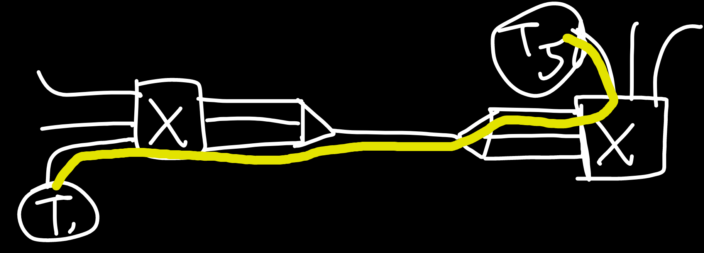
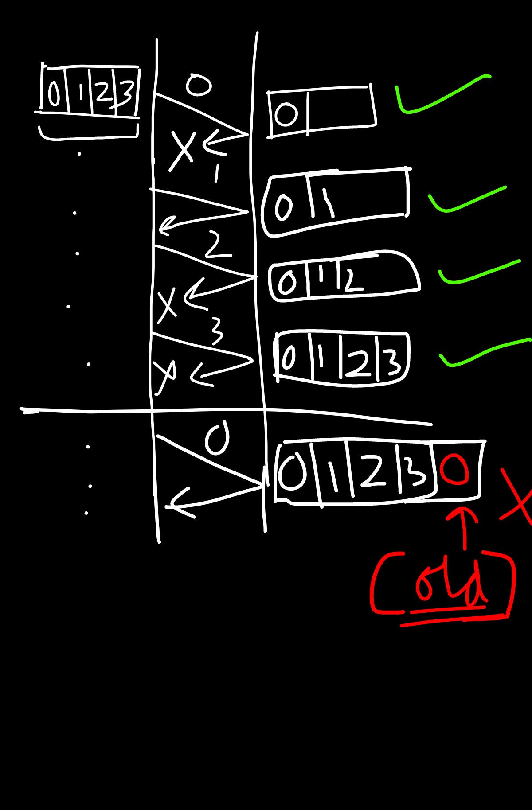

<!-- ID: 5 -->

# Formulae
## FRL Collision Domain
The maximum amount of collisions that can occur.
Number of devices = `n`
- Cable: $n$
- Repeater: $n$

## FRL Circuit Switching
- Setup Time, Tear Down time
- Transmission Time: Number of Messages / Bandwidth
- Propagation Delay: Distance / Velocity
- Total Time: Setup Time + Transmission Time + Propagation Delay + Tear Down Time

## FRL Packet Switching
- `n`: Number of intermediate devices re-transmitting the data packet
- Total time: n(Transmission Time) + Propagation Delay

## FRL Data Link Error Control
> Window Size: Sender | Receiver
- Stop & Wait: $1$ | $1$
- Go-Back-N: $N=2^k-1$ | $1$
- Selective Repeat: $N=2^{k-1}$ | $N=2^{k-1}$
    > If we want to transmit 4 bits, $N=4=2^m=2^2$, and window size for the sender will be $2^2-1=3$ bits.
- Efficiency:
    - $T_p$: Propagation Delay, $T_t$: Transmission Time
    - Efficiency: Transmission Time / Round Trip Time (= 2* Propagation Delay)
    - $x=T_p / T_t$
    - Stop-and-Wait ARQ: $1*1/(1+2x)$
    - Go-Back-N: $(2^k-1)*1/(1+2x)$
    - Selective Repeat: $(2^{k-1})*1/(1+2x)$

# Basics

## Network Types
- Based on Distance, the network types are:
    - PAN: Personal Area Network
    - LAN: Local Area Network
    - CAN: Campus Area Network
    - MAN: Metropolitan Area Network
    - WAN: Wide Area Network
- As distance increases, the number of devices used also increases, and we also have to put repeaters or network extenders to ensure the signal is strong enough to reach the destination.
- As distance increases, the error rates & maintainence cost also increases.

## OSI Model


Image taken from [here](https://www.lifewire.com/thmb/eaQyjAgWa-S1JKEfZxlFYoB-0V8=/1536x1024/filters:fill(auto,1)/OSImodel-8d93f19d50e543348f82110aa11f7a93.jpg)

### Why?
- There are a lot of functionalities and protocols that are necessary to send data from the client to the server, or vice versa.
- OSI is a theoritical model, ie it is not implemented in real life. But, using this model, all the other models are developed.
- OSI Model defines the layers in a network system, how the protocols are implemented in each layer, and how they work together to achieve it's primary purpose of moving data from Point A to Point B.

### Layers
- Application
- Presentation
- Session
- Transport
- Network
- [Data Link](#data-link-layer)
- [Physical](#physical-layer)

### Difference vs TCP/IP Model


Image taken from [here](https://ipcisco.com/wp-content/uploads/2018/10/tcpip-model.jpg)

- TCP/IP layer is an implementable model.
- It was a protocol defined by ARPANET for use by them.
- It combines the `Application, Presentation` & `Session layer` into the `Application Layer`.
- The `Network Layer` is defined as the `Internet Layer`.
- It combines the `Data Link Layer & Physical Layer` into `Network Access Layer`.

## Physical Layer
- Deals with hardware.
- Isn't concerned with security, that part is handled by the software.

### Network Topologies


Image taken from [here](https://ofbit.in/wp-content/uploads/2022/05/Full-Mesh-Topology-OFBIT.in_-1024x1024.jpg)

#### Point-to-Point Topology
- Direct communication between two devices.
- Simple and easy to implement.
- Suitable for small networks.
- Efficient and reliable communication.

#### Mesh Topology
- Every device is connected to every other device.
- Redundant paths enhance reliability.
- High fault tolerance but expensive and complex.
- Common in critical applications where reliability is crucial.

#### Star Topology
- All devices are connected to a central hub or switch.
- Easy to install and manage.
- Failure in one device doesn't affect others.
- Centralized control and potential single point of failure.

#### Bus Topology
- Single central cable to which all devices are connected.
- Simple and inexpensive.
- Limited cable length and potential for collisions.
- Suitable for small networks with low traffic.

#### Ring Topology
- Devices connected in a circular fashion.
- Each device has exactly two neighbors for communication purposes.
- Unidirectional or bidirectional communication.
- Potential for data collisions and a failure in one device can disrupt the entire network.

|↓ Parameter \| Topology →|Mesh|Star|Bus|Ring|
|---|---|---|---|---|
|Number of Cables|$(n(n-1))/2$|$n$|$n+1$|$n$|
|Number of ports|$n(n-1)$|$n$|$n$|$2n$|
|Reliability|high|low|low|low|
|Affected by noise?|no|no|yes|yes|
|Cost|high|low|low|low|
|Security|high|medium|[low](#reason-hub)|[low](#reason-cable)|low|
|P2P between devices|yes|no|no|yes|
|Multipoint|no|no|yes|no|


- Reliability = **low** means there is a single point of failure.
- #reason-hub: The hub broadcasts messages to all devices by default.
- #reason-cable: The cable cannot filter or send data to only a specific device.

## Manchester Encoding
- It is used to encode 1's and 0's.
- There are 2 variants: The one by G E Thomas, and the IEEE 802.3 version. By default, IEEE 802.3 is used.

    
    Image taken from [here](https://media.geeksforgeeks.org/wp-content/uploads/ETHERNET_1.jpg)

## Networking Devices
- Hardware only: [Cables](#cable), Repeaters, Hubs
- Hardware + Software: Router, Gateway, Firewall, Modem
- Software only: IDS

### Cable
- Layer: `Physical`
- Types:
    - Baseband: `Only 1` signal can be transmitted over the cable at any point of time.
    - Broadband: `>1` signals can be transmitted over the cable in parallel.
- Signal filtering/attenuation: Not possible, since it's purely hardware.
- Collision: A maximum of `n` collisions can occur, if there are `n` connected devices.

- **100BaseT**:
    - `100`: speed in Mbps
    - `Base`: Type of cable, Baseband / Broadband
    - `T`/`2`/`5`/`Fx`: 100/200/500 metres or Fiber Channel, range about 2km. The signal quality deteriorates beyond the range.

### Repeater
- Layer: `Physical`
- It is a 2 port device.
- While an amplifier amplifies the signal (from x to 2x,3x, etc), a repeater regenerates the signal (x) and retains it's original strength.
- Signal filtering/attenuation: Not possible, since it's purely hardware.
- **Collision Domain**: A maximum of `n` collisions can occur, if there are `n` connected devices.
- **Broadcast Domain**: Any broadcast packet will reach all devices connected, on all sides of the repeater.

### Hub
- Layer: `Physical`
- A hub is a multi-port repeater.
- It has $>2$ ports.
- There is some basic functionality built-in, using which we can check if all devices are properly connected or not.
- Signal filtering/attenuation: Not possible. If `A` wants to send some data to `B`, then the others also get the message. The message is broadcasted to all connected devices.
- **Collision Domain**: A maximum of `n` collisions can occur, if there are `n` connected devices.
- **Broadcast Domain**: Any broadcast packet will reach all devices connected, on all sides of the hub.

### Bridge
- Layer: `Data Link`
- Bridges are used to connect 2 different LANs.
- A packet transmitted by a device contains the source & destination MAC address.
- Signal filtering/attenuation: Possible. If the bridge notices that some packet does not need to be forwarded to the other LAN to reach it's destination, it can filter the packet & directly send it to the destination, on the same LAN it originated in.
- 2 Types: Static & Dynamic
    - **Static**: The MAC to Port mapping table is static. The network administrator sets it up when setting up the device.
        ```diff
        - Cannot dynamically map MAC Address -> Ports.
        - If the device MAC Address changes for some reason, the mapping will need to be re-done manually.
        ```
    - **Dynamic**: The MAC to Port mapping table is dynamic. It learns about the mapping by itself, without the interference of the network administrator.
        ```diff
        + Learns and maps MAC -> Port by itself.
        - Broadcasts the message to all devices, if it doesn't know the destination.
        - Takes some time to learn about the mappings, at first.
        ```
        - Initially, it is empty.
        - When the switch cannot find the destination in the MAC to Port mapping table, it broadcasts the packet to all devices.
        - The device which has accepted it, sends back the ACK (Acknowledgement) packet. 
        - Using that packet, the bridge 'learns' about the location of the destination device and adds it to the mapping table.
- It uses Spanning Trees in the form of `Bridge Data Unit Protocol`, which ensures that data packets don't get stuck in a loop.
- **Collision Domain**: The bridge uses the `Store & Forward` strategy. It stores the incoming packet, processes it, and then sends it to the destination. There may be collisions within the networks themselves, but not across them.
- **Broadcast Domain**: Any broadcast packet will reach all devices connected, on all sides of the bridge.

### Switch
- Layer: `Data Link`
- It is a multi-port bridge.
- We connect multiple devices with a switch, which in turn is connected to the router, which in turn is connected to the Internet (optional).
- Switch provides full-duplex links to the devices.
    > Duplex: Data can be sent/Received parallely. <br>
    > Simplex: Only 1 signal can be transmitted at a time.
- **Collision Domain**: The switch uses the `Store & Forward` strategy. It stores the incoming packet, processes it, and then sends it to the destination. There may be collisions within the networks themselves, but not across them.
- **Broadcast Domain**: Any broadcast packet will reach all devices connected, on all sides of the switch.

### Router
- Layer: `Physical` `Data Link` `Network`
- It is a multi-port device. Multiple networks can be connected to it at the same time.
- Router can check for both MAC & IP addresses.
- The router receives an IP Address (usually `XXX.XXX.XXX.1`) from each network it is connected to, so that it can identify and differentiate between them.
- Forwarding/Flooding: Once the router receives a data packet containing the source & destination IP & MAC Address, it checks it's **Routing Table**.
    - If it finds the entry, it forwards it to the destination.
    - If it does not find the entry ie cannot decide where to send the packet, it floods the network ie broadcasts it to all networks.
- Filtering: If the router receives something like an ARP request, it can send it back to the same network.
    > An ARP (Address Resolution Protocol) request is a message sent by a device on a network to discover the MAC (Media Access Control) address associated with a specific IP (Internet Protocol) address.
- **Collision Domain**: The router uses the `Store & Forward` strategy. It stores the incoming packet, processes it, and then sends it to the destination. There may be collisions within the networks themselves, but not across them.
- **Broadcast Domain**: Any broadcast packet will reach all devices connected but only within the network. It will not propagate to the other networks connected to the router.

## Collision Domain & Broadcast Domain
- **Collision Domain**: A collision domain represents the network segment where collisions can occur. If multiple devices send data packets at the same time in a shared medium, the data packets will collide with each other. In the worst case, the collision domain can be $n$ if there are $n$ devices connected.
- **Broadcast Domain**: Whether all devices receive the data packet a particular device on the network sends, regardless of if it was intended for them or not.

| Device   | Collision Domain     | Broadcast Domain    |
|----------|----------------------|---------------------|
| Repeater | Unchanged            | Unchanged           |
| Hub      | Unchanged            | Unchanged           |
| Bridge   | Reduced              | Unchanged           |
| Switch   | Reduced              | Unchanged           |
| Router   | Reduced              | Reduced             |

## Switching Techniques
## Circuit Switching
- Layer: `Physical`
- Formulae: [here](#frl-circuit-switching)
<br>
- In a Telephone Exchange, the physical cables are already laid out between all devices. The Exchange themselves are connected to each other using cables.
- When we pick up the phone and dial a number, a connection is established between the sender and the receiver. The time it takes is acalled `Setup Time`.
- By establishing a connection, we're effectively reserving a portion of bandwidth and ports, for the duration of the session.
- Once the connection is established, data flows in-order and is continuous. No headers are needed since a one-to-one connection is established.
    > Header: Section within a data packet which contains source and destination address.
- Efficiency of the overall network is less, since once a connection is established, resources are reserved for it. Even if it's not being used, the resources can't be freed until the connection is terminated.
- Packet delay is minimal since the pathway is already clearly defined at the very beginning.
- Circuit Switching is good for Telephone networks, but not suitable for computer networks because of it's inefficiency.

## Message Switching
- Predessor of [Packet Switching](#packet-switching)
- Uses the Store & Forward strategy.
- Hop by hop delivery: A message first goes to the first node. It processes it, then transfers it to the next node, and so on. The message keeps hopping between various nodes, till it reaches it's destination.
- In contrast to Packet Switching, here the message is not broken down before being transmitted. It is transmitted as a whole.

## Packet Switching
- Layer:
    - Datagram: `Network`
    - Virtual Circuit: `Data Link`
- Formulae: [here](#frl-packet-switching)
<br>
- All connected switches store the received data packet, figure out which path to send it through (using Routing Tables), then send it. This is called **Store & Forward strategy**.
- If there are multiple data packets to be sent, they are sent one after the other. The sender does not wait for the current packet to be received on the other end, before sending the next packet.
- Efficiency: high, since no reserved pathways exist.
- Delay: The more the number of intermediate devices like switches, the more the delay.

### Datagram Switching
- Layer: `Network`
- Connectionless: No connection is established before tranmitting data. Resources are provided on-demand.
- No reservation takes place.
- Data is usually received out-of-order, since they're taking different paths to get to the destination.
- There is high overhead, all data packets have headers in them.
- Packet loss can take place.
- Packet Delay depends on the load on the network.
- Used in Internet

### Virtual Circuit
Layer: `Data Link`
- Connection-oriented: A global packet is sent first, which establishes a dedicated connection and resources in it's pathway.
- The pathway is reserved.
- Data packets are received in-order.
- Only the global (first) packet has a header.
- Since the connection is dedicated, there is minimal delay.
- Minimal probability of packet loss.
- Used in ATM (Asynchronous Transfer Mode)  etc.

## Cast
- The meaning of cast is to share information with a number of devices.
- **Unicast**: `one-to-one`. We're sending information from one device to another.
- **Broadcast**: The information is sent to a broad range of devices (for example, all devices within a local area network).
    - Example: Let's assume: Network `A: 90.0.0.1`, `B: 92.0.0.1`.
    - **Limited Broadcast**: A broadcast originating from network `A`, to all devices on `A`. The signal is not received by devices on network `B`. Broadcast address: `255.255.255.255`
    - **Direct Broadcast**: A broadcast originating from network `A`, to all devices on `B`. The signal is not received by devices on network `A`. Broadcast address, in this case: `92.255.255.255`.
- **Multicast**: Broadcasting to a specific group of devices.

## Data Link Layer
- Within a particular network, this layer is enough to send data between devices.
- Terminology: `Data Frame`. Data packets, received from the Network Layer, are split into equal sized Data Frames, and transmitted to Physical Layer.
- **Node-to-Node delivery**: The primary responsibility is to determine which node the data packet will hop to, next. At every step, it performs the task of moving the data packet to the next node, till it reaches the destination.
- **Flow Control**: Flow control refers to the techniques used to regulate the flow of data between two communicating devices to ensure that the sender does not overwhelm the receiver. It involves mechanisms for pacing data transmission, buffering, and acknowledgment to prevent data loss due to congestion or buffer overflow.
    > Methods: Stop & Wait, Go Back N, Selective Repeat
- **Error Control**: Error control involves techniques used to detect and correct errors that may occur during data transmission over a communication channel.
    > Cyclic Redundancy Check, Checksum (in Transport Layer), Parity (in Transport Layer)
- **Access Control**: Access control mechanisms govern the access to the communication channel by multiple devices in a network. It manages how devices contend for access to the channel, resolve contention issues, and allocate the channel efficiently to ensure fair and orderly data transmission.
    > Methods:  CSMA/CD (dontention-based), ALOHA, Slotted ALOHA, Token Ring (contention-free)
- **Physical Addressing**: It uses MAC Addresses for identifying devices.

### Stuffing
- Stuffing is done on the Data Link Layer to distinguish between 2 data frames.
- General: FLAG **ABCDE** FLAG **BCDEF** FLAG ...
    - `FLAG` is used as a delimiter, to separate 2 frames.
- **Byte Stuffing**: In byte stuffing, a special byte sequence is inserted into the data stream to mark the beginning and end of a frame or packet. When the sender encounters the special byte sequence within the data, it inserts an additional byte to distinguish it from the data. Byte stuffing helps to prevent ambiguity and misinterpretation of data frames, particularly when the data contains sequences that might be mistaken for control characters.
    - If `FLAG` itself is present in the data: FLAG **ABCDE** ESC **FLAG BCDEF** FLAG ...
        - If `ESC` precedes the `FLAG`, it is meant to be ignored, as it is a part of the data.
    - If `ESC` itself is present in the data: FLAG **ABCDE** ESC **ESC BCDEF** FLAG ...
        - If `ESC` precedes the `ESC`, it is meant to be ignored, as it is a part of the data.
- **Bit Stuffing**: Bit stuffing is similar to byte stuffing but operates at the bit level. In bit stuffing, a special bit pattern is inserted into the data stream to mark the beginning and end of a frame. When the sender encounters the special bit pattern within the data, it inserts an additional bit to ensure that the pattern does not appear in the data itself. Bit stuffing is commonly used in synchronous communication protocols, such as HDLC (High-Level Data Link Control) and Ethernet, to maintain synchronization and prevent errors in data transmission.
    - `1` after `011111` (1 followed by 0 followed by 5 1's) is a starting delimiter, used in the header. If it is a part of the data, we stuff a 0 after `011111`.
        - Example: 011111**0**11010110101110011111**0**101010010
- Data is unstuffed before being sent to the next layer.

### Error Detection and Correction
- In the `Data Link Layer`, the data is checked bit-by-bit for errors.
- Types of errors:
    - **Single Bit**: Error only occurs in 1 bit. Example: 101**0** ➡ 101**1**
    - **Burst**: Error in more than 1 bit. Example: 1**0**101**0** ➡ 1**1**101**1**
- **Length of error**: The number of bits, between the 1st and last error bit. In the previous example, it is 5 bits.

## Error Control
- Formulae: [here](#frl-data-link-error-control)
### Stop and Wait ARQ
- Formulae: [here](#frl-data-link-error-control)
- ARQ: Automatic Repeat Request
- Acknowledgement (ACK): Independent, per frame
- Maximum frames Re-tramsmitted: 1
- It is an error control technique. It is done by keeping a copy of the sent frame, and re-transmitting it when the timer expires.
- **Window size:** Sender: $1$ | Receiver: $1$
- Sequence numbers used: 0,1.
- Steps:
    1. `Frame 0` is sent by `A` to `B`.
    1. `B` receives the frame, and sends back the acknowledgement `ACK 1`. The acknowledgement states that `B` is now expecting `Frame 1`.
    1. `A` receives the acknowledgement, sends `Frame 1`.
    - If `Frame 0` is lost or the acknowledgement is lost, then `A` sends `Frame 0` again to `B`.
        - If the frame was lost, `B` accepts it.
        - If the frame was received but acknowledgement was lost, `B` discards it as a duplicate frame.
    - `A` waits for a specific amount of time (called timeout) before re-sending the frame.
    <br>
    <br>Image taken from [here](https://contribute.geeksforgeeks.org/wp-content/uploads/Stop-and-Wait-ARQ-7.png)

### Go-Back-N ARQ
- Formulae: [here](#frl-data-link-error-control)
- ARQ: Automatic Repeat Request
- Acknowledgement (ACK): Cumulative
- Number of bits used to represent window: $k$
- Maximum frames Re-tramsmitted: $2^{k}-1$
- **Window size:** Sender: $N=2^{k}-1$ | Receiver: $1$
- If we want to send $N$ bits, then size must be 1 less than it, otherwise it will accept the previously received packet again.
    <br>
- If window size of the sender is `N`, it means `N` packets can be sent to the receiver. If any acknowledgement in the middle is lost, and still the receiver expects the correct packet, it is assumed that all frames have been received properly.
    <br>
    <br>Image taken from [here](https://4.bp.blogspot.com/-Mp8qNeHkFRw/Vu5KRrdlu9I/AAAAAAAAAh4/w2zhkQ7S-hM4t4k60G_D8AY1hoaGCh5fg/s1600/go-back-n%2B2.png)

- If sender window size is $N=2$, and frames 0,1,2,3 are sent, and if `Frame 2` is lost in the middle, then Frame 3 onwards will not be accepted by the receiver (NAK 2). Afterwards, Frames 2 & 3 will have to be re-sent by the sender. So, **Frames cannot be received out of order.**
    <br>
    <br>Image taken from [here](https://media.geeksforgeeks.org/wp-content/uploads/Sliding-Window-Protocol.jpg)

### Selective Repeat ARQ
- Formulae: [here](#frl-data-link-error-control)
- ARQ: Automatic Repeat Request
- Acknowledgement (ACK): Cumulative & Independent
- Number of bits used to represent window: $k$
- Maximum frames Re-tramsmitted: $2^{k-1}$
- **Window Size:** Sender: $N=2^{k-1}$ | Receiver: $N=2^{k-1}$
- Since the receiver can receive any one of the $2^{3-1}=4$ frames that the sender sends, ie frames 0,1,2 or 3 out of 0,1,2,3,4,5,6,7 if window size for both is $2^{3-1}=4$, **frames can be received out of order**.
- Window size of receiver should not be greater than $2^{m-1}$, otherwise it will accept the previously received packet again.
    <br>
- Sliding Window will not move till all frames have been received. For example, out of frame 0,1,2,3, if 1 was lost in the way, then the receiver will accept 0,2,3 but will not send an ACK for 1. Then, sender will re-send frame 1.
- NAK: If a frame is corrupt, it can send an NAK (negative acknowledgement) for it, so that the sender re-sends it.
<br>
<br>Image taken from [here](https://4.bp.blogspot.com/-_GoNnqzwU-k/Vu5NWQywVcI/AAAAAAAAAiI/Cg-LF4EBhI0JZoSLYDKSYZ0ToeQksK2rA/s1600/selective%2Brepeat%2B1.png)

### Gateway
### IDS (Intrusion Detection System)
### Firewall
### Modem

### Cables & Connectors
### Networking hardware
### Transmission modes
### Multiplexing
### Encoding
<!-- Last image: self/3.png | external/7.png -->
