# Basics

# Linear Data Structures
## Arrays
- It's a collection of elements of a particular data type
- Elements are adjacent to each other.
- Each partition has 2 neighbours, except 1st and last one.
- Size of the box is fixed, and cannot be modified.
- The positions are indexed, and we can find an element by it's index.

- Implementation: [code](https://github.com/sayande717/code/blob/main/self/Java/initArray.java)

- Resize an array: There is no way to directly resize an array in Java. To do it, create another bigger array, and then copy all elements from the current array to the new array.

### Linear Search
> Linear search is a simple searching algorithm that sequentially checks each element in a list until a match is found or the end of the list is reached.
- **Steps**:
    1. Start from the first element of the list.
    1. Compare the current element with the target element.
    1. If a match is found, return the index of the element.
    2. If not, continue to the next element in the list.
    3. If the end of the list is reached without finding a match, return -1 to indicate that the target element is not present in the list.
- Time Complexity: $O(n)$.
- It can work on both sorted and unsorted data.

### Sentinel Search
> Sentinel search is a variation of the linear search algorithm used to improve its efficiency by reducing the number of comparisons. It involves placing a sentinel value (a special value) at the end of the data structure to avoid having to check for out-of-bounds conditions during the search.
- **Steps**:
    - Before starting the search, add a sentinel value to the end of the list or array. This sentinel value should be greater than any other value in the list, so it will guarantee that the search will eventually find it if the item is not present.
    - Initialize the search index variable i to 0.
    - Set the last element of the array to the search key.
    - While the search key is not equal to the current element of the array (i.e., arr[i]), increment the search index i.
    - If i is less than the size of the array or arr[i] is equal to the search key, return the value of i (i.e., the index of the search key in the array).
    - Otherwise, the search key is not present in the array, so return -1 (or any other appropriate value to indicate that the key is not found).
- The key benefit of the Sentinel Linear Search algorithm is that it eliminates the need for a separate check for the end of the array, which can improve the average case performance of the algorithm.  
- However, it does not improve the worst-case performance, which is still  $O(n)$ (where n is the size of the array), as we may need to scan the entire array to find the sentinel value.

### Interpolation Search
> Interpolation search is an algorithm for searching for a specific value in a sorted array that uses interpolation to estimate the position of the target value. It is an improvement over binary search for uniformly distributed data.

- **Steps**:
    1. Calculate the index of the target value using interpolation formula:
        $$ \text{index} = \text{lo} + \left( \frac{(target - \text{arr[lo]}) \times (\text{hi} - \text{lo})}{\text{arr[hi]} - \text{arr[lo]}} \right) $$
    2. If the calculated position is out of range or the target value is not within the range of the array, return -1 to indicate that the target value is not found.
    3. If the target value is found at the calculated position, return the position.
    4. If the target value is smaller than the value at the calculated position, repeat the search process on the left subarray.
    5. If the target value is larger than the value at the calculated position, repeat the search process on the right subarray.
    6. Repeat steps 1-5 until the target value is found or the subarray size becomes 0.

- Time Complexity: 
    - Best case: O(1) when the target value is found at the first position.
    - Worst case: O(n) when the array is sorted in descending order or the target value is at the extreme ends of the array.
    - Average case: O(log log n) for uniformly distributed data.

- Interpolation search can be used for both sorted and uniformly distributed data, but it may not perform well for data with unevenly distributed values or when the array is not sorted.

### Exponential Search

## Infix, Prefix & Postfix expressions
- The conversions are done using `stack` data structure.

### Infix to Postfix:
- **Rules**:
    - Scan the infix expression from left to right. 
    - If the scanned character is an operand, put it in the postfix expression. 
    - Otherwise, do the following: If the precedence and associativity of the scanned operator are greater than the precedence and associativity of the operator in the stack [or the stack is empty or the stack contains a ‘(‘ ], then push it in the stack. [‘^‘ operator is right associative and other operators like ‘+‘,’–‘,’*‘ and ‘/‘ are left-associative].
        - Check especially for a condition when the operator at the top of the stack and the scanned operator both are ‘^‘. In this condition, the precedence of the scanned operator is higher due to its right associativity. So it will be pushed into the operator stack. 
        - In all the other cases when the top of the operator stack is the same as the scanned operator, then pop the operator from the stack because of left associativity due to which the scanned operator has less precedence. 
    - Else, Pop all the operators from the stack which are greater than or equal to in precedence than that of the scanned operator.
        - After doing that Push the scanned operator to the stack. (If you encounter parenthesis while popping then stop there and push the scanned operator in the stack.) 
    - If the scanned character is a ‘(‘, push it to the stack. 
    - If the scanned character is a ‘)’, pop the stack and output it until a ‘(‘ is encountered, and discard both the parenthesis. 
    - Repeat steps 2-5 until the infix expression is scanned. 
    - Once the scanning is over, Pop the stack and add the operators in the postfix expression until it is not empty.
    - Finally, print the postfix expression.
- Example:  `a*b+c/d` (Infix) to Postfix:
    | Symbols | Stack         | Postfix Expression |
    |---------|---------------|--------------------|
    | a       |               | a                  |
    | *       | *             | a                  |
    | b       | *             | ab                 |
    | +       | +             | ab*                |
    | c       | +             | ab*c               |
    | /       | +/            | ab*c               |
    | d       | +/            | ab*cd              |
    |         | +             | ab*cd/             |
    |         |               | ab*cd/+            |

- Example: `(a*b)+c/d` (Infix) to Postfix:
    | Symbols | Stack         | Postfix Expression |
    |---------|---------------|--------------------|
    | (       | (             |                    |
    | a       | (             | a                  |
    | *       | (*            | a                  |
    | b       | (*            | ab                 |
    | )       |               | ab*                |
    | +       | +             | ab*                |
    | c       | +             | ab*c               |
    | /       | +/            | ab*c               |
    | d       | +/            | ab*cd              |
    |         | +             | ab*cd/             |
    |         |               | ab*cd/+            |

## Postfix to Infix:
- Algorithm:
    - While there are input symbols left, read the next symbol from the input.
    - If the symbol is an operand, push it onto the stack. 
    - If the symbol is an operator. 
        - Pop the top 2 values from the stack (**write the values from bottom to top**). 
        - Put the operator, with the values as arguments and form a string. 
        - Push the resulted string back to stack. 
    - If there is only one value in the stack, that value in the stack is the desired infix string. 
- Example: `ab*c+` -> `(a*b)+c`:
     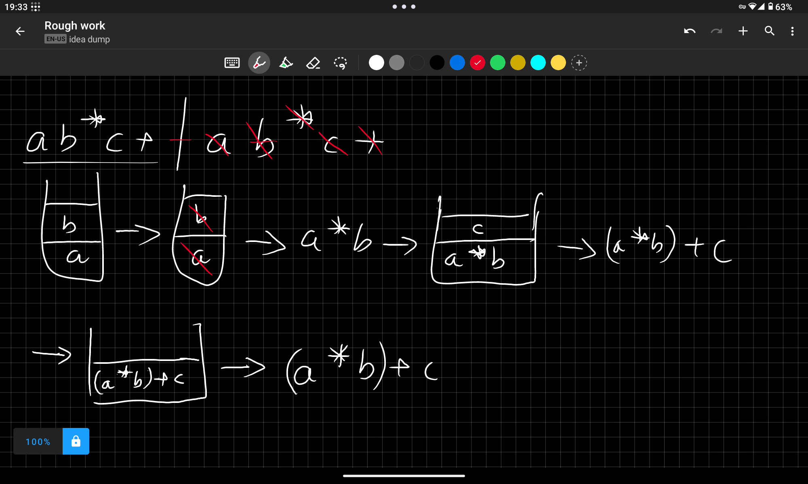 

## Stack // [Code](https://github.com/sayande717/code/blob/main/platform/College-1/data-structure-and-algorithms/2-1.c)
- A stack is a linear data structure that follows the **Last-In-First-Out (LIFO)** principle.
- It is an ordered collection of elements where the insertion and deletion of elements can only be performed at one end, called the top of the stack.
- The element that is inserted last is the first one to be removed.
- The operations performed on a stack are:
    - **Push()**: Adds an element to the top of the stack.
    - **Pop()**: Removes and returns the top element from the stack.
    - **Peek/Top()**: Returns the top element without removing it.
    - **isEmpty()**: Checks if the stack is empty.
    - **Size()**: Returns the number of elements in the stack.
- Stack can be implemented using arrays or linked lists.
- It is used in various applications such as expression evaluation, function call management, backtracking, and more.
- The time complexity of stack operations is O(1).
- How a stack works:
     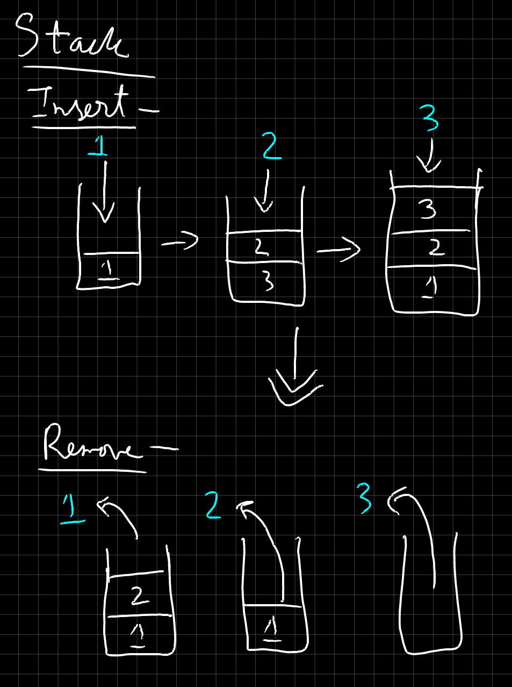

## Queue // [Code](https://github.com/sayande717/code/blob/main/platform/College-1/data-structure-and-algorithms/3-1.c)
- A queue is a linear data structure that follows the **First-In-First-Out (FIFO)** principle.
- It is an ordered collection of elements where the insertion of elements is done from the front, and the removal of elements is done from the rear. Subsequently, elements can be inserted from the rear and removed from the front too.
- The element that is inserted first is the first one to be removed.
- The operations performed on a queue are:
    - **Enqueue()**: Adds an element to the rear of the queue.
    - **Dequeue()**: Removes and returns the element from the front of the queue.
    - **Peek()/Front()**: Returns the element at the front without removing it.
    - **isEmpty()**: Checks if the queue is empty.
    - **Size**: Returns the number of elements in the queue.
- Queue can be implemented using arrays or linked lists.
- It is used in various applications such as job scheduling, breadth-first search, and more.
The time complexity of queue operations is O(1).
- How a Linear Queue works:
     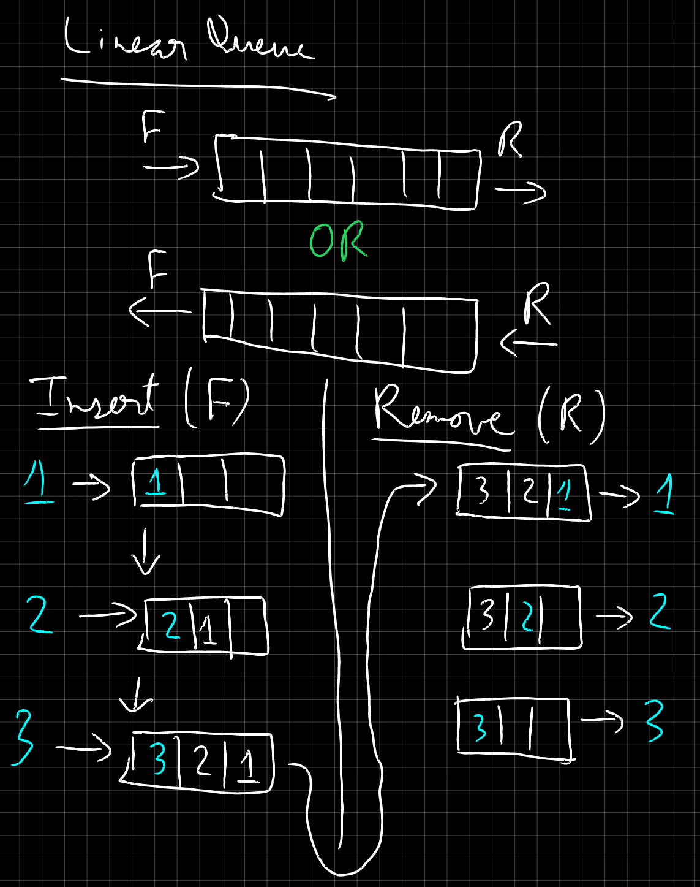

### Circular Queue // [Code](https://github.com/sayande717/code/blob/main/platform/College-1/data-structure-and-algorithms/3-2.c)
- A circular queue is a variation of the queue data structure where the last element points back to the first element, forming a circular structure.
- In a circular queue, the front and rear pointers wrap around to the beginning of the queue when they reach the end, allowing for efficient space utilization.
- Differences from a regular queue:
    - The rear pointer can move to the beginning of the queue when it reaches the end, creating a circular structure.
    - The front and rear pointers can be equal, indicating that the queue is full.
    - The queue can be implemented using an array or a linked list.
- Circular queues are commonly used in scenarios where elements are continuously added and removed, such as in scheduling algorithms or buffer management.
- The time complexity of enqueue and dequeue operations in a circular queue is $O(1)$.
- The first end can be inserted anywhere, but all subsequent elements are inserted in order after it.
- Consequently, front doesn't have to be index 0. So, when checking for isFull(), we need to check if *front is **just after** *rear, instead of checking if the index of *rear is length of queue - 1.
- How a Circular Queue works:
     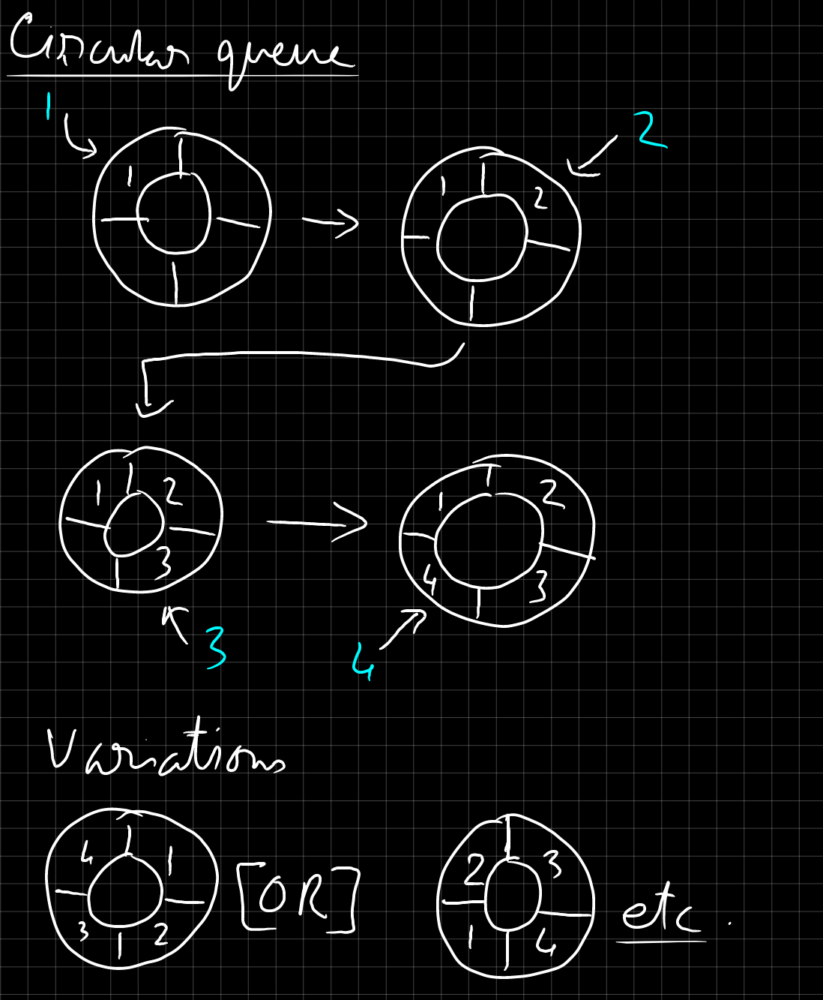

### Double-Ended Queue
- A double-ended queue, also known as a deque, is a linear data structure that allows insertion and deletion of elements from both ends.
- In a double-ended queue, elements can be added or removed from either the front or the rear end, providing flexibility in implementing various algorithms.
- Operations supported by a double-ended queue:
    - **InsertFront()**: Adds an element to the front of the deque.
    - **InsertRear()**: Adds an element to the rear of the deque.
    - **DeleteFront()**: Removes and returns the element from the front of the deque.
    - **DeleteRear()**: Removes and returns the element from the rear of the deque.
    - **GetFront()**: Returns the element at the front of the deque without removing it.
    - **GetRear()**: Returns the element at the rear of the deque without removing it.
    - **isEmpty()**: Checks if the deque is empty.
    - **Size()**: Returns the number of elements in the deque.
- Double-ended queues can be implemented using arrays or linked lists.
- They are used in scenarios where efficient insertion and deletion operations are required at both ends, such as in implementing deque-based algorithms or data structures like priority queues.
- The time complexity of deque operations depends on the implementation, but commonly, it is O(1) for most operations.
- How a Double-Ended Queue works:
     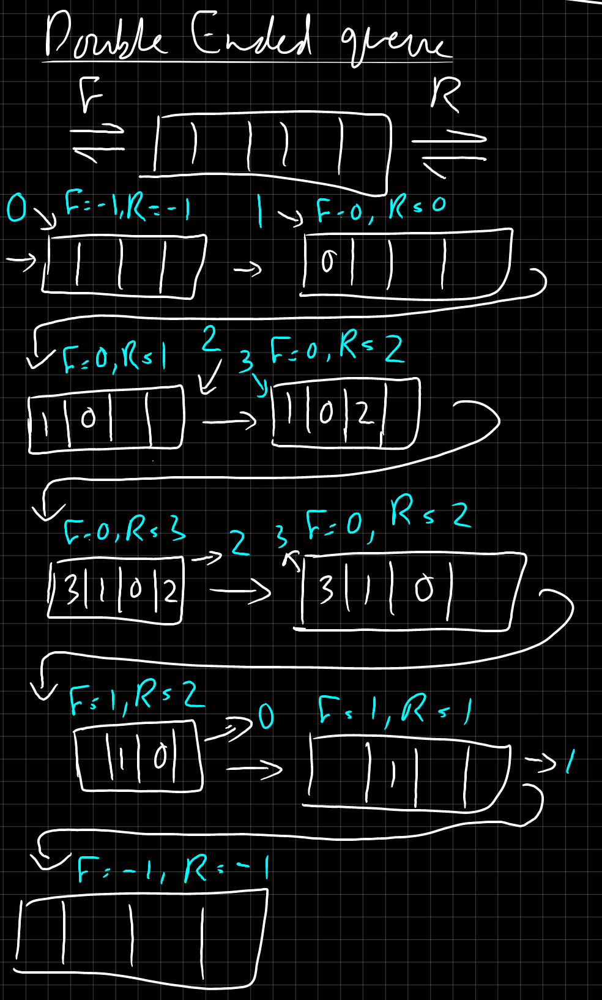

## Linked List
- A linked list is a linear data structure consisting of a sequence of elements, called nodes, where each node contains a data element and a reference (or pointer) to the next node in the sequence.
- Unlike arrays, which have a fixed size and store elements in contiguous memory locations, linked lists dynamically allocate memory for each node, allowing for efficient insertion, deletion, and traversal of elements.
- Usage: Linked lists are often used when the size of the data structure is not known in advance or when frequent insertions and deletions are required, as they offer flexibility and efficient memory utilization. However, they may have slower access times for random access compared to arrays, as elements are not stored in contiguous memory locations.

### Singly Linked List
- Design:
     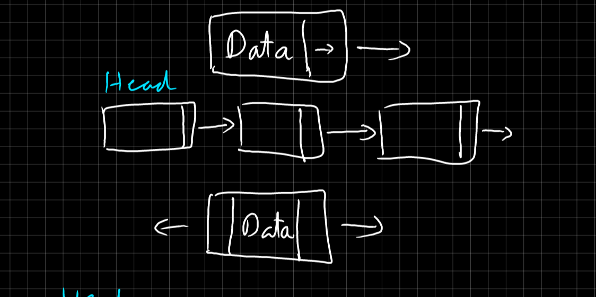
- In this type of linked list, each node contains data and a pointer to the next node in the sequence. The last node points to `NULL` to indicate the end of the list.

### Doubly linked list
- Design:
     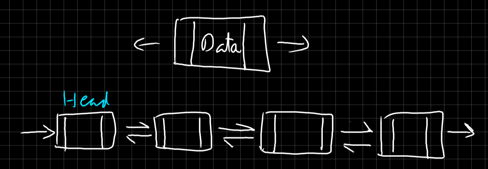
- In a doubly linked list, each node contains data, a pointer to the next node, and a pointer to the previous node in the sequence. This allows for traversal in both forward and backward directions.

### Circular linked list
- Design:
     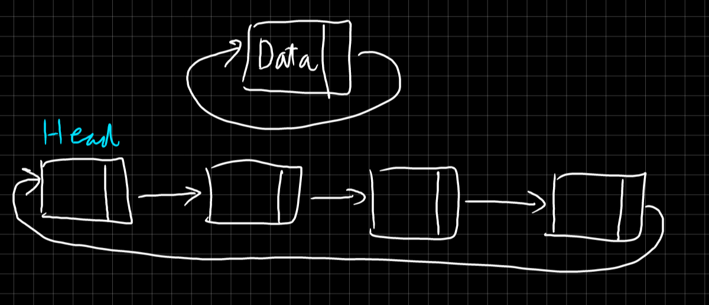
- In a circular linked list, the last node points back to the first node, forming a circular structure. This can simplify certain operations like traversal or insertion at the end of the list.

## Tree
- A tree is a hierarchical data structure consisting of nodes, with a single node designated as the root, and all other nodes connected by edges forming a parent-child relationship.
- **Properties:** Trees have several properties, including a root node, leaf nodes, and internal nodes. Each node can have zero or more child nodes, and there are no cycles in a tree.

### Binary Tree
- Design:
     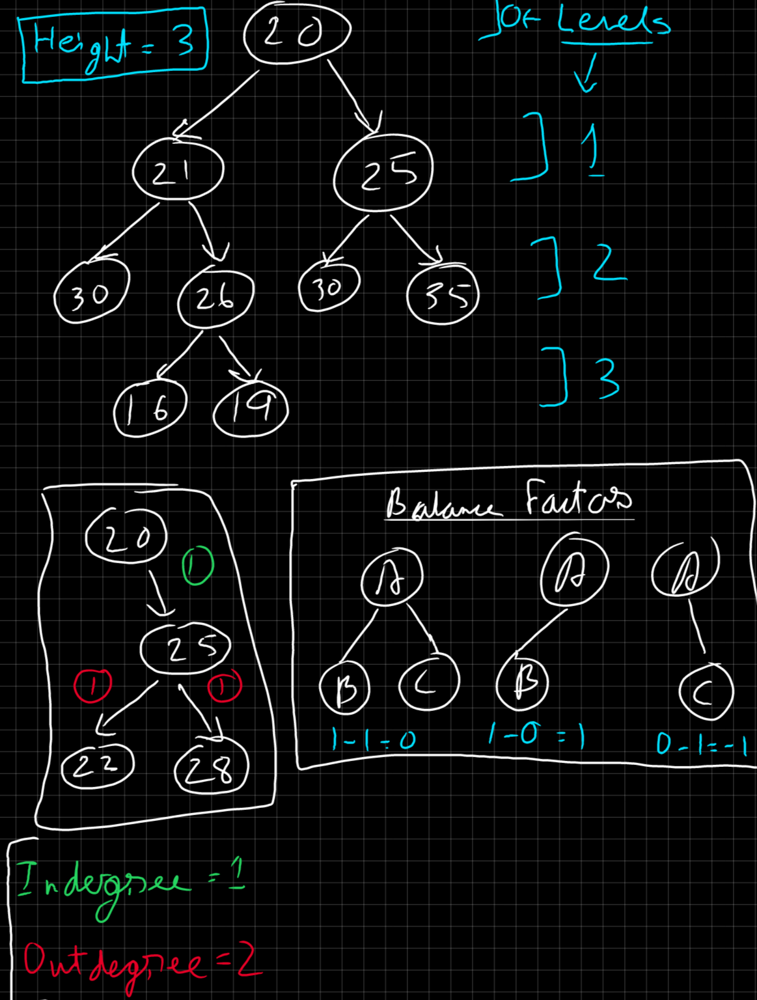
- **Definition:** A binary tree is a type of tree where each node has at most two children, referred to as the left child and the right child.
- **Properties:** Binary trees have properties such as a maximum of two children per node, a unique path from the root to any node, and various types of binary trees based on their structure.
- **Types of nodes:** 
  - **Ancestor:** A node that is connected to another node by a path of edges leading from the root.
  - **Descendant:** A node that is connected to another node by a path of edges leading to a leaf.
  - **Children:** Nodes that are directly connected to a node and are one level below it.
  - **Parent:** A node that has one or more child nodes directly connected to it.
- **Types:**
  - **Complete:** A binary tree in which all levels are fully filled except possibly the last level, which is filled from left to right.
  - **Strict:** A binary tree where each node has exactly zero or two children.
  - **Nearly:** A binary tree in which all levels are fully filled except possibly the last level, and the last level has all nodes as left as possible.
- **Important Facts & Terms:**
  - **Height of a tree:** The length of the longest path from the root to a leaf.
  - **Depth of a tree:** The length of the path from the root to a given node.
  - **Degree of a node:** The number of children a node has.
  - **Indegree:** The number of edges coming into a node.
  - **Outdegree:** The number of edges going out from a node.
  - **Maximum number of nodes:** $2^{h+1}-1$, h = height of the tree
  - **Balance Factor:** $h[l] - h[r]$, h = height of the tree
  - If $n_0$=Node with degree 0, similar for $n_1$ & $n_2$, then **$n_0=n_2+1$**
- **Types of tree traversal:** (D: Process node, L: Left sub-tree / node, R: Right sub-tree / node)
  - **Preorder:** (DLR). Visiting the root node first, then recursively visiting the left subtree, followed by the right subtree.
  - **Inorder:** (LDR). Recursively visiting the left subtree first, then the root node, followed by the right subtree.
  - **Postorder:** (LRD). Recursively visiting the left subtree first, then the right subtree, and finally the root node.
  - Example 0:
       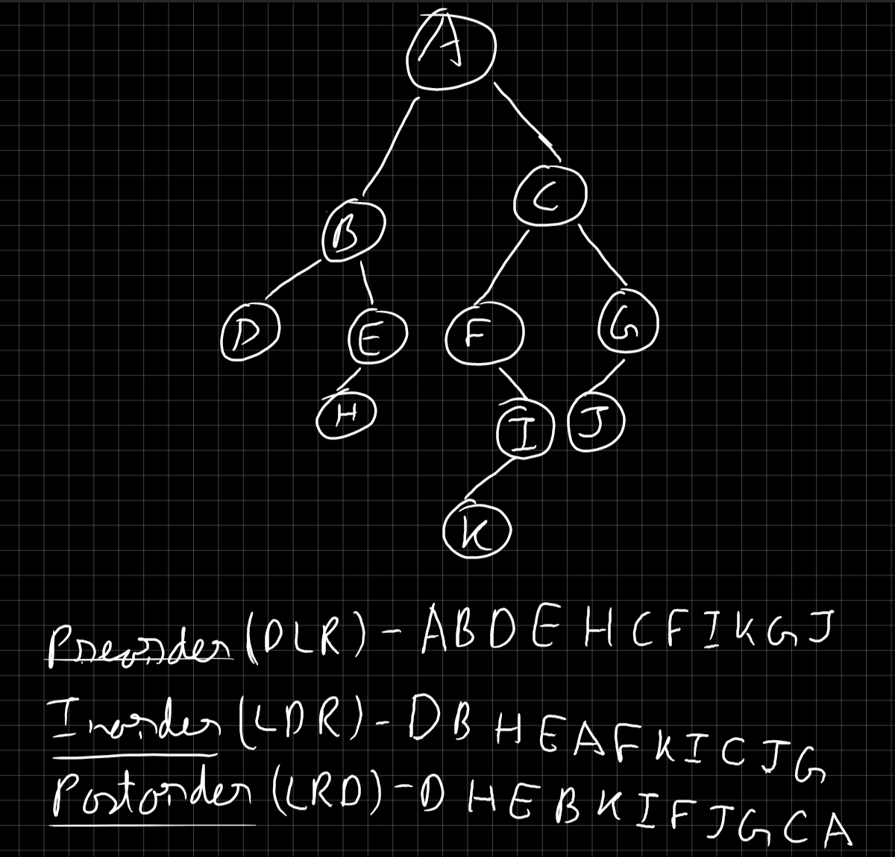
  - Example 1:
       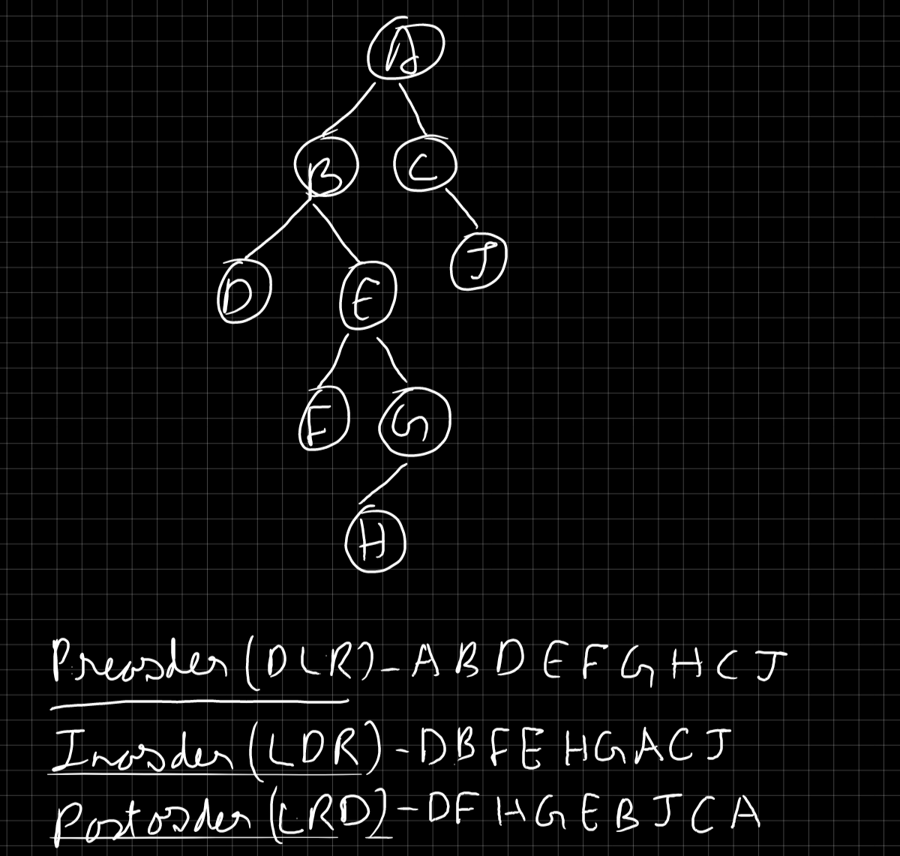
- Generate a tree from it's Traversals:
    - Preorder, Inorder:
        1. Root of the tree = **First** node in the Preorder Traversal.
        1. For the root of the left sub-tree: Check which of the possible elements $(8,4,10,9,11,2,5)$ occur **first** in the Preorder list. Here, it's $2$.
        1. Check the nodes to the left and right of $2$ in the Inorder list. $L=(8,4,10,9,11)$, $R=(5)$. These will be the elements of the left & right sub-trees of $2$.
        1. Again, for the root of the left sub-tree of $2$: Check which of the possible elements $(8,4,10,9,11)$ occur first in the Preorder list. Here, it's $4$.
        1. Similarly, check the nodes to the left and right of $4$ in the Inorder list. $L=(8)$, $R=(10,9,11)$. These will be the elements of the left & right sub-trees of $4$.
        1. Continue till the entire tree is generated.
        - Solution:
             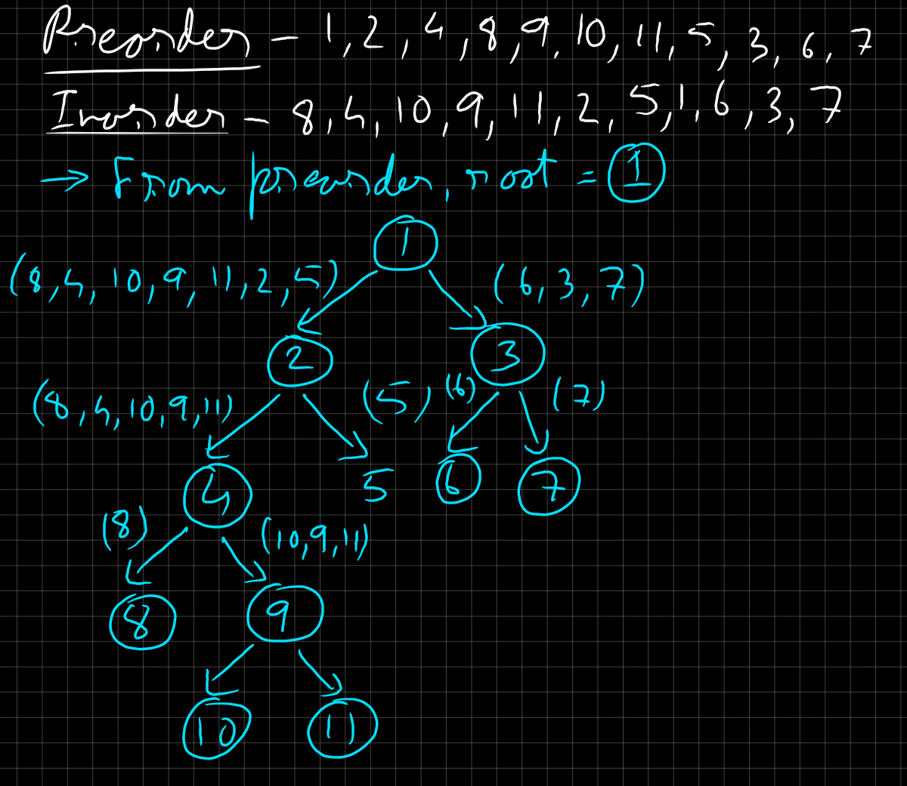
    - Postrder, Inorder:
        1. Root of the tree = **Last** node in the Postorder Traversal.
        1. For the root of the left sub-tree: Check which of the possible elements $(9,5,1,7,2,12)$ occur **last** in the Postorder list. Here, it's $5$.
        1. Check the nodes to the left and right of $5$ in the Inorder list. $L=(9)$, $R=(1,7,2,12)$. These will be the elements of the left & right sub-trees of $5$.
        1. The left sub-tree of $5$ only has one element, $9$.
        1. Again, for the root of the right sub-tree of $5$: Check which of the possible elements $(1,7,2,12)$ occur last in the Postorder list. Here, it's $7$.
        1. Similarly, check the nodes to the left and right of $7$ in the Inorder list. $L=(1)$, $R=(2,12)$. These will be the elements of the left & right sub-trees of 7$$.
        1. Continue till the entire tree is generated.
        - Solution:
             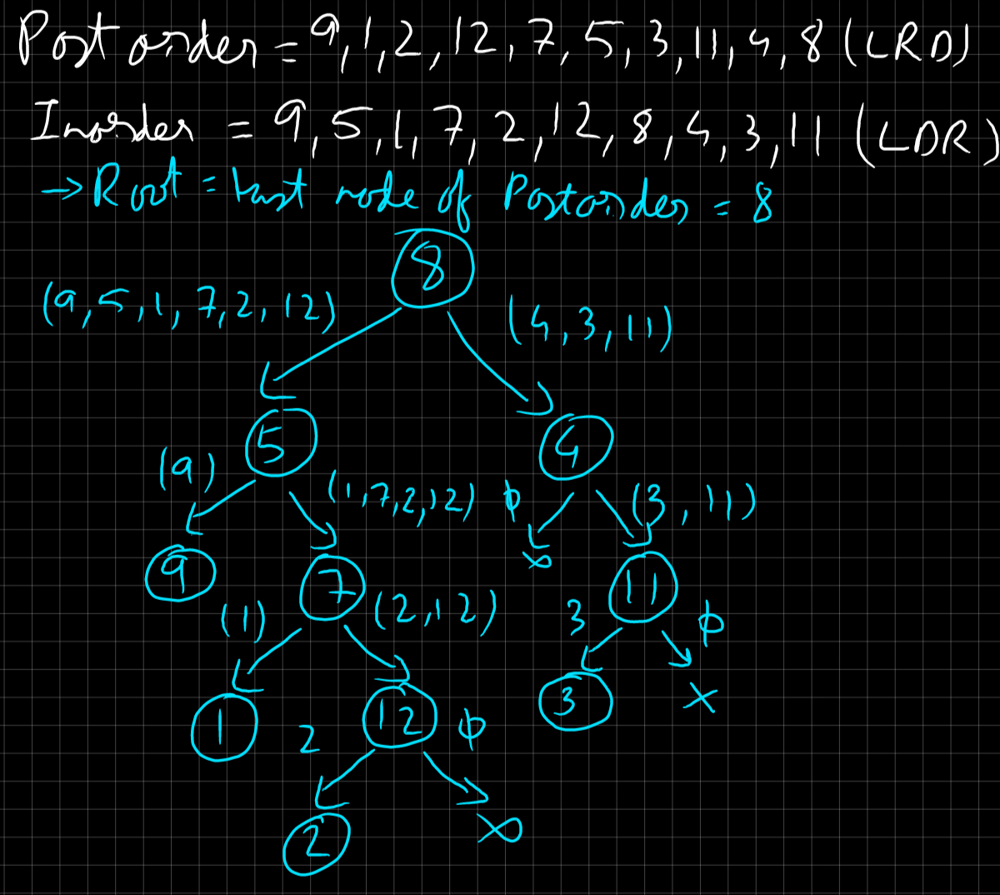
    - Preorder, Postorder (Recursive Method)
        - Using these traversal lists, we **cannot construct** an unique binary tree, but we **can construct** an unique full binary tree.
        1. Root of the tree = **First** node in the Preorder Traversal = **Last** node in the Postorder Traversal = $F$
        1. In the Preorder list, successor of $F$ is $B$. Find $B$ in the Postorder list.
        1. In the Postorder list, elements to the left of $B$, $L=(A,C,E,D,B)$ will be in the left sub-tree of $F$. Consequently, elements to the right, $R=(H,I,G)$ will be in the right sub-tree of $F$.
        1. Now, we switch to the left sub-tree of $F$.
            1. Find the new Postorder list. It is the same as the left sub-tree of $F$ i.e. $(A,C,E,D,B)$
            1. Find the new Preorder list. In the left sub-tree of $F$ i.e. $L=(A,C,E,D,B)$, check which occurs first & last (from L to R) in the Preorder list. It's $B$ & $E$. So, new Preorder list = $(B,A,D,C,E)$.
        1. Now, we switch to $B$ as the root node.
            1. In the Preorder list, successor of $B$ is $A$. Find $A$ in the Postorder list.
            1. In the Postorder list, elements to the left of $A$, $L=(A)$ will be in the left sub-tree of $B$. Consequently, elements to the right, $R=(C,E,D)$ will be in the right sub-tree of $B$.
        1. The left sub-tree of $B$ only has 1 element, $A$. So, we switch to the right sub-tree of $B$.
            1. Find the new Postorder list. It is the same as the right sub-tree of $F$ i.e. $(C,E,D)$.
            1. Find the new Preorder list. In the right sub-tree of $B$ i.e. $R=(C,E,D)$, check which occurs first & last (from L to R) in the Preorder list. It's $D$ & $E$. So, new Preorder list = $(D,C,E)$.
            1. Continue till the entire tree is generated.
        - Solution:
             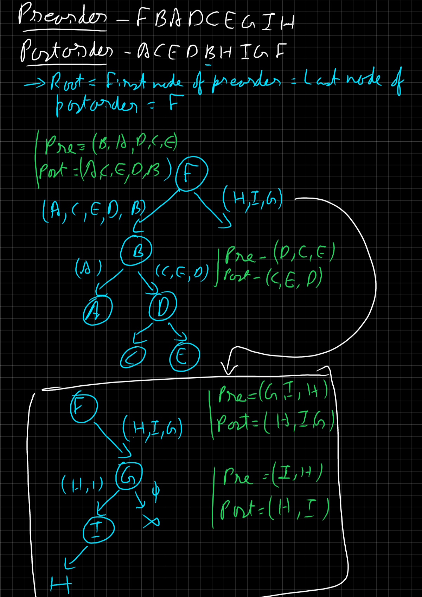

    - Preorder, Postorder (Fast Method)
        1. Root of the tree = **First** node in the Preorder Traversal = **Last** node in the Postorder Traversal = $F$
        1. Start from the next right node in the Preorder list: $B$.
        1. **If the next element is to the left of current node, then it is a child of current node.**
        1. $B$, the next element, is to the left of $F$. So, it is a child of $F$. Since $F$ has no children, put $B$ as the left-most child of $F$.
        1. Continue to the next right node in the Preorder list: $A$.
        1. Among $(B,F)$, $A$ is to the left of $B$ before it is to the left of $F$. So, it is a child of $B$.
        1. Continue to the next right node in the Preorder list: $D$.
        1. Among $(F,B,A)$, $D$ is to the left of $B$. So, it is a child of $B$.
        1. Continue till the entire tree is generated.
        - Solution:
             

### Binary Search Tree
- A Binary Search Tree is a data structure used in computer science for organizing and storing data in a sorted manner.
- Each node in a Binary Search Tree has at most two children, a left child and a right child.
    - The left child has a value less thanthe parent node.
    - The right child has a value greater than the parent node.
- This hierarchical structure allows for efficient searching, insertion, and deletion operations on the data stored in the tree.
- Searching in a Binary Search Tree:
     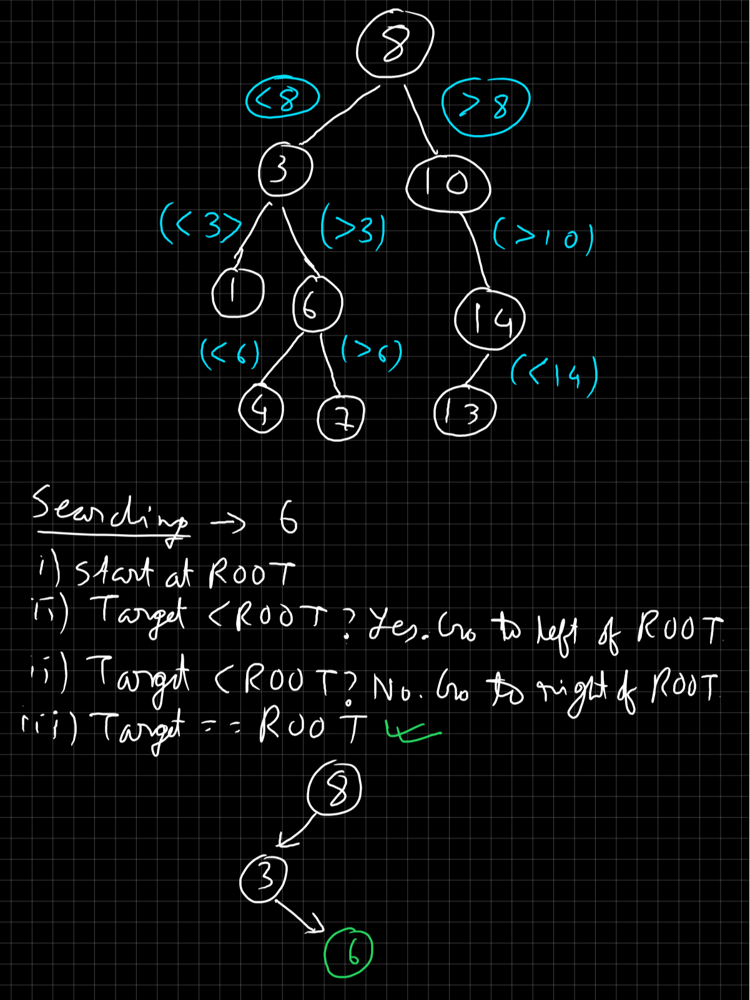

### B-Tree
- It is a balanced m-way tree. (m=Order of the tree)
- In constrast to a Binary Search Tree, a node can have more than 1 key, & more than 2 children.
- All leaf nodes are at the same level.
- A B-Tree of Order $m$ has these properties:
    - Root node has:
        - Maximum keys: $m-1$
        - Maximum children: $m$
        - Minimum keys: $1$
        - Minimum children: $2$
    - Every node has
        - Maximum keys: $m-1$
        - Maximum children: $m$
        - Minimum keys: $\lceil \frac {m}{2} \rceil - 1$
        - Minimum children: $\lceil \frac {m}{2} \rceil$

## Graph
- Components of a graph:
    - Node / Vertex
    - Edge / Ordered pair: Connection between 2 nodes.
- Terms:
    - Adjacent node: Nodes connected to the current node.
    - Degree of a node:
        - Undirected Graph: Number of nodes we can reach from current node.
        - Directed Graph:
            - Indegree: Number of nodes through which we can reach current node.
            - Outdegree: Number of nodes we can reach from current node.
    - Path: A Path of length `n` from node `u` to `v` is a sequence of `n+1` nodes.
    - Isolated node: If the degree of[] a node is `0`.
- Types:
    - Directed: Direction of the edge is defined.
        - Directed Acryllic Graph: A directed graph with no cycle.
        - Tree: A DAG, where the additional condition is that a child can only have 1 parent.
    - Undirected: Direction of the edge is not defined.
        - Connected: There exists an edge between every pair of nodes. No node is unreachable.
        - Complete: Every node is connected to every other node. A particular node can be reached from all other nodes.
        - Bi-connected: A connected graph with no articulation points.
            - Articulation point: If a node gets removed, the graph gets disconnected.
         
    - Weighted: Edges have some costs associated with them.
    - Unweighted: Edges don't have costs associated with them.
    - Bipartite: Given 2 colours, a graph is a bipartite graph if no 2 adjacent nodes have the same colour.
        - Linear graphs are always bipartite by nature.
        - Graphs with even cycle length are always bipartite.
        - Graphs with odd cycle length are never bipartite.
         
    - Sparse: A graph with relatively few edges compared to the number of vertices.
    - Dense: A graph with relatively few vertices compared to the number of edges.
    - Finite: A graph with a finite number of vertices and edges.
    - Infinite: A graph with an infinite number of vertices and edges.
  
<!-- Last image: self/15.png | external/-1.jpg -->
