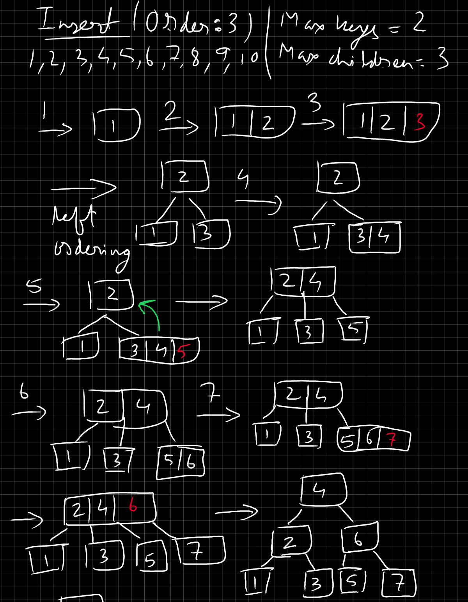
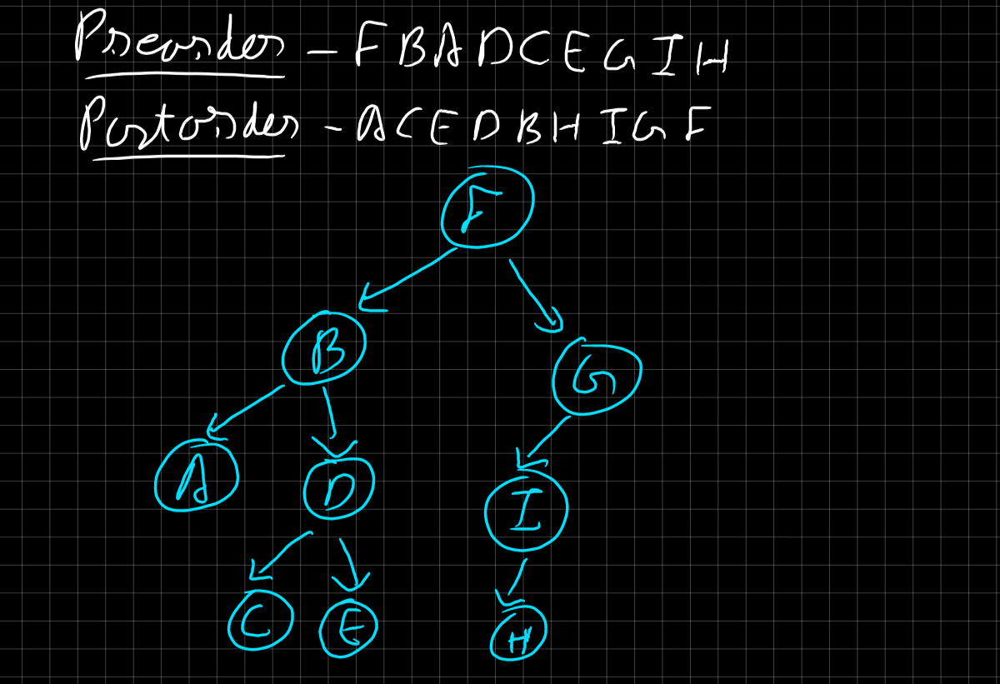
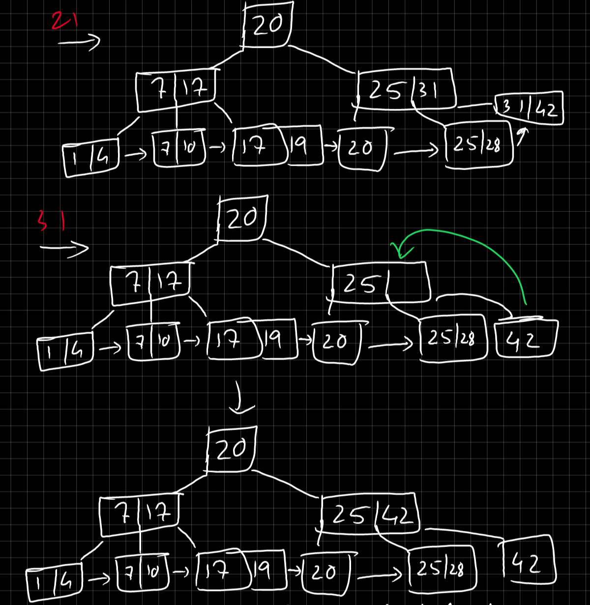
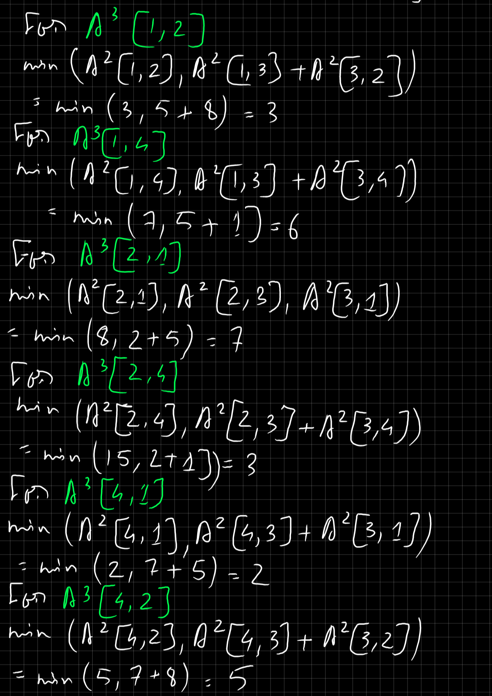

# Basics

# Linear Data Structures
## Arrays
- It's a collection of elements of a particular data type
- Elements are adjacent to each other.
- Each partition has 2 neighbours, except 1st and last one.
- Size of the box is fixed, and cannot be modified.
- The positions are indexed, and we can find an element by it's index.
- Implementation: [code](https://github.com/sayande717/code/blob/main/self/Java/initArray.java)
- Resize an array: There is no way to directly resize an array in Java. To do it, create another bigger array, and then copy all elements from the current array to the new array.

# Medians & Order Statistics
-  These are concepts in statistics and computer science that deal with the ranking and ordering of elements within a dataset.
## Median
- The median is the middle value in a list of numbers.
- If the list has an odd number of entries, the median is the number in the middle. Example: In $\{1, 3, 3, 6, 7, 8, 9\}$, $median=6$.
- If the list has an even number of entries, the median is the average of the two middle numbers. Example: In $\{1, 2, 3, 4, 5, 6, 8, 9\}$, $median = (4+5)/2 = 4.5$.

## Order Statistics
- Order statistics are statistics that provide information about the values at specific positions in a dataset when it is sorted in ascending or descending order.
- The k-th order statistic of a dataset is the k-th smallest element in the sorted order.
- Example: In $\{1,2,3,4,5,6\}$, $n=6$; $1$ is the first order statistic, $2$ is the 2nd order statistic ... and $6$ is the $n^{th}$ order statistic.
- Median:
    - If $n$ is odd, the median is the $\frac{n+1}{2}$-th order statistic.
    - If $n$ is even, the median is the average of the $\frac{n}{2}$-th and $\frac{n}{2}+1$-th order statistics.
- Finding the median and order statistics:
    - **Selection Algorithms**: These algorithms are used to find the k-th smallest (or largest) element in an unordered list. Examples include Quickselect and the Median of Medians algorithm.
    - **Sorting Algorithms**: These algorithms sort the entire dataset, after which the median or any order statistic can be directly accessed. Examples include Quick Sort, Merge Sort, and Heap Sort.
    - **Median of Medians Algorithm**: This is a deterministic selection algorithm that guarantees a linear time complexity. It works by dividing the list into smaller groups, finding the median of each group, and then recursively finding the median of the medians.

# Linear Time Selection
## Expected Linear Time Selection
- **Quickselect**: This is a randomized algorithm that works by partitioning the array around a pivot element. The pivot is chosen randomly, and the algorithm recursively searches the appropriate subarray. Time complexity = O(n).
- **Introselect**: This is a hybrid of quicksort and heapsort. It uses quicksort as long as it performs well, and switches to heapsort if the performance degrades. This guarantees a worst-case linear time complexity.
## Worst Case Linear Time Selection
- **Median of Medians algorithm**:
    - This algorithm divides the array into groups of five elements, finds the median of each group, and then recursively finds the median of the medians. This median is used as the pivot for partitioning.
    - Time Complexity = $O(n)$
    - Example: $Array = \{2,5,1,7,3,9,4,8,6\}$
        1. Divide into groups: $\{2,5,1\},\{7,3,9\},\{4,8,6\}$
        2. Sort each group: $\{1,2,5\},\{3,7,9\},\{4,6,8\}$
        3. Find the median of each group: $2,7,6$
        4. Find the median of the medians: $Median = 6$. This is the median of the original array.

### Searching
#### Linear Search
> Linear search is a simple searching algorithm that sequentially checks each element in a list until a match is found or the end of the list is reached.
- **Steps**:
    1. Start from the first element of the list.
    1. Compare the current element with the target element.
    1. If a match is found, return the index of the element.
    2. If not, continue to the next element in the list.
    3. If the end of the list is reached without finding a match, return -1 to indicate that the target element is not present in the list.
- Time Complexity: $O(n)$.
- It can work on both sorted and unsorted data.

#### Sentinel Search
> Sentinel search is a variation of the linear search algorithm used to improve its efficiency by reducing the number of comparisons. It involves placing a sentinel value (a special value) at the end of the data structure to avoid having to check for out-of-bounds conditions during the search.
- **Steps**:
    - Before starting the search, add a sentinel value to the end of the list or array. This sentinel value should be greater than any other value in the list, so it will guarantee that the search will eventually find it if the item is not present.
    - Initialize the search index variable i to 0.
    - Set the last element of the array to the search key.
    - While the search key is not equal to the current element of the array (i.e., arr[i]), increment the search index i.
    - If i is less than the size of the array or arr[i] is equal to the search key, return the value of i (i.e., the index of the search key in the array).
    - Otherwise, the search key is not present in the array, so return -1 (or any other appropriate value to indicate that the key is not found).
- The key benefit of the Sentinel Linear Search algorithm is that it eliminates the need for a separate check for the end of the array, which can improve the average case performance of the algorithm. <br>
- However, it does not improve the worst-case performance, which is still  $O(n)$ (where n is the size of the array), as we may need to scan the entire array to find the sentinel value.

#### Interpolation Search
> Interpolation search is an algorithm for searching for a specific value in a sorted array that uses interpolation to estimate the position of the target value. It is an improvement over binary search for uniformly distributed data.

- **Steps**:
    1. Calculate the index of the target value using interpolation formula:
        $$ \text{index} = \text{lo} + \left( \frac{(target - \text{arr[lo]}) \times (\text{hi} - \text{lo})}{\text{arr[hi]} - \text{arr[lo]}} \right) $$
    2. If the calculated position is out of range or the target value is not within the range of the array, return -1 to indicate that the target value is not found.
    3. If the target value is found at the calculated position, return the position.
    4. If the target value is smaller than the value at the calculated position, repeat the search process on the left subarray.
    5. If the target value is larger than the value at the calculated position, repeat the search process on the right subarray.
    6. Repeat steps 1-5 until the target value is found or the subarray size becomes 0.

- Time Complexity: 
    - Best case: O(1) when the target value is found at the first position.
    - Worst case: O(n) when the array is sorted in descending order or the target value is at the extreme ends of the array.
    - Average case: O(log log n) for uniformly distributed data.

- Interpolation search can be used for both sorted and uniformly distributed data, but it may not perform well for data with unevenly distributed values or when the array is not sorted.

#### TODO: Exponential Search

### Sorting
#### Insertion Sort
- It is a stable sorting algorithm.
- It is efficient for small lists and nearly sorted lists.
- Steps (\$array = \{9,8,7,6,5,4,3,2,1,0\}$\)
    - Assume array at index 0 is sorted.
    - **PASS 1**: Index 1
        1. **Target (key)** = array[1] = 8.
        2. Compare \$8\$ with range \{9\}, and insert it: \{8,9\}
        3. Array: \{8,9,7,6,5,4,3,2,1,0\}
    - **PASS 2**: Index 2
        1. **Target (key)** = array[2] = 7.
        2. Compare \$7\$ with range \{8,9\}, and insert it: \{7,8,9\}
        3. Array: \{7,8,9,6,5,4,3,2,1,0\}
    - **PASS 3**: Index 3
        1. **Target (key)** = array[3] = 6.
        2. Compare \$6\$ with range \{7,8,9\}, and insert it: \{6,7,8,9\}
        3. Array: \{6,7,8,9,5,4,3,2,1,0\}
    - **PASS 4**: Index 4
        1. **Target (key)** = array[4] = 5.
        2. Compare \$5\$ with range \{6,7,8,9\}, and insert it: \{5,6,7,8,9\}
        3. Array: \{5,6,7,8,9,4,3,2,1,0\}
    - **PASS 5**: Index 5
        1. **Target (key)** = array[5] = 4.
        2. Compare \$4\$ with range \{5,6,7,8,9\}, and insert it: \{4,5,6,7,8,9\}
        3. Array: \{4,5,6,7,8,9,3,2,1,0\}
    - **PASS 6**: Index 6
        1. **Target (key)** = array[6] = 3.
        2. Compare \$3\$ with range \{4,5,6,7,8,9\}, and insert it: \{3,4,5,6,7,8,9\}
        3. Array: \{3,4,5,6,7,8,9,2,1,0\}
    - **PASS 7**: Index 7
        1. **Target (key)** = array[7] = 2.
        2. Compare \$2\$ with range \{3,4,5,6,7,8,9\}, and insert it: \{2,3,4,5,6,7,8,9\}
        3. Array: \{2,3,4,5,6,7,8,9,1,0\}
    - **PASS 8**: Index 8
        1. **Target (key)** = array[8] = 1.
        2. Compare \$1\$ with range \{2,3,4,5,6,7,8,9\}, and insert it: \{1,2,3,4,5,6,7,8,9\}
        3. Array: \{1,2,3,4,5,6,7,8,9,0\}
    - **PASS 9**: Index 9
        1. **Target (key)** = array[9] = 0.
        2. Compare \$0\$ with range \{1,2,3,4,5,6,7,8,9\}, and insert it: \{0,1,2,3,4,5,6,7,8,9\}
        3. Array: \{0,1,2,3,4,5,6,7,8,9\}
    - **Sorted Array**: $\{0,1,2,3,4,5,6,7,8,9\}$
- Algorithm:
    ```c
    void insertionSort(int* arr) {
        // arr[0] is assumed to be sorted.
        for(int iter=1;iter<maxArrSize;iter++) {
            int target = arr[iter];
            int jter = iter-1;
            // Here, we compare the target with array elements [1 to (i-1)], and put the key in it's proper position.
            while(jter>=0 && arr[jter]>=target) {
                // The target gets overwritten in the array.
                arr[jter+1] = arr[jter];
                jter = jter - 1;
            }
            // Restore the target.
            // WARN: j is either -1, or 1 index before the target here.
            arr[jter+1] = target;
        }
    }
    ```

#### Bubble Sort
- It is a stable sorting algorithm.
- Steps (\$array = \{9,8,7,6,5,4,3,2,1,0\}$\)
    - **PASS 1**: Traverse range = $\{9,8,7,6,5,4,3,2,1,0\}$.
        1. If $array[iter] > array[iter+1]$, swap them.
        2. After all swaps, array: $\{8,7,6,5,4,3,2,1,0,9\}$.
        3. The last element is at it's proper position.
    - **PASS 2**: Traverse range = $\{8,7,6,5,4,3,2,1,0\}$.
        1. If $array[iter] > array[iter+1]$, swap them.
        2. After all swaps, array: $\{7,6,5,4,3,2,1,0,8,9\}$.
        3. The last 2 elements are at their proper positions.
    - **PASS 3**: Traverse range = $\{7,6,5,4,3,2,1,0\}$.
        1. If $array[iter] > array[iter+1]$, swap them.
        2. After all swaps, array: $\{6,5,4,3,2,1,0,7,8,9\}$.
        3. The last 3 elements are at their proper positions.
    - **PASS 4**: Traverse range = $\{6,5,4,3,2,1,0\}$.
        1. If $array[iter] > array[iter+1]$, swap them.
        2. After all swaps, array: $\{5,4,3,2,1,0,6,7,8,9\}$.
        3. The last 4 elements are at their proper positions.
    - **PASS 5**: Traverse range = $\{5,4,3,2,1,0\}$.
        1. If $array[iter] > array[iter+1]$, swap them.
        2. After all swaps, array: $\{4,3,2,1,0,5,6,7,8,9\}$.
        3. The last 5 elements are at their proper positions.
    - **PASS 6**: Traverse range = $\{4,3,2,1,0\}$.
        1. If $array[iter] > array[iter+1]$, swap them.
        2. After all swaps, array: $\{3,2,1,0,4,5,6,7,8,9\}$.
        3. The last 6 elements are at their proper positions.
    - **PASS 7**: Traverse range = $\{3,2,1,0\}$.
        1. If $array[iter] > array[iter+1]$, swap them.
        2. After all swaps, array: $\{2,1,0,3,4,5,6,7,8,9\}$.
        3. The last 7 elements are at their proper positions.
    - **PASS 8**: Traverse range = $\{2,1,0\}$.
        1. If $array[iter] > array[iter+1]$, swap them.
        2. After all swaps, array: $\{1,0,2,3,4,5,6,7,8,9\}$.
        3. The last 8 elements are at their proper positions.
    - **PASS 9**: Traverse range = $\{1,0\}$.
        1. If $array[iter] > array[iter+1]$, swap them.
        2. After all swaps, array: $\{0,1,2,3,4,5,6,7,8,9\}$.
        3. All 9 elements are at their proper positions.
    - **Sorted Array**: $\{0,1,2,3,4,5,6,7,8,9\}$
    - As an enhancement:
        - Check if any swap has taken place in the current pass.
        - *If yes*, continue.
        - *If not*, then you can safely assume the array at that point is already sorted, stop processing it further.
- Algorithm:
    ```c
    void bubbleSort(int* arr) {
        // Outer loop gives the limit till which the array is traversed.
        // The limit starts at (arr.length-1), and ends at 1.
        for(int iter=maxArrSize-1;iter>0;iter--) {
            bool isSwapped = false;
            // The array is traversed in this loop.
            // Pass 1: We traverse from 0 to (arr.length-2). In the end, the last element is sorted.
            // Pass 2: We traverse from 0 to (arr.length-3). In the end, the last 2 elements are sorted.
            // Pass 3: We traverse from 0 to (arr.length-4). In the end, the last 3 elements are sorted.

            for(int jter=0;jter<iter;jter++) {
                if(arr[jter]>arr[jter+1]) {
                    isSwapped = true;
                    int temp = arr[jter];
                    arr[jter] = arr[jter+1];
                    arr[jter+1] = temp;
                }
            }

            // If no swap occurs in the current pass, it means the array is sorted.
            if(!isSwapped) {
                break;
            }
        }
    }
    ```

#### Cocktail Sort
- Recommended for small to medium-sized arrays, typically up to a few thousand elements.
- It is a stable sorting algorithm.
- Steps (\$array = \{9,8,7,6,5,4,3,2,1,0\}$\)
    - **PASS 1**:
        - Forward:
            1. Traverse range = $\{9,8,7,6,5,4,3,2,1,0\}$.
            2. If $array[iter] > array[iter+1]$, swap them.
            3. After all swaps, array: $\{8,7,6,5,4,3,2,1,0,9\}$.
            4. The last element is at its proper position.
        - Backward:
            1. Traverse range = $\{8,7,6,5,4,3,2,1\}$, in a backward manner.
            2. If $array[iter] > array[iter+1]$, swap them.
            3. After all swaps, array: $\{0,8,7,6,5,4,3,2,1,9\}$.
            4. The first element is at its proper position.
    - **PASS 2**:
        - Forward:
            1. Traverse range = $\{8,7,6,5,4,3,2,1\}$.
            2. If $array[iter] > array[iter+1]$, swap them.
            3. After all swaps, array: $\{0,7,6,5,4,3,2,1,8,9\}$.
            4. The second last element is at its proper position.
        - Backward:
            1. Traverse range = $\{7,6,5,4,3,2,1\}$, in a backward manner.
            2. If $array[iter] > array[iter+1]$, swap them.
            3. After all swaps, array: $\{0,1,7,6,5,4,3,2,8,9\}$.
            4. The second element is at its proper position.
    - **PASS 3**:
        - Forward:
            1. Traverse range = $\{7,6,5,4,3,2\}$.
            2. If $array[iter] > array[iter+1]$, swap them.
            3. After all swaps, array: $\{0,1,6,5,4,3,2,7,8,9\}$.
            4. The third last element is at its proper position.
        - Backward:
            1. Traverse range = $\{6,5,4,3,2\}$, in a backward manner.
            2. If $array[iter] > array[iter+1]$, swap them.
            3. After all swaps, array: $\{0,1,2,6,5,4,3,7,8,9\}$.
            4. The third element is at its proper position.
    - **PASS 4**:
        - Forward:
            1. Traverse range = $\{6,5,4,3\}$.
            2. If $array[iter] > array[iter+1]$, swap them.
            3. After all swaps, array: $\{0,1,2,5,4,3,6,7,8,9\}$.
            4. The fourth last element is at its proper position.
        - Backward:
            1. Traverse range = $\{5,4,3\}$, in a backward manner.
            2. If $array[iter] > array[iter+1]$, swap them.
            3. After all swaps, array: $\{0,1,2,3,5,4,6,7,8,9\}$.
            4. The fourth element is at its proper position.
    - **PASS 5**:
        - Forward:
            1. Traverse range = $\{5,4\}$.
            2. If $array[iter] > array[iter+1]$, swap them.
            3. After all swaps, array: $\{0,1,2,3,4,5,6,7,8,9\}$.
            4. The fifth last element is at its proper position.
        - Backward:
            1. Traverse range = $\{4\}$, in a backward manner.
            2. If $array[iter] > array[iter+1]$, swap them.
            3. After all swaps, array: $\{0,1,2,3,4,5,6,7,8,9\}$.
            4. The fifth element is at its proper position.
    - **PASS 6**: start = end, so we break out.
    - **Sorted Array**: $\{0,1,2,3,4,5,6,7,8,9\}$

#### TODO: Merge Sort
#### Bitonic Sort
- It is a sorting algorithm that works by recursively dividing the array into smaller bitonic sequences and then merging them in a way that maintains the bitonic property.
- A bitonic sequence is a sequence of numbers that is first monotonically increasing and then monotonically decreasing, or vice versa.
- The size of the array should be in the order of $2^n$.
- It is a stable sorting algorithm.
- Bitonic Sequence: Given an index $i$,
    - All elements to the left of i $\leq i$, while all elements to the right are $\geq i$.
    <br> [OR]
    - All elements to the left of i $\geq i$, while all elements to the right are $\leq i$.
    - Examples:
        1. $\{1,2,3,4,5,6,7,6,5,4,3,2,1\}$ \| $index=6$
        1. $\{2,3,19,72,603,101,57,18\}$ \| $index=4$
        1. $\{9,8,7,6,5,4,3,2,1,2,3,4,5,6,7,8,9\}$ \| $index=8$
- Steps \($array = \{19,2,72,3,18,57,603,10\}$\):
    1. Form the bitonic sequence, if needed:
        <br>
    2. Sort the array:
        <br>

#### Counting Sort
- Counting Sort is a non-comparative sorting algorithm that works well for sorting integers (or objects that can be mapped to an integer) when the range of the input data (i.e., the maximum and minimum values) is small.
- It's a stable sorting algorithm, which means the relative position of same elements are maintained.
- Steps \($array = \{2,5,3,0,2,3,0,3\}$\):
    - Find max of all elements: $5$
    - Create count arrray with length=$5+1=6$, filled with 0's: $count=[0,0,0,0,0,0]$
    - Store the count of each unique elements in their respective indices.
        - For $2$, frequency(count) = $2$, so store $2$ at index $2$.
        - For $5$, frequency(count) = $1$, so store $1$ at index $5$.
    - Finally, $count=[2,0,2,3,0,1]$
    - Store the cummulative sum of count[], in count[]: count[i] = count[i-1]+count[i].
    - Finally, $count=[2,2,4,7,7,8]$
    - Iterate from right to left of the array.
        1. Start with $arr[7]=3$.
            1. Go to index $3$ of count. $count[3]=7$.
            2. Decrement $count[3]$ by 1, $count[3]=7-1=6$.
            3. Store $3$ in index $6$ of the output array.
        2. Next, we have $arr[6]=0$.
            1. Go to index $0$ of count. $count[0]=2$.
            2. Decrement $count[0]$ by 1, $count[0]=2-1=1$.
            3. Store $0$ in index $1$ of the output array.
        3. Next, we have $arr[5]=3$.
            1. Go to index $3$ of count. $count[3]=6$.
            2. Decrement $count[3]$ by 1, $count[3]=6-1=5$.
            3. Store $3$ in index $5$ of the output array.
        4. Next, we have $arr[4]=2$.
            1. Go to index $2$ of count. $count[2]=4$.
            2. Decrement $count[2]$ by 1, $count[2]=4-1=3$.
            3. Store $2$ in index $3$ of the output array.
        5. Next, we have $arr[3]=0$.
            1. Go to index $0$ of count. $count[0]=1$.
            2. Decrement $count[0]$ by 1, $count[0]=1-1=0$.
            3. Store $0$ in index $0$ of the output array.
        6. Next, we have $arr[2]=3$.
            1. Go to index $3$ of count. $count[3]=5$.
            2. Decrement $count[3]$ by 1, $count[3]=5-1=4$.
            3. Store $3$ in index $4$ of the output array.
        7. Next, we have $arr[1]=5$.
            1. Go to index $5$ of count. $count[5]=8$.
            2. Decrement $count[5]$ by 1, $count[5]=8-1=7$.
            3. Store $5$ in index $7$ of the output array.
        8. Finally, we have $arr[0]=2$.
            1. Go to index $2$ of count. $count[2]=3$.
            2. Decrement $count[2]$ by 1, $count[2]=3-1=2$.
            3. Store $2$ in index $2$ of the output array.
    - Finally,
        $outArr = [0,0,2,2,3,3,3,5]$
        $count = [0,2,2,4,7,7]$
    - Representation:
        <br>
        <br>

#### Radix Sort
- It's a stable sorting algorithm.
- It works by sorting the elements based on their individual digits.
- It's a non-comparative sorting algorithm, meaning it doesn't compare elements directly with each other.
- Steps (\$array = \{170,45,75,90,802,24,2,66\}$\)
    - Find the maximum element: $802$, which has $3$ digits. So, we need to iterate $3$ times over the array.
    - Iterations:
        1. Sort based on least significant (unit) digit:
            - Current array = \{17**0**,4**5**,7**5**,9**0**,80**2**,2**4**,**2**,6**6**\}
            - Sorted array = \{170,90,802,2,24,45,75,66\}
        2. Sort based on 2nd least significant (tens) digit:
            - Current array = \{1**7**0,**9**0,8**0**2,**0**2,**2**4,**4**5,**7**5,**6**6\}
            - Sorted array = \{802,2,24,45,66,170,75,90\}
        3. Sort based on 3rd least / most significant (hundreds) digit:
            - Current array = \{**8**02,**0**2,**0**24,**0**45,**0**66,1**7**0,**0**75,**0**90\}
            - Sorted array = \{2,24,45,66,75,90,170,802\}
    - **Sorted Array**: $\{2,24,45,66,75,90,170,802\}$
- TODO: Algorithm

## Infix, Prefix & Postfix expressions
- The conversions are done using `stack` data structure.

### Infix to Postfix:
- **Rules**:
    - Scan the infix expression from left to right. 
    - If the scanned character is an operand, put it in the postfix expression. 
    - Otherwise, do the following: If the precedence and associativity of the scanned operator are greater than the precedence and associativity of the operator in the stack [or the stack is empty or the stack contains a ‘(‘ ], then push it in the stack. [‘^‘ operator is right associative and other operators like ‘+‘,’–‘,’*‘ and ‘/‘ are left-associative].
        - Check especially for a condition when the operator at the top of the stack and the scanned operator both are ‘^‘. In this condition, the precedence of the scanned operator is higher due to its right associativity. So it will be pushed into the operator stack. 
        - In all the other cases when the top of the operator stack is the same as the scanned operator, then pop the operator from the stack because of left associativity due to which the scanned operator has less precedence. 
    - Else, Pop all the operators from the stack which are greater than or equal to in precedence than that of the scanned operator.
        - After doing that Push the scanned operator to the stack. (If you encounter parenthesis while popping then stop there and push the scanned operator in the stack.) 
    - If the scanned character is a ‘(‘, push it to the stack. 
    - If the scanned character is a ‘)’, pop the stack and output it until a ‘(‘ is encountered, and discard both the parenthesis. 
    - Repeat steps 2-5 until the infix expression is scanned. 
    - Once the scanning is over, Pop the stack and add the operators in the postfix expression until it is not empty.
    - Finally, print the postfix expression.
- Example:  `a*b+c/d` (Infix) to Postfix:
    | Symbols | Stack         | Postfix Expression |
    |---------|---------------|--------------------|
    | a       |               | a                  |
    | *       | *             | a                  |
    | b       | *             | ab                 |
    | +       | +             | ab*                |
    | c       | +             | ab*c               |
    | /       | +/            | ab*c               |
    | d       | +/            | ab*cd              |
    |         | +             | ab*cd/             |
    |         |               | ab*cd/+            |

- Example: `(a*b)+c/d` (Infix) to Postfix:
    | Symbols | Stack         | Postfix Expression |
    |---------|---------------|--------------------|
    | (       | (             |                    |
    | a       | (             | a                  |
    | *       | (*            | a                  |
    | b       | (*            | ab                 |
    | )       |               | ab*                |
    | +       | +             | ab*                |
    | c       | +             | ab*c               |
    | /       | +/            | ab*c               |
    | d       | +/            | ab*cd              |
    |         | +             | ab*cd/             |
    |         |               | ab*cd/+            |

## Postfix to Infix:
- Algorithm:
    - While there are input symbols left, read the next symbol from the input.
    - If the symbol is an operand, push it onto the stack. 
    - If the symbol is an operator. 
        - Pop the top 2 values from the stack (**write the values from bottom to top**). 
        - Put the operator, with the values as arguments and form a string. 
        - Push the resulted string back to stack. 
    - If there is only one value in the stack, that value in the stack is the desired infix string. 
- Example: `ab*c+` -> `(a*b)+c`:
    <br><br>

## Stack // [Code](https://github.com/sayande717/code/blob/main/platform/College-1/data-structure-and-algorithms/2-1.c)
- A stack is a linear data structure that follows the **Last-In-First-Out (LIFO)** principle.
- It is an ordered collection of elements where the insertion and deletion of elements can only be performed at one end, called the top of the stack.
- The element that is inserted last is the first one to be removed.
- The operations performed on a stack are:
    - **Push()**: Adds an element to the top of the stack.
    - **Pop()**: Removes and returns the top element from the stack.
    - **Peek/Top()**: Returns the top element without removing it.
    - **isEmpty()**: Checks if the stack is empty.
    - **Size()**: Returns the number of elements in the stack.
- Stack can be implemented using arrays or linked lists.
- It is used in various applications such as expression evaluation, function call management, backtracking, and more.
- The time complexity of stack operations is O(1).
- How a stack works:
    <br>

## Queue // [Code](https://github.com/sayande717/code/blob/main/platform/College-1/data-structure-and-algorithms/3-1.c)
- A queue is a linear data structure that follows the **First-In-First-Out (FIFO)** principle.
- It is an ordered collection of elements where the insertion of elements is done from the front, and the removal of elements is done from the rear. Subsequently, elements can be inserted from the rear and removed from the front too.
- The element that is inserted first is the first one to be removed.
- The operations performed on a queue are:
    - **Enqueue()**: Adds an element to the rear of the queue.
    - **Dequeue()**: Removes and returns the element from the front of the queue.
    - **Peek()/Front()**: Returns the element at the front without removing it.
    - **isEmpty()**: Checks if the queue is empty.
    - **Size**: Returns the number of elements in the queue.
- Queue can be implemented using arrays or linked lists.
- It is used in various applications such as job scheduling, breadth-first search, and more.
The time complexity of queue operations is O(1).
- How a Linear Queue works:
    <br>

### Circular Queue // [Code](https://github.com/sayande717/code/blob/main/platform/College-1/data-structure-and-algorithms/3-2.c)
- A circular queue is a variation of the queue data structure where the last element points back to the first element, forming a circular structure.
- In a circular queue, the front and rear pointers wrap around to the beginning of the queue when they reach the end, allowing for efficient space utilization.
- Differences from a regular queue:
    - The rear pointer can move to the beginning of the queue when it reaches the end, creating a circular structure.
    - The front and rear pointers can be equal, indicating that the queue is full.
    - The queue can be implemented using an array or a linked list.
- Circular queues are commonly used in scenarios where elements are continuously added and removed, such as in scheduling algorithms or buffer management.
- The time complexity of enqueue and dequeue operations in a circular queue is $O(1)$.
- The first end can be inserted anywhere, but all subsequent elements are inserted in order after it.
- Consequently, front doesn't have to be index 0. So, when checking for isFull(), we need to check if *front is **just after** *rear, instead of checking if the index of *rear is length of queue - 1.
- How a Circular Queue works:
    <br>

### Double-Ended Queue
- A double-ended queue, also known as a deque, is a linear data structure that allows insertion and deletion of elements from both ends.
- In a double-ended queue, elements can be added or removed from either the front or the rear end, providing flexibility in implementing various algorithms.
- Operations supported by a double-ended queue:
    - **InsertFront()**: Adds an element to the front of the deque.
    - **InsertRear()**: Adds an element to the rear of the deque.
    - **DeleteFront()**: Removes and returns the element from the front of the deque.
    - **DeleteRear()**: Removes and returns the element from the rear of the deque.
    - **GetFront()**: Returns the element at the front of the deque without removing it.
    - **GetRear()**: Returns the element at the rear of the deque without removing it.
    - **isEmpty()**: Checks if the deque is empty.
    - **Size()**: Returns the number of elements in the deque.
- Double-ended queues can be implemented using arrays or linked lists.
- They are used in scenarios where efficient insertion and deletion operations are required at both ends, such as in implementing deque-based algorithms or data structures like priority queues.
- The time complexity of deque operations depends on the implementation, but commonly, it is O(1) for most operations.
- How a Double-Ended Queue works:
    <br>

## Linked List
- A linked list is a linear data structure consisting of a sequence of elements, called nodes, where each node contains a data element and a reference (or pointer) to the next node in the sequence.
- Unlike arrays, which have a fixed size and store elements in contiguous memory locations, linked lists dynamically allocate memory for each node, allowing for efficient insertion, deletion, and traversal of elements.
- Usage: Linked lists are often used when the size of the data structure is not known in advance or when frequent insertions and deletions are required, as they offer flexibility and efficient memory utilization. However, they may have slower access times for random access compared to arrays, as elements are not stored in contiguous memory locations.

### Singly Linked List
- Design:
    <br>
- In this type of linked list, each node contains data and a pointer to the next node in the sequence. The last node points to `NULL` to indicate the end of the list.

### Doubly linked list
- Design:
    <br>
- In a doubly linked list, each node contains data, a pointer to the next node, and a pointer to the previous node in the sequence. This allows for traversal in both forward and backward directions.

### Circular linked list
- Design:
    <br>
- In a circular linked list, the last node points back to the first node, forming a circular structure. This can simplify certain operations like traversal or insertion at the end of the list.

## Tree
- A tree is a hierarchical data structure consisting of nodes, with a single node designated as the root, and all other nodes connected by edges forming a parent-child relationship.
- **Properties:** Trees have several properties, including a root node, leaf nodes, and internal nodes. Each node can have zero or more child nodes, and there are no cycles in a tree.

### Binary Tree
- Design:
    <br>
- **Definition:** A binary tree is a type of tree where each node has at most two children, referred to as the left child and the right child.
- **Properties:** Binary trees have properties such as a maximum of two children per node, a unique path from the root to any node, and various types of binary trees based on their structure.
- **Types of nodes:** 
  - **Ancestor:** A node that is connected to another node by a path of edges leading from the root.
  - **Descendant:** A node that is connected to another node by a path of edges leading to a leaf.
  - **Children:** Nodes that are directly connected to a node and are one level below it.
  - **Parent:** A node that has one or more child nodes directly connected to it.
- **Types:**
  - **Complete:** A binary tree in which all levels are fully filled except possibly the last level, which is filled from left to right.
  - **Strict:** A binary tree where each node has exactly zero or two children.
  - **Nearly:** A binary tree in which all levels are fully filled except possibly the last level, and the last level has all nodes as left as possible.
- **Important Facts & Terms:**
  - **Height of a tree:** The length of the longest path from the root to a leaf.
  - **Depth of a tree:** The length of the path from the root to a given node.
  - **Degree of a node:** The number of children a node has.
  - **Indegree:** The number of edges coming into a node.
  - **Outdegree:** The number of edges going out from a node.
  - **Maximum number of nodes:** $2^{h+1}-1$, h = height of the tree
  - **Balance Factor:** $h[l] - h[r]$, h = height of the tree
  - If $n_0$=Node with degree 0, similar for $n_1$ & $n_2$, then **$n_0=n_2+1$**
- **Types of tree traversal:** (D: Process node, L: Left sub-tree / node, R: Right sub-tree / node)
  - **Preorder:** (DLR). Visiting the root node first, then recursively visiting the left subtree, followed by the right subtree.
  - **Inorder:** (LDR). Recursively visiting the left subtree first, then the root node, followed by the right subtree.
  - **Postorder:** (LRD). Recursively visiting the left subtree first, then the right subtree, and finally the root node.
  - Example 0:
      <br>
  - Example 1:
      <br>
- Generate a tree from it's Traversals:
    - Preorder, Inorder:
        1. Root of the tree = **First** node in the Preorder Traversal.
        1. For the root of the left sub-tree: Check which of the possible elements $(8,4,10,9,11,2,5)$ occur **first** in the Preorder list. Here, it's $2$.
        1. Check the nodes to the left and right of $2$ in the Inorder list. $L=(8,4,10,9,11)$, $R=(5)$. These will be the elements of the left & right sub-trees of $2$.
        1. Again, for the root of the left sub-tree of $2$: Check which of the possible elements $(8,4,10,9,11)$ occur first in the Preorder list. Here, it's $4$.
        1. Similarly, check the nodes to the left and right of $4$ in the Inorder list. $L=(8)$, $R=(10,9,11)$. These will be the elements of the left & right sub-trees of $4$.
        1. Continue till the entire tree is generated.
        - Solution:
            <br>
    - Postorder, Inorder:
        1. Root of the tree = **Last** node in the Postorder Traversal.
        1. For the root of the left sub-tree: Check which of the possible elements $(9,5,1,7,2,12)$ occur **last** in the Postorder list. Here, it's $5$.
        1. Check the nodes to the left and right of $5$ in the Inorder list. $L=(9)$, $R=(1,7,2,12)$. These will be the elements of the left & right sub-trees of $5$.
        1. The left sub-tree of $5$ only has one element, $9$.
        1. Again, for the root of the right sub-tree of $5$: Check which of the possible elements $(1,7,2,12)$ occur last in the Postorder list. Here, it's $7$.
        1. Similarly, check the nodes to the left and right of $7$ in the Inorder list. $L=(1)$, $R=(2,12)$. These will be the elements of the left & right sub-trees of 7$$.
        1. Continue till the entire tree is generated.
        - Solution:
            <br>
    - Preorder, Postorder (Recursive Method)
        - Using these traversal lists, we **cannot construct** an unique binary tree, but we **can construct** an unique full binary tree.
        1. Root of the tree = **First** node in the Preorder Traversal = **Last** node in the Postorder Traversal = $F$
        1. In the Preorder list, successor of $F$ is $B$. Find $B$ in the Postorder list.
        1. In the Postorder list, elements to the left of $B$, $L=(A,C,E,D,B)$ will be in the left sub-tree of $F$. Consequently, elements to the right, $R=(H,I,G)$ will be in the right sub-tree of $F$.
        1. Now, we switch to the left sub-tree of $F$.
            1. Find the new Postorder list. It is the same as the left sub-tree of $F$ i.e. $(A,C,E,D,B)$
            1. Find the new Preorder list. In the left sub-tree of $F$ i.e. $L=(A,C,E,D,B)$, check which occurs first & last (from L to R) in the Preorder list. It's $B$ & $E$. So, new Preorder list = $(B,A,D,C,E)$.
        1. Now, we switch to $B$ as the root node.
            1. In the Preorder list, successor of $B$ is $A$. Find $A$ in the Postorder list.
            1. In the Postorder list, elements to the left of $A$, $L=(A)$ will be in the left sub-tree of $B$. Consequently, elements to the right, $R=(C,E,D)$ will be in the right sub-tree of $B$.
        1. The left sub-tree of $B$ only has 1 element, $A$. So, we switch to the right sub-tree of $B$.
            1. Find the new Postorder list. It is the same as the right sub-tree of $F$ i.e. $(C,E,D)$.
            1. Find the new Preorder list. In the right sub-tree of $B$ i.e. $R=(C,E,D)$, check which occurs first & last (from L to R) in the Preorder list. It's $D$ & $E$. So, new Preorder list = $(D,C,E)$.
            1. Continue till the entire tree is generated.
        - Solution:
            <br>

    - Preorder, Postorder (Fast Method)
        1. Root of the tree = **First** node in the Preorder Traversal = **Last** node in the Postorder Traversal = $F$
        1. Start from the next right node in the Preorder list: $B$.
        1. In the Postorder list, **if the next element is to the left of current node, then it is a child of current node.**
        1. In the Postorder list, $B$, the next element, is to the left of $F$. So, it is a child of $F$. Since $F$ has no children, put $B$ as the left-most child of $F$.
        1. Continue to the next right node in the Preorder list: $A$.
        1. In the Postorder list, among $(B,F)$, $A$ is to the left of $B$ before it is to the left of $F$. So, it is a child of $B$.
        1. Continue to the next right node in the Preorder list: $D$.
        1. In the Postorder list, among $(F,B,A)$, $D$ is to the left of $B$. So, it is a child of $B$.
        1. Continue till the entire tree is generated.
        - Solution:
            <br>

### Binary Search Tree
- A Binary Search Tree is a data structure used in computer science for organizing and storing data in a sorted manner.
- Each node in a Binary Search Tree has at most two children, a left child and a right child.
    - The left child has a value less thanthe parent node.
    - The right child has a value greater than the parent node.
- This hierarchical structure allows for efficient searching, insertion, and deletion operations on the data stored in the tree.
- Searching in a Binary Search Tree:
    <br>

### B-Tree
- Diagram:
    <br>
- It is a balanced m-way tree. (m=Order of the tree)
- Order of a B-Tree = Maximum number of children a node can have.
- A B-Tree is based on multi-level indexing.
- 
- In constrast to a Binary Search Tree, a node can have more than 1 key, & more than 2 children.
- It follows the order property of the Binary Search Tree, elements to the left of current node are smaller than current node, while elements to the right of current node are larger.
- All leaf nodes are at the same level.
- A B-Tree of Order $m$ has these properties:
    - Root node has:
        - Maximum keys: $m-1$
        - Maximum children: $m$
        - Minimum keys: $1$
        - Minimum children: $2$
    - Every node has
        - Maximum keys: $m-1$
        - Maximum children: $m$
        - Minimum keys: $\lceil \frac {m}{2} \rceil - 1$
        - Minimum children: $\lceil \frac {m}{2} \rceil$
    - In 1 data location, we have a key & it's corresponding block/record pointer.
- Terms:
    - Key: Data. It is stored in a sorted order in the B-Tree.
    - Record Pointer: Points to the memory location of the data item.
    - Block Pointer: Points to the children of a node.
- **Insert** Nodes: $1,2,3,4,5,6,7,8,9,10$ \| $Order=3$
    1. Insert 1,2,3 in the root node.
    1. Insert 4. Node gets overflowed, so it must be split from the middle.
    1. The middle elements are 2 & 3. Choose either 2 (left-ordering) or 3 (right-ordering). Maintain the ordering till the end of the tree. Here, we choose 2 (left-middle).
    1. Move 2 one level up. 1 goes to the left of 2, 3 & 4 go to the right of 2.
    1. Insert 5,6. After inserting 6, node gets overflowed.
    1. Move 4 one level up, to the right of 2. 3 goes to the left of 4, 5 & 6 to the right of 4.
    1. Insert 7,8. After inserting 8, node gets overflowed.
    1. Continue till the tree is generated.
    - Steps:
        <br>
        <br>

- **Delete** Nodes: 64,23,72,65,20
    1. Original Tree:
        <br>
    1. Delete 64. Node still has the minimum number of keys.
    1. Delete 23. Node does not have the minimum number of keys (underflow).
        - Node can borrow a key from it's immediate left or right node (sibling), on the condition that the immediate node has more than the minimum number of keys.
        - Here, there is no immediate right node. We borrow from the immediate left node.
        - First, the **maximum** key from the left node (16) displaces the key of the parent node (20), then the displaced node is moved in place of the deleted node, 23.
    1. Delete 72. Node does not have the minimum number of keys (underflow).
        - Node cannot borrow from immediate left sibling, as it does not satisfy the condition. However, it can borrow from it's right sibling.
        - First, the **minimum** key from the right node (77) displaces the key of the parent node (75), then the displaced node is moved in place of the deleted node, 72.
    1. Delete 65. Node does not have the minimum number of keys (underflow).
        - None of the immediate left or right siblings satisfy the condition, so key cannot be borrowed from either of them.
        - In this case, the node is merged with it's immediate left or right node.
            - Merge with immediate left node: The minimum key of the parent is taken, and merged in addition to merging the concerned nodes. The resultant node is: 51,52,60,68.
            - Merge with immediate right node: The maximum key of the parent is taken, and merged in addition to merging the concerned nodes. The resultant node is: 68,73,75,77.
    1. Delete 20. Node does not have the minimum number of keys (underflow).
        - None of the immediate left or right siblings satisfy the condition, so key cannot be borrowed from either of them.
        - In this case, the node is merged with it's immediate left node. The minimum key of the parent is taken, and merged in addition to merging the concerned nodes. The resultant node is: 14,15,16,27.
        - Now, the parent node does not have the minimum number of keys (underflow).
        - So, the node is merged with it's immediate right node, and the minimum key is taken from it's parent.
        - Refactor the existing nodes.
- Delete intermediate nodes: 70
    1. Delete 70. Node still has the minimum number of keys. However, deleting it just like that is not possible since there are nodes connected to this intermediate node.
        - We have to choose the key that is just less than 70 i.e. inorder predecessor (the maximum element of the left sub-tree) or more than 70 i.e. inorder successor (the minimum element of the right sub-tree).
        - Before removing the key from the respective node, we will check if that node will still have the minimum number of keys or not, after the removal.
        - Here, the key can only be borrowed from the left child.
    1. Delete 95.
        - In this case, we have to take the inorder successor key, from the right child.
    1. Delete 77.
        - In this case, we can't take either the inorder predecessor or successor key, because condition isn't satisfied in either case.
        - So, we merge the concerned nodes which contain the keys, i.e. the left and right children.
    1. Delete 80.
        - Here, we can replace 80 with it's inorder predecessor, which is the maximum value of the left sub-tree.
    1. Delete 100.
        - Here, the nodes which contain the inorder predecessor and inorder successor, both fail to provide the node, since they will not contain the minimum number of keys if the keys are borrowed from them.
        - So, we merge both the concerned nodes.
        - Now, the node with 90 has less than the minimum number of keys.
        - So, we have to borrow a key from the immediate left or right sibling. we borrow from the left sibling, because it satisfies the condition, and also the right sibling doesn't exist.
        - The borrowing occurs through the parent. 68 gets transferred to parent, 79 gets transferred to the current node (with 90).
        - Refactor: Nodes initially at the right of 68 will get moved to the right of the parent node, BUT to the leftmost available space of the (79,90) node.

    1. Delete 6,27, 60,16.
        - These nodes can be removed directly.
    1. Delete 50.
        - Since we can't get a key from the concerned nodes of both the left and right sub-tree, we merge the concerned nodes.
        - After merging, the parent has only 1 key (10).
        - This node cannot get a key from it's immediate right node.
        - So, the children nodes of (68) merge with each other.
    - Finally, we see that the height of the B-Tree has decreased. This is known as shrinking of the B-Tree.
    - Steps:
        <br>
        <br>
        <br>
        <br>
        <br>
        <br>
        <br>

### B+ Tree
- Differences, compared to [B-Tree](#b-tree):
    - Data is only stored in leaf nodes, not internal nodes.
    - Searching & deleting keys (data) is faster.
    - The internal nodes only contain the key & block pointer.
    - The leaf nodes contain the key (a copy of all keys in the internal nodes), data pointer, and a block pointer that points to the next leaf node.
    - The leaf nodes are linked together, like in a linked list.
    - Diagram:
        <br>
- **Insert** Nodes: $1,4,7,10,17,21,31$ \| $Order=4$
    1. When splitting the node, check for the middle element (s).
     - If the number of nodes is odd, there will be 1 middle element.
     - If the number of nodes is even, there will be 2 middle elements. Choose the left-middle (left biased) or right-middle (right biased) element.
     - Move the node to it's parent, and re-factor accordingly. 
    1. Process:
        <br>
- **Delete** Nodes: $21,31,20,10,7,25,42$ \| $Order=4$
    1. Original Tree:
        <br>
    1. Delete $21$.
        - It's a leaf node, and removing it doesn't make the node property invalid. So, simply delete it.
    1. Delete $31$.
        - Leaf node: Still has minimum number of keys, after deleting $31$. So, delete it.
        - Index node: Still has minimum number of keys, after deleting $31$. So, delete it.
        - Take the minimum value from the right child of index node ($42$), and move it to it's parent.
    1. Delete $20$.
        - Leaf node: Removing the key will break any property of B+ Tree.
            1. Borrow a key either from the left or right sibling, given that they can still hold the property of B+ Tree after donating the key. Here, we choose the right sibling.
            1. Borrow the minimum value ($25$), through the parent. Remove $25$ from both the node and the parent, and put it into the leaf node.
        - Now, the parent node may satisfy any property, but still has siblings to be taken care of. So, we take the minimum of the right sibling ($28$) and place it there.
        - Index (Root) node: Removing the key will break any property of B+ Tree.
            1. Borrow the minimum key from it's siblings (in the leaf nodes, since this is a B+ Tree and only these nodes actually have the keys), $25$. Place it in the root node.
    1. Delete $10$.
        - Leaf node: Removing it doesn't break any property, so do it.
    1. Delete $7$.
        - Index node: Removing it breaks the property, but we'll sort it in the next section.
        - Leaf node: Removing it breaks the property.
            1. We can borrow a key from both left and right sibling. We borrow from the left one, this time.
            1. We borrow $4$ through the parent. Remove $7$ in the index node, put $4$ in the parent, then insert it in place of $7$.
    1. Delete $25$.
        - Leaf node: Removing it breaks the property.
            1. We cannot borrow anything from either the left or right sibling. So, we have to merge the node.
            1. **When merging nodes, the key between those nodes, $28$, is deleted.** So, only $42$ remains.
            1. To the left of $42$, we have $28$. To the right, we have $42$.
        - Index node: Removing it breaks the property.
            1. Take the minimum value from the leaf-node siblings, and insert it. Here, we insert $28$.
    1. Delete $42$.
        - Leaf node: Removing it breaks the property.
        - Index node: Removing it breaks the property.
            1. First, let's do the index node. Here, we can borrow 17 from the left sibling, through the root.
            1. Root now contains $17$, and we place $28$ after removing $42$.
            1. Nodes to the right of 17, $(17,19)$ come to the left of $28$.
        - Here, we had to perform operations on the index node first, instead of merging the leaf nodes. At the end, we could maintain the property B+ Tree while deleting the concerned key.
    1. Delete $4$.
        - Leaf node: Removing it breaks the property.
        - Index node: Removing it breaks the property.
            1. First, we have to merge the leaf nodes, so we create a new merged node with $(1)$ in it.
            1. Next, we have to merge the index nodes too. But here, **since the parent of this index node is the root node, we can't delete the root.** We marge $(17,28)$, and the height of the tree decreases.
    - Steps:
        <br>
        <br>
        <br>

### Minimum Spanning Tree
- A Spanning Tree is a tree with N nodes, N-1 edges, and all nodes are reachable from each other.
- A Minimum Spanning Tree is a Spanning Tree with the minimum weight.
  <br>
- Algorithms for finding Minimum Spanning Tree:
  - Reverse Delete Algorithm:
    1. Delete the largest edge.
    2. Check if all the nodes are still connected.
       - If yes, continue, till the number of edges = vertices - 1.
       - If no, undo the deletion, and continue for other edges.
    - Example:
      - We cannot delete the 2nd 6 (D-E), because the nodes will no longer be connected. So, we undo it.
    <br>
   - Boruvka's Algorithm:
     1. Choose a vertex (say A).
     2. Check all the outgoing edges from A.
     3. Choose the one with the minimum weight (1 here).
     4. Now, come to B. The minimum weight (1) has already been chosen. So, come to C.
     5. The minimum weight for C is (4). So, we choose that. Next, we come to D, where we choose (2).
     6. Continue till you connect the minimum edges for all the vertices.
     7. Next, if there are disconnected trees, then do these:
        - Take 2 pairs. Figure out ALL valid ways to connect them.
        - Choose the edge with the minimum weight.
     8. Finally, the MST is formed.
     <br>
     <br>
     <br>

## Heap
- If we want to get the smallest number in an array in $O(1)$ time, we have to sort it everytime we insert a new element. The insertion process will take atmost $O(n \log n)$ time.
- So, we use a heap to reduce this insertion time further.
- Formal Definition: Given a collection of items and a condition, a heap will:
  - Find the item in $O(1)$ time
  - Insert an item in $O(\log n)$ time.
  - Delete an item in $O(\log n)$ time.
- Properties:
  - Heaps are represented as a Complete Binary Tree.
  - In Data Structures, they are represented as an array, with 1-based Indexing.
  - Min Heap:
    - Every node value is greater than it's parent.
    - The root element is the minimum.
  - Max Heap:
    - Every node value is lesser than it's parent.
    - The root element is the maximum.
- The entire array representation of a heap may not be ordered, but the property of Max & Min heap will be maintained.
- For 1-based indexing:
    - root -> $i=1$
    - $parent (i) = i/2$
    - $left\ child (i) = (2i)$
    - $right\ child (i) = (2i+1)$
    - $height=\log n$
- For 0-based indexing:
    - root -> $i=0$
    - $parent (i) = (i-1)/2$
    - $left\ child (i) = (2i+1)$
    - $right\ child (i) = (2i+2)$
    - $height=\log n$
    <br>
- Inserting a node (Min Heap):
  - Whenever a new node is inserted, we check if it violates the heap property.
    - Min Heap: Is the current node lesser than it's parent?
    - Max Heap: Is the current node greater than it's parent?
  - If these answers are false, we need to swap the current node's value with that of it's parent. This process is called **Heapify**.
  - Once a violation is detected, keep checking the values of the current node & parent, till it is resolved.
  <br>
  <br>
- Deleting a node (Min Heap):
  - Put the last element in it's place.
  - Heapify.
    - Check if left child is smaller, if yes, swap.
    - Check if right child is smaller, if yes, swap.
    <br>

## Graph
- Components of a graph:
    - Node / Vertex
    - Edge / Ordered pair: Connection between 2 nodes.
- Terms:
    - Adjacent node: Nodes connected to the current node.
    - Degree of a node:
        - Undirected Graph: Number of nodes we can reach from current node.
        - Directed Graph:
            - Indegree: Number of nodes through which we can reach current node.
            - Outdegree: Number of nodes we can reach from current node.
    - Path: A Path of length `n` from node `u` to `v` is a sequence of `n+1` nodes.
    - Isolated node: If the degree of[] a node is `0`.
- Types:
    - Directed: Direction of the edge is defined.
        - Directed Acryllic Graph: A directed graph with no cycle.
        - Tree: A DAG, where the additional condition is that a child can only have 1 parent.
    - Undirected: Direction of the edge is not defined.
        - Connected: There exists an edge between every pair of nodes. No node is unreachable.
        - Complete: Every node is connected to every other node. A particular node can be reached from all other nodes.
        - Bi-connected: A connected graph with no articulation points.
            - Articulation point: If a node gets removed, the graph gets disconnected.
    - Weighted: Edges have some costs associated with them.
    - Unweighted: Edges don't have costs associated with them.
    - Bipartite: Given 2 colours, a graph is a bipartite graph if no 2 adjacent nodes have the same colour.
        - Linear graphs are always bipartite by nature.
        - Graphs with even cycle length are always bipartite.
        - Graphs with odd cycle length are never bipartite.
    - Sparse: A graph with relatively few edges compared to the number of vertices.
    - Dense: A graph with relatively few vertices compared to the number of edges.
    - Finite: A graph with a finite number of vertices and edges.
    - Infinite: A graph with an infinite number of vertices and edges.

### Shortest Path Algorithms
- These algorithms help to find the shortest distance between 2 vertices, in a graph.
- The paths may have intermediate vertices between the source & the destination.

#### Dijkstra's Algorithm
- Here, at every step, we calculate the direct distance between all nodes. We take the shortest among them, as the intermediate step.
- The process of updating the distance values for the vertices, is called Relaxation.
- Formulae (Relaxation):
  ```c
  if(d[u]+c[u,v]<d[v]) {
      d[v] = d[u]+c[u,v];
  }
  ```
- Steps:
    - If the vertices can't be reached directly, the value for the vertex is ∞.
    - Perform Relaxation:
        1. Whenever you choose a new node, check all nodes that can be reached from that node.
        2. Calculate all the distance values for these nodes.
        3. If any distance value is lesser than the existing value for that node, replace it with the newly calculated value.
        <br>
        <br>
        <br>
        - Table:
            | Vertex | Distance ($d[v]$) |
            |--------|-------------------|
            | 2      | 2                 |
            | 3      | 3                 |
            | 4      | 8                 |
            | 5      | 6                 |
            | 6      | 9                 |
- Another Example:
  <br>
- Dijkstra's Algorithm may or may not work if the graph contains negative edges.

#### Floyd-Warshall Algorithm
- This algorithm is also used to calculate the shortest distance between 2 vertices, but the approach is different compared to [Dijkstra's Algorithm](#dijkstras-algorithm).
- Here, we calculate the shortest distances from each vertex to all other vertices. For example, if there are 4 vertices = [1,2,3,4]:
  - 1 -> 2,3,4
  - 2 -> 1,3,4
  - 3 -> 1,2,4
  - 4 -> 1,2,3
- Formulae:
  <br>$A^k[i,j] = min(A^{k-1}[i,k],A^{k-1}[k,j])$
- Steps (Vertices = [1,2,3,4]):
    1. Generate $A^0$. This is the initial matrix, containing the distances between each vertex.
    2. Start with $A^1$, for vertex 1.
       - Fill the rows & columns for Vertex 1 from $A^0$, because these distances will remain unchanged.
       - Fill all the diagonals (1-1,2-2,3-3,4-4) with 0.
       - Example: For calculating $A^1[2,3]$, we need to check both the direct path ($A^0[2,3]$) & the indirect path via 1 ($A^0[2,1]+A^0[1,3]$). So, $A^1[2,3]=min(A^0[2,3],A^0[2,1]+A^0[1,3])$
     3. Continue to $A^2$. Generate it from $A^1$.
       - Fill the rows & columns for Vertex 1 from $A^1$, because of the reason stated above.
     4. The last matrix, $A^4$, gives the shortest distances between all the vertices.
   <br>
   <br>
   <br>
   <br>
   <br>
   <br>
   <br>

<!-- Last image: self/54.png | external/-1.jpg -->
