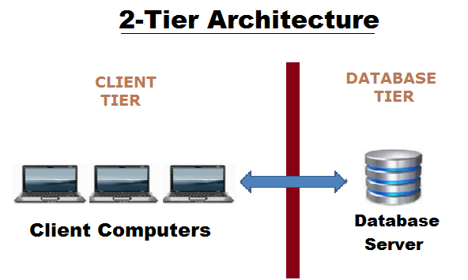
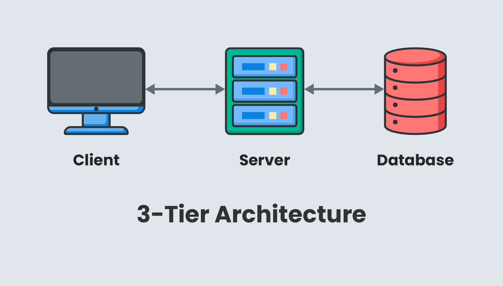

# Basics

## Structured data
- Data that needs to be stored in a structured manner.
- Data stored in a RDB, ie a Relational Database, in the form of a relation/table. It is managed by a RDBMS.
- Users can operate on the data using DBMS/RDBMS. Possible operations: Insert, Add, Delete, Update.
- Examples: SQL Server, Oracle, MySQL, etc.

## Unstructured data: 
- Data that does not need to be stored in a particular pre-defined structure.
- Example: Websites, photos, videos, etc.

## File System vs DBMS
- Filesystems were used before DBMS existed.
- In 1970's, the user used to access data in their own system.
- Advantages of using databases & database management systems (`-`: filesystem, `+`: database):
    ```diff
    - Data is stored in 1 user's computer, and is only accessible by that particular user.
    + We have the data stored in a centralized server, and multiple users can access the data from anywhere (over the internet or other type of network).

    - Users need to download the full file even if they only want some specific data.
    + Users can send a query to the server to access only the data they need.

    - Users need to know the location of the file, to fetch it.
    + Users don't need to know details about the data ie where it is stored, how it is stored, etc. They can fetch the data just from sending a query.

    - Concurrency: In modern times, a lot of people access/update data from a server at the same time. File systems don't have any protocols to handle inconsistency & conflict during concurrent operations.
    + There are protocols in place to handle inconsistency & conflict during concurrent operations.

    - Security: Since filesystem is controlled by OS, there is no level-by-level control. No security protocols can be defined.
    + Role-based (hierarchical) security protocols are available, so different kinds of users are only allowed to access relevant data.
    
    - Redundancy: Multiple files with same content but different names, can be stored.
    + DBMS has various contraints to ensure we don't waste storage space by storing duplicate/redundant data. In ensures that only unique data can be stored.

    ```

## 2-Tier Architecture



Image taken from [here](https://i.ibb.co/hMXD29s/2-tier.png)

- Consists of multiple clients, directly interacting with a single database server.
- Clients have an interface which help them interact with the database server.
- Client connects to the database, sends the query, and fetches the information. Information can also be modified or deleted from the database server as needed.

```diff
+ Simple architecture.
+ Easy to maintain.
- Difficult to scale.
- Implementing security is difficult,because client is directly is interacting with the database serer.
```

## 3-Tier Architecture:


Image taken from [here](https://inui.io/wp-content/uploads/3-tier_architecture_2.jpg)

- 3 Layers: Client (Application) Layer > Application Server / Business Layer > Database Layer
- Clients have an interface which allows them to interact with the middleware application server. They don't directly connect to the database server.
- Database server does not get overwhelmed since the middleware server handles all the queries, so load on it is reduced.

```diff
+ Can be scaled.
+ Secure, since client is not directly interacting with the database server.
- More complex and difficult to maintain compared to 2-Tier architecture.
```

## Schema & 3-Schema Architecture


Image taken from [here](https://www.tutorialandexample.com/wp-content/uploads/2019/08/Three-Schema-Architecture-of-DBMS.png)

- Schema means the logical representation of data in the database. It tells us about the structure in which the data will be stored. We also get information about the elements in the structure, their size, etc.
- We're not interested in the physical representation of the data, ie how exactly they're stored in the database. We're only interested in a legible representation of the data.
- A 3-Schema architecture consists of 3 levels: View | Logical | Physical
- We see data in the form of a table, but it is actually stored in the form of files.

### 1: External Schema / View Level:
- Controlled by the Front-end Developer.
- Different types of users (student, faculty, etc.) have different views.
- Within a particular type, different users are shown different data, relevant to them, within the particular view.

### 2: Conceptual Schema / Logical Level:
- Controlled by the Database Designer.
- Can be called a blueprint of the structure.
- Stores information about the tables, and the data in the tables.
- Stores Relationships between the tables ie how they are connected.

### 3: Physical Schema / Physical Level:
- Controlled by the Database Administrator.
- Stores information about where the data is stored, how it is stored.
- Decides if data is centralized or de-centralized.

### Data Independence
- The actual data is shown to the user, but information about how it is stored, where it is stored, etc. is hidden.
- We don't show all the tables to the user, we only show the relevant information the user wants to see.
- The application program is not changed, since the user directly interacts with it and it used to the particular view.
- The objective is to make changes in the Conceptual and Physical Schema in such a way that the user (View Level) is not affected.

- **Logical Data Independence**:
    - Changes made in the Conceptual Schema don't affect the External Schema.
    - Example: The WebUI shown to an user is not affected even after making some changes to the Conceptual Schema of a database system.

- **Physical Data Independence**:
    - Changes made in the Physical Schema don't affect the Conceptual Schema or the External Schema.
    - Example: Changing file structure, physical storage, Indexing, etc don't affect the Conceptual Schema.

# Data Models: ER Model, Relational Model, Object-Oriented Model, Network Model, Hierarchical Model

# Basics of keys
# Basics of Keys (especially foreign keys)
# Normalization
# Transaction Control & Concurrency: ACID property, R-W W-R W-W locking, Conflict Serializability, Recoverability, 2-Phase locking, timestamp ordering for concurrency
# SQL & Relational algebra: DDL, DML & DCL commands, constraints of various keys, Aggregate functions, Joins (natural, outer join, inner join), nested query
# Indexing: single-level (primary, cluster, secondary), multi-level (b-tree, b+ tree)
