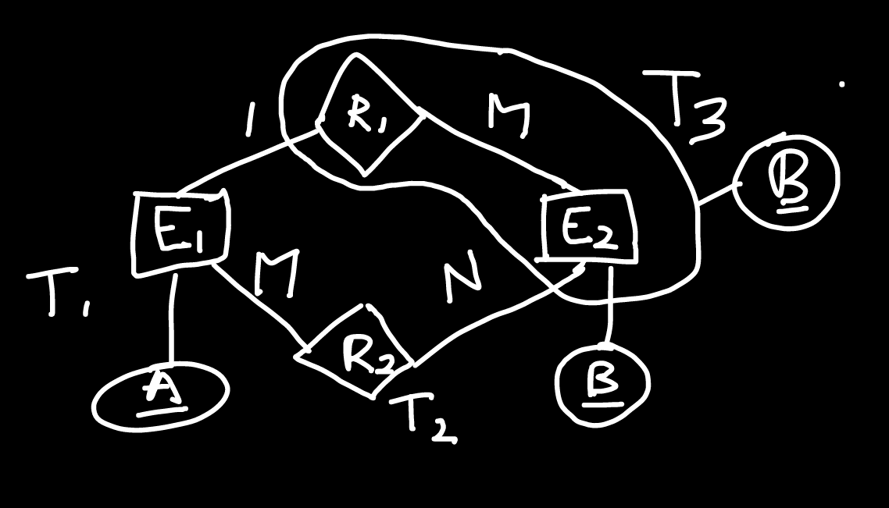
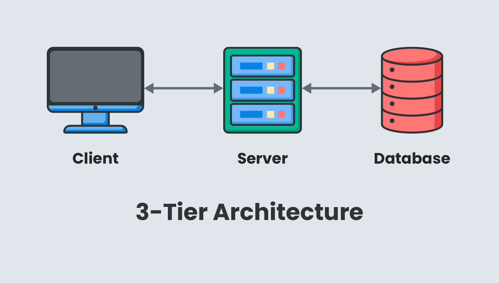
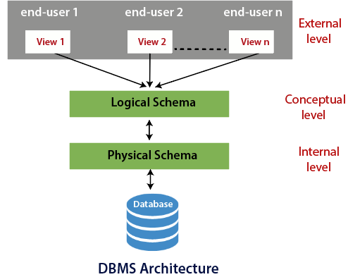
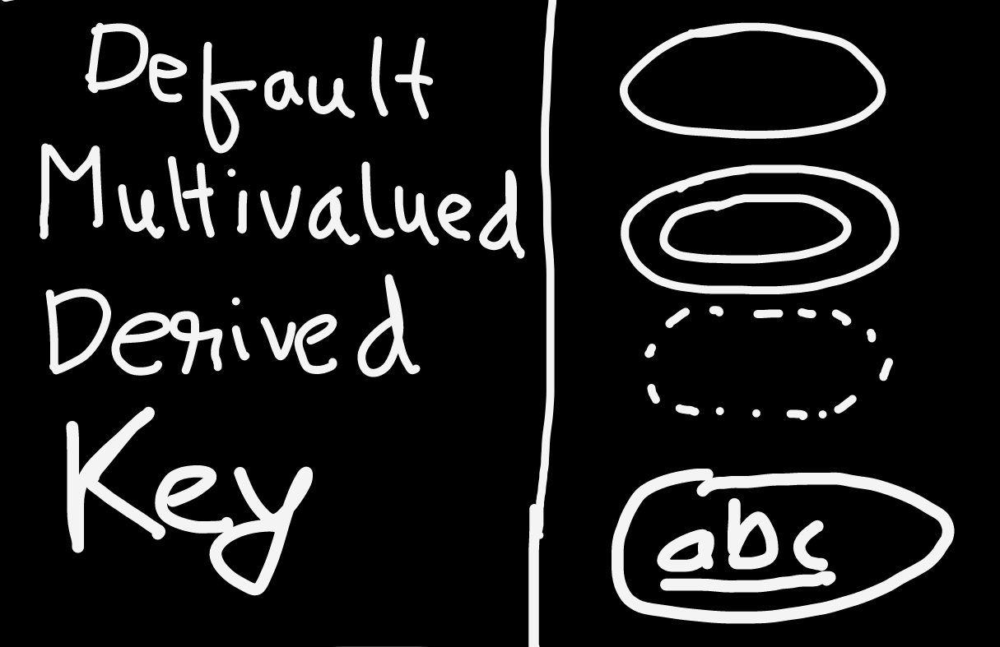
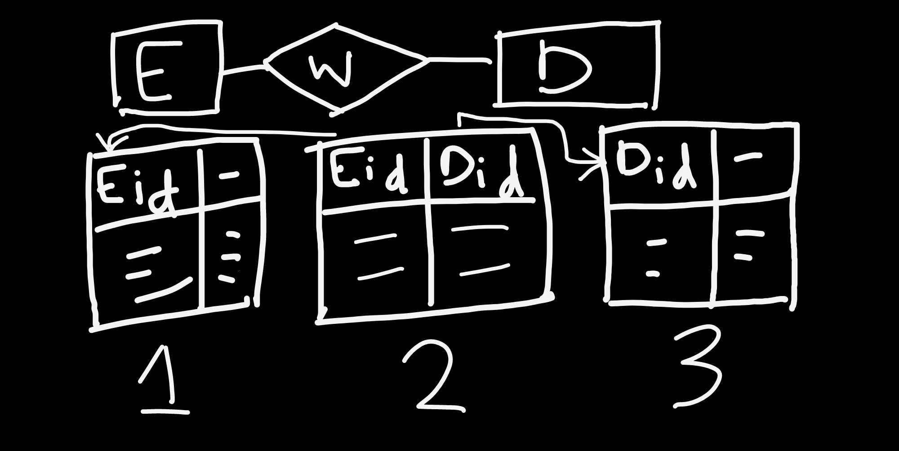

<!-- ID: 1 -->

# Questions


## qs-UGC_NET-2018
> Let $R_1 (a,b,c)$ and $R_2 (x,y,z)$ be 2 relations in which 'a' is a foreign key in $R_1$ that refers to the primary key (unspecified) of $R_2$. Consider 4 options:
1. Insert into $R_1$
1. Insert into $R_2$
1. Delete from $R_1$
1. Delete from $R_2$

Which of theses options is true?
- Option 'a' & 'c' will cause violation.
- Option 'b' & 'c' will cause violation.
- Option 'c' & 'd' will cause violation.
- **Option 'd' & 'a' will cause violation.**

Explanation:  Check 

<details>
  <summary>Explanation</summary>
  Check <a href="#referential-integrity">Referential Integrity </a> <br>
</details>

## qs-GATE-2005

> What is the minimum number of tables required to represent this E-R Model into Relational Model?
- 2
- **3**
- 4
- 5


<details>
  <summary>Explanation</summary>
  - 4 Tables are created, E1, E2, R1 & R2. <br>
  - R1: B becomes the primary key. Since E2 also has the same primary key, R1 can get merged with E2. <br>
  - R2: A+B together forms the primary key. It cannot be merged with any of the other 2 tables. <br>
    
</details>

# Basics

## Structured data
- Data that needs to be stored in a structured manner.
- Data stored in a RDB, ie a Relational Database, in the form of a relation/table. It is managed by a RDBMS.
- Users can operate on the data using DBMS/RDBMS. Possible operations: Insert, Add, Delete, Update.
- Examples: SQL Server, Oracle, MySQL, etc.

## Unstructured data: 
- Data that does not need to be stored in a particular pre-defined structure.
- Example: Websites, photos, videos, etc.

## File System vs DBMS
- Filesystems were used before DBMS existed.
- In 1970's, the user used to access data in their own system.
- Advantages of using databases & database management systems (`-`: filesystem, `+`: database):
    ```diff
    - Data is stored in 1 user's computer, and is only accessible by that particular user.
    + We have the data stored in a centralized server, and multiple users can access the data from anywhere (over the internet or other type of network).

    - Users need to download the full file even if they only want some specific data.
    + Users can send a query to the server to access only the data they need.

    - Users need to know the location of the file, to fetch it.
    + Users don't need to know details about the data ie where it is stored, how it is stored, etc. They can fetch the data just from sending a query.

    - Concurrency: In modern times, a lot of people access/update data from a server at the same time. File systems don't have any protocols to handle inconsistency & conflict during concurrent operations.
    + There are protocols in place to handle inconsistency & conflict during concurrent operations.

    - Security: Since filesystem is controlled by OS, there is no level-by-level control. No security protocols can be defined.
    + Role-based (hierarchical) security protocols are available, so different kinds of users are only allowed to access relevant data.
    
    - Redundancy: Multiple files with same content but different names, can be stored.
    + DBMS has various contraints to ensure we don't waste storage space by storing duplicate/redundant data. In ensures that only unique data can be stored.

    ```

## 2-Tier Architecture


Image taken from [here](https://i.ibb.co/hMXD29s/2-tier.png)

- Consists of multiple clients, directly interacting with a single database server.
- Clients have an interface which help them interact with the database server.
- Client connects to the database, sends the query, and fetches the information. Information can also be modified or deleted from the database server as needed.

```diff
+ Simple architecture.
+ Easy to maintain.
- Difficult to scale.
- Implementing security is difficult,because client is directly is interacting with the database serer.
```

## 3-Tier Architecture:


Image taken from [here](https://inui.io/wp-content/uploads/3-tier_architecture_2.jpg)

- 3 Layers: Client (Application) Layer > Application Server / Business Layer > Database Layer
- Clients have an interface which allows them to interact with the middleware application server. They don't directly connect to the database server.
- Database server does not get overwhelmed since the middleware server handles all the queries, so load on it is reduced.

```diff
+ Can be scaled.
+ Secure, since client is not directly interacting with the database server.
- More complex and difficult to maintain compared to 2-Tier architecture.
```

## Schema & 3-Schema Architecture



Image taken from [here](https://www.tutorialandexample.com/wp-content/uploads/2019/08/Three-Schema-Architecture-of-DBMS.png)

- Schema means the logical representation of data in the database. It tells us about the structure in which the data will be stored. We also get information about the elements in the structure, their size, etc.
- We're not interested in the physical representation of the data, ie how exactly they're stored in the database. We're only interested in a legible representation of the data.
- A 3-Schema architecture consists of 3 levels: View | Logical | Physical
- We see data in the form of a table, but it is actually stored in the form of files.

### 1: External Schema / View Level:
- Controlled by the Front-end Developer.
- Different types of users (student, faculty, etc.) have different views.
- Within a particular type, different users are shown different data, relevant to them, within the particular view.

### 2: Conceptual Schema / Logical Level:
- Controlled by the Database Designer.
- Can be called a blueprint of the structure.
- Stores information about the tables, and the data in the tables.
- Stores Relationships between the tables ie how they are connected.

### 3: Physical Schema / Physical Level:
- Controlled by the Database Administrator.
- Stores information about where the data is stored, how it is stored.
- Decides if data is centralized or de-centralized.

### Data Independence
- The actual data is shown to the user, but information about how it is stored, where it is stored, etc. is hidden.
- We don't show all the tables to the user, we only show the relevant information the user wants to see.
- The application program is not changed, since the user directly interacts with it and it used to the particular view.
- The objective is to make changes in the Conceptual and Physical Schema in such a way that the user (View Level) is not affected.

- **Logical Data Independence**:
    - Changes made in the Conceptual Schema don't affect the External Schema.
    - Example: The WebUI shown to an user is not affected even after making some changes to the Conceptual Schema of a database system.

- **Physical Data Independence**:
    - Changes made in the Physical Schema don't affect the Conceptual Schema or the External Schema.
    - Example: Changing file structure, physical storage, Indexing, etc don't affect the Conceptual Schema.

# Keys
- Any piece of data within a tuple in a database, can be called a key.
- Keys are of many types: Primary Key, Candidate Key, etc.

## Primary & Candidate Key
- Any key that can be used to uniquely identify data tuples (or rows) in a database, is called a primary key.
- The primary key must be unique. Also, it must not be wrong or have any default value.
- It must not be null.
- There must only be 1 primary key in a database table (in case of RDB).
- Usually, if there's a possibility that the user cannot provide the data for a primary key at this time, it is auto-generated and assigned to the user. For example, registration number, roll number, etc.

- The set of all possible keys that can be used as a primary key, is called Candidate Key.
- We can have keys who value is null, in the set of Candidate Keys. However, the `Unique` property must be maintained.
- Example:
    | Roll Number | Registration Number  |   SName   |  City  | Age | Phone Number  |
    |-------------|----------------------|-----------|--------|-----|---------------|
    |   101       |     REG2022001       |   Alice   |  Paris |  20 | 555-1234-5678 |
    |   102       |     REG2022002       |   Bob     |  London|  22 | 555-1234-5678 |
    |   103       |     REG2022003       |   Charlie |  Berlin|  21 | 555-3456-7890 |
    |   104       |     REG2022004       |   David   |  Tokyo |  23 |     null      |
    |   105       |     REG2022005       |   Emily   |  Rome  |  20 | 555-5678-9012 |
    - Here, the candidate keys are: <Roll No, Registration Number, Phone Number>
    - Among these, Phone number can be null, so it can't be used as a primary key. Any 1 of the other 2 can be used for the purpose.

## Foreign Key
- An attribute or set of attributes that references to `Primary Key` of the same table or another table.
- It maintains referential integrity.
- If 2 tables are related, there will be atleast 1 common column between them. However, it's not necessary for this column to have the same name in both the tables.
- Example:
    **Table 1**: Student Information
    | Roll No |   Name   |  Address  |
    |---------|----------|-----------|
    |   101   |  Alice   |   Paris   |
    |   102   |   Bob    |  London   |
    |   103   | Charlie  |  Berlin   |
    |   104   |  David   |   Tokyo   |

    **Table 2**: Course Information
    | Course ID | Course Name | Roll Number |
    |-----------|-------------|-------------|
    |    201    | Math        |     101     |
    |    202    | Science     |     102     |
    |    203    | English     |     103     |
    |    204    | History     |     104     |

    - Here, `Roll Number` of Table 2 is a foreign key, referencing `Roll No` in Table 1.
    - The names of the columns may or may not be unique.
    - SQL query for setting a foreign key during table creation:
        ```sql
        CREATE TABLE StudentInformation (
            RollNo INT PRIMARY KEY,
            Name VARCHAR(20),
            Address VARCHAR(20)
        );

        CREATE TABLE CourseInformation (
            CourseID INT PRIMARY KEY,
            CourseName VARCHAR(20),
            RollNumber INT,
            FOREIGN KEY (RollNumber) REFERENCES StudentInformation(RollNo)
        );
        ```

    - SQL query for setting a foreign key after table creation (CONSTRAINT name can be anything as it's the name of the constraint):
        ```sql
        ALTER TABLE CourseInformation
            ADD CONSTRAINT FK_StudentInfo_RollNo
            FOREIGN KEY (RollNumber) REFERENCES StudentInformation(RollNo);
        ```
### **Referential Integrity**

#### Integrity means consistency of the data across multiple tables. By preserving referential integrity, we aim to ensure consistency among the data across both the referenced (base) & referencing table.

- Now, let's check if INSERT, DELETE & UPDATE operations on either of the tables disturbs the Referential Integrity of the data.

- Example:
    **Referenced (Base) Table 1**: Student Information
    | Roll No |   Name   |  Address  |
    |---------|----------|-----------|
    |   101   |  Alice   |   Paris   |
    |   102   |   Bob    |  London   |
    |   103   | Charlie  |  Berlin   |
    |   104   |  David   |   Tokyo   |
    - Primary Key: `Roll No`

    **Referencing Table 2**: Course Information
    | Course ID | Course Name | Roll Number |
    |-----------|-------------|-------------|
    |    201    | Math        |     101     |
    |    202    | Science     |     102     |
    |    203    | English     |     103     |
    |    204    | History     |     104     |
    - Foreign Key: `Roll Number` REFERENCES `Roll No`.
    
- Operations performed on `Referenced (Base) Table 1`:
    - **INSERT**: No violation

    - **UPDATE**: Possible violation.
        - Updating the `Roll No` on `Table 1` can introduce inconsistency, because the tuple in `Table 2` that was referencing to it, now links to nothing.
        - Solution:
            1. Update manually: Recommended.
            1. $onUpdateCascade()$: When `Roll No` is updated, delete the corresponding row on `Table 2`. This can result in loss of data.
            1. $onUpdateSetNull()$: When `Roll No` is updated, set the `Roll Number` of the corresponding row on `Table 2`, to null. However, this may cause issues if the foreign key is also a primary key of `Table 2`.

    - **DELETE**: Possible violation.
        - We may accidentally delete a tuple whose `Roll No` has been referenced by `Table 2`.
        - Solution:
            1. No action: Do nothing, this is not recommended for obvious reasons.
            <!-- 1. $onDeleteCascade()$: When the tuple is deleted, delete the corresponding row on `Table 2`. This can result in loss of data. -->
            1. $onDeleteSetNull()$: When the tuple is deleted, set the `Roll Number` of the corresponding row on `Table 2`, to `null`.


- Operations performed on `Referencing Table 2`:
    - **INSERT**: Possible violation.
        - We cannot insert a tuple in this table with a `Roll Number` that doesn't reference to any tuple in `Table 1`.
        - Solution: Ensure that the corrensponding tuple exists in `Table 1`.

    - **UPDATE**: Possible violation.
        - Updating the foreign key, `Roll Number` on `Table 2` can introduce inconsistency, while it's fine to update other columns.
        - Solution:
            1. Before updating the foreign key, ensure that it's not referencing to any primary key in `Table 1`.

    - **DELETE**: No violation.

## Super Key
- It is a combination of all possible attributes which can uniquely identify 2 tuples in a table. We pair the candidate key with any other key, to uniquely identify the tuple.
- A super-set of any candidate key is called a super key.
- Example 0: IF $R(A_1,A_2,A_3,...A_n)$:
    - If $A_1$ is a candidate key, then how many super keys are possible?
        - Usually, per key, we have 2 choices. We can either include it in our set, or exclude it.
            > Total number of possible choices in general: $2^n$
        - But, here $A_1$ is said to be the candidate key, and must be included. For the rest, they may or may not be included.
            > Total number of possible choices: $2^{n-1}$
    - If $A_1$ & $A_2$ are candidate keys:
        - If we just take $A_1$, we have $2^{n-1}$ possible choices.
        - If we just take $A_2$, we have $2^{n-1}$ possible choices.
        - **However**, both these super sets will have some elements in common. For $A_1$ set, we will have elements which contain $A_2$ in them, and vice versa. So, we need to exclude them. We intend to exclude elements which contain both $A_1$ & $A_2$ in them, which is $2^{n-2}$.
            > Number of possible sets: $2^{n-1}+2^{n-1}-2^{n-2}$
    - If $A_1 A_2$ & $A_3 A_4$  are candidate keys:
        > Similarly, the number of possible sets: $2^{n-2}+2^{n-2}-2^{n-4}$

# Data Models
- Before implementing a database, we need to draw a logical design for the end-product. This design is called a data model.

## Entity Relationship Model
- Entity: Object which has some attributes.
- Relationship: Relationships among the entities.

### Attributes
Example: Student

1. Single: Attribute which has only 1 value.
    > Registration number.
1. Multivalued: has more than 1 values.
    > Mobile Number

<br>

1. Simple: cannot be broken further
    > Age
1. Composite: can be broken further
    > Name, cab be broken down into first name, middle name, last name <br>
    > Date of Birth, can be broken down into DD,MM,YY <br>
    > Address
1. Complex: Composite + Multivalued
    > Address, it is composite, and a single student can have multiple addresses too.

<br>

1. Stored: directly stored.
    > Date of Birth
1. Derived: derived from stored attribute.
    > Age, derived from Date of Birth.



<br>

1. Key: can be used as the Primary key in a database.
    > Registration number
1. Non-key: All keys other than the key attribute.
    > Name

<br>

1. Required: mandatorily needs to have a value.
    > Username, usually.
1. Optional: may not have a value.
    > Mobile number, usually.

### Relationships
#### One to One
- Representation: 1-1 | One-One
- Example:
    - 3 tables: `Employee`, `Work`, `Department`
        
    - In `Employee`: E_id is the primary key
    - In `Department` : D_id is the primary key
    - In the Relationship table, `Work`:
        - Foreign keys:
            - E_id: referencing to E_id of `Employee`.
            - D_id: referencing to D_id of `Department`.
        - Relationship (1-1): An employee only works in a single Department.
            - E_id: Value is unique
            - D_id: Value is unique
        - Primary Key: Either of the primary keys of the LHS or RHS table.
            > Any of `E_id` or `D_id`
    - We **can reduce** (merge) `Employee` & `Work` into a single `Employee` table. In fact, we can merge the Relationship table with either the LHS or the RHS table.

#### One to Many
- Representation: 1-M | One-Many
- Example:
    - 3 tables: `Customer`, `Places`, `Order`
    - In `Customer`: C_id is the primary key
    - In `Order` : O_no is the primary key
    - In the Relationship table, `Places`:
        - Foreign keys:
            - C_id: referencing to C_id of `Customer`.
            - O_no: referencing to O_no of `Order`.
        - Relationship (1-Many): A customer can place multiple orders.
            - C_id: Value can repeat
            - O_no: Value is unique
        - **Primary Key**: Primary key of the RHS table.
            > `O_no`, since `C_id` can repeat.
    - We **can merge** (reduce) `Places` & `Order` into a single `Order` table, ie we're merging the Relationship table with the RHS table.

#### Many to One
- Representation: M-1 | Many-One
- Example:
    - 3 tables: `Order`, `Placed-by`, `Customer`
    - In `Order` : O_no is the primary key
    - In `Customer`: C_id is the primary key
    - In the Relationship table, `Placed-by`:
        - Foreign keys:
            - O_no: referencing to O_no of `Order`.
            - C_id: referencing to C_id of `Customer`.
        - Relationship (Many-1): Many orders can be placed by a single customer.
            - O_no: Value is unique
            - C_id: Value can repeat
        - **Primary Key**: Primary key of the LHS table.
            > `O_no`, since `C_id` can repeat.
    - We **can merge** (reduce) `Placed-by` & `Order` into a single `Order` table, ie we're merging with the LHS table.

#### Many to Many
- Representation: M-N | Many-Many
- Example:
    - 3 tables: `Student`, `Study`, `Course`
    - In `Study` : RollNo is the primary key.
    - In `Course`: Cid is the primary key.
    - In the Relationship table, `Study`:
        - Foreign keys:
            - RollNo: referencing to RollNo of `Student`.
            - C_id: referencing to C_id of `Course`.
        - Relationship (May-Many): A student can take up multiple courses, and a course can be taken up by multiple students.
            - `RollNo`: Value can repeat
            - `C_id`: Value can repeat
        - **Primary Key**: A composite key, including both the primary keys from the LHS & RHS tables.
            > `RollNo + C_id`, since both `RollNo` & `C_id` can repeat.
    - We **cannot merge** (reduce) the tables.

# Normalization
- It is a method of removing or reducing redundancy ie duplicate values from a table.
- 2 rows cannot be exactly the same, since we have a primary key in every table. At the very least, the primary key column will be different. However, the other values may be partially or fully duplicated.
- There are 3 types of anamolies:
    > Anamoly: Error that only occurs under special circumstances.
    - Insertion
    - Deletion
    - Updation
- Example:
    | $S_{ID}$ | Sname   | C_ID | Cname    | F_ID | Fname  | Salary |
    |------|---------|------|----------|------|--------|--------|
    | 101  | Alice   | 201  | Math     | 301  | John   | 50000  |
    | 102  | Bob     | 202  | English  | 302  | Emily  | 55000  |
    | 103  | Charlie | 203  | Science  | 303  | Sarah  | 60000  |
    | 104  | Bob     | 202  | English  | 302  | Emily  | 55000  |
    | 105  | Emma    | 205  | Geography| 305  | Alex   | 58000  |

    - **Insertion Anamoly**: We cannot insert a new course in this table, unless there's also a student to take it up, and $S_{ID}$ is a primary key.
    - **Deletion Anamoly**: We can delete $S_{ID}=102$ safely without losing data because details for $C_{ID}=202$ & $F_{ID}=302$ is also present in other rows. But, if we delete $S_{ID}=105$, we may lose important information.
    - **Updation Anamoly**: Say we want to update the salary of faculty $F_{ID}=302$ ie Emily from $55000$ to $60000$. Now, since there is only 1 faculty with $F_{ID}=302$, the updation should only happen once. But, in reality, since there are multiple entries of $F_{ID}=302$, value $55000$ will be updated multiple times within the table (twice, in this example).
- Normalization aims to prevent these anamolies from happening.

## Functional Dependency
- X -> Y: means that X determines Y, or Y is determined by X.
    - X: Determinant
    - Y: Dependent Attribute
- Example:
    - X: Sid, Y: Sname, X -> Y
    1. VALID, data has been duplicated.
        |Sid|Sname|
        |---|---|
        |1|Ranjit|
        |1|Ranjit|
    1. VALID, they are different people.
        |Sid|Sname|
        |---|---|
        |1|Ranjit|
        |2|Ranjit|
    1. VALID, they are different people.
        |Sid|Sname|
        |---|---|
        |1|Ranjit|n which the left part is a proper subset of a candidate key and the right part is a non prime attribute.

So, for the same reason, if a dependency contains in the left part a proper subset of a candidate key plus a non-prime attribute, this does not fall under the Codd’s definition, meaning that it does not violate such definition.
        |2|Varun|
    1. INVALID, Sid cannot be same for different people.
        |Sid|Sname|
        |---|---|
        |1|Ranjit|
        |1|Varun|
- Types:
    - **Trivial**: Functional Dependencies where if (X -> Y), then Y is a subset of X. Also, they are always valid, because effectively, X is determining itself. Example: (Sname,Sid -> Sid).
    - **Non-Trivial**: Functional Dependencies where if (X -> Y), then Y is not a subset of X. Example: (Eid -> Ename).
- Properties: 
    - **Reflexivity**: If X & Y are Trivial Functional Dependencies (Y is a subset of X), then (X -> Y)
    - **Augmentation**: If (X -> Y), then (XZ -> YZ)
    - **Transitive**: If (X -> Y) & (Y -> Z), then (X -> Z)
    - **Union**:  If (X -> Y) & (X -> Z), then (X -> YZ)
    - **Decomposition**: If (X -> YZ), then (X -> Y) & (X -> Z). You cannot Decompose the left hand side.
    - **Composition**: If (X -> Y) & (Z -> W), then (XZ -> YW)
    - **Pseudotransitivity**: If (X -> Y) & (WY -> Z), then (WX -> Z)

## Closure Method
- A method to find candidate keys from functional dependencies (FDs).
- 2 methods:
    1. One by one: Examples 0,1
    1. More efficient: Example 2

- Example 0:
    - R=(ABCD) | FD = {A->B, B->C,C->D}
    - $A^+=ABCD$
    - $B^+=BCD$
    - $C^+=CD$
    - $D^+=D$
    - $AB^+=ABCD$, but cannot be considered because candidate keys should be minimal. However, it can be a [super key](#super-key).
    - Prime Attributes: $\{A\}$
    > These attributes can be used as a candidate key.
    - Non-Prime Attributes: $\{B,C,D\}$
    > These attributes cannot be used as a candidate key.
    - $A$ is included in $A^+$ because it will always determine it's own value.
   - Only attributes that determine the values of all attributes in the relation, can be the candidate key.

- Example 1:
    - R=(ABCD) | FD = {A->B, B->C,C->D,D->A}
    - $A^+=ABCD$
    - $B^+=BCDA$
    - $C^+=CDAB$
    - $D^+=DABC$
    - Prime Attributes: $\{A,B,C,D\}$
    - Non-Prime Attributes: $\{null\}$

- Example 2:
    - R=(ABCDE) | FD = {A->B, BC->D,E->C,D->A}
    1. Check the RHS of the functional dependencies: ${AB,D,C,A}$. `E` is missing, so assume that E will be a part of the candidate key.
    1. Start check from `n which the left part is a proper subset of a candidate key and the right part is a non prime attribute.

So, for the same reason, if a dependency contains in the left part a proper subset of a candidate key plus a non-prime attribute, this does not fall under the Codd’s definition, meaning that it does not violate such definition.A`:
        > $AE^+=\{AECBD\}$. Candidate Key Set: $\{AE\}$
    1. Check if `A` or `E` is in RHS: \[D->A\]. Check for `D`:
         > $DE^+=\{DEABC\}$. Candidate Key Set: $\{AE,DE\}$
    1. Check if `D` is in RHS: \[BC->D\]. Check for `B` & `C`:
         > $BE^+=\{BECDA\}$. Candidate Key Set: $\{AE,DE,BE\}$ <br>
         > $CE^+=\{CE\}$. Candidate Key Set: $\{AE,DE,BE\}$
    - So, in short, when we find a new candidate key, we search if that new attribute is also present in RHS of the FD. If it is, we check for the corresponding LHS attributes.

## First Normal form (1-NF)
- The table should not contain **multivalued attributes**.
- Example: Normalize this table to `1-NF` (Solution 3 is the one that works):
    |RollNo|Name|Course|
    |---|---|---|
    |1|Sai|C,C++|
    |2|Harsh|Java|
    |3|Onkar|C,DBMS|
    - Solution 1: Put only 1 course per row.
        |RollNo|Name|Course|
        |---|---|---|
        |1|Sai|C|               
        |1|Sai|C++|
        |2|Harsh|Java|
        |3|Onkar|C|
        |3|Onkar|DBMS|
        - Primary Key: `RollNo+Course`
        ```diff
        - Data Duplication
        ```
    - Solution 2: Divide the `Course` column:
        |RollNo|Name|Course 1|Course 2|
        |---|---|---|---|
        |1|Sai|C|C++|
        |2|Harsh|Java|null|
        |3|Onkar|C|DBMS|
        - Primary Key: `RollNo`
        - `null`: no value
        ```diff
        - If there are 2 columns for course & someone takes up a 3rd course, we have to add another column for `Course 3`.
        - For people who have only taken 1 course, we have to put the value for course 2,3,... n as `null`, which is not good practice.
        ```
    - **Solution 3**: Segregate into 2 tables.
        - Base Table
            |RollNo|Name|
            |---|---|
            |1|Sai|
            |2|Harsh|
            |3|Onkar|
            - Primary Key: `RollNo`
        - Referencing Table:
            |RollNo|Course|
            |---|---|
            |1|C|
            |1|C++|
            |2|Java|
            |3|C|
            |3|DBMS|
        - Primary Key: `RollNo+Course`
        - Foreign Key: `RollNo`, referencing to `RollNo`.

## Second Normal form (2-NF)
- Table must be in First Normal Form (1-NF).
- All the non-prime attributes must be fully functionally dependent on the Candidate Key. They must not be only partially dependent on a part of (ie a proper subset of) the Candidate Key.
- It's not a problem if both LHS and RHS are non-prime attributes.
- (AB -> C) should happen.
- If (AB -> C), AB is a candidate key (prime attribute) while C is a non-prime attribute. If (A -> C) or (B -> C) is true, then the table is not in 2-NF.
- Example:
    |Customer ID|Store ID|Location|
    |---|---|---|
    |1|1|Delhi|
    |1|3|Mumbai|
    |2|1|Delhi|
    |3|2|Bangalore|
    |4|3|Mumbai|
    - Primary Key: `Customer ID + Store ID`
    - Here, Location (non-prime attribute), is only dependent on one of the prime attributes (Store ID). So, it's not in `2-NF`.
    - So, we divide it into 2 tables.
    - Table 1 (no dependency problems):
        |Customer ID|Store ID|
        |---|---|
        |1|1|
        |1|3|
        |2|1|
        |3|2|
        |4|3|
    - Table 2 (Location is dependent on the only prime attribute, `Store ID`):
        |Store ID|Location|
        |---|---|
        |1|Delhi|
        |2|Bangalore|
        |3|Mumbai|
- Example 1:
    - $R=\{A,B,C,D,E,F\}$, FD: {C->F, E->A, EC->D, A->B}
    1. Here, C & E are not present in the RHS of the functional dependencies. So, let's check for $CE^+$.
    1. $CE^+={CEAFDB}$
    1. Candidate Key: CE
    1. None of C,E are present in the RHS of the functional dependencies, so {CE} is the only candidate key.
    1. Prime attributes: $\{C,E\}$
    1. Non-Prime attributes: $\{A,B,D,F\}$
    1. Here,because C->F, E->A, we can clearly see the C & E by tehmselves are determining a non-prime attribute. So, table is not in `2-NF`.

## Third Normal form (3-NF)
- Table must be in Second Normal Form (2-NF).
- Table must not have any Transitive Dependency. For (X->Y), `X` should be a Candidate Key, **or** `Y` should be a prime attribute.
- If AB -> CD, and D -> A:
    - Candidate Keys: {AB,DB}
    - Prime Attributes: {A,B,D}
    - Non-prime Attributes: {C)
    - Among the Functional Dependencies, none have any Transitive Dependency.

## Boyce Codd Normal Form (BCNF)
- A special case of 3rd Normal Form.
- Table must be in Third Normal Form (3-NF).
- The left hand side of each functional dependency should be a candidate key or super key.
- 3-NF preserves dependencies, but BCNF does not.
- However, BCNF ensures Lossless Decomposition.
- Example 0:
    - Candidate Keys: {RollNo, VoterID}
    - Functional Dependencies:
        - RollNo -> Name
        - RollNo -> VoterID
        - VoterID -> Age
        - VoterID -> RollNo
    - All are valid, since the LHS attributes are all prime attributes.
- Example 1: R(ABCD)
    - AB -> CD
    - D -> A
    1. Candidate Keys: {AB,DB}
    1. Prime Attributes: {A,B,D}
    1. Non-Prime Attributes: {C}
    1. Here, in {D -> A}, `D` is not a candidate key. So the table is **not** in BCNF. Let's convert it into BCNF.
    1. We separate DA since {D -> A} was the problem.
    1. We also separate BCD.
    1. So, ABCD -> DA,BCD
    1. Lossless Decomposition: The attribute that is common to both tables will be the candidate key of the tables individually, or both of them.
    1. Now, generate the Functional Dependencies: D -> A, BD -> C.
    1. Here, {AB -> CD} is not preserved. So, the fact that BCNF does not preserve dependencies, is proved.

## 4th Normal Form (4-NF)
- Table must be in Boyce Codd Normal Form.
- No multivalued dependencies must be present.
- Example:
    - If a person has 3 mobile numbers and 3 E-Mail ID's, this is what the table will look like:
        |Name|Mobile Number|E-Mail|
        |----|-------------|------|
        |John|1111111111|aa@aa.com|
        |John|1111111111|bb@bb.com|
        |John|1111111111|cc@cc.com|
        |John|2222222222|aa@aa.com|
        |John|2222222222|bb@bb.com|
        |John|2222222222|cc@cc.com|
        |John|3333333333|aa@aa.com|
        |John|3333333333|bb@bb.com|
        |John|3333333333|cc@cc.com|
    - Our main with Normalization is to reduce redundancy in the data, so we must not have any multivalued dependency like this.

## 5th Normal Form (5-NF)
- The Decomposition must be Lossless in nature.
- If, after joining the tables to get back the original table, we see that the Decomposition was Lossless, we can be sure that the table is in 5-NF.
- There will be no difference between the tuples in our table and the original table.

# Decomposition
- Lossy Decomposition: Decomposition that leads to inconsistency in data.
- When Decomposing a table, the common attribute should be the candidate key of either of the tables, or both of them. This ensures Lossless Decomposition.
- Example 0 (Lossy Decomposition):
    - Table $R$:
        |A|B|C|
        |-|-|-|
        |1|2|1|
        |2|2|2|
        |3|3|2|
    - Table $R_1$:
        |A|B|
        |-|-|
        |1|2|
        |2|2|
        |3|3|
    - Table $R_2$:
        |B|C|
        |-|-|
        |2|1|
        |2|2|
        |3|2|
    - Question: Find the value of `C` if `A: 1`.
    - Query: Select $R_2C\ from\ R_2\ NATURAL\ JOIN\ R_1, WHERE\ R_1 A=1$
    1. First, find the cross product of all rows of the tables.
        |A|B|B|C|
        |-|-|-|-|
        |1|2|2|1|
        |1|2|2|2|
        |1|2|3|2|
        |2|2|2|1|
        |2|2|2|2|
        |2|2|3|2|
        |3|3|2|1|
        |3|3|2|2|
        |3|3|3|2|
    1. Remove the rows where the value of `B` is different.
        |A|B|B|C|
        |-|-|-|-|
        |1|2|2|1|
        |1|2|2|2|
        |2|2|2|1|
        |2|2|2|2|
        |3|3|3|2|
    1. The Natural Join table is:
        | A | B | C |
        |---|---|---|
        | 1 | 2 | 1 |
        | 1 | 2 | 2 |
        | 2 | 2 | 1 |
        | 2 | 2 | 2 |
        | 3 | 3 | 2 |
    1. We can clearly see that `C` is resolving to 1 & 2 for A=1.
    1. We can also see that the number of rows is more in this table, compared to the original table `R`.
    1. The extra tuples are called `Spurious Tuples`.
- Example 1 (Lossless Decomposition):
    - Table $R$:
        |A|B|C|
        |-|-|-|
        |1|2|1|
        |2|2|2|
        |3|3|2|
    - Table $R_1$:
        |A|B|
        |-|-|
        |1|2|
        |2|2|
        |3|3|
    - Table $R_2$:
        |A|C|
        |-|-|
        |1|1|
        |2|2|
        |3|2|
    - As we see, there are no `Spurious Tuples` when using `A` as the common attribute, following the above rule.

    - Example 1: Check if Functional Dependencies are preserved:
        - R(ABCD)
        - Functional Dependencies: { A->B, B->C, C->D, D->B }
        - R is decomposed into $R_1(AB)$, $R_2(BC)$, $R_1(BD)$.
        1. Check if any attributes have been left out in the decomposed tables: false, they're intact.
        1. Check for all possible **non-trivial** dependencies of the decomposed tables, with respect to the original Functional Dependencies: 
            |$R_1(AB)$|$R_2(BC)$|$R_3(BD)$|
            |-----|-----|-----|
            |{A->B}|{B->C}|{B->D}|
            |~~{B->A}~~|{C->B}|{D->B}|
        1. So, dependencies are: { A->B, B->C, B->D, C->B, D->B }.
        1. Now, check if these dependencies include all the ones in the original Functional Dependency.
            - { A->B }: true 
            - { B->C }: true
            - { C->D }: true
            - { D->B }: true
        1. So, functional dependencies are preserved.
    - Example 2: Check if Functional Dependencies are preserved:
        - R(ABCD)
        - Functional Dependencies: { AB->CD, D->A }
        - R is decomposed into $R_1(AD)$, $R_2(BCD)$
        1. Check if any attributes have been left out in the decomposed tables: false, they're intact.
        1. Check for all possible **non-trivial** dependencies of the decomposed tables, with respect to the original Functional Dependencies: 
            |$R_1(AD)$|$R_2(BCD)$|
            |-----|-----|
            |~~{A->D}~~|~~{B->C}~~|
            |{D->A}|~~{C->D}~~|
            | null |~~{D->B}~~|
            | null |~~{BC->D}~~|
            | null |~~{CD->B}~~|
            | null |{BD->C}|
        1. So, dependencies are: { D->A, BD->C }
        1. Now, check if these dependencies include all the ones in the original Functional Dependency.
            - { AB->CD }: false
            - { D->A }: true
        1. So, functional dependencies are not preserved.

## Minimal Cover
- The aim is to reduce or simplify the Functional Dependencies.
- Example: For the following Functional Dependencies, find the correct Minimal Cover: {A->B,C->B,D->ABC,AC->D}
    1. Simplify the dependencies: {A->B,C->B,D->A,D->B,D->C,AC->D}
    1. Remove the functional dependencies one by one, and check if that results in loss of dependencies (false: cannot be removed).
        1. (A->B), $A^+=A$, false
        1. (C->B), $C^+=C$, false
        1. (D->A), $D^+=DBC$, false
        1. (D->B), $D^+=DABC$, true
        1. (D->C), $D^+=DAB$, false
        1. (AC->D), $AC^+=ACB$, false
    1. Only (D->B) can be removed.
    1. So, current dependencies: {A->B,C->B,D->A,D->C,AC->D}
    1. Now, check if the left side of the dependencies can be minimized further. Try to keep only 1 attribute on the LHS, and see if you can get the other attributes in it's closure.
        1. (AC->D), $A^+=AB$, $C^+=CB$, false
        1. After removing A, we're trying to get $A$ in $C^+$, and after removing C, we're trying to get $C$ in $A^+$.
     1. **Minimal list of Dependencies**: {A->B,C->B,D->A,D->C,AC->D}

## Normalization Examples
- Example 0: $R(ABCDEF)$, Functional Dependencies: $\{AB->C,C->DE,E->F,F->A\}$, **Check the highest Normal Form.**
    1. Find the Candidate Keys.
        1. $\{AB^+=ABCDEF\}$, true
        1. `A` is present in RHS for (F->A). So, $\{FB^+=FBACDE\}$, true
        1. `F` is present in RHS for (E->F). So, $\{EB^+=EBFACD\}$, true
        1. `E` is present in RHS for (C->DE). So, $\{CB^+=CBDEFA\}$, true
        1. `C` is present in RHS for (AB->C), but `AB` has already been defined.
        1. Candidate Keys: $\{AB,FB,EB,CB\}$
    1. Note the Prime Attributes: $\{A,B,C,E,F\}$
    1. Note the Non-Prime Attributes: $\{D\}$
    1. Check for  Normal Form (1: valid):
        |Normal Form|AB->C|C->DE|E->F|F->A|
        |-----------|:---:|:---:|:--:|:--:|
        |BCNF|1|0|0|0|
        |3-NF|1|0|1|1|
        |2-NF|1|0|1|1|
        |1-NF|1|1|1|1|
        - Check in reverse order, starting with `BCNF`.
        - For `1-NF`, whether the attributes are multivalued or not cannot be determined, so we assume that the table is atleast in `1-NF`.
- Example 1: $R(ABCDEF)$, Functional Dependencies: $\{AB->C,C->D,C->E,E->F,F->A\}$, Convert the table to BCNF.
    - Candidate Keys: $\{AB,FB,EB,CB\}$
    - Prime Attributes: $\{A,B,C,E,F\}$
    - Non-Prime Attributes: $\{D\}$
    - Functional Dependencies: $\{AB->C,C->D,C->E,E->F,F->A\}$
    1. Check for 1-NF: We cannot check for atomicity here, since we need the attribute values to do so. We assume that the table is already in 1-NF.
    1. Check for 2-NF:
        - (AB->C): true
        - (C->D): false
        - (C->E): true
        - (E->F): true
        - (F->A): true
        - In (C->D), a non-prime attribute is being determined by a part of the candidate key.
        1. Divide the table into two. Separate the dependency that is causing a problem.
        1. $R_1=ABEF$, $R_2=CD$
        1. Here, we need to have atleast 1 variable common.
        1. In $R_2$, $C^+=CD$ ie C is a candidate key. So, we can use C as a common variable.
        1. $R_1=ABCEF=\{AB->C,C->E,E->F,F->A\}$, $R_2=CD=\{C->D\}$
    1. Check for 3-NF:
        1. $R_1$, Candidate Keys: {AB,FB,EB,CB}:
            - (AB->C): true
            - (C->E): true
            - (E->F): true
            - (F->A): true
        1. $R_2$, Candidate Keys: {C}:
            - (C->D): true 
    1. Check for BCNF:
        1. $R_1$, Candidate Keys: {AB,FB,EB,CB}:
            - (AB->C): true
            - (C->E): false 
            - (E->F): false 
            - (F->A): false 
        1. $R_2$, Candidate Keys: {C}:
            - (C->D): true 
        1. We have to Decompose $R_1$.
            - $R_3=(AB->C)=ABC$, Candidate Key: {AB} (from existing)
            - $R_4=(C->E)=CE$, Candidate Key: {C}
            - $R_5=(E->F)=EF$, Candidate Key: {E}
            - $R_6=(F->A)=FA$, Candidate Key: {F}
- Example 2: Which of the following statement is true?
    - A relation is in `3-NF`, then it is always in `BCNF`.
    - A relation is in `2-NF`, then it is not in `1-NF`.
    - **A relation is in `BCNF`, then it is in `2-NF`**.
    - A relation is in `2-NF`, it contains partial dependencies.
- Example 3: Relation `R` has 8 attributes, $R=ABCDEFGH$. Functional Dependencies: $\{CH->G,A->BC,B->CFH,E->A,F->EG\}$
    1. `D` is not present in `RHS`.
    1. $DA^+=DABCFHGE$ | Candidate Keys: $\{DA\}$
    1. `A` is on the RHS of (E->A). Check for `E`.
    1. $DE^+=DEABCFHG$ | Candidate Keys: $\{DA,DE\}$
    1. `E` is on the RHS of (F->EG). Check for `F`.
    1. $DF^+=DFEGABCH$ | Candidate Keys: $\{DA,DE,DF\}$
    1. `F` is on the RHS of (B->CFH). Check for `B`.
    1. $DB^+=DBCFHEGA$ | Candidate Keys: $\{DA,DE,DF,DB\}$
    1. So, total number of candidate keys: $4$.
- Example 3: Check the highest Normal Forms for these tables:
    - Schema 1:
        - Registration (<u>rollno</u>, courses)
        - Functional Dependencies: {rollno -> courses}
        1. **BCNF**:
            - { rollno -> courses }: true
    - Schema 2:
        - Registration (<u>rollno</u>, <u>courseid</u>, email)
        - Functional Dependencies: {rollno, courseid -> email, email -> rollno}
        1. BCNF:
            - { rollno,courseid -> email }: true
            - { email -> rollno }: false
        1. **3-NF**:
            - { rollno,courseid -> email }: true
            - { email -> rollno }: true
    - Schema 3:
        - Registration (<u>rollno</u>, <u>courseid</u>, marks, grade)
        - Functional Dependencies: {rollno,courseid -> marks, grade, marks -> grade}
        1. BCNF:
            - { rollno, courseid -> marks, grade }: true
            - { marks -> grade }: false
        1. 3-NF:
            - { rollno, courseid -> marks, grade }: true
            - { marks -> grade }: false
        1. **2-NF**:
            - { rollno, courseid -> marks, grade }: true
            - { marks -> grade }: true
    - Schema 4:
        - Registration (<u>rollno</u>, <u>courseid</u>, credit)
        - Functional Dependencies: {rollno, courseid -> credit, courseid -> credit}
        1. BCNF:
            - { rollno, courseid -> credit }: true
            - { courseid -> credit }: false
        1. 3-NF:
            - { rollno, courseid -> credit }: true
            - { courseid -> credit }: false
        1. 2-NF:
            - { rollno, courseid -> credit }: true
            - { courseid -> credit }: false
        1. **1-NF**:
            - { rollno, courseid -> credit }: true (assumed)
            - { courseid -> credit }: true (assumed)

    ## Equivalence of Functional Dependency
    - If the closure of all attributes are same between 2 Functional Dependencies, we can say that they are equivalent to each other.
    - Example 0:
        - X = { A->B, B->C}
        - Y = { A->B, B->C, A->C}
        1. Take the LHS attributes of `Y` one by one, form the closure from `X`, match with `Y`:
            - $A^+=ABC$: true
            - $B^+=BC: true
        1. Take the LHS attributes of `X` one by one, form the closure from `Y`, match with `X`:
            - $A^+=ABC$: true
            - $B^+=BC: true
        1. Since both match, `X` is equivalent of `Y`.
    - Example 1:
        - X = { AB->CD, B->C, C->D }
        - Y = { AB->C, AB->D,C->D }
        1. Take the LHS attributes of `Y` one by one, form the closure from `X`, match with `Y`:
            - $AB^+=ABCD$: true
            - $C^+=CD$: true
        1. Take the LHS attributes of `X` one by one, form the closure from `Y`, match with `X`:
            - $AB^+=ABCD$: true
            - $B^+=BCD$: false
            - $C^+=CD$: true
        1. `X` is not equivalent of `Y`.

# Joins
## Natural Join / Inner Join
- Joined table only contains rows **where the primary key & foreign key are equal**.
- Table `emp`:
    |Eno|Ename|Address|
    |---|-----|-------|
    |1  |Alice|123 Main St|
    |2  |Bob  |456 Elm St|
    |3  |Charlie|789 Oak St|    
    |4  |David|321 Maple St|
    |5  |Eve|654 Pine St|
- Table `dept`:
    |DEPTno|Name   |Eno|
    |------|-------|---|
    |101   |Sales  |1  |
    |102   |HR     |2  |
    |103   |IT     |3  |
    |104   |Finance|4  |
    |105   |Marketing|5|
- Cross Product (every row of `emp` is multiplied with the whole of `dept`):
    |Eno|Ename|Address    |DEPTno|Name      |Eno|
    |---|-----|-----------|------|----------|---|
    |1  |Alice|123 Main St|101   |Sales     |1  |
    |1  |Alice|123 Main St|102   |HR        |2  |
    |1  |Alice|123 Main St|103   |IT        |3  |
    |1  |Alice|123 Main St|104   |Finance   |4  |
    |1  |Alice|123 Main St|105   |Marketing |5  |
    |2  |Bob  |456 Elm St |101   |Sales     |1  |
    |2  |Bob  |456 Elm St |102   |HR        |2  |
    |2  |Bob  |456 Elm St |103   |IT        |3  |
    |2  |Bob  |456 Elm St |104   |Finance   |4  |
    |2  |Bob  |456 Elm St |105   |Marketing |5  |
    |3  |Charlie|789 Oak St|101   |Sales     |1  |
    |3  |Charlie|789 Oak St|102   |HR        |2  |
    |3  |Charlie|789 Oak St|103   |IT        |3  |
    |3  |Charlie|789 Oak St|104   |Finance   |4  |
    |3  |Charlie|789 Oak St|105   |Marketing |5  |
    |4  |David|321 Maple St|101   |Sales     |1  |
    |4  |David|321 Maple St|102   |HR        |2  |
    |4  |David|321 Maple St|103   |IT        |3  |
    |4  |David|321 Maple St|104   |Finance   |4  |
    |4  |David|321 Maple St|105   |Marketing |5  |
    |5  |Eve  |654 Pine St|101   |Sales     |1  |
    |5  |Eve  |654 Pine St|102   |HR        |2  |
    |5  |Eve  |654 Pine St|103   |IT        |3  |
    |5  |Eve  |654 Pine St|104   |Finance   |4  |
    |5  |Eve  |654 Pine St|105   |Marketing |5  |
- Example 0: Select Ename from `emp` natural join `dept`
    - Explanation: Select Ename from emp,dept where emp.Eno=dept.Eno
    - Values:
        |Eno|Ename|Address    |DEPTno|Name      |Eno|
        |---|-----|-----------|------|----------|---|
        |1  |Alice|123 Main St|101   |Sales     |1  |
        |2  |Bob  |456 Elm St |102   |HR        |2  |
        |3  |Charlie|789 Oak St|103   |IT        |3  |
        |4  |David|321 Maple St|104   |Finance   |4  |
        |5  |Eve  |654 Pine St|105   |Marketing |5  |
    - Answer: `Alice, Bob, Charlie, David, Eve`

## Self Join
- Here, we join a table with itself.
- Example 0: Select Sid from study as t1, study as t2 where t1.Sid=t2.Sid and t1.Cid < > t2.Cid
    - Explanation: Select Sid, where student has taken up atleast 2 courses. { < > means not equal }
    - Table `study`:
        |Sid|Cid|Since|
        |---|---|-----|
        |$S_1$|$C_1$|2016|
        |$S_2$|$C_2$|2017|
        |$S_1$|$C_2$|2017|

    - Cross-Product (with itself):
        |Sid|Cid|Sid|Cid|Since|
        |---|---|---|---|-----|
        |$S_1$|$C_1$|$S_1$|$C_1$|2016|
        |$S_1$|$C_1$|$S_2$|$C_2$|2017|
        |$S_1$|$C_1$|$S_1$|$C_2$|2017|
        |$S_2$|$C_2$|$S_1$|$C_1$|2016|
        |$S_2$|$C_2$|$S_2$|$C_2$|2017|
        |$S_2$|$C_2$|$S_1$|$C_2$|2017|
        |$S_1$|$C_2$|$S_1$|$C_1$|2016|
        |$S_1$|$C_2$|$S_2$|$C_2$|2017|
        |$S_1$|$C_2$|$S_1$|$C_2$|2017|
    - Values:
        |Sid|Cid|Sid|Cid|Since|
        |---|---|---|---|-----|
        |$S_1$|$C_1$|$S_1$|$C_2$|2017|
        |$S_1$|$C_2$|$S_1$|$C_1$|2016|
    - Answer: `Sid`

## Equi & Non-Equi Join
- Table `emp`:
    |Eno|Ename|Address|
    |---|-----|-------|
    |1  |Alice|123 Main St|
    |2  |Bob  |456 Elm St|
    |3  |Charlie|789 Oak St|    
    |4  |David|321 Maple St|
    |5  |Eve|654 Pine St|
- Table `dept`:
    |DEPTno|Location    |Eno|
    |------|------------|---|
    |101   |123 Main St |1  |
    |102   |456 Elm St  |2  |
    |103   |789 Oak St  |3  |
    |104   |777 Maple St|4  |
    |105   |654 Pine St |5  |

- Cross Product (every row of `emp` is multiplied with the whole of `dept`):
    |Eno|Ename  |Address    |DEPTno|Location    |Eno|
    |---|-------|-----------|------|------------|---|
    |1  |Alice  |123 Main St|101   |123 Main St |1  |
    |1  |Alice  |123 Main St|102   |456 Elm St  |2  |
    |1  |Alice  |123 Main St|103   |789 Oak St  |3  |
    |1  |Alice  |123 Main St|104   |777 Maple St|4  |
    |1  |Alice  |123 Main St|105   |654 Pine St |5  |
    |2  |Bob    |456 Elm St |101   |123 Main St |1  |
    |2  |Bob    |456 Elm St |102   |456 Elm St  |2  |
    |2  |Bob    |456 Elm St |103   |789 Oak St  |3  |
    |2  |Bob    |456 Elm St |104   |777 Maple St|4  |
    |2  |Bob    |456 Elm St |105   |654 Pine St |5  |
    |3  |Charlie|789 Oak St |101   |123 Main St |1  |
    |3  |Charlie|789 Oak St |102   |456 Elm St  |2  |
    |3  |Charlie|789 Oak St |103   |789 Oak St  |3  |
    |3  |Charlie|789 Oak St |104   |777 Maple St|4  |
    |3  |Charlie|789 Oak St |105   |654 Pine St |5  |
    |4  |David  |321 Maple St|101   |123 Main St |1  |
    |4  |David  |321 Maple St|102   |456 Elm St  |2  |
    |4  |David  |321 Maple St|103   |789 Oak St  |3  |
    |4  |David  |321 Maple St|104   |777 Maple St|4  |
    |4  |David  |321 Maple St|105   |654 Pine St |5  |
    |5  |Eve    |654 Pine St |101   |123 Main St |1  |
    |5  |Eve    |654 Pine St |102   |456 Elm St  |2  |
    |5  |Eve    |654 Pine St |103   |789 Oak St  |3  |
    |5  |Eve    |654 Pine St |104   |777 Maple St|4  |
    |5  |Eve    |654 Pine St |105   |654 Pine St |5  |

- **Equi Join**: Condition checks are for equality.
    - Query: Select Ename from emp,dept where emp.Eno=dept.Eno and emp.Address=dept.Location
    - Explanation: Select Ename where the address & locations match in both tables.
    - Filtered table:
        |Eno|Ename  |Address    |DEPTno|Location    |Eno|
        |---|-------|-----------|------|------------|---|
        |1  |Alice  |123 Main St|101   |123 Main St |1  |
        |2  |Bob    |456 Elm St |102   |456 Elm St  |2  |
        |3  |Charlie|789 Oak St |103   |789 Oak St  |3  |
        |5  |Eve    |654 Pine St |105   |654 Pine St |5  |
    - Answer: `Alice`, `Bob`, `Charlie`, `Eve`

- **Non-Equi Join**: Condition checks are for in-equality.
    - Query: Select Ename from emp,dept where emp.Eno=dept.Eno and dept.DEPTno>102
    - Explanation: Select Ename where the DEPTno is greater than 102.
    - Filtered table:
        |Eno|Ename  |Address    |DEPTno|Location    |Eno|
        |---|-------|-----------|------|------------|---|
        |3  |Charlie|789 Oak St |103   |789 Oak St  |3  |
        |4  |David  |321 Maple St|104   |777 Maple St|4  |
        |5  |Eve    |654 Pine St |105   |654 Pine St |5  |

## Left-Outer, Right-Outer & Full-Outer join
- Table `emp`:
    |EMPno|Ename  |DEPTno|
    |------|-----|------|
    |101   |Alice |101   |
    |102   |Bob   |102   |
    |103   |Charlie|101  |
    |104   |David |104   |
- Table `dept`:
    |DEPTno|Dname     |Loc       |
    |------|----------|----------|
    |101   |Sales     |New York  |
    |102   |HR        |Los Angeles|
    |103   |IT        |Chicago   |
    |104   |Finance   |San Francisco|
    |105   |Marketing |Boston    |

- **Left-Outer Joined Table**:
    - Keeping the primary & foreign key equal, it gives all the rows in the left table, and corresponding rows in the right table.
    - Query: Select EMPno, Ename, DEPTno, Dname, Loc from emp left outer join dept on (emp.DEPTno=dept.DEPTno)
    - Table:
        |EMPno|Ename  |DEPTno|Dname     |Loc       |
        |------|-------|------|----------|----------|
        |101   |Alice  |101   |Sales     |New York  |
        |102   |Bob    |102   |HR        |Los Angeles|
        |103   |Charlie|101   |Sales     |New York  |
        |104   |David  |104   |Finance   |San Francisco|
- **Right-Outer Joined Table**:
    - Query: Select EMPno, Ename, DEPTno, Dname, Loc from emp right outer join dept on (emp.DEPTno=dept.DEPTno)
    - Keeping the primary & foreign key equal, it gives all the rows in the right table, and corresponding rows in the left table.
    - Table:
        |DEPTno|Dname     |Loc       |EMPno|Ename  |
        |------|----------|----------|------|-----|
        |101   |Sales     |New York  |101|Alice|
        |101   |Sales     |New York  |103|Charlie|
        |102   |HR        |Los Angeles|102|Bob|
        |103   |IT        |Chicago   |null|null|
        |104   |Finance   |San Francisco|104|David|
        |105   |Marketing |Boston    |null|null|
- **Full-Outer Joined Table**:
    - Query: Select EMPno, Ename, DEPTno, Dname, Loc from emp full outer join dept on (emp.DEPTno=dept.DEPTno)
    - Table:
        |EMPno|Ename  |DEPTno|Dname     |Loc       |
        |------|-----|------|----------|----------|
        |101   |Alice |101   |Sales|New York|
        |102   |Bob   |102   |HR|Los Angeles|
        |103   |Charlie|101  |Sales|New York|
        |104   |David |104   |Finance|San Francisco|
        |null|null|103|IT|Chicago|
        |null|null|105|Marketing|Boston|


        


    


<!-- Last image: self/2.png | external/2.png -->
