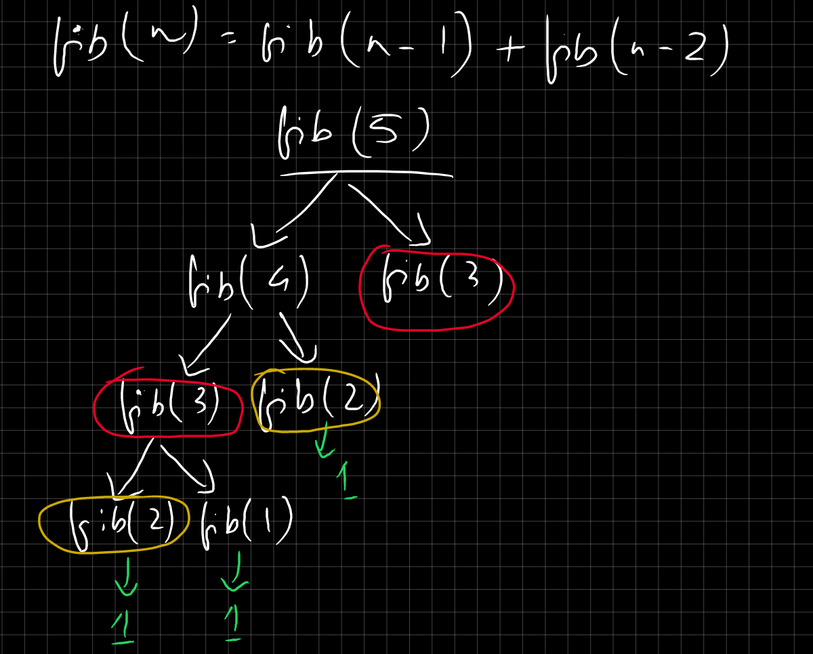
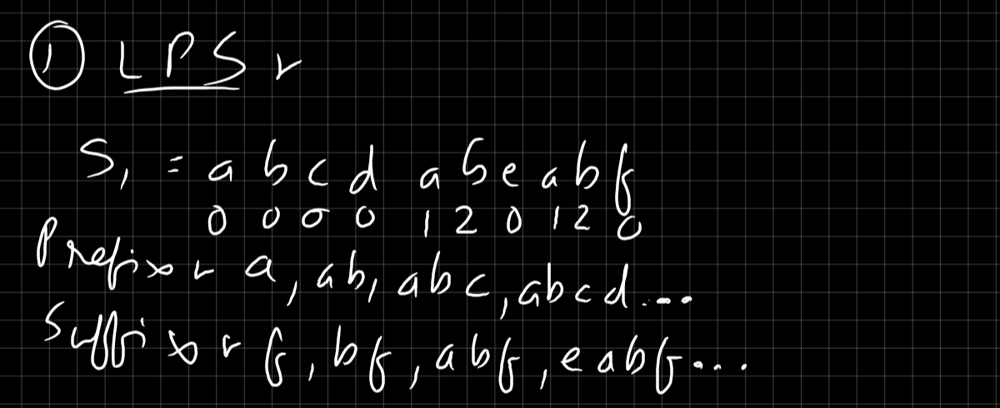

# Basic
- **What is an algorithm?** It is a sequence of unambiguous instructions for solving a problem ie for obtaining the required output for a legitimate input in a finite amount of time. 
- Properties of a Computer Algorithm:
    - **Finiteness**: An algorithm must always terminate after a finite number of steps. It should not run indefinitely.
    - **Definiteness**: Each step of the algorithm must be precisely defined. The instructions should be clear and unambiguous.
    - **Input**: An algorithm should have zero or more inputs. These are the values that are fed into the algorithm before it begins processing.
    - **Output**: An algorithm must produce one or more outputs. These are the results of the algorithm's processing.
    - **Effectiveness**: The steps of the algorithm must be basic enough to be performed, in principle, by a person using paper and pencil. They should be simple and feasible.
- Some important terms:
    - **Precondition**: A precondition is a condition or set of conditions that must be true before a function or a process is executed. It defines the state of the system or the variables before the execution starts. If the precondition is not met, the behavior of the function or process is undefined.
    - **Assertion**: An assertion is a statement that a certain condition is true at a specific point in the execution of a program. Assertions are used as a debugging aid to check for correctness. If an assertion fails (the condition is not true), it typically results in an error or exception, signaling that something went wrong in the program.
    - **Postcondition**: A postcondition is a condition or set of conditions that must be true after a function or process has executed. It defines the expected state of the system or the variables after the execution is completed. Postconditions are used to verify that the function or process has correctly performed its task.
    - **Loop Invariant**:A loop invariant is a condition that holds true before and after each iteration of a loop. Loop invariants are used to reason about the correctness of loops, particularly in the context of program verification and algorithm analysis. They help ensure that the loop is functioning as intended and will lead to the desired postcondition once the loop terminates.
        - Properties of a Loop Invariant:
            - **Initialization**: The invariant must be true before the first iteration of the loop starts.
            - **Maintenance**: If the invariant is true before an iteration of the loop, it must remain true after the iteration.
            - **Termination**: When the loop terminates, the invariant, combined with the loop's exit condition, should provide a useful property that helps prove the correctness of the algorithm.

## Algorithm Analysis
### The process of comparing two algorithms with respect to time, space, etc.
- Priori analysis:
    - Analyzing before execution, is not dependent on hardware.
    - We count the number of times a line of code executes.
    - Preferred, because it has an uniform value.
    - We use Asymptotic notation, like Big O to denote the time complexity.
- Posteriori Analysis:
    - Analyzing after execution, is dependent on hardware.
    - We determine the amount of time an algorithm takes to execute on a particular hardware platform.

## Asymptotic Notation
- Also check: [Algorithm Analysis](algorithm-analysis)
- It is a mathematical way of representing the time complexity.
- Example: Let's take the example of a notebook.
    - Best-case: I find the topic right on the first page, just after opening the notebook.
    - Worst-case: I find the topic on the last page of the notebook.
    - Average-case: I find the topic somewhere in the middle of the notebook, after traversing the pages one by one.

### Big-oh (O)
- Worst-case | Upper Bound
- $f(n) = O g(n), f(n) \leq c \cdot g(n)$
    - c is the constant, $c > 0$
    - k is the point where $f(n)$ and $g(n)$ intercept, $k \geq 0$
    - $n \geq k$
- **Example**: $f(n)=2n^2+n$
    - Find the **closest largest** term such that $g(n)  \geq f(n)=2n^2+n$. The term is $n^2$.
    - So, $(2n^2+n) \leq c.g(n^2)$
    - $(2n^2+n) \leq 2n^2$, let c = 2. This is **false**, so increment c by 1.
    - $(2n^2+n) \leq 3n^2$, which is **true**.
    - So, $n \leq n^2$ or $n \geq 1$.
    - This means that for all values of $n \geq 1$ & $c=3$, the condition will hold true.
- Little o: $f(n) = O g(n), f(n) **<** c.g(n)$.

### Big-Omega (Ω)
- Best-case | Lower Bound
- $f(n) = Ω\ g(n)$, $f(n) \geq c.g(n)$
- **Example**: $f(n)=2n^2+n$
    - Find the **closest smallest** term such that $g(n)  \leq f(n)=2n^2+n$. The term is $n^2$.
    - So, $(2n^2+n) \geq c.g(n^2)$
    - $(2n^2+n) \geq 2n^2$, let c = 2. which is **true**.
    - So, $n \geq 0$.
    - This means that for all values of $n \geq 0$ & $c=2$, the condition will hold true.
- Little Ω: f(n) = O g(n), f(n) **>** c.g(n)$.

### Theta (θ)
- Average-case | Between Upper & Lower Bound
    - $f(n) = θ g(n)$, $c_1.g(n) \leq f(n) \leq c_2.g(n)$
- **Example**: $f(n)=2n^2+n$
    - Find both the **closest smallest** term and **closest largest** term, for $g(n)$. **Both the terms are same**, $n^2$.
    - So, $c_1.n^2 \leq (2n^2+n) \leq c_2.n^2$
    - For $c_1 n^2 \leq (2n^2+n)$, c = 2.
    - For $(2n^2+n) \leq c_2.n^2$, c = 3.
    - So, $2n^2 \leq (2n^2+n) \leq 3n^2$
    - This means that between the values $c=2$ & $c=3$ and $g(n)=n^2$, the condition will hold true.

### Properties of Asymptotic Notation

| Asymptotic Notation | Representation as `f(n)` | Representation as $a \& b$ | Reflexive | Symmetric | Transitive |
|-------------------------------|------------------------------------------------------------|--------------------------------------------------------|------------|-----------|------------|
| Big O (O)                         | $f(n) \leq c \cdot g(n)$                                   | $a \leq b$                              | 1          | 0         | 1          |
| Big Omega (Ω)                    | $f(n) \geq c \cdot g(n)$                                   | $a \geq b$                              | 1          | 0         | 1          |
| Theta (θ)                        | $c_1 \cdot g(n) \leq f(n) \leq c_2 \cdot g(n)$            | $a=b$ | 1          | 1         | 1          |
| Small O (o)                       | $f(n) < c \cdot g(n)$                                     | $a < b$                                | 0          | 0         | 1          |
| Small Omega (Ω)                   | $f(n) > c \cdot g(n)$                                     | $a > b$                                | 0          | 0         | 1          |

- Reflexive: If $a\ (operator)\ a$ is valid.
- Symmetric: if $a\ (operator)\ b$ is valid, then $b\ (operator)\ a$ should also be valid.
- Transitive: If $a\ (operator)\ b$ is valid and $b\ (operator)\ c$ is valid, then $a\ (operator)\ c$ should also be valid.

## Comparison of Time complexities

$c/1 < \log (\log (n)) < \log (n) < n < n \log (n) < n^2 < n^3 < n^k < 2^n < n! < 2^{2^n}$

| Time Complexity | Notation | Time complexity, taking $n = 10000$ |
|-----------------|:---------:|:----------------------------------:|
| Constant        | $O(c)$ / $O(1)$  | $1$                         |
| null            | $O(\log (\log (n)))$ | $1.1461$                |
| Logarithmic     | $O(\log n)$ | $14$                             |
| Linear          | $O(n)$  | $10000$                              |
| Linearithmic    | $O(n \log n)$ | $132877$                       |
| Quadratic       | $O(n^2)$ | $100000000$                         |
| Cubic           | $O(n^3)$ | $10000000000000$                    |
| Polynomial      | $O(n^k)$ | Very large number                                |
| Exponential     | $O(2^n)$ | Very large number                   |
| Factorial       | $O(n!)$  | Very large number                   |
| Double Exponential | $O(2^{2^n})$ | Very large number            |

## Time Complexity Examples
- Example 0:
    ```java
    publc int sum(int x, int y) {
        int result = x + y; // i
        return result;      // ii
    }
    ```
    1. $1$ unit
    1. $1$ unit
    - Time Complexity: $O(1)$
- Example 1:
    ```java
    publc int get(int[] arr, int i) {
        return arr[i];      // i
    }
    ```
    1. $1$ unit
    - Time Complexity: $O(1)$
- Example 2:
    ```java
    public void findSum(int n) {
        int sum = 0;                    // i
        for(int i = 1; i <= n; i++) {   
            sum = sum + i;              // ii
        }
        return sum;                     // iii
    }
    ```
    1. $1$ unit
    1. $n$ units
    1. $1$ unit
    - Time Complexity: $O(n)$
- Example 3:
    ```java
    public void print(int n) {
         for(int i = 1; i <= n; i++) {                  
            for (int j = 1; j <= n; j++) {              
                System.out.println("i=" +i+ ", j="+j);  // i
            }
            System.out.println("Enter of inner loop");  // ii
        }       
        System.out.println("End of outer loop");        // iii
    }
    ```
    1. $n^n$ units
    1. $n$ units
    1. $1$ unit
    - Time Complexity: $O(n^n)$

## Common Time Complexities
- Legend:
    - V = Number of vertices
    - E = Number of edges

| Algorithm           | Best Case | Average Case | Worst Case |
|---------------------|:---------:|:------------:|:----------:|
| Binary Search       |   $O(1)$   |   $O(\log n)$   |   $O(\log n)$  |
| Sequential Search   |   $O(1)$   |     $O(n)$      |     $O(n)$    |
| Quick Sort          | $O(n \log n)$ |   $O(n \log n)$  |   $O(n^2)$    |
| Merge Sort          | $O(n \log n)$ |   $O(n \log n)$  | $O(n \log n)$  |
| Insertion Sort      |   $O(n)$   |     $O(n^2)$    |   $O(n^2)$    |
| Bubble Sort         |   $O(n)$   |     $O(n^2)$    |   $O(n^2)$    |
| Heap Sort           | $O(n \log n)$ |   $O(n \log n)$  | $O(n \log n)$  |
| Selection Sort      |  $O(n^2)$  |     $O(n^2)$    |   $O(n^2)$    |
| Height of Complete Binary Tree| $O(\log n)$ | $O(\log n)$ | $O(\log n)$ |
| Insert in Heap      |  $O(\log n)$  |    $O(\log n)$   |   $O(\log n)$  |
| Construct Heap      |   $O(n)$   |      $O(n)$     |     $O(n)$    |
| Delete from Heap    |  $O(\log n)$  |    $O(\log n)$   |   $O(\log n)$  |
| Huffman Coding      | $O(n \log n)$ |   $O(n \log n)$  | $O(n \log n)$  |
| Prims (Matrix)      |$O((V + E) \log V)$|$O((V + E) \log V)$|$O((V + E) \log V)$|
| Prims (Heap)        |$O(n^2)$       |$O(n^2)$          |$O(n^2)$        |
| Kruskal             | $O(E \log V)$ |   $O(E \log V)$  | $O(E \log V)$  |
| BFS                 |  $O(V + E)$  |    $O(V + E)$   |   $O(V + E)$  |
| DFS                 |  $O(V + E)$  |    $O(V + E)$   |   $O(V + E)$  |
| Floyd Warshall      |   $O(V^3)$   |     $O(V^3)$    |   $O(V^3)$    |
| Dijkstra            |$O((V + E) \log V)$|$O((V + E) \log V)$|$O((V + E) \log V)$|

- Example 1: $f_1=n^2\ \log n$ vs $f_2=n\ {\log n}^{10}$
    - Method 1: Put a large value of n. Let $n=10^9$
        - $10^9\ x\ 10^9\ x\ \log_{10} 10^9$ vs $10^9\ {(\log_{10} 10^9)}^{10}$
        - $10^9\ x\ 9$ vs $9^{10}$
        - $10^9\ x\ 9$ vs $9\ x\ 9^9$
        - $10^9$ vs $9^9$
        - So, $f_1 > f_2$
    - Method 2: Simplify the equations.
        - $n\ x\ n \log n$ vs $n\ \log n\ x\ \log n^{9}$
        - $n$ vs ${(\log n)}^9$
        - $\log n$ vs $\log (\log n)^9$
        - $\log n$ vs $9\ x\ \log (\log n)$
        - $\log n$ vs $\log (\log n)$ # 9 is constant, can be neglected
        - So, $f_1 > f_2$
- Example 2: $f_1(n) = 2^n$, $f_2(n) = n^{3/2}$, $f_3 (n) = n\ \log_{2} n$, $f_4(n) = n^{\log_{2} n}$
    - (1): $f_2<f_3<f_4<f_1$
    - (2): $f_2<f_1<f_3<f_4$
    - (3): $f_1<f_2<f_3<f_4$
    - **(4)**: $f_3<f_2<f_4<f_1$

    - Method 1: Put a large value of n. Let $n=256$
        - First of all, $2^n = 2^{256}$ will be largest, since it increases `exponentially`. This leaves us with options (2) & (3).
        - $f_1=2^{256}$
        - $f_2=256^{3/2}=2^{8x{3/2}}=2^{12}$
        - $f_3=256\ x \log_{2} 256=2^8\ x\ \log_{2} 2^8=2^8\ x\ 8=2^8$
        - $f_4=256\ x\ 256^{\log_{2} 256}$=$2^8\ x\ 2^{8x8}$=$2^{24}$
        - So, $f_3<f_2<f_4<f_1$
    - Method 2: Simply the equations
        - $f_1=2^n$
        - $f_2=n^{3/2}=n\ x\ n^{1/2}=n \sqrt n$
        - $f_3=n \ log_{2} n$
        - In $f_2$ & $f_3$, we can remove `n` as it is common between both. So, $f_3<f_2$.
        - $f_4=n^{\log_{2} n}=n^k$, which is greater than $f_2$.
        - So, $f_3<f_2<f_4<f_1$

### Loops
- $O(1)$:
    ```c
    for (int i = 0; i < 1; i++) {
        // Constant time operation
    }
    ```
- $O(n)$:
    ```c
    for (int i = 0; i < n; i++) {
        // Linear time operation
    }
    ```
- $O(n)$:
    ```c
    for (int i = 1; i < n/2; i++) {
        // Linear time operation
    }
    ```
- $O(n^2)$:
    ```c
    for (int i = 0; i < n; i++) {
       for (int j = 0; j < n; j++) {
            // Quadratic time operation
        }   
    }
    ```
- $O(n^3)$:
    ```c
    for (int i = 0; i < n; i++) {
        for (int j = 0; j < n; j++) {
            for (int k = 0; k < n; k++) {
                // Cubic time operation
            } 
        }
    }
    ```
- $O(\log n)$:
    ```c
    for (int i = 1; i < n; i = i * 2) {
        // Logarithmic time operation
    }
    ```
- $O(2^n)$:
    ```c
    void exponentialFunction(int n) {
        if (n == 0) return;
        exponentialFunction(n - 1);
        exponentialFunction(n - 1);
    }
    ```
- $O(n!)$:
    ```c
    void factorialFunction(int n) {
        if (n == 0) return;
        for (int i = 0; i < n; i++) {
            factorialFunction(n - 1);
        }
    }
    ```


## Recurrence Relation
- Example:
    ```javascript
    val start = 0
    val end = arr.length-1
    function binarySearch(start, end, arr[], target) {
        while(start<=end) {
            val mid = i+j/2
            if(arr[mid] == target) {
                return mid
            } else if(arr[mid] < target) {
                binarySearch(mid+1,end,arr,target)
            } else { // if (arr[mid] > target)
                binarySearch(start,mid-1,arr,target)
            }
        }
    }
    ```
    - Binary Search only works on sorted arrays.
    - Steps, example: $\{10,20,30,40,50,60,70\}$:
        1. Here, we're first finding the middle index of the array.
        1. We're checking if the middle element is same as the target. If `true`, we're returning the element.
        1. If the middle element is less than the target, the target will be on the right half of the array, ie amongst $\{50,60,70\}$.
        1. If the middle element is greater than the target, the target will be on the left half of the array, ie amongst $\{10,20,30\}$.
        1. In essence, we're dividing our problem into half with each iteration, from $n → n/2 → n/4$ and so on. We're only solving one half at a time. This is called recurrence relation.
    - Relation: $T(n/2)+c$
    - We solve recurrence relations using:
        1. Back Substitution Method

### Back Substitution Method
- Example 0:
    > Recurrence Relation: $T(n)=T(n/2)+c$ <br>
    > Termination condition: $T(n)=1\ if\ n=1$
    - Step 1: $n$ >> $n/2$.
        - $T(n)=T(n/2)+c$
        - $T(n/2)=T(n/4)+c$
        - $T(n/4)=T(n/8)+c$
    - Step 2: Substitiute $T(n/2)$ in $T(n)$, and so on.
        - $T(n)=[T(n/4)+c]+c$
            - $T(n/4)+2c$
            > $T(n/2^2)+2c$
        - $T(n)=[T(n/8)+c]+2c$
            - $T(n/8)+3c$
            > $T(n/2^3)+3c$
        - After k times, $T(n/2^k)+kc$
    - To make $T(n/2^k)=T(1)$, we need to make **$2^k=n$**. Then, the equation will be $T(n/n)+kc=T(1)+kc=1+kc$
    - We have to find the $k$ in $1+kc$. We already assumed $2^k=n$. So,
        - $n=2^k$w
        - $\log n = \log {2^k}$
        - $\log_2 n = k \log_2 2$
        - $log n = k$ or $k = \log n$
    - Substitute the value of `k`:
       - $1+kc$
       - $1+\log n*c$
    - $(\log n)$ is the largest term. So, time complexity: $O(\log n)$

- Example 1:
    > Recurrence Relation: $T(n)=\{n*T(n-1)\}\ if\ n>1$ <br>
    > Termination condition: $T(n)=1\ if\ n=1$
    - Step 1: $n$ >> $n-1$
        - $T(n)=\{n*T(n-1)\}$
        - $T(n-1)=(n-1)*T((n-1)-1)=(n-1)*T(n-2)$
        - $T(n-2)=(n-2)*T((n-2)-1)=(n-2)*T(n-3)$
    - Step 2: Substitute `T(n-1)`, etc. with their RHS
        - $T(n)=n*[(n-1)*T(n-2)]$ # Substitute $T(n-1)$ with $(n-1)*T(n-2)$
        - $T(n)=n*(n-1)*[(n-2)*T(n-3)] = n*(n-1)*(n-2)*T(n-3)$
        - We see a pattern here.
        - So, after `k` iterations, $n*(n-1)*(n-2)*(n-3)...*T(n-k)$
    - Step 3: Assume $(n-k)=1$, so that the equation can be terminated.
        - Equation: $n*(n-1)*(n-2)*(n-3)...*T(n-k)$.
        - $(n-k)=1$, $k=(n-1)$, ie we need to run the equation for $(n-1)$ iterations to get to $T(1)$.
        - So, $T(n)=n*(n-1)*(n-2)*(n-3)* ... *3*2*1$
    - Step 5: Simplify the equation
        - $T(n)=n*(n-1)*(n-2)*(n-3)* ... *3*2*1$
        - $n*n(n-1/n)*n(n-2/n)*n(n-3/n)* ... *n(3/n)*n(2/n)*n(1/n)$
        - $n^{n}*(n-1/n)*(n-2/n)*(n-3/n)* ... * (3/n) * (2/n) * (1/n)$
        - So, $n^{n}$ is the most significant term. Time complexity: $O(n!)$, or Factorial.

- Example 2:
    > Recurrence Relation: $T(n)=2T{(n/2)}+n$ <br>
    > Termination condition: $T(n)=1\ if\ n=1$
    - Step 1: $n$ >> $n/2$.
        - $T(n)=2T{(n/2)}+n$
        - $T(n/2)=2T{(n/4)}+(n/2)$
        - $T(n/4)=2T{(n/8)}+(n/4)$
    - Substitute value of $T(n/2)$ in $T(n)$, and so on.
        - $T(n)=2[{2T{(n/4)}+(n/2)}]+n$
            - $4T(n/4)+2n$
            > $2^2T(n/2^2)+2n$
        - $T(n)=4[2T{(n/8)}+(n/4)]+2n$
            - $8T(n/8)+3n$
            > $2^3T(n/2^3)+3n$
        - After k times, $T(n)=2^kT(n/2^k)+kn$
    - We need to make $T(n/2^k)$ 1, using the termination condition, ie $n/2^k=1$ or $n=2^k$.
        - $n=2^k$
        - $\log_2 n = log_2 2^k$
        - $\log_2 n = k \log_2 2$
        - $\log_2 n = k$ or $k=\log_2 n$
    - Substitute the value of `k`:
        - $T(n)=n+n \log n$, $n \log n$ is the largest term.
        - So, time complexity = $O(n \log n)$.

- Example 3:
    > Recurrence Relation: $T(n-1)+ \log n$ <br>
    > Termination condition: $T(n)=1\ if\ n=1$
    - Step 1: $n$ is decreasing by $(n-1)$.
        - $T(n)=T(n-1)+ \log n$
        - $T(n-1)=T(n-2)+ \log (n-1)$
        - $T(n-2)=T(n-3)+ \log (n-2)$
    - Substitute value of $T(n-1)$ in $T(n)$, and so on.
        - $T(n)=[T(n-2)+ \log (n-1)]+ \log n$
            > $T(n-2)+\log(n-1)+\log n$
        - $T(n)=T(n-2)+\log(n-1)+\log n$
            - $[T(n-3)+ \log (n-2)]+\log(n-1)+\log n$
            > $T(n-3)+ \log (n-2)+\log(n-1)+\log n$
        - After k times, $T(n)=T(n-k)+\log (n-(k-1))+\log(n-(k-2))+log(n-(k-3)) + ...\ +log(n-0)$
    - We need to make $T(n-k)=T(1)$. So, let $n-k=1$ or $n=k$
    - Substitute the value of `k`:
        - $1+\log 1 + \log 2 + \log 3 + ... + \log n$
        - $1+log(1*2*3*4*...*n)$
        - $1+log(n^n)$
        - $1+n \log n$
    - $(n \log n)$ is the largest term. So, time complexity: $O(n \log n)$

### Master Theorem
- The Master Theorem is applicable to a specific class of recursive algorithms and may not be applicable to all recursive algorithms.
- If a recursive algorithm can be expressed in the form:
    <br> $T(n) = a * T(n/b) + f(n)$, $a \geq 1$, $b>1$, where:
    - $T(n)$ is the time complexity of the algorithm for a problem of size n
    - $a$ is the number of recursive subproblems
    - $n/b$ is the size of each subproblem
    - $f(n)$ is the time complexity of the work done outside of the recursive calls
    - **Extra conditions**: $a \geq 1$, $b>1$
- The solution is: $T(n) = n^{\log_ba} * [U(n)]$
    - $U(n)$ depends on $h(n)$.
    - $h(n) = \frac{f(n)}{\log_b a}$
    - Relation b/w $h(n)$ & $U(n)$:
        - If $h(n)=n^r,n>0$, $U(n)=O(n^r)$
        - If $h(n)=n^r,n<0$, $U(n)=O(1)$
        - If $h(n)=({\log n}^{i}, i \geq 0$, $U(n)=\frac{{\log_2 n}^{i+1}}{i+1})$

# Greedy Methods
- Greedy algorithms are a class of algorithms that make locally optimal choices at each step with the hope of finding a global optimum solution. In these algorithms, decisions are made based on the information available at the current moment without considering the consequences of these decisions in the future.
- We select the best possible choice at each step, leading to a solution that may not always be the most optimal but is often good enough for many problems.

## Job Sequencing Problem
- Each job consumes 1 unit of time.
- Deadline: 2 means this job must be completed by 2 months (if duration = months).
- Example (Deadline: 3):
    |  Jobs   | $J_1$ | $J_2$ | $J_3$ | $J_4$ | $J_5$ |
    |---------|-------|-------|-------|-------|-------|
    | Profits |  20   |  15   |  10   |   5   |   1   |
    |Deadlines|   2   |   2   |   1   |   3   |   3   |
    
- Steps (!optimal):
    1. Sort the jobs in decreasing order of profits (here, it's already done).
    2. Available slots: $|0-1|1-2|2-3|$
    3. Start with the job with the highest profit, $J_1$. Deadline = 2. Assign it the last available slot, honoring the deadling: 1-2.
       > Slots: | _ | $J_1$ | _ |
    4. Now, choose $J_2$. Slot 1-2 is already full, so assign the next best slot: 0-1.
       > Slots: | $J_2$ | $J_1$ | _ |
    5. Now, choose $J_3$. Since deadline is 1, it can't be accomodated. Discard it.
    6. Now, choose $J_4$. Deadline is 3. Assign the slot 2-3 to $J_4$.
       > Slots: | $J_2$ | $J_1$ | $J_4$ |
    7. Now, choose $J_5$. Deadline is 3. It cannot be accomodated in any of the slots.
    8. Sequence: $\{J_2,J_1,J_4\}$. Total Profit: $20+15+5=40$

## Graph Coloring
- The problem is the find the minimum number of colors it takes to color all nodes in a graph.
- The condition is that no 2 adjacent nodes (vertices) can have the same colour.
- Adjacency Matrix
    - Each cell in the above table/matrix is represented as $A_{ij}$, where $i$ and $j$ are vertices. The value of $A_{ij}$ is either $1$ or $0$ depending on whether there is an edge from vertex $i$ to vertex $j$.
        <br>
- Steps:
  - List all vertices (nodes).
  - Color each vertex with the 1st valid color, keeping in mind the condition.
# Divide & Conquer
- Divide and Conquer algorithm is a problem-solving strategy that involves breaking down a complex problem into smaller, more manageable parts, solving each part individually, and then combining the solutions to solve the original problem. It is a widely used algorithmic technique in computer science and mathematics.
- Stages of Divide and Conquer Algorithm:
    - Divide:
        - Break down the original problem into smaller subproblems.
        - Each subproblem should represent a part of the overall problem.
        - The goal is to divide the problem until no further division is possible.
    - Conquer:
        - Solve each of the smaller subproblems individually.
        - If a subproblem is small enough (often referred to as the “base case”), we solve it directly without further recursion.
        - The goal is to find solutions for these subproblems independently.
    - Merge:
        - Combine the sub-problems to get the final solution of the whole problem.
        - Once the smaller subproblems are solved, we recursively combine their solutions to get the solution of larger problem.
        - The goal is to formulate a solution for the original problem by merging the results from the subproblems.

# Backtracking
- Backtracking is a problem-solving technique used in algorithms to find solutions by exploring all possible options and then backtracking, or reversing, when a solution path is deemed incorrect or unfeasible.
- It's particularly useful for problems that require searching through a large set of possible configurations, such as puzzles, optimization problems, and combinatorial problems.
- Typical Steps:
  - Choose an option.
  - Check if the current path leads to a solution.
    - If yes, continue recursively exploring the path further.
    - If no, undo the choice (backtrack) and try another option.

## Graph Coloring
- We color all nodes in a graph in such a way, that no 2 adjacent vertices have the same colour.
- Steps:
  1. Order available colours: R, G, B
  2. Select a vertex: Choose the 1st colour: R
  3. Check if this color is used by any adjacent vertex.
  4. If it is, choose the next colour, and re-check.
  5. Once you find a colour that isn't used by adjacent vertices, colour the node with that colour.
  6. Repeat for all other nodes.
  <br>

## Subset Sum
- Given a target sum, find the combination of elements that lead to it. There may be more than 1 combination of elements.
- Steps:
  - For every element of the set, you can either take or or not ignore it.
  - Take each element one by one, until the total sum matches or exceeds the target sum.
    - If matched, it's a possible combination of elements.
    - If exceeded, backtrack and try other combinations.
    <br>

# Branch & Bound

## A-Star

## LIFO

## FIFO


# Dynamic Programming
- [vs **Divide & Conquer**] Dynamic programming optimizes recursive algorithms by storing the results of subproblems to avoid redundant computations, which significantly reduces the time complexity. Unlike the divide and conquer approach, which solves subproblems independently and may recompute the same subproblems multiple times, dynamic programming ensures that each subproblem is solved only once and then reused, making it more efficient for problems with overlapping subproblems and optimal substructure.
- Example of repetitive calculations in the Fibonacci Sequence:
  <br>
- Solution:
  - In this method, once a problem is solved, the result is stored in a data structure like an array. Next time the same problem needs to be solved, the result is simply retrieved from this array.
  - In this way, it's more efficient than a brute force method. No same problem is solved more than once.
  - The process of storing the results is called **memoization**.
- [vs **Greedy Method**] Dynamic programming guarantees finding the globally optimal solution by considering all possible subproblems and their combinations. On the other hand, the greedy method makes a series of choices, each of which looks best at the moment, but it doesn't always guarantee a globally optimal solution because it doesn't reconsider its choices. Thus, dynamic programming is more reliable for complex problems where the greedy method might fail to find the best solution.
- It checks all available paths, and chooses the most optimal path. **It always provides the optimal solution.**

## Matrix Chain Multiplication
- Here, we need to find the minimum number of scalar multiplications needed to multiply a chain of matrices.
- Example: `Matrix ID = Rows x Columns`
  - $A_1=5x4$
  - $A_2=4x6$
  - $A_3=6x2$
  - $A_4=2x7$
  - Steps:
    <br>
    <br>
    <br>

## Karatsuba Multiplication Algorithm
- This algorithm helps in multiplying 2 large numbers efficiently.
- Steps (example: $n_1=1234$, $n_2=5678$):
    1. Divide $n_1$ into $a=12$, $b=34$.
    1. Divide $n_2$ into $c=56$, $d=78$.
    1. Calculate the number of digits of the largest number among the two, $d=max(4,4)=4$
    1. Find $a*c=672$
    1. Find $b*d=2652$
    1. Find $(a+b)(c+d)=6164$
    1. $[6]-[(4)+(5)]=6164-(672+2652)=2840$
    1. $[4]*10^{d}+[5]+[7]*10^{(d/2)}=672*10^{4}+2652+2840*10^{2}=6720000+2652+284000=7006652$

## Strassen's Multiplication of Matrices
- Usually, multiplying 2 2x2 matrices involves 8 recursive calls.
    <br>A (row 1): [a b], B (row 1): [e f], AB (row 1): [ae+bg af+bh]
    <br>A (row 2): [c d], B (row 2): [g h], AB (row 2): [ce+dg cf+dh]
- Using this algorithm, we can reduce the number of system calls to 7.
- This results in a reduction of time complexity from $O(n^3)$ to $O(n^{\log 7}))$.
- Formulae:
    - First, find $p_1 \to p_7$:
        - $p_1=a(f-h)$
        - $p_2=(a+b)h$
        - $p_3=(c+d)e$
        - $p_4=d(g-e)$
        - $p_5=(a+d)(e+h)$
        - $p_6=(b-d)(g+h)$
        - $p_7=(a-c)(e+f)$
    - Next, we derive the final result: 
        <br> [a b] [e f] = [$p_5+p_4-p_2+p_6$ $p_1+p_2$]
        <br> [c d] [g h] = [$p_3+p_4$ $p_1+p_5-p_3-p_7$]
- Example:
    <br> [1 2] [10 12] = [a b] [e f]
    <br> [3 4] [14 15] = [c d] [g h]
    - $p_1=-3$
    - $p_2=45$     
    - $p_3=70$        
    - $p_4=16$
    - $p_5=125$
    - $p_6=-58$
    - $p_7=-44$
    - Deriving the final results:
        <br>[38 -42]
        <br>[86 96]

## Longest Common Subsequence
- Given 2 strings, the goal is to find a sequential / non-sequential subsequence that's common to both the substrings.
- Example 0:
  - String 1: `abdace`
  - String 2: `babce`
  - Subsequences:
      - `bace`
      - `abce`
  - Longest Common Subsequence: `bace` or `abce`
  <br>
- In Dynamic Programming, these are the rules we use to generate the table:
  ```c
  // LCS[i,j] = Memoization Table
  // String 1: Across i
  // String 2: Across j
  if(A[i] == B[j]) {
    LCS[i,j] = 1 + LCS[i-1,j-1];
  } else {
    LCS[i,j] = max(LCS[i-1,j],LCS[i,j-1]);
  }
  ```
  - Put an arrow towards the element you derived the current element from.
  - To find the subsequence, trace back the arrows. Pick the base elements of the diagonal arrows.
- Example 1:
  - String 1: `bd`
  - String 2: `abcd`
  - Longest Common Subsequence: `GTAB`
  - Steps:
    <br>
- Example 2:
  - String 1: `stone`
  - String 2: `longest`
  - Longest Common Subsequence: `one`
  - Steps:
    <br>

## String Matching Algorithm
### Naive String Matching
- Given a string & a pattern, check if the pattern exists in the string. Return the starting index of the pattern, if it does.
- Steps:
  - Take a part of the string equal to the length of the pattern (from index 0, initially).
  - Match the characters one by one.
    - If a match occurs, continue matching from the next character onwards.
    - If a match does not occur, stop matching further, and move the window to the next part (from index 1).
    <br>

### Kruth Morris Pratt Algorithm
- Given a string & a pattern, check if the pattern exists in the string. Return the starting index of the pattern, if it does.
- Steps (Example String: `abcdabeabf`):
  - Generate the LPS (Longest Pattern Subsequence):
    1. First, generate the prefix & suffix.
       - Prefix: a, ab, abc, abcd ... etc.
       - Suffix: f, bf, abf, eabf ... etc.
    2. Start with the first prefix, `a`. Denote each occurence of `a` by `1` (except the 1st occurence).
    3. Select the next prefix, `ab`. Denote each occurence by `1 2` (except 1st occurence).
    4. Continue for other occurences. Stop when the selected prefix doesn't occur even once.
    5. Put `0` for all other indices.
    <br>
- Example 1 (String: `ababcabcabababd` | Pattern: `ababd`):
  1. START 2 pointers, $i$ for string and $j$ for pattern. $i=0$,$j=1$.
  2. Compare $String[i]$ with $Pattern[j]$.
     - If they match, $i++$ & $j++$.
     - If they don't match, $j=LPS[j]$, i.e. bring $j$ to the index same as the LPS value at $j$. Leave $i$ as-is.
     - Keep moving $i$ after every iteration, but $j$ moves according to the above conditions.
     - If $j=length(pattern)$ then string match has occured, $index=i$.
  <br>

### Rabin Karp Algorithm
- Given a string & a pattern, check if the pattern exists in the string. Return the starting index of the pattern, if it does.
- Steps with Example:
  1. Generate a hash table containing ALL the characters in the pattern & string. ASCII values are generally used for this, though you can also use your own values.
  2. Calculate the hash value for the pattern, $421$.
  3. Start comparing the string from the beginning (index=0). First compare range 0-2: $3*10^{2}+3*10^{1}+3*10^{0}=331$. It didn't match.
  4. Now, slide to range 1-3. To compare:
     1. Remove $3*10^{2}$ from the previous equation.
     2. Multiply $10$ with result of $3*10^{1}+3*10^{0}, $(3*10^{1}+3*10^{0})*10=31*10=310$.
     3. Add the last character's hash to it: $310+3*10^0=313$.
  5. The hash codes for the range $10-12$ will match, which signals that the pattern has matched.
  <br>
  <br>

## Find Maximum flow in a graph
### Ford-Fulkerson Algorithm
- This is used to find the the maximum capacity in a network graph, using DFS (Depth-First Search) to find Augmenting Paths.
- Augmenting Path: Possible Path from source to sink (start to end).
- Residual Graph **[TODO: Rectify Diagram]**: This shows how much flow we can push forward / backward in the graph.
  <br>
- Steps:
  1. We're given the total capacity per edge in the graph. We start with current flow $0$ for all of them.
  2. We identify the source & sink (S,T in this case).
  3. Randomly select an augmenting path: S -> A -> D -> T. The bottleneck, the path with the least current capacity, is $8$. Add the flow to all the chosen edges.
  4. Continue for other edges. Note: We can also choose **Backward Edges** as part of the path. In this case, the current flow of the edge will reduce by n, if the bottleneck is n.
  5. The algorithm terminates when there is no edge with:
     - Available flow in an intermediate edge.
     - $>0$ flow in a probable backward edge.
  <br>
  <br>
  <br>
  <br>
  <br>

### Edmonds Karp Algorithm
- This is used to find the the maximum capacity in a network graph, using BFS (Breath-First Search) to find Augmenting Paths.
- Steps:
  1. Check [Ford-Fulkerson](#ford-fulkerson-algorithm) for the general steps.
  2. The only difference between Ford-Fulkerson and this one is that here we don't randomly choose the possible augmenting paths, rather we use BFS to choose the shortest one to the sink.
  <br>
  <br>
  <br>
  <br>

<!-- Last image: self/24.png | external/-1.jpg -->
