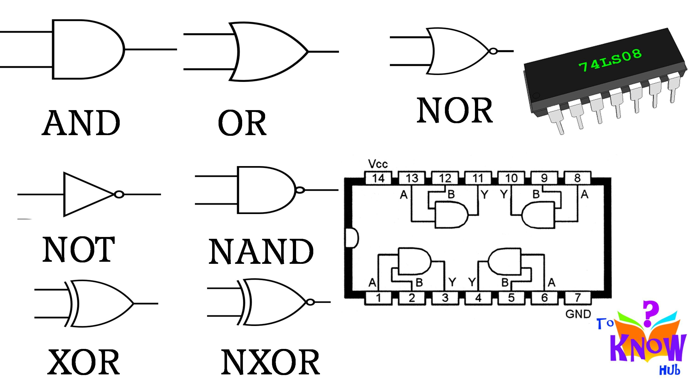

# Formulae
## FRL Self Duality
- How many self-dual functions can be made with n variables?
    - Total number of combinations: $2^n$
    - Total number of Boolean functions: $2^{2^n}$
    - Total number of self-dual functions: $2^{2^{n-1}}$ 

# <strong>Gates</strong>

## <u>Properties of Gates:</u>
- Idempotent: $A.A = A$
- Commutative: $A.B = B.A$
- Associative: $(A+B)+C = A+(B+C)$

[1/0 = Doesn't have/has property]

| Gates | Symbol | Idempotent/Closure | Commutative | Associative |
| :--- | :---: | :---: | :---: | :---: |
| NOT | ¬ | 0 | NA | NA |
| AND | . | 1 | 1 | 1 |
| OR | + | 1 | 1 | 1 |
| NAND | ↑ | 0 | 1 | 0 |
| NOR | ↓ | 0 | 1 | 0 |
| XOR | ⊕ | 0 | 1| 1 |
| XNOR | ⊙ | 0 | 1 | 1 |

## <u>Types of Gates</u>
- Basic Gates: The most basic of all: AND, OR, NOT
- Universal Gates: Combination of basic gates, can be used to make any other gate: NAND (AND + NOT), NOR (OR + NOT)
- Arithmetic Gates: Used to perform arithmetic operations: XOR, XNOR
- Evaluation:
    - AND: **1** if both A & B are 1, otherwise **0**.
    - OR: **1** if either of A or B are 1, otherwise **0**.
    - NOR: Negation of OR, **1** if A OR B is 0, otherwise **0**.
    - NAND: Negation or AND, **1** if A AND B is 0, otherwise **0**.
    - XOR: **1** if both A & B are different, otherwise **0**.
    - XNOR: **1** if both A & B are same, otherwise **0**.

Image taken from [here](https://i.pinimg.com/originals/0c/19/25/0c1925a59240ec9623f584cf7e16c471.jpg)

| A | B | AND | OR | NOR | NAND | XOR | XNOR |
|---|---|-----|----|-----|------|-----|------|
| A | B | A.B | A+B | ¬(A.B) | ¬(A+B) | A ⊕ B | A ⊙ B |
| 0 | 0 |  0  |  0 | 1 |  1  |  0  |   1  |
| 0 | 1 |  0  |  1 | 1 |  0  |  1  |   0  |
| 1 | 0 |  0  |  1 | 1 |  0  |  1  |   0  |
| 1 | 1 |  1  |  1 | 0 |  0  |  0  |   1  |

### <u>Universal Gates: NAND and NOR</u>
<!-- TODO: Add Circuit Diagram -->
- Logic: To implement OR gate, we need 3 NAND gates or 2 NOR gates.

| Gates | NAND | NOR |
| :---  |:---: |:---:|
|  NOT  |  1   |  1  |
|  AND  |  2   |  3  |
|  OR   |  3   |  2  |
|  XOR  |  4   |  5  |
|  XNOR |  5   |  4  |

### <u>Arithmetic Gates (XOR, XNOR)</u>

#### <u>XOR Gate</u>
- If 2 inputs are A & B, A ⊕ B = $A \bar B + \bar AB$
- If both inputs are same, output will be `0`, otherwise `1`.
- Truth Table:
    | A | B | Y |
    |---|---|---|
    | 0 | 0 | 0 |
    | 0 | 1 | 1 |
    | 1 | 0 | 1 |
    | 1 | 1 | 0 |
- Examples:
    1. $A ⊕ A = 0$
    2. $A ⊕ \bar A = 1$
    3. $A ⊕ 0 = A$ (Exchange property: In `(i)`, put `0` in LHS & `A` in RHS)
    4. $A ⊕ 1 = \bar A$ (Exchange property: In `(ii)`, put `1` in LHS & `$\bar A$` in RHS)
    5. $A ⊕ A ⊕ A ⊕ A ⊕ A ⊕ A ... n\ times$:
        - If `n` is even (for example $n=4$), $A ⊕ A ⊕ A ⊕ A = 0 ⊕ 0 = 0$
        - If `n` is odd (for example $n=3$), $A ⊕ A ⊕ A = 0 ⊕ A = A$
- XOR Gate can be used as buffer/inverter: Since $A ⊕ 0 = A$ & $A ⊕ 1 = \bar A$, we can give an input `A` & use the 2nd input as control. If the control is 0, output is same as input, otherwise output is inverted.

#### <u>XNOR Gate</u>
- Negation (¬) of XOR Gate.
- If 2 inputs are A & B, A ⊙ B = $AB + \bar A \bar B$ 
- If both inputs are same, output will be `1`, otherwise `0`.
- Truth Table:
    | A | B | Y |
    |---|---|---|
    | 0 | 0 | 1 |
    | 0 | 1 | 0 |
    | 1 | 0 | 0 |
    | 1 | 1 | 1 |
- Examples:
    1. $A ⊙  A = 1$
    2. $A ⊙ \bar A = 0$
    3. $A ⊙ 0 = \bar A$ (Exchange property: In `(i)`, put `0` in LHS & `A` in RHS)
    4. $A ⊙ 1 = A$ (Exchange property: In `(ii)`, put `1` in LHS & `$\bar A$` in RHS)
    5. $A ⊙ A ⊙ A ⊙ A ⊙ A ⊙ A ... n\ times$:
        - If `n` is even (for example $n=4$), $A ⊙ A ⊙ A ⊙ A = 1 ⊙ 1 = 1$
        - If `n` is odd (for example $n=3$), $A ⊙ A ⊙ A = 1 ⊕ A = A$
- XOR Gate can be used as buffer/inverter: Since $A ⊙ 0  = \bar A$ & $A ⊙ 1 = A$, we can give an input `A` & use the 2nd input as control. If the control is 1, output is same as input, otherwise output is inverted.

## Sum of Product & Canonical Sum of Product
- SoP need not contain all the literals, but in Canonical form, each product term should contain all literals, be it in complemented or un-complemented form.
- The product terms themselves are called the min-terms.
- **Sum of all min-terms for which output $f= 1$, is called Canonical Sum of Product, or disjunctive normal form**.
- Truth Table:

    |   x   |   y   |   z   |  Decimel  |   f   |
    |-------|-------|-------|:---------:|-------|
    |   0   |   0   |   0   |     0     |   0   |
    |   0   |   0   |   1   |     1     |   1   |
    |   0   |   1   |   0   |     2     |   0   |
    |   0   |   1   |   1   |     3     |   1   |
    |   1   |   0   |   0   |     4     |   0   |
    |   1   |   0   |   1   |     5     |   1   |
    |   1   |   1   |   0   |     6     |   0   |
    |   1   |   1   |   1   |     7     |   1   |

    - If $x=0$, we write $\bar x$, otherwise we write $x$.
    - So, SoP ie $f(1) = \bar x \bar y z + \bar x y z + x \bar y z + xyz$
    - We can also write it as $∑m(1,3,5,7)$ or $∑(m$1$+m$3$+m$5$+m$7$)$.

## Duality Theorem
### To get the dual of any boolean expression, replace:

| Source | Destination |
| :---:  | :---:       |
| OR     | AND         |
| .      | +           |
| NOT    | NOT         |
| XOR    | XNOR        |
| NAND   | NOR         |
| 0      | 1           |
|Variable| keep as-is  |

- [Formulae](#frl-self-duality)

- **Complement**: Has all properties of the Duality Theorem, and we complement the variables in addition.
    - $A\ <->\ \bar A$
    - $\bar A\ <->\ A$

- Example 0: $XOR = \bar A B + A \bar B$
    - $(\bar A + B) . (A + \bar B)$
    - $\bar A A + AB + \bar A \bar B + B \bar B$
    - $(AB + \bar A \bar B) = XNOR$ [Duality]
    - $(\bar A \bar B + A B)$       [Complement]

- Example 1: $(AB \bar C)+(\bar ABC) + (ABC)$
    - $(A+B+ \bar C).(\bar A + B+C).(A+B+C)$                                   [Duality]
    - $(\bar A + \bar B + C).(A + \bar B + \bar C).(\bar A + \bar B + \bar C)$ [Complement]

- Example 2: $(XYZ)+(\bar X Y \bar Z)+(\bar Y Z) = 1$
    - $(X+Y+Z).(\bar X + Y + \bar Z).(\bar Y + Z) = 0$              [Duality]
    - $(\bar X+ \bar Y + \bar Z).(X + \bar Y + Z).(Y + \bar Z) = 0$ [Complement]
- Example 3, demonstrating **self-dual equation**: $XY+YZ+XZ)$
    - $(X+Y).(Y+Z).(X+Z)$
    - $(XY+XZ+Y+YZ).(X+Z)$ # `Y.Y` can be written as `Y`
    - $(Y[X+1+YZ]+XZ).(X+Z)$
    - $(Y+XZ)(X+Z)$ # 1 added with anything will result in `1`, so `X+1+YZ` is resolved to `1`.
    - $XY+YZ+XZ+XZ$ # `XXZ=XZ` & `XZZ=XZ`
    - $XY+YZ+XZ$ # `XZ+XZ=XZ`
    - This kind of equation is called a self-dual equation. In other words, the output is the same as input in such an equation.
- Example 4: How many self-dual functions can be made with 1 variable?
    - Total number of combinations: 2, ie A can be either 0 or 1
    - Total number of Boolean functions: 4, ie $0,1, A$ or $\bar A$
    - Total number of self-dual functions: 2 (out of $0,A,\bar A,1$, only $A, \bar A$ are self-dual)
        | A | $f_1$ | $f_2$ | $f_3$ | $f_4$ |
        |---|:---:  | :---: | :---: | :---: |
        | 0 |0      | 0     | 1     | 1     |
        | 1 |0      | 1     | 0     | 1     |
        |**Result**|0   | $A$     | $\bar A$ | 1  |
- Example 5: How many self-dual functions can be made with 2 variables?
    - Total number of combinations: **4**, ie A can be either 0 or 1 & B can also be either 0 or 1
    - Total number of Boolean functions: **16**.
    - Total number of self-dual functions: **4**, ie only $A, \bar A, B, \bar B$ are self-dual out of all functions.
        | A | B | $f_1$ | $f_2$ | $f_3$ | $f_4$ | $f_5$ | $f_6$ | $f_7$ | $f_8$ | $f_9$ | $f_{10}$ | $f_{11}$ | $f_{12}$ | $f_{13}$ | $f_{14}$ | $f_{15}$ | $f_{16}$ |
        |:---:|:---:|:---:|:---:|:---:|:---:|:---:|:---:|:---:|:---:|:---:|:---:|:------:|:------:|:------:|:------:|:---:|:---:|
        | 0 | 0 |  0  |  0  |  0  |  0  |  0  |  0  |  0  |  0  |  1  |  1  |   1  |   1  |   1  |   1  |   1  |   1  |   0  |
        | 0 | 1 |  0  |  0  |  0  |  0  |  1  |  1  |  1  |  1  |  0  |  0  |   0  |   0  |   1  |   1  |   1  |   1  |   0  |
        | 1 | 0 |  0  |  0  |  1  |  1  |  0  |  0  |  1  |  1  |  0  |  0  |   1  |   1  |   0  |   0  |   1  |   1  |   0  |
        | 1 | 1 |  0  |  1  |  0  |  1  |  0  |  1  |  0  |  1  |  0  |  1  |   0  |   1  |   0  |   1  |   0  |   1  |   1  |

