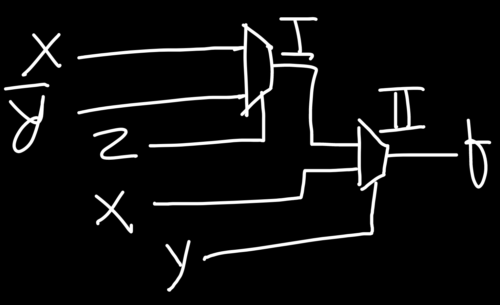
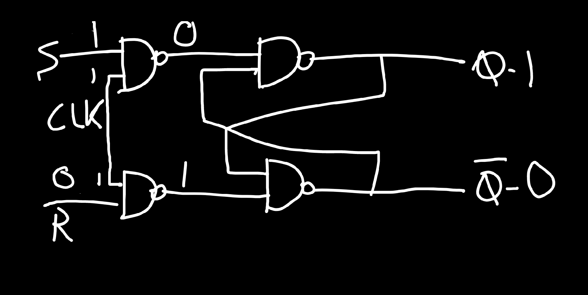
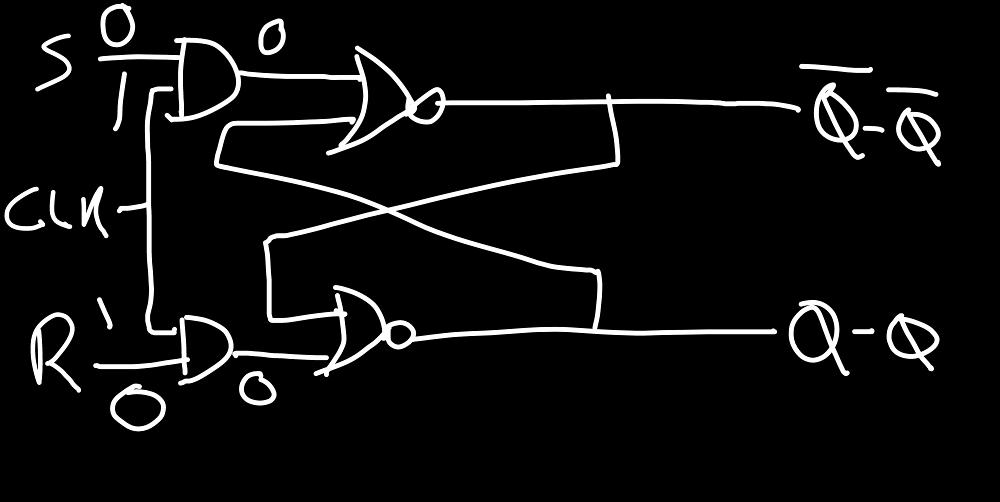
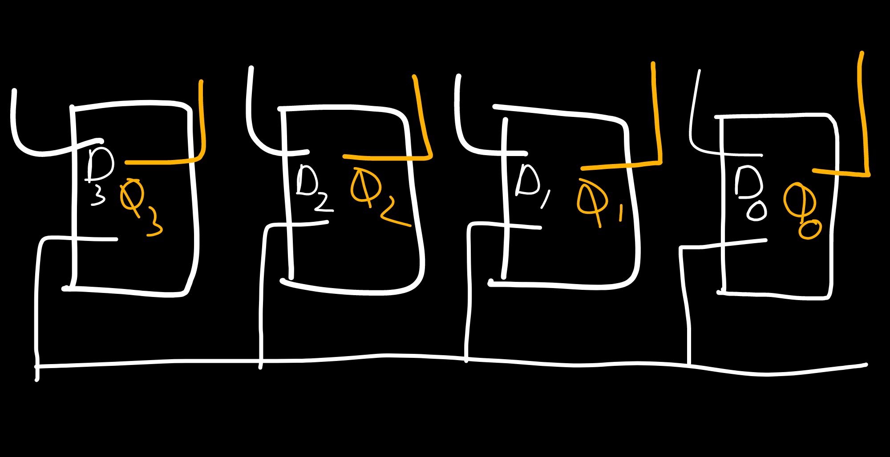

<!-- ID: 3 -->
# Formulae
## FRL Self Duality
- How many self-dual functions can be made with n variables?
    - Total number of combinations: $2^n$
    - Total number of Boolean functions: $2^{2^n}$
    - Total number of self-dual functions: $2^{2^{n-1}}$ 

## FRL Properties of Gates
- **AND** Gate:
    - $A . 0 = 0$
    - $A . 1 = A$
    - $A . \bar A = 0$
- **OR** Gate:
    - $A + 0 = A$
    - $A + 1 = 1$
    - $A + \bar A = 1$
- **XOR** Gate:
    - $A ⊕ A = 0$
    - $A ⊕ \bar A = 1$
    - $A ⊕ 0 = A$ // Output is same as input
    - $A ⊕ 1 = \bar A$ // Output is inverted
    - $A ⊕ A ⊕ A ⊕ A ⊕ A ⊕ A ... n\ times$:
        - If `n` is even, result $=0$ 
        - If `n` is odd, result $=A$
- **NAND** Gate:  If any 1 of the inputs is 0, output is 1.
- **NOR** Gate: If any 1 of the inputs is 1, output is 0.

- **XNOR** Gate:
    - $A ⊙  A = 1$
    - $A ⊙ \bar A = 0$
    - $A ⊙ 0 = \bar A$ // Output is inverted
    - $A ⊙ 1 = A$ // Output is same as input
    - $A ⊙ A ⊙ A ⊙ A ⊙ A ⊙ A ... n\ times$:
        - If `n` is even, result $=1$
        - If `n` is odd, result $=A$
## FRL Signed Magnitude & Complement
- For Signed Magniture (SM) & 1's Complement: For n-bits, there are $2^n$ possible numbers, and the ranges are $-(2^{n-1}-1)$ to $(2^{n-1}-1)$
    > If Range is $0$ to $2^n/2 - 1$, then $2^n/2-1=2^{n}.2^{-1}-1=2^{n-1}-1$
- For 2's Complement: For n-bits, there are $2^n$ possible numbers, and the ranges are $-(2^{n-1})$ to $(2^{n-1}-1)$
    > The negative range starts at one less than the previous, while the positive range remains the same.

# <strong>Gates</strong>

## <u>Properties of Gates:</u>
- Idempotent: $A.A = A$
- Commutative: $A.B = B.A$
- Associative: $(A+B)+C = A+(B+C)$

[1/0 = Doesn't have/has property]

| Gates | Symbol | Idempotent/Closure | Commutative | Associative |
| :--- | :---: | :---: | :---: | :---: |
| NOT | ¬ | 0 | NA | NA |
| AND | . | 1 | 1 | 1 |
| OR | + | 1 | 1 | 1 |
| NAND | ↑ | 0 | 1 | 0 |
| NOR | ↓ | 0 | 1 | 0 |
| XOR | ⊕ | 0 | 1| 1 |
| XNOR | ⊙ | 0 | 1 | 1 |

## <u>Types of Gates</u>
- Basic Gates: The most basic of all: AND, OR, NOT
- Universal Gates: Combination of basic gates, can be used to make any other gate: NAND (AND + NOT), NOR (OR + NOT)
- Arithmetic Gates: Used to perform arithmetic operations: XOR, XNOR
- Evaluation:
    - AND: **1** if both A & B are 1, otherwise **0**.
    - OR: **1** if either of A or B are 1, otherwise **0**.
    - NOR: Negation of OR, **1** if A OR B is 0, otherwise **0**.
    - NAND: Negation or AND, **1** if A AND B is 0, otherwise **0**.
    - XOR: **1** if both A & B are different, otherwise **0**.
    - XNOR: **1** if both A & B are same, otherwise **0**.

<hr>


Image taken from [here](https://i.pinimg.com/originals/0c/19/25/0c1925a59240ec9623f584cf7e16c471.jpg)

<hr>

| A | B | AND | OR | NOR | NAND | XOR | XNOR |
|---|---|-----|----|-----|------|-----|------|
| A | B | A.B | A+B | ¬(A.B) | ¬(A+B) | A ⊕ B | A ⊙ B |
| 0 | 0 |  0  |  0 | 1 |  1  |  0  |   1  |
| 0 | 1 |  0  |  1 | 1 |  0  |  1  |   0  |
| 1 | 0 |  0  |  1 | 1 |  0  |  1  |   0  |
| 1 | 1 |  1  |  1 | 0 |  0  |  0  |   1  |

### <u>Basic Gates: AND, OR and NOT</u>

### <u>AND Gate</u>
- Inputs: $A$, $B$ | Outputs: $Y$
- If any 1 of the inputs is 0, output is 0.
- Truth-Table:
    | A | B | Y |
    |---|---|---|
    | 0 | 0 | 0 |
    | 0 | 1 | 0 |
    | 1 | 0 | 0 |
    | 1 | 1 | 1 |

### <u>OR Gate</u>
- Inputs: $A$, $B$ | Outputs: $Y$
- If any 1 of the inputs is 1, output is 1.
- Truth-Table:
    | A | B | Y |
    |---|---|---|
    | 0 | 0 | 0 |
    | 0 | 1 | 1 |
    | 1 | 0 | 1 |
    | 1 | 1 | 1 |

### <u>NOT Gate</u>
- Inputs: $A$ | Outputs: $Y$
- If any 1 of the inputs is 1, output is 1.
- Truth-Table:
    | A | Y |
    |---|---|
    | 0 | 1 |
    | 1 | 0 |

### <u>Universal Gates: NAND and NOR</u>
<!-- TODO: Add Circuit Diagram -->
#### <u>NAND Gate</u>
- Inputs: $A$, $B$ | Outputs: $Y$
- If any 1 of the inputs is 0, output is 1.
- Truth-Table:
    | A | B | Y |
    |---|---|---|
    | 0 | 0 | 1 |
    | 0 | 1 | 1 |
    | 1 | 0 | 1 |
    | 1 | 1 | 0 |

#### <u>NOR Gate</u>
- Inputs: $A$, $B$ | Outputs: $Y$
- If any 1 of the inputs is 1, output is 0.
- Truth-Table:
    | A | B | Y |
    |---|---|---|
    | 0 | 0 | 1 |
    | 0 | 1 | 0 |
    | 1 | 0 | 0 |
    | 1 | 1 | 0 |

- To implement OR gate, we need 3 NAND gates or 2 NOR gates.
    | Gates | NAND | NOR |
    | :---  |:---: |:---:|
    |  NOT  |  1   |  1  |
    |  AND  |  2   |  3  |
    |  OR   |  3   |  2  |
    |  XOR  |  4   |  5  |
    |  XNOR |  5   |  4  |

### <u>Arithmetic Gates (XOR, XNOR)</u>

#### <u>XOR Gate</u>
- If 2 inputs are A & B, A ⊕ B = $A \bar B + \bar AB$
- If both inputs are same, output will be `0`, otherwise `1`.
- In a K-Map, if the diagonals are covered with 1, we can take XOR of the variables.
- Truth Table:
    | A | B | Y |
    |---|---|---|
    | 0 | 0 | 0 |
    | 0 | 1 | 1 |
    | 1 | 0 | 1 |
    | 1 | 1 | 0 |
- Examples:
    1. $A ⊕ A = 0$
    2. $A ⊕ \bar A = 1$
    3. $A ⊕ 0 = A$ (Exchange property: In `(i)`, put `0` in LHS & `A` in RHS)
    4. $A ⊕ 1 = \bar A$ (Exchange property: In `(ii)`, put `1` in LHS & `$\bar A$` in RHS)
    5. $A ⊕ A ⊕ A ⊕ A ⊕ A ⊕ A ... n\ times$:
        - If `n` is even (for example $n=4$), $A ⊕ A ⊕ A ⊕ A = 0 ⊕ 0 = 0$
        - If `n` is odd (for example $n=3$), $A ⊕ A ⊕ A = 0 ⊕ A = A$
- XOR Gate can be used as buffer/inverter: Since $A ⊕ 0 = A$ & $A ⊕ 1 = \bar A$, we can give an input `A` & use the 2nd input as control. If the control is 0, output is same as input, otherwise output is inverted.

#### <u>XNOR Gate</u>
- Negation (¬) of XOR Gate.
- If 2 inputs are A & B, A ⊙ B = $AB + \bar A \bar B$ 
- If both inputs are same, output will be `1`, otherwise `0`.
- Truth Table:
    | A | B | Y |
    |---|---|---|
    | 0 | 0 | 1 |
    | 0 | 1 | 0 |
    | 1 | 0 | 0 |
    | 1 | 1 | 1 |
- Examples:
    1. $A ⊙  A = 1$
    2. $A ⊙ \bar A = 0$
    3. $A ⊙ 0 = \bar A$ (Exchange property: In `(i)`, put `0` in LHS & `A` in RHS)
    4. $A ⊙ 1 = A$ (Exchange property: In `(ii)`, put `1` in LHS & `$\bar A$` in RHS)
    5. $A ⊙ A ⊙ A ⊙ A ⊙ A ⊙ A ... n\ times$:
        - If `n` is even (for example $n=4$), $A ⊙ A ⊙ A ⊙ A = 1 ⊙ 1 = 1$
        - If `n` is odd (for example $n=3$), $A ⊙ A ⊙ A = 1 ⊕ A = A$
- XNOR Gate can be used as buffer/inverter: Since $A ⊙ 0  = \bar A$ & $A ⊙ 1 = A$, we can give an input `A` & use the 2nd input as control. If the control is 1, output is same as input, otherwise output is inverted.

# Sum of Product & Canonical Sum of Product
- SoP need not contain all the literals, but in Canonical form, each product term should contain all literals, be it in complemented or un-complemented form.
- The product terms themselves are called the min-terms.
- **Sum of all min-terms for which output $f= 1$, is called Canonical Sum of Product, or disjunctive normal form**.
- Truth Table:

    |   x   |   y   |   z   |  Decimel  |   f   |
    |-------|-------|-------|:---------:|-------|
    |   0   |   0   |   0   |     0     |   0   |
    |   0   |   0   |   1   |     1     |   1   |
    |   0   |   1   |   0   |     2     |   0   |
    |   0   |   1   |   1   |     3     |   1   |
    |   1   |   0   |   0   |     4     |   0   |
    |   1   |   0   |   1   |     5     |   1   |
    |   1   |   1   |   0   |     6     |   0   |
    |   1   |   1   |   1   |     7     |   1   |

    - If $x=0$, we write $\bar x$, otherwise we write $x$.
    - So, SoP ie $f(1) = \bar x \bar y z + \bar x y z + x \bar y z + xyz$
    - We can also write it as $∑m(1,3,5,7)$ or $∑(m$<sub>1</sub>$+m$<sub>3</sub>$+m$<sub>5</sub>$+m$<sub>7</sub>$)$.

# Duality Theorem
### To get the dual of any boolean expression, replace:

| Source | Destination |
| :---:  | :---:       |
| OR     | AND         |
| .      | +           |
| NOT    | *keep as-is*|
| XOR    | XNOR        |
| NAND   | NOR         |
| 0      | 1           |
|Variable| *keep as-is*|

- [Formulae](#frl-self-duality)

- **Complement**: Has all properties of the Duality Theorem, and we complement the variables in addition.
    - $A\ <->\ \bar A$
    - $\bar A\ <->\ A$

- Example 0: $XOR = \bar A B + A \bar B$
    - $(\bar A + B) . (A + \bar B)$
    - $\bar A A + AB + \bar A \bar B + B \bar B$
    - $(AB + \bar A \bar B) = XNOR$ [Duality]
    - $(\bar A \bar B + A B)$       [Complement]

- Example 1: $(AB \bar C)+(\bar ABC) + (ABC)$
    - $(A+B+ \bar C).(\bar A + B+C).(A+B+C)$                                   [Duality]
    - $(\bar A + \bar B + C).(A + \bar B + \bar C).(\bar A + \bar B + \bar C)$ [Complement]

- Example 2: $(XYZ)+(\bar X Y \bar Z)+(\bar Y Z) = 1$
    - $(X+Y+Z).(\bar X + Y + \bar Z).(\bar Y + Z) = 0$              [Duality]
    - $(\bar X+ \bar Y + \bar Z).(X + \bar Y + Z).(Y + \bar Z) = 0$ [Complement]
- Example 3, demonstrating **self-dual equation**: $XY+YZ+XZ)$
    - $(X+Y).(Y+Z).(X+Z)$
    - $(XY+XZ+Y+YZ).(X+Z)$ # `Y.Y` can be written as `Y`
    - $(Y[X+1+YZ]+XZ).(X+Z)$
    - $(Y+XZ)(X+Z)$ # 1 added with anything will result in `1`, so `X+1+YZ` is resolved to `1`.
    - $XY+YZ+XZ+XZ$ # `XXZ=XZ` & `XZZ=XZ`
    - $XY+YZ+XZ$ # `XZ+XZ=XZ`
    - This kind of equation is called a self-dual equation. In other words, the output is the same as input in such an equation.
- Example 4: How many self-dual functions can be made with 1 variable?
    - Total number of combinations: 2, ie A can be either 0 or 1
    - Total number of Boolean functions: 4, ie $0,1, A$ or $\bar A$
    - Total number of self-dual functions: 2 (out of $0,A,\bar A,1$, only $A, \bar A$ are self-dual)
        | A | $f_1$ | $f_2$ | $f_3$ | $f_4$ |
        |---|:---:  | :---: | :---: | :---: |
        | 0 |0      | 0     | 1     | 1     |
        | 1 |0      | 1     | 0     | 1     |
        |**Result**|0   | $A$     | $\bar A$ | 1  |
- Example 5: How many self-dual functions can be made with 2 variables?
    - Total number of combinations: **4**, ie A can be either 0 or 1 & B can also be either 0 or 1
    - Total number of Boolean functions: **16**.
    - Total number of self-dual functions: **4**, ie only $A, \bar A, B, \bar B$ are self-dual out of all functions.
        | A | B | $f_1$ | $f_2$ | $f_3$ | $f_4$ | $f_5$ | $f_6$ | $f_7$ | $f_8$ | $f_9$ | $f_{10}$ | $f_{11}$ | $f_{12}$ | $f_{13}$ | $f_{14}$ | $f_{15}$ | $f_{16}$ |
        |:---:|:---:|:---:|:---:|:---:|:---:|:---:|:---:|:---:|:---:|:---:|:---:|:------:|:------:|:------:|:------:|:---:|:---:|
        | 0 | 0 |  0  |  0  |  0  |  0  |  0  |  0  |  0  |  0  |  1  |  1  |   1  |   1  |   1  |   1  |   1  |   1  |   0  |
        | 0 | 1 |  0  |  0  |  0  |  0  |  1  |  1  |  1  |  1  |  0  |  0  |   0  |   0  |   1  |   1  |   1  |   1  |   0  |
        | 1 | 0 |  0  |  0  |  1  |  1  |  0  |  0  |  1  |  1  |  0  |  0  |   1  |   1  |   0  |   0  |   1  |   1  |   0  |
        | 1 | 1 |  0  |  1  |  0  |  1  |  0  |  1  |  0  |  1  |  0  |  1  |   0  |   1  |   0  |   1  |   0  |   1  |   1  |

# K-Map
- aka **Karnaugh Map**
- A K-Map is used to **graphically represent & minimize** boolean expressions.
- For a boolean expression of `n` variables, number of cells needed in K-Map is $2^{n}$.
- K-Map is based on Grey code (unit distance code). We can't change more than 1 bit in a single step.
- **Prime Implicants**: Min-terms which have a `1` in them.
- **Essential Prime Implicants**: Min-terms which have a `1` in them, which is also not shared with other pairs.
- There are 3 types of input values, `0`, `1`, `d,x (don't care)`.
- Steps:
    1. We generate the K-Map.
    1. We find the pairs. They contain 1 mandatorily. We may take `d` ie `don't care` if needed, otherwise we ignore them. While pairing elements, we first try to find the biggest pair possible (16 elements in a K-Map of 16 elements). Then, we gradually decrease the pair size.
    1. We find the min-terms. Min-terms consist of variables which are same/common for all elements of the pair.
- Example: Generate a K-Map for $(A,B,C)$ & $(A,B,C,D)$
    - Detailed versions (the cell values denote the decimel representation of the positions):
        - 2 variables, $AB$:
            |$↓A\ \|\ B→$|$\bar B_{(0)}$|$B_{(1)}$
            |:---:|:---:|:---:|
            |$\bar A_{(0)}$|$0_{(00)}$|$1_{(01)}$|
            |$A_{(1)}$|$2_{(10)}$|$3_{(11)}$|

        - 3 variables, $ABC$:
            |$↓A\ \|\ BC→$|$\bar B \bar C_{(00)}$|$\bar B C_{(01)}$|$B C_{(11)}$|$B \bar C_{(10)}$|
            |:---:|:---:|:---:|:---:|:---:|
            |$\bar A_{(0)}$|$0_{(000)}$|$1_{(001)}$|$3_{(011)}$|$2_{(010)}$|
            |$A_{(1)}$|$4_{(100)}$|$5_{(101)}$|$7_{(111)}$|$6_{(110)}$|
        
        - 4 variables, $ABCD$:
            |$↓AB\ \|\ CD→$|$\bar C \bar D_{(00)}$|$\bar C D_{(01)}$|$C D_{(11)}$|$C \bar D_{(10)}$|
            |:---:|:---:|:---:|:---:|:---:|
            |$\bar A \bar B_{(00)}$|$0_{(0000)}$|$1_{(0001)}$|$3_{(0011)}$|$2_{(0010)}$|
            |$\bar A B_{(01)}$|$4_{(0100)}$|$5_{(0101)}$|$7_{(0111)}$|$6_{(0110)}$|
            |$AB_{(11)}$|$12_{(1100)}$|$13_{(1101)}$|$15_{(1111)}$|$14_{(1110)}$|
            |$A \bar B_{(10)}$|$8_{(1000)}$|$9_{(1001)}$|$11_{(1011)}$|$10_{(1010)}$|

    - Simplified versions & templates:
         - 2 variables, $AB$:
            |$↓A\ \|\ B→$|$\bar B$|$B$
            |:---:|:---:|:---:|
            |$\bar A$|$null_{(0)}$|$null_{(1)}$|
            |$A$|$null_{(2)}$|$null_{(3)}$|

        - 3 variables, $ABC$:
            |$↓A\ \|\ BC→$|$\bar B \bar C$|$\bar B C$|$B C$|$B \bar C$|
            |:---:|:---:|:---:|:---:|:---:|
            |$\bar A$|$null_{(0)}$|$null_{(1)}$|$null_{(3)}$|$null_{(2)}$|
            |$A$|$null_{(4)}$|$null_{(5)}$|$null_{(7)}$|$null_{(6)}$|

        - 4 variables, $ABCD$:
            |$↓AB\ \|\ CD→$|$\bar C \bar D_{(00)}$|$\bar C D_{(01)}$|$C D_{(11)}$|$C \bar D_{(10)}$|
            |:---:|:---:|:---:|:---:|:---:|
            |$\bar A \bar B_{(00)}$|$null_{(0)}$|$null_{(1)}$|$null_{(3)}$|$null_{(2)}$|
            |$\bar A B_{(01)}$|$null_{(4)}$|$null_{(5)}$|$null_{(7)}$|$null_{(6)}$|
            |$AB_{(11)}$|$null_{(12)}$|$null_{(13)}$|$null_{(15)}$|$null_{(14)}$|
            |$A \bar B_{(10)}$|$null_{(8)}$|$null_{(9)}$|$null_{(11)}$|$null_{(10)}$|

- Example 1: $f(A,B)=\sum (2,3)$
    - Method 1, by directly solving the equation:
        |A|B|$f$|
        |---|---|---|
        |0|0|0|
        |0|1|0|
        |1|0|1|
        |1|1|1|
        - As per the question, $f=1$ for index 2 & 3 (within 0-3).
        - The resultant equation is: $A \bar B + A B = A(\bar B + B) = A.1 = A$
    - Method 2, using K-Map:
        |null|$\bar B$|$B$|
        |---|---|---|
        |$\bar A$|$0_{(0)}$|$0_{(1)}$|
        |$A$|$1_{(2)}$|$1_{(3)}$|
        - Pairs: (2) & (3). Output: $A$

- Example 2: $\sum m(0,2,5,7,9,11)+d(3,8,10,12,14)$
    |$↓PQ\ \|\ RS→$|$\bar R \bar S_{(00)}$|$\bar R S_{(01)}$|$R S_{(11)}$|$R \bar S_{(10)}$|
    |:---:|:---:|:---:|:---:|:---:|
    |$\bar P \bar Q_{(00)}$|$1_{(0)}$|$null_{(1)}$|$d_{(3)}$|$1_{(2)}$|
    |$\bar P Q_{(01)}$|$null_{(4)}$|$1_{(5)}$|$1_{(7)}$|$null_{(6)}$|
    |$PQ_{(11)}$|$d_{(12)}$|$null_{(13)}$|$null_{(15)}$|$d_{(14)}$|
    |$P \bar Q_{(10)}$|$d_{(8)}$|$1_{(9)}$|$1_{(11)}$|$d_{(10)}$|
    - Pairs: $\{8,9,11,10\},\{0,2,8,10\},\{5,7\}$
    - Min-Terms: **4** ie $P \bar Q, \bar Q \bar S, \bar P Q S, \bar P \bar Q \bar S$
    - Essential Prime Implicants: **3** ie $P \bar Q, \bar Q \bar S,\bar P Q S$

- Example 3: $\sum m(5,11,13,14,15)$
    |$↓AB\ \|\ CD→$|$\bar C \bar D_{(00)}$|$\bar C D_{(01)}$|$C D_{(11)}$|$C \bar D_{(10)}$|
    |:---:|:---:|:---:|:---:|:---:|
    |$\bar A \bar B_{(00)}$|$null_{(0)}$|$null_{(1)}$|$null_{(3)}$|$null_{(2)}$|
    |$\bar A B_{(01)}$|$null_{(4)}$|$1_{(5)}$|$null_{(7)}$|$null_{(6)}$|
    |$AB_{(11)}$|$null_{(12)}$|$1_{(13)}$|$1_{(15)}$|$1_{(14)}$|
    |$A \bar B_{(10)}$|$null_{(8)}$|$null_{(9)}$|$1_{(11)}$|$null_{(10)}$|
    - Pairs: $\{5,13\},\{13,15\},\{15,14\},\{15,11\}$
    - Prime Implicants: **4** ie $B \bar C D, ABD, ABC, ACD$
    - Essential Prime Implicants: **3** ie $B \bar C D, ABC, ACD$

# <strong>Logic Circuits</strong>

## Half-Adder
- Adds 2 bits
- Inputs: 2 | Outputs: 2
- Sum (Least Significant Bit [LSB]): $x⊕y$
- Carry (Most Significant Bit [MSB]): $xy$
- Truth Table:
    |X|Y|Sum|Carry|
    |-|-|-|-|
    |0|0|0|0|
    |0|1|1|0|
    |1|0|1|0|
    |1|1|0|1|
- Min-terms:
    - Sum: $\bar x y, x \bar y=x⊕y$ (In K-Map, diagonals are filled with 1)
    - Carry: $xy$
- Circuit Diagram:
    - Sum: $\bar x y + x \bar y$ | Carry: $xy$
        
    - Sum: $x⊕y$ | Carry: $xy$
        

## Full-Adder
- Adds 3 bits
- Inputs: 3 | Outputs: 2
- 2 Half-Adders = Full-Adder
- Sum: $x⊕y⊕z$ 
- Carry: $xy+yz+zx=(x⊕y)z+xy$ 
- Truth Table:
    | x | y | z($c_{in})$ | sum | $c_{out}$ |
    |---|---|-----|:---:|:----:|
    | 0 | 0 |  0  |  0  |  0   |
    | 0 | 0 |  1  |  1  |  0   |
    | 0 | 1 |  0  |  1  |  0   |
    | 0 | 1 |  1  |  0  |  1   |
    | 1 | 0 |  0  |  1  |  0   |
    | 1 | 0 |  1  |  0  |  1   |
    | 1 | 1 |  0  |  0  |  1   |
    | 1 | 1 |  1  |  1  |  1   |
- Min-Terms:
    - Sum:  $\sum{(m_1,m_2,m_4,m_7)} = x⊕y⊕z$
        |$↓x\ \|\ yz→$|$\bar y \bar z$|$\bar y z$|$y z$|$y \bar z$|
        |:---:|:---:|:---:|:---:|:---:|
        |$\bar x$|$null_{(0)}$|$1_{(1)}$|$null_{(3)}$|$1_{(2)}$|
        |$x$|$1_{(4)}$|$null_{(5)}$|$1_{(7)}$|$null_{(6)}$|
        - Diagonals are filled with 1.
    - Carry: $\sum{(m_3,m_5,m_6,m_7)}= xy+yz+xz=(x⊕y)z+xy$
        |$↓x\ \|\ yz→$|$\bar y \bar z$|$\bar y z$|$y z$|$y \bar z$|
        |:---:|:---:|:---:|:---:|:---:|
        |$\bar x$|$null_{(0)}$|$null_{(1)}$|$1_{(3)}$|$null_{(2)}$|
        |$x$|$null_{(4)}$|$1_{(5)}$|$1_{(7)}$|$1_{(6)}$|
        - Pairs: $y z,xz,xy=xy+yz+xz$
- Circuit Diagram:
    - Sum: $x⊕y⊕z$ | Carry: $(x⊕y)z+xy$
        

## Half-Subtractor
- Subtracts 2 bits
- Inputs: 2 | Outputs: 2
- Subtraction (Least Significant Bit [LSB]): $x⊕y$
- Borrow (Most Significant Bit [MSB]): $\bar xy$
- Truth Table:
    |x|y|sub|$b_{out}$|
    |-|-|-|-|
    |0|0|0|0|
    |0|1|1|1|
    |1|0|1|0|
    |1|1|0|0|

- When subtracting $1$ from $0$, first we have to borrow $1$. So, $0$ becomes $10$, and $10-1=1$, with borrow $1$.
- Min-terms:
    - Sub: $\bar x y, x \bar y=x⊕y$
    - Borrow: $\bar xy$
- Circuit Diagram:
    - Sub: $x⊕y$ | Borrow: $\bar xy$
        

## Full-Subtractor
- Subtracts 3 bits
- Inputs: 3 | Outputs: 2
- Sub: $x⊕y⊕z$ 
- Borrow: $\bar x y + yz + \bar xz$
- Truth Table:
    | x | y | z($c_{in})$ | sub | $c_{out}$ |
    |---|---|-----|:---:|:----:|
    | 0 | 0 |  0  |  0  |  0   |
    | 0 | 0 |  1  |  1  |  0   |
    | 0 | 1 |  0  |  1  |  0   |
    | 0 | 1 |  1  |  0  |  1   |
    | 1 | 0 |  0  |  1  |  0   |
    | 1 | 0 |  1  |  0  |  1   |
    | 1 | 1 |  0  |  0  |  1   |
    | 1 | 1 |  1  |  1  |  1   |
- Min-Terms:
    - Sub:  $\sum{(m_1,m_2,m_4,m_7)} = x⊕y⊕z$
        |$↓x\ \|\ yz→$|$\bar y \bar z$|$\bar y z$|$y z$|$y \bar z$|
        |:---:|:---:|:---:|:---:|:---:|
        |$\bar x$|$null_{(0)}$|$1_{(1)}$|$null_{(3)}$|$1_{(2)}$|
        |$x$|$1_{(4)}$|$null_{(5)}$|$1_{(7)}$|$null_{(6)}$|
        - Diagonals are filled with 1.
    - Borrow: $\sum{(m_1,m_3,m_2,m_7)}=\bar xz+ \bar x y + yz$
        |$↓x\ \|\ yz→$|$\bar y \bar z$|$\bar y z$|$y z$|$y \bar z$|
        |:---:|:---:|:---:|:---:|:---:|
        |$\bar x$|$null_{(0)}$|$1_{(1)}$|$1_{(3)}$|$1_{(2)}$|
        |$x$|$null_{(4)}$|$null_{(5)}$|$1_{(7)}$|$null_{(6)}$|
        - Pairs: $\bar xz, \bar x y, yz$
- Circuit Diagram:
    - Sub: $x⊕y⊕z$ | Borrow: $\bar xz+ \bar x y + yz$
        

# <strong>Combinational Logic Circuits</strong>
## Multiplexer
- It is a Combinational circuit that has $n$ input lines and $1$ output line.
- It is an electronic switch that connects 1 of the `n` inputs to an output.
- Select lines are used to select the input. If the number of inputs is $n$ and ($n=2^k$), the number of select lines will be $k$.
- Multiplexers are **functionally complete**, which means we can design any circuit using them.
    - We will prove that we can make AND, OR, and NOT gates using Multiplexers. If we can make these basic gates, we can also make NAND & NOR gates after this, which are Universal Gates.
    - We will use a 2:1 Multiplexer for proving this.
    - Inputs: $A$,$B$
    - AND Gate:
        1. Truth Table of AND Gate:
            | A | B | O/P |
            |---|---|---|
            | 0 | 0 | 0 |
            | 0 | 1 | 0 |
            | 1 | 0 | 0 |
            | 1 | 1 | 1 |
        1. Min-Terms: $f=AB$
        1. Let's give B as select-line.
            |$B$|Value|Input|
            |---|:-:|:-:|
            |$\bar B$|$0$|$I_1$|
            |$B$|$1$|$I_2$|
        1. $I_1=0$, because $0 . B =0$
        1. $I_2=A$, because $A . B = AB$
        1. Result: $0 \bar B + A B = AB$
    - OR Gate:
        1. Truth Table of OR Gate: 
            | A | B | O/P |
            |---|---|---|
            | 0 | 0 | 0 |
            | 0 | 1 | 1 |
            | 1 | 0 | 1 |
            | 1 | 1 | 1 |
        1. Min-Terms: $f=B + A \bar B$
            - $\bar A B + A \bar B + A B$
            - $B(\bar A + A) + A \bar B$
            - $B + A \bar B$ // check [formula](#frl-properties-of-gates)
        1. Let's give B as select-line.
            |$B$|Value|Input|
            |---|:-:|:-:|
            |$\bar B$|$0$|$I_1$|
            |$B$|$1$|$I_2$|
        1. $I_1=A$, because $A . \bar B = A \bar B$
        1. $I_2=1$, because $1 . B = B$
        1. Result: $\bar A B + B$
    - NOT Gate:
        1. Truth Table of NOT Gate:
            |A|O/P|
            |-|-|
            |0|1|
            |1|0|
        1. Let's give A as select-line.
            |$A$|Value|Input|
            |---|:-:|:-:|
            |$\bar A$|$0$|$I_1$|
            |$A$|$1$|$I_2$|
        1. We just need to invert the Inputs.
        1. $I_1=1$, because $A . 1 = 1$
        1. $I_2=0$, because $A . 0 = 0$

### 4:1 Multiplexer
- Inputs: $4$ | Outputs: $1$ | Select-Lines: $2$ (because $4=2^2$)
- Truth-Table (Select Lines):
    |$S_1$|$S_0$|$I_0$|$I_1$|$I_2$|$I_3$|
    |---|---|---|---|---|---|
    |0|0|I|0|0|0|
    |0|1|0|I|0|0|
    |1|0|0|0|I|0|
    |1|1|0|0|0|I|
- SoP: $\bar S_1 \bar S_0 I_1 + \bar S_1 S_0 I_2 + S_1 \bar S_0 I_3 + S_1 S_0 I_4$
- Logic Diagram:
    - Select Lines: $A$, $B$
    - Inputs: $D_0$, $D_1$, $D_2$, $D_3$
    - Output: $Y$
    <br><br>
    Image taken from [here](https://www.eeweb.com/wp-content/uploads/articles-articles-4-to-1-multiplexer-circuit-diagram-1387783580.jpg?fit=602%2C499)

### Cascading Multiplexer
- Multiplexers are connected in a way such that the output of 1 Multiplexer becomes one of the inputs of the next Multiplexer.
- Example 0:
    <br>
    - Output of Multiplexer 1: $x \bar z + \bar y z$
    - Output of Multiplexer 2: $f=(x \bar z + \bar y z)\bar y + xy$
        - $x \bar y \bar z + \bar y z + x y$
        - $x(\bar y \bar z + y) + \bar y z$
        - $x((y + \bar y)(y + \bar z)) + \bar y z$ // Distributive Property
        - $x(y + \bar z) + \bar y z$ // $(y + \bar y) = 1$
        > $f=x y + x \bar z + \bar y z$

### Implementing Functions using Multiplexer:
- Our objective is to implement the given function in the Multiplexer, to get the same output as that of the function.
- Example 0:
    > $f(A,B,C)=\sum {(1,2,5,7)}$
    - Select Lines: `A` `B`
    - Inputs: Some variant of `C`
    - Min-Terms: $\bar A \bar B C + \bar A B \bar C + A \bar B C + A B C$
    - Match A & B with the select lines, $S_1$ & $S_0$.
        > Since $\bar A \bar B$ matches with $\bar S_1 \bar S_2$, Input $I_1=C$.

        |$S_1$|$S_0$|Min-Term|Input|
        |---|---|---|---|
        |0|0|$\bar A \bar B$|$C$|
        |0|1|$\bar A B$|$\bar C$|
        |1|0|$A \bar B$|$C$|
        |1|1|$A B$|$C$|

### Examples
- Example 0:
    <br>
    - Multiplexer I:
        - Inputs: $X$, $\bar Y$
        - Select Line: $Z$
        - Output: $X \bar Z + \bar YZ$
            > Z: 0, $X \bar Z$ <br>
            > Z: 1, $\bar Y Z$
        - This output is Input $I_1$ for Multiplexer II.
    - Multiplexer II:
        - Inputs: $X \bar Z + \bar Y Z$, $X$
        - Select Line: $Y$
        - Output: $(X \bar Z + \bar Y Z)\bar Y + XY$
            > Z: 0, $(X \bar Z + \bar Y Z)\bar Y$ <br>
            > Z: 1, $XY$
    - Minimizing the output:
        - $(X \bar Z + YZ)\bar Y + XY$
        - $X \bar Y \bar Z + \bar Y Z + XY$ // $\bar Y + \bar Y = \bar Y$
        - $X(Y + \bar Y \bar Z)+ \bar Y Z$
        - $X[(Y+ \bar Y)(Y + \bar Z)] + \bar Y Z$ // Distributive Property
        - $X (Y + \bar Z) + \bar Y Z$
        - $X Y + X \bar Z + \bar Y Z$

## De-Multiplexer
- It is a Combinational circuit that has $1$ input line and $n$ output line.
- It is an electronic switch that connects the input to one of the `n` outputs.
- Select lines are used to select the output where the input will be sent. If the number of outputs is $n$ and ($n=2^k$), the number of select lines will be $k$.

### 1:4 De-multiplexer
- Inputs: $1$ | Outputs: $4$ | Select-Lines: $2$ (because $4=2^2$)
- Truth-Table (Select Lines):
    |$S_1$|$S_0$|$O_0$|$O_1$|$O_2$|$O_3$|
    |---|---|---|---|---|---|
    |0|0|I|0|0|0|
    |0|1|0|I|0|0|
    |1|0|0|0|I|0|
    |1|1|0|0|0|I|
- SoP: $\bar S_1 \bar S_0 O_1,\ \bar S_1 S_0 O_2 ,\ S_1 \bar S_0 O_3,\ S_1 S_0 O_4$
- Logic Diagram:
    - Select Lines: $S_1$, $S_0$
    - Inputs: $D$
    - Output: $Y_0$, $Y_1$, $Y_2$, $Y_3$
    <br><br>
    Image taken from [here](https://www.electronicshub.org/wp-content/uploads/2015/07/1-to-4-Demux-logic-diagram.jpg)

## Decoder
- It is a multi-input multi-output device.
- Inputs: $n$ | Outputs: upto $2^n$
- Applications:
    - Binary to Octal (3:8)
    - Binary to Hexadecimel (4:16)
    - Binary to Decimel (4:10)
- Truth-Table (3:8 Decoder):
    | X | Y | Z | $D_0$ | $D_1$ | $D_2$ | $D_3$ | $D_4$ | $D_5$ | $D_6$ | $D_7$ |
    |---|---|---|-------|-------|-------|-------|-------|-------|-------|-------|
    | 0 | 0 | 0 |    1  |    0  |    0  |    0  |    0  |    0  |    0  |    0  |
    | 0 | 0 | 1 |    0  |    1  |    0  |    0  |    0  |    0  |    0  |    0  |
    | 0 | 1 | 0 |    0  |    0  |    1  |    0  |    0  |    0  |    0  |    0  |
    | 0 | 1 | 1 |    0  |    0  |    0  |    1  |    0  |    0  |    0  |    0  |+
    | 1 | 0 | 0 |    0  |    0  |    0  |    0  |    1  |    0  |    0  |    0  |
    | 1 | 0 | 1 |    0  |    0  |    0  |    0  |    0  |    1  |    0  |    0  |
    | 1 | 1 | 0 |    0  |    0  |    0  |    0  |    0  |    0  |    1  |    0  |
    | 1 | 1 | 1 |    0  |    0  |    0  |    0  |    0  |    0  |    0  |    1  |
- SoP: $\bar X \bar Y \bar Z D_0 + \bar X \bar Y Z D_1 + \bar X Y \bar Z D_2 + \bar X Y Z D_3 + X \bar Y \bar Z D_4 + X \bar Y Z D_5 + X Y \bar Z D_6 + X Y Z D_7$

## Encoder
- It is a multi-input multi-output device.
- Inputs: $2^n$ | Outputs: upto $n$
- Applications:
    - Octal to Binary (8:3)
    - Hexadecimel to Binary (16:4)
    - Decimel to Binary (10:4)
- Truth-Table (8:3 Encoder):
    | $E_0$ | $E_1$ | $E_2$ | $E_3$ | $E_4$ | $E_5$ | $E_6$ | $E_7$ | X | Y | Z |
    |-------|-------|-------|-------|-------|-------|-------|-------|---|---|---|
    |   1   |   0   |   0   |   0   |   0   |   0   |   0   |   0   |  0| 0 | 0 |
    |   0   |   1   |   0   |   0   |   0   |   0   |   0   |   0   |  0| 0 | 1 |
    |   0   |   0   |   1   |   0   |   0   |   0   |   0   |   0   |  0| 1 | 0 |
    |   0   |   0   |   0   |   1   |   0   |   0   |   0   |   0   |  0| 1 | 1 |
    |   0   |   0   |   0   |   0   |   1   |   0   |   0   |   0   |  1| 0 | 0 |
    |   0   |   0   |   0   |   0   |   0   |   1   |   0   |   0   |  1| 0 | 1 |
    |   0   |   0   |   0   |   0   |   0   |   0   |   1   |   0   |  1| 1 | 0 |
    |   0   |   0   |   0   |   0   |   0   |   0   |   0   |   1   |  1| 1 | 1 |
- SoP: $\bar X \bar Y \bar Z E_0 + \bar X \bar Y Z E_1 + \bar X Y \bar Z E_2 + \bar X Y Z E_3 + X \bar Y \bar Z E_4 + X \bar Y Z E_5 + X Y \bar Z E_6 + X Y Z E_7$

# <strong>Sequential Circuits</strong>
- Consists of a memory element that stores the present output.
- Output not only depends on the input, but also on the previous output.
- Inputs: $I$ (Input) | $Q_n$ (Present output)
- Output: $Q_{n+1}$ (Next Output)

## SR Latch
- For Latches, the output depends on the Gate used to design it.
### Using NAND Gate
- Inputs: $S$ (Set), $R$ (Reset) | Outputs: $Q_{n+1} / Q$, $\bar Q$
- Property of NAND Gate: If any 1 of the inputs is 0, output is 1.
- Truth-Table:
    |$S$|$R$|$Q_{n+1}$ ($Q$)|
    |---|---|---|
    |0|0|Invalid|
    |0|1|1|
    |1|0|0|
    |1|1|Hold / Q|
- Inputs: $S=0$, $R=0$ | Outputs: $Q=1$, $\bar Q=1$
    - NAND Gate (I) will output 1, since one of the inputs is 0.
    - NAND Gate (II) will output 1, since one of the inputs is 0.
    - This is invalid since the outputs should've been complimentary to each other.
    - Circuit-Diagram:
        <br>
- Inputs: $S=0$, $R=1$ | Outputs: $Q=1$, $\bar Q=0$
    - NAND Gate (I) will output 1, since one of the inputs is 0.
    - NAND Gate (II) will output 0, since both the inputs are 1.
    - Circuit-Diagram:
        <br>
- Inputs: $S=1$, $R=0$ | Outputs: $Q=0$, $\bar Q=1$
    - NAND Gate (II) will output 1, since one of the inputs is 0.
    - NAND Gate (I) will output 0, since both the inputs are 1.
    - Circuit-Diagram:
        <br>
- Inputs: $S=1$, $R=1$ | Outputs: $Q=Q$, $\bar Q=\bar Q$
    - Circuit-Diagram:
        <br>
    1. NAND Gate (II) will always output $\bar Q$, which will be taken as an input to NAND Gate (I).
    1. Also, NAND Gate (I) will always output $Q$, which will be taken as an input to NAND Gate (II).
    1. So, for NAND Gate (I), output:
       - $\bar {(1.\bar Q)}$
       - $\bar 1 . \bar {\bar Q}$
       - $0+Q$
       - $Q$
    1. Also, for NAND Gate (II), output:
       - $\bar {1.Q}$
       - $\bar 1 . \bar Q$
       - $0 + \bar Q$
       - $\bar Q$

### Using NOR Gate
- Inputs: $S$ (Set), $R$ (Reset) | Outputs: $Q_{n+1} / Q$, $\bar Q$
- Property of NOR Gate: If any 1 of the inputs is 1, output is 0.
- Truth-Table:
    |$S$|$R$|$Q_{n+1}$ ($Q$)|
    |---|---|---|
    |0|0|Hold / Q|
    |0|1|0|
    |1|0|1|
    |1|1|Invalid|
- Inputs: $S=0$, $R=0$ | Outputs: $Q=Q$, $\bar Q=\bar Q$
    - Circuit-Diagram:
        <br>
    1. NOR Gate (II) will always output $Q$, which will be taken as an input to NOR Gate (I).
    1. Also, NOR Gate (I) will always output $\bar Q$, which will be taken as an input to NOR Gate (II).
    1. So, for NOR Gate (II), output:
       - $\bar {0+\bar Q}$
       - $\bar 0.\bar {\bar Q}$
       - $1.Q$
       - $Q$
    1. Also, for NAND Gate (I), output:
       - $\bar {0+Q}$
       - $\bar 0. \bar Q$
       - $1.\bar Q$
       - $\bar Q$
- Inputs: $S=0$, $R=1$ | Outputs: $Q=0$, $\bar Q=1$
    - NOR Gate (II) will output 0, since one of the inputs is 1.
    - NOR Gate (I) will output 1, since both the inputs are 0.
    - Circuit-Diagram:
        <br>
- Inputs: $S=1$, $R=0$ | Outputs: $Q=1$, $\bar Q=0$
    - NOR Gate (I) will output 0, since one of the inputs is 1.
    - NOR Gate (II) will output 1, since both the inputs are 0.
    - Circuit-Diagram:
        <br>
- Inputs: $S=1$, $R=1$ | Outputs: $Q=0$, $\bar Q=0$
    - NAND Gate (I) will output 0, since one of the inputs is 1.
    - NAND Gate (II) will output 0, since one of the inputs is 1.
    - This is invalid since the outputs should've been complimentary to each other.
    - Circuit-Diagram:
        <br>

## Flip-Flop
## SR Flip-Flop
- A Flip-Flop only works when the Clock is triggered.
- The SR Flip-Flop is the most basic version of Flip-Flops, all other Flip-Flops are designed from it.
- For Flip-Flops, the output is same regardless of the Gate used to design it.
- Flip-Flops also have 2 more pins, clear and preset.
    - **Clear**: Force `0` as output.
    - **Preset**: Force `1` as output.
    - Low / High enabled flip-flop: The pins get enabled when the input for Clear/Preset is low/high.
    - Notation:
        <br>
### Using NAND Gate
- Inputs: $S$, $R$ | Outputs: $Q_{n}$, $\bar Q_n$
- Property of NAND Gate: If any 1 of the inputs is 0, output is 1.
- When the Clock is triggered, value `1` is passed to both NAND Gates.
- Truth-Table:
    |$CLK$|$S$|$R$|$Q_{n}$|
    |---|---|---|---|
    |0|Any|Any|Q / Hold|
    |1|0|0|Q / Hold|
    |1|0|1|0 / Reset|
    |1|1|0|1 / Set|
    |1|1|1|Invalid|
- Inputs: $S=0$, $R=0$ | Outputs: $Q_n=Q$, $\bar Q_n=\bar Q$
    - Circuit-Diagram:
        <br>
- Inputs: $S=0$, $R=1$ | Outputs: $Q_n=0$, $\bar Q_n=1$
    - Circuit-Diagram:
        <br>
- Inputs: $S=1$, $R=0$ | Outputs: $Q_n=1$, $\bar Q_n=0$
    - Circuit-Diagram:
        <br>
- Inputs: $S=1$, $R=1$ | Outputs: $Q_n=1$, $\bar Q_n=1$
    - Circuit-Diagram:
        <br>

### Using NOR Gate
- We use AND Gate instead of NOR Gate, as inputs to the Latch. This is because, if we use NOR Gates, they'll always output `0` when the clock is triggered (Property of NOR Gate: If any 1 of the inputs is 1, output is 0). So the Flip-Flop will not work properly.
- When the Clock is triggered, value `1` is passed to both NOR Gates.
- Truth-Table:
    |$CLK$|$S$|$R$|$Q_n$|
    |---|---|---|---|
    |0|Any|Any|Q / Hold|
    |1|0|0|Q / Hold|
    |1|0|1|0 / Reset|
    |1|1|0|1 / Set|
    |1|1|1|0 / Invalid|
- Inputs: $S=0$, $R=0$ | Outputs: $Q_n=Q$, $\bar Q_n=\bar Q$
    - Circuit-Diagram:
        <br>
- Inputs: $S=0$, $R=1$ | Outputs: $Q_n=0$, $\bar Q_n=1$
    - Circuit-Diagram:
        <br>
- Inputs: $S=1$, $R=0$ | Outputs: $Q_n=1$, $\bar Q_n=0$
    - Circuit-Diagram:
        <br>
- Inputs: $S=1$, $R=1$ | Outputs: $Q_n=0$, $\bar Q_n=0$
    - Circuit-Diagram:
        <br>

### Characteristic & Excitation Table
- SR Flip-Flop Truth-Table:
    |$CLK$|$S$|$R$|$Q_n$|
    |---|---|---|---|
    |0|Any|Any|Hold|
    |1|0|0|Q / Hold|
    |1|0|1|0 / Reset|
    |1|1|0|1 / Set|
    |1|1|1|0 / Invalid|
- **Characteristic Table**:
    - Inputs: 3 {$S$,$R$,$Q_n$} | Outputs: 1, {$Q_{n+1}$}
    - `Corresponds to`:
        - If $Q_n$ is in `Hold` state, $Q_{n+1}$ will be same as $Q_n$
        - If $Q_n$ is in `Reset` state, $Q_{n+1}$ will $0$ regardless of the value of $Q_n$
        - If $Q_n$ is in `Set` state, $Q_{n+1}$ will $1$ regardless of the value of $Q_n$
        - If $Q_n$ is in `invalid` state, $Q_{n+1}$ will also be invalid.
    - Truth-Table (x: don't care):
        |$S$|$R$|$Q_n$|$Q_{n+1}$|Corresponds to|
        |-----|-----|---------|-----------|---:|
        |  0  |  0  |    0    |     0     |Hold|
        |  0  |  0  |    1    |     1     |Hold|
        |  0  |  1  |    0    |     0     |Reset|
        |  0  |  1  |    1    |     0     |Reset|
        |  1  |  0  |    0    |     1     |Set|
        |  1  |  0  |    1    |     1     |Set|
        |  1  |  1  |    0    |     x     |Invalid|
        |  1  |  1  |    1    |     x     |Invalid|
    - SoP (based on $Q_{n+1}$): $\bar S \bar R Q_{n} + S \bar R \bar Q_{n} + S \bar R Q_{n} + S R \bar Q_{n} + S R Q_{n}$
    - K-Map:
        |$↓S\ \|\ R {Q_n}→$|$\bar R \bar {Q_n}_{(00)}$|$\bar R {Q_n}_{(01)}$|$R {Q_n}_{(11)}$|$R \bar {Q_n}_{(10)}$|
        |:---:|:---:|:---:|:---:|:---:|
        |$\bar S_{(0)}$|$null_{(0)}$|$1_{(1)}$|$null_{(3)}$|$null_{(2)}$|
        |$S_{(1)}$|$1_{(4)}$|$1_{(5)}$|$d_{(7)}$|$d_{(6)}$
        - Pairs: $\{1,5\},\{4,5,7,6\}$
        - Min-Terms: **2** ie $S + \bar R Q_{n}$
- **Excitation Table**:
    - Represents corresponding inputs to outputs $Q_n$ & $Q_{n+1}$
    - Prerequisite: `Characteristic Table`
    - Truth-Table (x: don't care / cannot be determined):
        |$Q_n$|$Q_{n+1}$|$S$|$R$|
        |---------|-----------|-----|-----|
        |    0    |     0     |  0  |  x  |
        |    0    |     1     |  1  |  0  |
        |    1    |     0     |  0  |  1  |
        |    1    |     1     |  x  |  0  |

## JK Flip-Flop
### Using NAND Gate
<br>
- Inputs: $J$,  $K$ | Outputs: $Q_{n}$, $\bar Q_n$
- Property of NAND Gate: If any 1 of the inputs is 0, output is 1.
- When the Clock is triggered, value `1` is passed to both NAND Gates.
- Truth-Table:
    |$CLK$|$S$|$R$|$Q_{n+1}$ ($Q$)|
    |---|---|---|---|
    |0|Any|Any|Q / Hold|
    |1|0|0|Q / Hold|
    |1|0|1|0 / Reset|
    |1|1|0|1 / Set|
    |1|1|0/1|Toggle|
- Inputs: $J=0$, $K=0$ | Outputs: $Q_n=Q$, $\bar Q_n=\bar Q$
- Inputs: $J=0$, $K=1$ | Outputs: $Q_n=0$, $\bar Q_n=1$
- Inputs: $K=1$, $K=0$ | Outputs: $Q_n=1$, $\bar Q_n=0$
- Inputs: $J=1$, $K=1$ | Outputs if $Q_n=1$, $\bar Q_n=0$ are $Q_{n+1}=0$, $\bar Q_{n+1}=1$
    - Let $Q_n=1$, then $\bar Q_{n}=0$.
    - $Q_{n}=1$ goes as input to NAND Gate $K$. It outputs $1$
    - $\bar Q_n=0$ goes as input to NAND Gate $J$. It outputs $0$.
    - The SR Latch gets input $1,0$ and outputs $Q_{n+1}=0$, $\bar Q_{n+1}=1$.
    <br>
- Inputs: $J=1$, $K=1$ | Outputs if $Q_n=0$, $\bar Q_n=1$ are $Q_{n+1}=1$, $\bar Q_{n+1}=0$
    - Let $Q_n=0$, then $\bar Q_{n}=1$.
    - $Q_{n}=0$ goes as input to NAND Gate $J$. It outputs $0$
    - $\bar Q_n=1$ goes as input to NAND Gate $K$. It outputs $1$.
    - The SR Latch gets input $0,1$ and outputs $Q_{n+1}=1$, $\bar Q_{n+1}=0$.
    <br>

### Characteristic & Excitation Table
- SR Flip-Flop Truth-Table:
    |$CLK$|$S$|$R$|$Q_n$|
    |---|---|---|---|
    |0|Any|Any|Q / Hold|
    |1|0|0|Q / Hold|
    |1|0|1|0 / Reset|
    |1|1|0|1 / Set|
    |1|1|1|Toggle|
- **Characteristic Table**:
    - Inputs: 3 {$J$,$K$,$Q_n$} | Outputs: 1, {$Q_{n+1}$}
    - `Corresponds to`:
        - If $Q_n$ is in `Hold` state, $Q_{n+1}$ will be same as $Q_n$
        - If $Q_n$ is in `Reset` state, $Q_{n+1}$ will $0$ regardless of the value of $Q_n$
        - If $Q_n$ is in `Set` state, $Q_{n+1}$ will $1$ regardless of the value of $Q_n$
        - If $Q_n$ is in `Toggle` state, $Q_{n+1}$ will be the opposite of $Q_n$.
    - Truth-Table:
        |$J$|$K$|$Q_n$|$Q_{n+1}$|Corresponds to|
        |-----|-----|---------|-----------|---:|
        |  0  |  0  |    0    |     0     |Hold|
        |  0  |  0  |    1    |     1     |Hold|
        |  0  |  1  |    0    |     0     |Reset|
        |  0  |  1  |    1    |     0     |Reset|
        |  1  |  0  |    0    |     1     |Set|
        |  1  |  0  |    1    |     1     |Set|
        |  1  |  1  |    0    |     1     |Toggle|
        |  1  |  1  |    1    |     0     |Toggle|
    - SoP: $\bar J \bar K Q_{n} + J \bar K \bar Q_n + J \bar K Q_n + J K \bar Q_n$
    - K-Map:
        |$↓J\ \|\ K {Q_n}→$|$\bar K \bar {Q_n}_{(00)}$|$\bar K {Q_n}_{(01)}$|$K {Q_n}_{(11)}$|$K \bar {Q_n}_{(10)}$|
        |:---:|:---:|:---:|:---:|:---:|
        |$\bar J_{(0)}$|$null_{(0)}$|$1_{(1)}$|$null_{(3)}$|$null_{(2)}$|
        |$J_{(1)}$|$1_{(4)}$|$1_{(5)}$|$null_{(7)}$|$1_{(6)}$
        - Pairs: $\{1,5\},\{4,6\}$
        - Min-Terms: **2** ie $\bar K Q_n + J \bar Q_{n}$
- **Excitation Table**:
    - Represents corresponding inputs to outputs $Q_n$ & $Q_{n+1}$
    - Prerequisite: `Characteristic Table`
    - Truth-Table (x: cannot be determined):
        |$Q_n$|$Q_{n+1}$|$J$|$K$|
        |---------|-----------|-----|-----|
        |    0    |     0     |  0  |  x  |
        |    0    |     1     |  1  |  x  |
        |    1    |     0     |  x  |  1  |
        |    1    |     1     |  x  |  0  |

### Level Trigger & Edge Trigger
- T: Time duration of 1 clock pulse, consisting of 1 low & 1 high.
- Level Trigger
    - Low Level Trigger: when $clock=0$
    - High Level Trigger: when $clock=1$
    - $T_w=T/2$
    
- Edge Trigger
    - Positive Edge Trigger: When clock switches from $0$ to $1$
    - Negative Edge Trigger: When clock switches from $1$ to $0$
<br>
- Representation:
    - Remember the edge cases in the right-most representation(s).
    <br>

### Race Around Condition
> Requirements (all are mandatory):
1. **Level Trigger**ed JK Flip-Flop.
1. Inputs: $J=1$, $K=1$ (Toggle Mode)
1. $T_w \gt \gt T_d$
    > $T_w$: Time duration that clock stays at a particular state <br> 
    $T_d$: Time taken by the Flip-Flop to process the inputs
> What happens:
1. We know that JK Flip-Flop gives next state $Q_n=1$ for current state $Q_n=0$.
1. If the clock stays at the same state $CLK=1$ for a sufficiently long time ($T_w \gt \gt T_d$), the outputs will get fed back to the Flip-Flop, and toggle the inputs again.
1. This will keep happening again and again, and we will not be able to figure out the output of the Flip-Flop. This is known as **Race Condition**.
<br>

### Master-Slave JK Flip-Flop 
- This is a solution for [Race Around Condition](#race-around-condition) in a JK Flip-Flop.
<br>
- The feedback from the Slave Flip-Flop goes to the Master Flip-Flop.
- The clock triggers only the Master Flip-Flop, and not the Slave Flip-Flop.
- The Master Flip-Flop is giving the desired output, and the Slave Flip-Flop is forwarding it as-is.

## D Flip-Flop
- Inputs: 2: $\{D,CLK\}$ | Outputs: 2: $\{Q_n,\bar Q_n\}$
- Also known as `transparent latch` or `storage device`.
- Truth Table:
    |$D$|$Q_{n}$|
    |---|---|
    |0|0|
    |1|1|
> Construction using SR Flip-Flop:
- Input: $D=0$ | Outputs: $Q_n=0$, $\bar Q_n=1$
    - Circuit-diagram:
        <br>
- Input: $D=1$ | Outputs: $Q_n=1$, $\bar Q_n=0$
    - Circuit-diagram:
        <br>

### Characteristic & Excitation Table
- **Characteristic Table**:
    - Inputs: 2 $\{D,Q_n\}$ | Outputs: 1, $\{Q_{n+1}\}$
        |$D$|$Q_n$|$Q_{n+1}$|
        |---|---|---|
        |0|0|0|
        |0|1|0|
        |1|0|1|
        |1|1|1|
    - Output is same as the input.
- **Excitation Table**:
    - Inputs: 2 $\{Q_n,Q_{n+1}\}$ | Outputs: 1, ${D}$
        |$Q_n$|$Q_{n+1}$|D|
        |---|---|---|
        |0|0|0|
        |0|1|1|
        |1|0|0|
        |1|1|1|

## T Flip-Flop
- Inputs: 2: $\{T,CLK\}$ | Outputs: 2: $\{Q_n,\bar Q_n\}$
- If $T=0$, outputs the same value as current input.
- If $T=1$, outputs the complement of current input.
- Truth Table:
    |$T$|$Q_{n}$|
    |---|---|
    |0|$Q_n$|
    |1|$\bar Q_n$|
- Input: $T$ | Outputs: $Q_n$, $\bar Q_n$
    - Logic-diagram:
        <br>

### Characteristic & Excitation Table
- **Characteristic Table**:
    - Inputs: 2 $\{Y,Q_n\}$ | Outputs: 1, $\{Q_{n+1}\}$
        |$T$|$Q_n$|$Q_{n+1}$|
        |---|---|---|
        |0|0|0|
        |0|1|1|
        |1|0|1|
        |1|1|0|
    - Output: $Q_{n+1}=T⊕Q_n$

- **Excitation Table**:
    - Inputs: 2 $\{Q_n,Q_{n+1}\}$ | Outputs: 1, ${T}$
        |$Q_n$|$Q_{n+1}$|T|
        |---|---|---|
        |0|0|0|
        |0|1|1|
        |1|0|1|
        |1|1|0|
   
## Conversion: SR Flip-Flop to D Flip-Flop
- We need to excite SR Flip-Flop, so it gets the Characteristics of D Flip-Flop.
- First, we define the Characteristics of D Flip-Flop.
- Next, we need the Excitation Table of SR Flip-Flop.
- Merge the Excitation Table of SR Flip-Flop, with the Characteristic Table of D Flip-Flop.
    |D|$Q_n$|$Q_{n+1}$|$S$|$R$|
    |-|-|-|-|-|
    |0|0|0|0|x|
    |0|1|0|0|1|
    |1|0|1|1|0|
    |1|1|1|x|0|
- Generate K-Map for $S$:
    |$↓D\ \|\ {Q_n}→$|$\bar {Q_n}_{(00)}$|${Q_n}_{(01)}$|
    |:---:|:---:|:---:|
    |$\bar D_{(0)}$|$null_{(0)}$|$null_{(1)}$|
    |$D_{(1)}$|$1_{(2)}$|$x_{(3)}$|
    - Pairs: $\{2,3\}$
    - Min-Terms: **1** ie $D$
- Generate K-Map for $R$:
    |$↓D\ \|\ {Q_n}→$|$\bar {Q_n}_{(00)}$|${Q_n}_{(01)}$|
    |:---:|:---:|:---:|
    |$\bar D_{(0)}$|$x_{(0)}$|$1_{(1)}$|
    |$D_{(1)}$|$null_{(2)}$|$null_{(3)}$|
    - Pairs: $\{0,1\}$
    - Min-Terms: **1** ie $\bar D$
    - Logic-diagram:
        <br>

## Conversion: T Flip-Flop to JK Flip-Flop
- We need to excite T Flip-Flop, so it gets the Characteristics of JK Flip-Flop.
- First, we define the Characteristics of JK Flip-Flop.
- Next, we need the Excitation Table of T Flip-Flop.
- Merge the Excitation Table of T Flip-Flop, with the Characteristic Table of JK Flip-Flop.
    |J|K|$Q_n$|$Q_{n+1}$|T|
    |-|-|-|-|-|
    |0|0|0|0|0|
    |0|0|1|1|0|
    |0|1|0|0|0|
    |0|1|1|0|1|
    |1|0|0|1|1|
    |1|0|1|1|0|
    |1|1|0|1|1|
    |1|1|1|0|1|
- K-Map for $T$:
    |$↓J\ \|\ K {Q_n}→$|$\bar K \bar {Q_n}_{(00)}$|$\bar K {Q_n}_{(01)}$|$K {Q_n}_{(11)}$|$K \bar {Q_n}_{(10)}$|
    |:---:|:---:|:---:|:---:|:---:|
    |$\bar J_{(0)}$|$null_{(0)}$|$null_{(1)}$|$1_{(3)}$|$null_{(2)}$|
    |$J_{(1)}$|$1_{(4)}$|$null_{(5)}$|$1_{(7)}$|$1_{(6)}$
    - Pairs: $\{3,7\},\{4,6\}$
    - Min-Terms: **2** ie $K Q_n + J \bar Q_{n}$
    - Logic-diagram:
        <br>

## Conversion: SR Flip-Flop to JK Flip-Flop
- We need to excite SR Flip-Flop so it gets the Characteristics of JK Flip-Flop.
- First, we define the Characteristics of JK Flip-Flop.
- Next, we need the Excitation Table of SR Flip-Flop.
- Merge the Excitation Table of SR Flip-Flop, with the Characteristic Table of JK Flip-Flop.
    | $J$ | $K$ | $Q_n$ | $Q_{n+1}$ | $S$ | $R$ |
    |-----|-----|-------|-----------|-----|-----|
    | 0   | 0   | 0     | 0         | 0   | x   |
    | 0   | 0   | 1     | 1         | x   | 0   |
    | 0   | 1   | 0     | 0         | 1   | 0   |
    | 0   | 1   | 1     | 0         | 1   | 0   |
    | 1   | 0   | 0     | 1         | 0   | 1   |
    | 1   | 0   | 1     | 1         | 0   | 1   |
    | 1   | 1   | 0     | 1         | 1   | 1   |
    | 1   | 1   | 1     | 0         | 1   | 1   |
- K-Map for $S$:
    |$↓J\ \|\ K {Q_n}→$|$\bar K \bar {Q_n}_{(00)}$|$\bar K {Q_n}_{(01)}$|$K {Q_n}_{(11)}$|$K \bar {Q_n}_{(10)}$|
    |:---:|:---:|:---:|:---:|:---:|
    |$\bar J_{(0)}$|$null_{(0)}$|$x_{(1)}$|$null_{(3)}$|$null_{(2)}$|
    |$J_{(1)}$|$1_{(4)}$|$x_{(5)}$|$null_{(7)}$|$1_{(6)}$
    - Pairs: $\{4,6\}$
    - Min-Terms: **1** ie $J \bar Q_{n}$
- K-Map for $R$:
    |$↓J\ \|\ K {Q_n}→$|$\bar K \bar {Q_n}_{(00)}$|$\bar K {Q_n}_{(01)}$|$K {Q_n}_{(11)}$|$K \bar {Q_n}_{(10)}$|
    |:---:|:---:|:---:|:---:|:---:|
    |$\bar J_{(0)}$|$x_{(0)}$|$null_{(1)}$|$1_{(3)}$|$x_{(2)}$|
    |$J_{(1)}$|$null_{(4)}$|$null_{(5)}$|$1_{(7)}$|$null_{(6)}$
    - Pairs: $\{3,7\}$
    - Min-Terms: **1** ie $K Q_{n}$
        <br>

## Conversion: JK Flip-Flop to SR Flip-Flop
- We need to excite JK Flip-Flop so it gets the Characteristics of SR Flip-Flop.
- First, we define the Characteristics of SR Flip-Flop.
- Next, we need the Excitation Table of JK Flip-Flop.
- Merge the Excitation Table JK Flip-Flop, with the Characteristic Table of SR Flip-Flop.
    | $S$ | $R$ | $Q_n$ | $Q_{n+1}$ | $J$ | $K$ |
    |-----|-----|-------|-----------|-----|-----|
    | 0   | 0   | 0     | 0         | 0   | x   |
    | 0   | 0   | 1     | 1         | x   | 0   |
    | 0   | 1   | 0     | 0         | 0   | x   |
    | 0   | 1   | 1     | 0         | x   | 1   |
    | 1   | 0   | 0     | 1         | 1   | x   |
    | 1   | 0   | 1     | 1         | x   | 0   |
    | 1   | 1   | 0     | x         | x   | x   |
    | 1   | 1   | 1     | x         | x   | x   |
- K-Map for $J$:
    |$↓S\ \|\ K {Q_n}→$|$\bar K \bar {Q_n}_{(00)}$|$\bar K {Q_n}_{(01)}$|$K {Q_n}_{(11)}$|$K \bar {Q_n}_{(10)}$|
    |:---:|:---:|:---:|:---:|:---:|
    |$\bar S_{(0)}$|$null_{(0)}$|$x_{(1)}$|$x_{(3)}$|$null_{(2)}$|
    |$S_{(1)}$|$1_{(4)}$|$x_{(5)}$|$x_{(7)}$|$x_{(6)}$
    - Pairs: $\{4,5,7,6\}$
    - Min-Terms: **1** ie $S$
- K-Map for $K$:
    |$↓J\ \|\ K {Q_n}→$|$\bar K \bar {Q_n}_{(00)}$|$\bar K {Q_n}_{(01)}$|$K {Q_n}_{(11)}$|$K \bar {Q_n}_{(10)}$|
    |:---:|:---:|:---:|:---:|:---:|
    |$\bar S_{(0)}$|$null_{(0)}$|$null_{(1)}$|$1_{(3)}$|$x_{(2)}$|
    |$S_{(1)}$|$x_{(4)}$|$null_{(5)}$|$x_{(7)}$|$x_{(6)}$
    - Pairs: $\{3,2,7,6\}$
    - Min-Terms: **1** ie $R$
        <br>

## Counters
- A counter is a device that stores and sometimes displays the number of times a particular event or process has occured.
- Counters count clock pulses.
- They are usually constructed of a number of flip-flops connected in cascade.
- We only use edge-triggered flip-flops, not level triggered flip-flops because of race condition of level triggered flip-flops.
- For a 0-1-2-3-4-0 ... etc, counter, it counts from 0 to 1,2,3,4, then comes back to 0. There are a total of 5 states {0,1,2,3,4}, and it is a Mod-5 counter.
    - The counter moves to the next state everytime a clock pulse is applied to it.
    - Consequently, **after every 5 clock pulses, it will come back to `0`**, if `0` is the `starting state`.
    - After 21 clock pulses, it'll will be 1 state ahead of the `starting state`, ie at `1`.
    <br>
- To design a `Mod-5` counter, we need $n$ Flip-Flops, such that $2^n \geq M$. For $M=5$, $2^3 \geq 5$, so we need $3$ Flip-Flops.
- If the counter sequence is 0-1-4-8-5, then it is a `Mod-5` counter. We should need $3$ Flip-Flops. However, we also need to look at the maximum number in the sequence, which is $8$. To represent $8=1000$, we would need $4$ Flip-Flops. **So, when a counter sequence is given, check both the number of states and the largest value in the sequence.**
- Types of Counters: `Synchronous (+)` & `Asynchronous (-)`
    ```diff
    + All clocks are externally triggered.
    - The 1st clock is externally triggered. The 2nd clock is triggered by the output of the first flip-flop, the 3rd one gets triggered by the output of 2nd flip-flop ... and so on.
    + We can design both sequential and non-sequential circuits (like 0-3-2-6-4).
    - We can only design Sequential circuits like 0-1-2-3 (UP Sequential) or 3-2-1-0 (DOWN Sequential).
    + It is faster.
    - It is comparatively slower.
    + If we want to disable some flip-flops, we have to use extra Gates, which increases the complexity.
    - It is relatively simpler.
    + Example: Ring, Twisted Ring Counter
    - Example: Ripple Counter
    ```
    <br>

### Synchronous Counter
- Design a Synchronous Counter using D Flip-Flop: 0-1-3-2
    - Number of states: $4$, Largest number: $3$. $2^2=4$, and $3=11$, so we need 2 Flip-Flops.
    - Current inputs: $Q_1$, $Q_0$
    - Next inputs: $Q^+_1$, $Q^+_0$
    - Representational inputs to the D Flip-Flops: $D_1$, $D_0$
    - Steps:
        |$Q_1$|$Q_0$|$Q^+_1$|$Q^+_0$|$D_1$|$D_0$|
        |---|---|---|---|---|---|
        |0|0|0|1|0|1|
        |0|1|1|1|1|1|
        |1|0|0|0|0|0|
        |1|1|1|0|1|0|
        1. Write the current inputs.
        1. For each input, write the next state by looking at the sequence (0-1-3-2).
        1. From the Excitation Table of the D Flip-Flop, write the D states:
            - $D_1$: Corresponds to $Q_1$ & $Q^+_1$
            - $D_0$: Corresponds to $Q_0$ & $Q^+_0$
        1. Generate the Flip-Flop for $D_1$, using the `Current Inputs` $Q_1$, $Q_0$.
            |$↓Q_1\ \|\ Q_0 →$|$\bar Q_0$|$Q_0$|
            |:---:|:---:|:---:|
            |$\bar Q_1$|$null_{(0)}$|$1_{(1)}$|
            |$Q_1$|$null_{(2)}$|$1_{(3)}$|
            - Pairs: $\{1,3\}$, Min-term: $Q_0$
        1. Generate the Flip-Flop for $D_0$, using the `Current Inputs` $Q_1$, $Q_0$.
            |$↓Q_1\ \|\ Q_0 →$|$\bar Q_0$|$Q_0$|
            |:---:|:---:|:---:|
            |$\bar Q_1$|$1_{(0)}$|$1_{(1)}$|
            |$Q_1$|$null_{(2)}$|$null_{(3)}$|
            - Pairs: $\{0,1\}$, Min-term: $\bar Q_1$
    - Logic Diagram:
        <br>

### Asynchronous Counter
- In Asynchronous counter, we can identify if it is an UP or DOWN counter, from it's representation. $Q$ & $\bar Q$ are the outputs used to trigger the clocks, and the arrows represent the clocks themselves.
    <br>

### Ring Counter
- Type: Synchronous
- In an `n-bit` ring counter, out of $2^n$ states, there are `n` usable states, while the rest are not usable.
- After `n` clock cycles, it returns to it's starting position.
- States for `4-bit` Counter:
    |$Q_3$|$Q_2$|$Q_1$|$Q_0$|
    |---|---|---|---|
    |1|0|0|0|
    |0|1|0|0|
    |0|0|1|0|
    |0|0|0|1|
    |1|0|0|0|
- After `4` clock cycles, the counter returns back to it's starting position.
- In a `4-bit` ring counter,
    - There are $2^4=16$ states.
    - There are 4 usable states: $1010, 0100, 0010, 0001$.
    - It will be called a `Mod-4 Ring Counter`.
<br>

### Twisted Ring Counter
- aka Johnson Counter
- Type: Synchronous
- In an `n-bit` ring counter, out of $2^n$ states, there are `2n` usable states, while the rest are not usable.
- After `2n` clock cycles, it returns to it's starting position.
- States for `4-bit` Counter:
    |$Q_3$|$Q_2$|$Q_1$|$Q_0$|
    |---|---|---|---|
    |0|0|0|0|
    |0|1|0|0|
    |1|1|0|0|
    |1|1|1|0|
    |1|1|1|1|
    |0|1|1|1|
    |0|0|1|1|
    |0|0|0|1|
    |0|0|0|0|
- After `8` clock cycles, the counter returns back to it's starting position.
- In a `4-bit` Twisted Ring counter,
    - There are $2^4=16$ states.
    - There are 8 usable states: $0000,0100,1100,1110,1111,0111,0011,0001,0000$
    - It will be called a `Mod-4 Twisted Ring Counter`.
<br>

## Shift Registers
- Type: Synchronous
- They are used to implement arithmetic operations: multiplication & division.
- D Flip-Flops are used for making Shift Registers.
- Left-Shift (for multiplication):
    1. 0 0 0 1 = 1
    1. 0 0 1 0 = 2 = 1*2
    1. 0 1 0 0 = 4 = 2*2
    1. 1 0 0 0 = 8 = 4*2
- Right-Shift (for division):
    1. 1 0 0 0 = 8
    1. 0 1 0 0 = 4 = 8/2
    1. 0 0 1 0 = 2 = 4/2
    1. 0 0 0 1 = 1 = 2/2
- 4 types of shift registers:
    1. SISO (Serial-In Serial-Out)
        <br>
    1. SIPO (Serial-In Parallel-Out)
        <br>
    1. PISO (Parallel-In Serial-Out)
        <br>
    1. PIPO (Parallel-In Parallel-Out)
        <br>
- Number of clock cycles needed for n-shift register:
    | Mode  | Loading | Reading | Total |
    |-------|---------|---------|-------|
    | SISO  |    n    |    n-1  | 2n-1  |
    | SIPO  |    n    |    0    |    n  |
    | PISO  |    1    |    n-1    | n |
    | PIPO  |    1    |    0    |  1   |
- Example 0:
    <br>
    - After 6 clock cycles, the value will be $1,1,1,1$ when initial value is $0,1,1,0$.
    - Outputs:
        |Clocks| $Q_3$ | $Q_2$ | $Q_1$ | $Q_0$ |
        |------|-------|-------|-------|-------|
        | $C_0$|   0   |   1   |   1   |   0   |
        | $C_1$|   1   |   0   |   1   |   1   |
        | $C_2$|   0   |   1   |   0   |   1   |
        | $C_3$|   1   |   0   |   1   |   0   |
        | $C_4$|   1   |   1   |   0   |   1   |
        | $C_5$|   1   |   1   |   1   |   0   |
        | $C_6$|   1   |   1   |   1   |   1   |

# Ranges of sign magnitude
- [Formulae](#frl-signed-magnitude-complement)
- Table:
    | USM  |        | SM  | 1's | 2's |
    |------|--------|-----|-----|-----|
    | 0    | 000    | +0  | +0  | +0  |
    | 1    | 001    | +1  | +1  | +1  |
    | 2    | 010    | +2  | +2  | +2  |
    | 3    | 011    | +3  | +3  | +3  |
    | 4    | 100    | -0  | -3  | -4  |
    | 5    | 101    | -1  | -2  | -3  |
    | 6    | 110    | -2  | -1  | -2  |
    | 7    | 111    | -3  | -0  | -1  |
- Explanation:
    - Unsigned Magnitude (USM): Self-explanatory.
    - Signed Magnitude (SM): In $010$, 0/1: +ve/-ve number, while $10=2$ in integer form. In $110$, it will be $-2$.
    - 1's Complement: Positive numbers (starting with 0) remain the same. For $110$, 1: -ve number, 1 becomes 0, and 0 becomes 1. So the result is $101$, which is $-1$.
    - 2's Complement: Positive numbers (starting with 0) remain the same. For $110$, $1*2^{-2}+1*2^{1}+0*2^{0}=-4+2=-2$. Note the $-2$ as the power of 2 because the number is negative.
- For Signed Magniture (SM) & 1's Complement: For n-bits, there are $2^n$ possible numbers, and the ranges are $-(2^{n-1}-1)$ to $(2^{n-1}-1)$
    > If Range is $0$ to $2^n/2 - 1$, then $2^n/2-1=2^{n}.2^{-1}-1=2^{n-1}-1$
- For 2's Complement: For n-bits, there are $2^n$ possible numbers, and the ranges are $-(2^{n-1})$ to $(2^{n-1}-1)$
    > The negative range starts at one less than the previous, while the positive range remains the same.

# Binary Operations
## Addition
- Example 0: $1110+1100=11010$, ie $14+12=26$
    - $1+1=10$, carry $1$. $1+1+1=11$, carry $1$.
- Example 1: $1110.110+1100.011=11011.001$, ie $14.750+12.375=27.125$

## Subtraction
- Example 0: $1110-0101=1001$, ie $14-5=9$
    - $0-1=10-1=1$, borrow $1$.
- Example 1: $1100-0101=0111$, ie $12-5=7$
    1. In $1100$, right-most 0 needs 1. It can't get it from the position 3 element. So, it gets it from the position 2 element.
    1. Position 2 element (1) will only give 10 to position 3 element (0).
    1. Again, position 3 element gives 1 to position 4 element.
    1. **However,position 4 element gets 10 too, not 1.**
    1. So, $10-1=1$, $1-0=1$, $0-1=10-1=1$, borrow $1$. $0-0=0$.
    - Whenever we borrow $1$ from a digit $1$, all the 0's on the right get $1$, but the right-most $0$ gets $10$.
- Example 2: $11000-00001=10111$, ie $24-1=23$
    - See previous
- Example 3: $11000-01111=01001$, ie $24-15=9$

<!-- Last image: self/48.png | external/2.jpg -->
