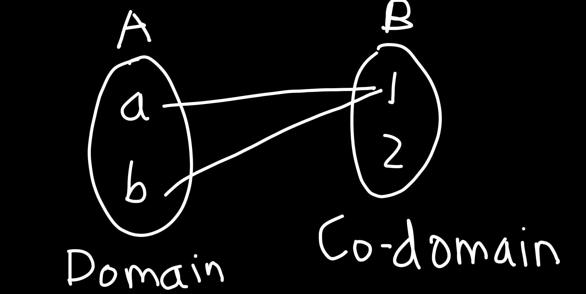
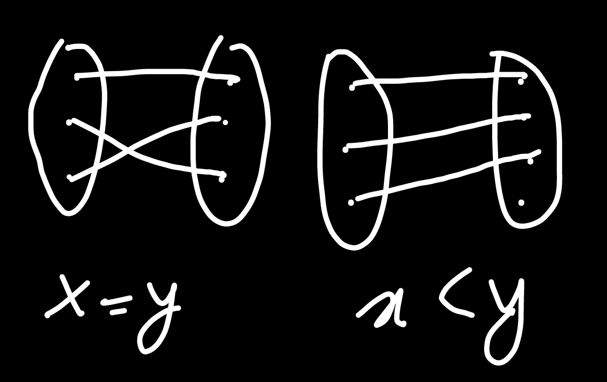
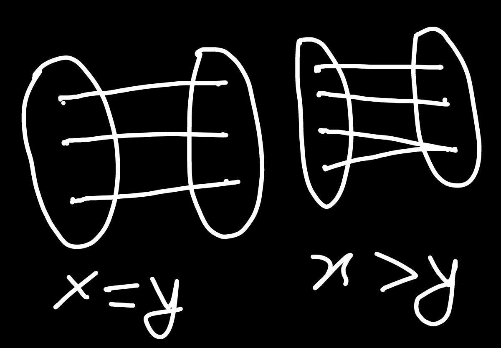

# Formulae
## FRL General
- Number of choices -
    - $A=\{1,2,3,4,5\}$
    - Let's form a sub-set of A with no constraints. Here, for each of the 5 elements, we may or may not include them in the subset. So, we have 2 choices per element. Total number of choices:
        > $2^5$ for 5 elements  
        > $2^n$ for n elements
    - If we had 3 choices per element, Total number of choices would be:
        > $3^5$ for 5 elements  
        > $3^n$ for n elements

## FRL Reflexive Relations
- Total number of relations: $n^2$
- Total number of Diagonal elements: $n$
- Total number of Non-Diagonal elements: Total number of elements in AxA - Total number of diagonal elements = $n^2-n$
- Total number of reflexive relations: $2^{Non-Diagonal}$ = $2^{n^2-n}$
- Total number of non-reflexive relations: $2^{n^2}-2^{n^2-n}$
- Smallest possible size: $n$
- Largest possible size: $n^2$

## FRL Irreflexive Relations
- Total number of Non-Diagonal elements: Total number of elements in AxA - Total number of diagonal elements = $n^2-n$
- All non-reflexive relations are not irreflexive relations.
- Total number of irreflexive relations: $2^{n^2-n}$
- Smallest possible size: 0 ($\{\}$)
- Largest possible size: $n^2-n$

## FRL Comparison of relations
> $A = \{1,2,3\}$, $AxA = \{(1,1),(2,2),(3,3),(1,2),(2,1),(1,3),(3,1),(2,3),(3,2)\}$

|Parameter|Reflexive|Irreflexive|Symmetric|Anti-symmetric|Asymmetric|Transitive|
|---|---|---|---|---|---|---|
|Cardinality of smallest relation|n|∅|∅|∅|∅|∅|
|Cardinality of largest relation|$n^2$|$n^2-n$|$n^2$|${(n^2+n)}/2$|$(n^2-n)/2$|$n^2$|
|Number of relations|$2^{n^2-n}$|$2^{n^2-n}$|$2^n.2^{(n^2-n)/2)}$|$2^n.3^{(n^2-n)/2}$|$3^{(n^2-n)/2}$|N/A|

## FRL Number Types
- **N** (Natural numbers) = {1,2,3,4,5 ... ∞}
- **Z** (Integers) = {-∞, ... +∞}
    - $Z^+$ = {1,2,3 ... ∞}
    - $Z^-$ = {-∞ ... -3,-2,-1}
- **Q** (Rational numbers) = Numbers which fit into the following criteria:
    1. Can be written as a fraction, where the denominator is not zero.  
        Example: $2.5/0$ is not a rational number
    1. Has a fixed number of digits after decimel, ie terminating decimels.  
        Example: $5/2=2.5$
    1. Has a repeating pattern of numbers after the decimel.  
        Example: $1/3=0.333...=0.\bar 3$ is a rational number
    - **Q\*** = {All of Q, excluding 0}
- **I** (Irrational numbers) = Numbers which cannot be written as a fraction, ie don't have a fixed number of digits after decimel, like π, $\sqrt 2$, etc.
- **R** (Real numbers) = Natural numbers, Integers, Rational numbers, Irrational numbers, etc. ie all types of numbers
- **C** = All complex numbers ie $(a+b_i)$

## FRL Group Theory
- **Algebriac Structure**: $a*b=c$, c has to exist in the domain.
- **Semi-group**: $(a*b)*c=a*(b*c)$
- **Monoid**: $(e*a)=(a*e)=a$, `e` = identity element
- **Group**: $(a*b)=(b*a)=e$, `e` = identity element
- **Albenian Group**: $(a*b)=(b*a)$, does not have to be equal to `e`

## FRL Functions
> $A=\{1,2,3,4...(x\ elements)\}$, $B=\{a,b,c,d, ... (y\ elements)\}$
- AxB=$x*y$ elements
- Number of relations possible: $2^x+2^y=2^{xy}$
- Number of choices per element of `A`: $y$
- Number of functions possible: $y^x$
- Number of relations which are not functions: $2^{xy}-y^{x}$

> $A=\{1,2,3,4...(x\ elements)\}$
- AxB=$x^x=x^{2}$ elements
- Number of relations possible: $2^{x^2}$
- Number of choices per element of `A`: $x$
- Number of functions possible: $x^x$
- Number of relations which are not functions: $2^{x^2}-x^{x}$

## FRL One-To-One Functions
> $A=\{1,2,3,4...(x\ elements)\}$, $B=\{a,b,c,d, ... (y\ elements)\}$
- Number of elements: $x \leq y$
- In set `A`, number of choices for:
    - 1st element: $y$
    - 2nd element: $(y-1)$
    - 3rd element: $(y-2)$
      ...
    - $x^{th}$ element: $y-(x-1)$
- Number of functions possible: $y*(y-1)*(y-2)*...*(y-(x-1))=P^{y}_x$
    > P: Permutation

## FRL Onto Functions
> $A=\{1,2,3,4...(x\ elements)\}$, $B=\{a,b,c,d, ... (y\ elements)\}$
- Number of elements: $x \geq y$
- If a function is one-to-one, it may not be onto.
- If a function is onto, it may not be one-to-one.
- Number of functions possible: $y*(y-1)*(y-2)*...*(y-(x-1))=P^{y}_x$
    > P: Permutation

## FRL Bijective Functions
> $A=\{1,2,3,4...(x\ elements)\}$, $B=\{a,b,c,d, ... (y\ elements)\}$
- Number of elements: $x = y = n$
- Number of functions possible: $n+(n-1)*(n-2)*...*1=n!$
    > !: Factorial

# Set Theory

## Set:
### A **well-defined** **unordered** collection of **distinct** elements.
- Unordered: Set {1,2,3,4} is same as {2,3,4,1}.
- Distinct: Set {1,2,3,4} is same as {1,1,2,2,3,4}.

 

## Null/Empty set
### A set with no elements, denoted by Φ or {}.
- Cardinality of an empty set is 0.
- {Φ} is not an empty set.
- Φ is present in every set.

 

## Subset
### If every element of Set A also exists in Set B, denoted by ⊆.
- **Example**: If A = {1,2,3,4}, A' = {1,2,3,4,5}, then A ⊆ A'.
- Every set is a subset of itself.
- Trivial subset: A set which contains all elements of A, is if A={1,2,3,4} and A'={1,2,3,4}.
- Proper subset: A set which is not a trivial subset of A, ie the subset can't be same / can't have the same length as A.
- If A⊆B & B⊆A, then A=B. #Note

## Cardinality
### Number of elements in a set.

## Power Set
### If 'A' is a finite set, then it is the set of all subsets of 'A'.
- **Example**: If $A = \{1,2,3\},\ P(A) = \{\{Φ\}, \{1\}, \{2\}, \{3\}, \{1,2\}, \{2,3\}, \{1,3\}, \{1,2,3\}\}$.
- If cardinality of a set is n, the number of elements in the power set is $2^n = 8$, ie $|P(a)| = |2^n|$
- Write all the sets starting with cardinality 0, then 1, then 2 ... and so on.

## Cartesian product
### Product of all elements of 1 set, with all elements of the other set.
- **Example**: If A={a,b} and B={1,2,3}, then:
    - $AxB = \{(a,1),(a,2),(a,3),(b,1),(b,2),(b,3)\}$ | If an element is (m,n), then m∈A & n∈B.
    - $BxA = \{(1,a),(1,b),(2,a),(2,b),(3,a),(3,b)\}$
- Total number of products, assuming Cardinality(A)=m & Cardinality(B)=n, is mxn.
- First multiply element 1 of A with element 1 of B, then element 1 of A with element 2 of B ... and so on.
- The order needs to be maintained, as is apparent in the example.
- AxB is not same as BxA, unless A=B.

## Relations
> also check [Cartesian Product](#cartesian-product)
### If A and B are two sets and AxB is their cartesian product, then **any subset of AxB can form a relation from A to B**.
- **Example**:
    - $\{(a,1),(a,2)\}$         | Valid
    - $\{(b,1),(b,2),(a,1)\}$   | Valid
    - $\{(1,a),(2,a)\}$         | Not Valid
- Total number of relations: $2^{mxn}$.

### Reflexive Relation
- [Formulae](#frl-reflexive-relations)
- A Relation 'R' on a set 'A' is said to be Reflexive if $(x,x)∊R ∀ x∊A$
- Every element of a set is related to itself.
- Points to remember:
    1. All elements must be present. 
    2. All of them must be related to themselves.
    3. After putting in all valid elements, we can put extra elements.
    4. The difference between a diagonal relation is that a reflexive relation may also contain extra elements.
- Example 0: $A = \{1,2,3\}$
    - $AxA = \{(1,1),(1,2),(1,3),(2,1),(2,2),(2,3),(3,1),(3,2),(3,3)\}$
    - Possible Reflexive relations:
        - $\{(1,1),(2,2),(3,3)\}$: *Smallest*
        - $\{(1,1),(2,2),(3,3),(2,1)\}$: *We may also put extra elements as long as the original condition has been satisfied.*
        - $\{(1,1),(2,2),(3,3),(2,1),(2,3)\}$
        - $\{(1,1),(2,2),(3,3),(2,1),(2,3),(3,1)\}$
        - $\{(1,1),(2,2),(3,3),(2,1),(2,3),(3,1),(3,2)\}$
        - $\{(1,1),(2,2),(3,3),(2,1),(2,3),(3,1),(3,2),(3,3)\}$: *Largest*
- Example 1: Check for reflexive relation: {$(x,y)$, $x-y$ is an integer}
    - $(2,3)$ cannot be in an answer, since it doesn't satisfy point 2.
    - $(1,1),(2,2),(3,3)$, etc. will satisfy the equation, as $1-1=0$, which is an integer. So **it is a reflexive relation**.
- Example 2: Check for reflexive relation: {$(x,y)$, $x-y$ is an odd number}
    - $(1,1),(2,2),(3,3)$, etc. will not satisfy the equation, as $1-1=0$, which is not an odd number. So **it is not a reflexive relation**.

### Irreflexive Relation
- [Formulae](#frl-irreflexive-relations)
- A Relation 'R' on a set 'A' is said to be Irreflexive if $(x,y)∉R\ ∀\ (x,y)∊A$
- No element of the set should be related to itself.
- Points to remember:
    1. We exclude all diagonal elements, and include the non-diagonal elements.
    2. **A not reflexive relation is not the same as an Irreflexive relation**. Example:
        - $A=\{1,2,3\}$, $R=\{(1,1),(2,2)\}$
        - Here, R is not a reflexive relation since it does not include (3,3). But, R is not in Irreflexive relation either, because it includes (1,1) & (2,2). So, it is just not a reflexive relation.
- Example 0: $A = \{1,2,3\}$
    - $AxA = \{(1,1),(1,2),(1,3),(2,1),(2,2),(2,3),(3,1),(3,2),(3,3)\}$
    - $R = \{(1,2),(1,3),(2,1),(2,3),(3,1),(3,2)\}$

### Symmetric Relation
- A Relation 'R' is symmetric, if for every $(x,y)∈R,\ (y,x)∈R\ ∀\ (x,y)∊A$.
- If $(x,y)$ is present in a Relation 'R' on a set 'A', then $(y,x)$ must also be present in the set.
- We first check if $(x,y)$ is present. We check for $(y,x)$ only if $(x,y)$ is present. It is not necessary for all possible relations to be present.
- Example 0: $A = \{1,2,3\}$
    - $AxA = \{(1,1),(1,2),(1,3),(2,1),(2,2),(2,3),(3,1),(3,2),(3,3)\}$
    - $\{(1,2),(2,1),(1,3),(3,1),(1,1)\}$: for $(1,1)$, it's Symmetric pair will also be $(1,1)$, which is a duplicate.
    - $\{(1,2),(1,3),(1,1)\}$: This is NOT a symmetric relation, because $(3,1)$ is not present for $(1,3)$.
- Example 1: Check: 'perpendicular-to' on a set of all lines.
    > Solution: If a line $L1 ⊥ L2$, then obviously $L2 ⊥ L1$. So, **this is a symmetric relation**.
- Example 2: Check: 'brother of' of all humans on Earth.
    > Solution: If X is a brother of Y, Y may be a sister of X. So, **it's not symmetric**.
- Example 3: Check: 'complement of', on a set of numbers.
    > Solution: If `X` is a complement of `Y`, then `Y` is also a complement of `X`. So, **the relation is symmetric**.

### Anti-symmetric Relation
- A Relation 'R' is anti-symmetric, if for every $(x,y)∈R,\ (y,x)∈R\ ∀\ (x,y)∊A, only\ if\ (x=y)$.
- If $(x,y)$ is present in a Relation 'R' on a set 'A', then $(y,x)$ should only also be present in the relations if $x=y$. Otherwise, it must not be present.
- We first check if $(x,y)$ is present. We check for $(y,x)$ only if $(x,y)$ is present. It is not necessary for all possible relations to be present.
- Example 0: $A = \{1,2,3\}$
    - $AxA = \{(1,1),(1,2),(1,3),(2,1),(2,2),(2,3),(3,1),(3,2),(3,3)\}$
    - $\{(2,1),(3,1),(1,1)\}$: TRUE, for $(2,1)$, $(1,2)$ must not be present since $(2≠1)$. For $(1,1)$, it's Symmetric pair is $(1,1)$, which is fine since $(1=1)$.
    - $\{(1,2),(2,1),(1,3),(1,1)\}$: FALSE, because $(2,1)$ is present.

### Asymmetric Relation
- A Relation 'R' is asymmetric, if for every $(x,y)∈R,\ (y,x)∉R\ ∀\ (x,y)∊A$.
- If $(x,y)$ is present in a Relation 'R' on a set 'A', then $(y,x)$ should only also be present in the relationsif $x=y$. Otherwise, it must not be present.
- We first check if $(x,y)$ is present. We check for $(y,x)$ only if $(x,y)$ is present. It is not necessary for all possible relations to be present.
- Example 0: $A = \{1,2,3\}$
    - $AxA = \{(1,1),(1,2),(1,3),(2,1),(2,2),(2,3),(3,1),(3,2),(3,3)\}$
    - $\{(2,1),(3,1),(2,3)\}$: TRUE, for all $(x,y)$, $(y,x)$ is not present in the relation.
    - $\{(2,2),(3,1),(2,3),(1,1)\}$: FALSE, because $(1,1)$ is present, and it's duplicate ie $(1,1)$ should not be present.
- Every Asymmetric relation is anti-symmetric. An Asymmetric relation is more restrictive than an anti-symmetric relation, since an asymmetric relation does not allow $(y,x)$ (for every $(x,y)$) to be present even if $(x=y)$.
- Every Anti-symmetric relations is not asymmetric. An anti-symmetric relation allows $(y,x)$ to be present if $(x=y)$.

### Transitive Relation
- A Relation 'R' is Transitive, if for every $(x,y)∈R\ \&\ (y,z)∈R$, $(x,z)∈R$ ∀ $(x,y)∊A$.
- If $(x,y)$ & $(y,z)$ is present in a Relation 'R' on a set 'A', then $(x,z)$ should also be present in the relation.
- If any or x,y or z is not present in the relation, then the relation is transitive by default.
- Example 0: $A = \{1,2,3\}$
    - $\{(1,1),(2,2)\}$: TRUE, x,y & z are not present together.
    - $\{Φ\}: TRUE, none of the elements are present.
    - $\{(1,2),(2,3)\}$: FALSE, since $(x,z)$ ie $(1,3)$ is not present.
        > x = 1, y = 2, z = 3
    - $\{(1,1),(1,2),(2,1)\}$: TRUE, since in both cases the conditions are matching.
        > x = 1, y = 1, z = 2
        > z = 1, y = 2, z = 1

### Equivalence Relation
- A Relation 'R' is equivalence, if it is `reflexive`, `symmetric` or `transitive`.
- Example 0: $A = \{1,2,3\}$
    - $\{(1,1),(2,2),(3,3)\}$: TRUE
    - $\{(1,1),(2,2),(3,3),(2,1),(1,2)\}$: TRUE
    - $\{(1,1),(2,2),(3,3),(3,2),(1,3)\}$: FALSE, because $(2,3)$ is not present for $(3,2)$, so it's not symmetric.
    - $\{\ \}$: FALSE, since $(1,1),(2,2),(3,3)$ is not present, so it is not a reflexive relation.

### Partially Ordered Set
- A Relation 'R' is said to be a partial-ordering relation if R is `reflexive`, `anti-symmetric` as well as `transitive`.
- Partially odered set: A set 'A' with Partial-Ordering relation 'R' defined on 'A' is called POSET, defined by [A;R]
- Example 0: $A = \{1,2,3\}$
    - $\{(1,1),(2,2),(3,3)\}$: TRUE
    - $\{(1,1),(2,2),(3,3),(1,2),(2,3),(1,3)\}$: TRUE
    - [A,$\leq$] is a POSET: TRUE,
        > $(1 \leq 1)$ is true, so relation is reflexive.  
        > $(1 \leq 1)$ is true, and for $(1.5 \leq 2.5)$, $(2.5 \leq 1,5)$ is not true. So, relation is anti-symmetric.  
        > $(1 \leq 2.5)$, $(2.5 \leq 3)$, then $(1 \leq 3)$ is also true. So, the relation is transitive.

### Totally Ordered Set
- A POSET {A,R} is called a totally ordered set if every pair of elements in set `A` are comparable, ie, if:
    > $aRb\ or\ bRa\ ∀\ (a,b) ∈A$
- The set has to mandatorily be a [Partially Ordered Set](#partially-ordered-set). In other words, every TOS is a POSET.
- Example 0: $(A,÷)∈R\ ∀ (A∈I)$, I=Integers: FALSE.
    > A = {1,2,3,4,5,6,7,8...∞}  
    > Reflexive: $(1,1),(2,2),(3,3)∈R$  
    > Anti-symmetric: $(4,2)∈R$ but $(2,4)∉R$  
    > Transitive: If $(8,4)∈R\ \&\ (4,2)∈R$, then $(8,2)∈R$.  
    > TOS: $(2,3),(4,8)$, etc. are not comparable when the domain consists only of positive integers.
- Example 1: $(A,\leq)∈R\ ∀ (A∈R)$, I=Real numbers: TRUE.
- Example 2: $(A,∈)∈R\ ∀ A∈\{\{∅\},\{a\},\{b\},\{a,b\}\}$: FALSE.
    > $\{a\}$ is not comparable with $\{b\}$.

### Comparison of all relations
See [comparison of relations](#frl-comparison-of-relations) in section `formulae`.
- Explanation:
    > $A = \{1,2,3\}$  
    > $AxA = \{(1,1),(2,2),(3,3),(1,2),(2,1),(1,3),(3,1),(2,3),(2,2)\}$
    - Reflexive:
        - Smallest: $\{(1,1),(2,2),(3,3)\}$ | Cardinality: $n$
        - Largest: $\{(1,1),(2,2),(3,3),(1,2),(2,1),(1,3),(3,1),(2,3),(3,2)\}$ | Cardinality: $n^2$
        - Number of relations: For $\{(1,1),(2,2),(3,3)\}$ ie `n` elements, we don't have a choice. For the rest $\{(1,2),(2,1),(1,3),(3,1),(2,3),(3,2)\}$ ie $(n^2-n)$ elements, we have 2 choices per pair. So, the total number of choices: $2^{n^2}-2^{n} = 2^{n^2-n}$
    - Irreflexive:
        - Smallest: $\{\}$ | Cardinality: ∅
        - Largest: $\{(1,2),(2,1),(1,3),(3,1),(2,3),(3,2)\}$ | Cardinality: $n^2-n$
        - Number of relations: $2^{n^2-n}$
    - Symmetric:
        - Smallest: $\{\}$ | Cardinality: ∅
        - Largest: $\{(1,1),(2,2),(3,3),(1,2),(2,1),(1,3),(3,1),(2,3),(3,2)\}$ | Cardinality: $n^2$
        - Number of relations: For $\{(1,1),(2,2),(3,3)\}$ ie `n` elements, we have 2 choices per pair. For the rest $\{(1,2),(2,1),(1,3),(3,1),(2,3),(3,2)\}$ ie $(n^2-n)$ elements, if (1,2) is present, (2,1) also needs to be present. So, we have 2 choices per respective double-pair. Total number of choices: $2^{n}.2^{(n^2-n)/2}$
    - Anti-symmetric:
        - Smallest: $\{\}$ | Cardinality: ∅
        - Largest: $\{(1,1),(2,2),(3,3),(1,2),(1,3),(2,3)\}$ OR $\{(1,1),(2,2),(3,3),(2,1),(3,1),(3,2)\}$ | Cardinality: $n+[(n^2-n)/2]=(2n+n^2-n)/2=(n^2+n)/2$
        - Number of relations: For $\{(1,1),(2,2),(3,3)\}$ ie `n` elements, we have 2 choices per pair. For the rest $\{(1,2),(2,1),(1,3),(3,1),(2,3),(3,2)\}$ ie $(n^2-n)$ elements, if (1,2) is present, (2,1) must not be present and vice versa. So, we can either take (1,2) or (2,1) exclusively, or we can exclude both. We have 3 choices per double-pair. Total number of choices: $2^{n}.3^{(n^2-n)/2}$
    - Asymmetric:
        - Smallest: $\{\}$ | Cardinality: ∅
        - Largest: $\{(1,2),(1,3),(2,3)\}$ OR $\{(2,1),(3,1),(3,2)\}$ | Cardinality: $(n^2-n)/2$
        - Number of relations: For $\{(1,1),(2,2),(3,3)\}$ ie `n` elements, we cannot take them. For the rest $\{(1,2),(2,1),(1,3),(3,1),(2,3),(3,2)\}$ ie $(n^2-n)$ elements, if (1,2) is present, (2,1) must not be present and vice versa. So, we can either take (1,2) or (2,1) exclusively, or we can exclude both. We have 3 choices per double-pair. Total number of choices: $3^{(n^2-n)/2}$
    - Transitive:
        - Smallest: $\{\}$ | Cardinality: ∅
        - Largest: $\{(1,1),(2,2),(3,3),(1,2),(2,1),(1,3),(3,1),(2,3),(2,2)\}$ | Cardinality: $n^2$

# Group Theory
Algebriac Structure >> Semi-group >> Monoid >> Group >> Abelian Group
## Algebriac Structure
- A non-empty set S is called Algebriac Structure with respect to binary operation `*` if $(a*b)=c\ ∀\ \{(a,b,c)∈S\}$
- `c` needs to exist in the domain.
- `*` is closure operation on `S`
- Prerequisites: none
- Example 0:
    > N = Natural numbers
    - (N,+): TRUE
    - (N,-): FALSE
        > $3-5=-2$, which is an integer
    - (N,.): TRUE
        > We won't have 0 unless we multiply any number by 0, which won't happen in this case
    - (N,/): FALSE
        > $1/2=0.5$, which is not a rational number
- Example 1:
    > Z = Integers
    - (Z,+): TRUE
    - (Z,-): TRUE
    - (Z,.): TRUE
    - (Z,/): FALSE
        > $5/2=2.5$, which is a rational number
- Example 2:
    > R = Real numbers
    - (R,+): TRUE
    - (R,-): TRUE
    - (R,.): TRUE
    - (R,/): TRUE
- Example 3:
    > Q: Rational numbers
    - (Q,+): TRUE
    - (Q,-): TRUE
    - (Q,.): TRUE
    - (Q,/): FALSE
        > $2/0=∞$, where the denominator is zero
- Example 4:
    > Q*: Rational numbers, excluding 0
    - (Q*,+): TRUE
    - (Q*,-): TRUE
    - (Q*,.): TRUE
    - (Q*,/): TRUE
        > $5/0$ can't be done because 0 doesn't exist in the range of Q*

## Semi-group
- An Algebriac Structure (S,*) is called Semi-group if it follows associative property, ie $(a*b)*c = a*(b*c) ∀\ \{(a,b,c)∈S\}$
- Prerequisites: `Algebriac Structure`
- Example 0:
    > N = Natural numbers
    - (N,+): TRUE | TRUE
    - (N,-): FALSE | null
    - (N,.): TRUE | TRUE
    - (N,/): FALSE | null
- Example 1:
    > Z = Integers
    - (Z,+): TRUE | TRUE
    - (Z,-): TRUE | FALSE
        > $2-(3-5)≠(2-3)-5$
    - (Z,.): TRUE | TRUE
    - (Z,/): FALSE | null
- Example 2:
    > R = Real numbers
    - (R,+): TRUE | TRUE
    - (R,-): TRUE | FALSE
        > $2-(3-5)≠(2-3)-5$
    - (R,.): TRUE | TRUE
    - (R,/): TRUE | FALSE
        > $8/(4/2)≠(8/4)/2$
- Example 3:
    > Q: Rational numbers
    - (Q,+): TRUE | TRUE
    - (Q,-): TRUE | FALSE
        > $3.5-(2.5-1.5)≠(3.5-2.5)-1.5$
    - (Q,.): TRUE | TRUE
    - (Q,/): FALSE | null
- Example 4:
    > Q*: Rational numbers, excluding 0
    - (Q*,+): TRUE | TRUE
    - (Q*,-): TRUE | FALSE
        > $3.5-(2.5-1.5)≠(3.5-2.5)-1.5$
    - (Q*,.): TRUE | TRUE
    - (Q*,/): TRUE | FALSE
        > $10/(5/2.5)≠(10/5)/2.5$
- Example 5:
    - {$2^n$ | n is an integer w.r.t multiplication}
    - $2^5.2^{10}.2^8=8388608$, which is an integer.
    - $2^5.(2^{10}.2^8)=(2^5.2^{10}).2^8$, so TRUE

## Monoid
- A Semi-group (S,*) is called Monoid if there exists one element $(e∈S)$, such that $(e*a) = (a*e) = a\ ∀\ \{a∈S\}$
- `e` is the identity element, $(a*e = a)$. Our goal is to find the identity element. If it exists, then the resultant group is a Monoid. 
    > Example: 10+`0`=10, a+`e`=a
- Prerequisites: `Algebriac Structure`, `Semi-group`
- Example 0 (`Algebriac Structure` | `Semi-group` | `Monoid`):
    > N = Natural numbers
    - (N,+): TRUE | TRUE | FALSE
    - (N,-): FALSE | null | null
    - (N,.): TRUE | TRUE | TRUE
        > 2*`1`=2
    - (N,/): FALSE | null | null
- Example 1:
    > Z = Integers
    - (Z,+): TRUE | TRUE | TRUE
    - (Z,-): TRUE | FALSE | null
    - (Z,.): TRUE | TRUE | TRUE
    - (Z,/): FALSE | null | null
- Example 2:
    > R = Real numbers
    - (R,+): TRUE | TRUE | FALSE
    - (R,-): TRUE | FALSE | null
    - (R,.): TRUE | TRUE | TRUE
    - (R,/): TRUE | FALSE | null
- Example 3:
    > Q: Rational numbers
    - (Q,+): TRUE | TRUE | FALSE
        > $4/2+0/0=4/2$, but `0/0` is not allowed.
    - (Q,-): TRUE | FALSE | null
    - (Q,.): TRUE | TRUE | FALSE
        > $0*b=0$, b cannot be found.
    - (Q,/): FALSE | null | null
- Example 4:
    > Q*: Rational numbers, excluding 0
    - (Q*,+): TRUE | TRUE | FALSE
    - (Q*,-): TRUE | FALSE | null
    - (Q*,.): TRUE | TRUE | TRUE
    - (Q*,/): TRUE | FALSE | null
- Example 5:
    - ($2^n$, `n` = Integer wrt multiplication): TRUE | TRUE | TRUE
        > $2^n.2^0=2^n$

## Group
- A Monoid (S,*) is called Group if for each element $(a∈S)$, there exists an element $(b∈S)$, such that $(a*b) = (b*a) = e$
- `e` is the identity element.
- Prerequisites: `Algebriac Structure`, `Semi-group`, `Monoid`
- Example 0 (`Algebriac Structure` | `Semi-group` | `Monoid` | `Group`):
    > N = Natural numbers
    - (N,+): TRUE | TRUE | FALSE | null
    - (N,-): FALSE | null | null | null
    - (N,.): TRUE | TRUE | TRUE | FALSE
    - (N,/): FALSE | null | null | null
- Example 1:
    > Z = Integers
    - (Z,+): TRUE | TRUE | TRUE | TRUE
    - (Z,-): TRUE | FALSE | null | null
    - (Z,.): TRUE | TRUE | TRUE | FALSE
    - (Z,/): FALSE | null | null | null
- Example 2:
    > R = Real numbers
    - (R,+): TRUE | TRUE | FALSE | null
    - (R,-): TRUE | FALSE | null | null
    - (R,.): TRUE | TRUE | TRUE | FALSE
        > For 0, it is invalid since we can't find `b` in $a.b=e$
    - (R,/): TRUE | FALSE | null | null
- Example 3:
    > Q: Rational numbers
    - (Q,+): TRUE | TRUE | FALSE | null
    - (Q,-): TRUE | FALSE | null | null
    - (Q,.): TRUE | TRUE | FALSE | null
    - (Q,/): FALSE | null | null | null
- Example 4:
    > Q*: Rational numbers, excluding 0
    - (Q*,+): TRUE | TRUE | FALSE | null
    - (Q*,-): TRUE | FALSE | null | null
    - (Q*,.): TRUE | TRUE | TRUE | TRUE
    - (Q*,/): TRUE | FALSE | null | null

## Abelian Group
- A Group (G,*) is called an Abelian Group if $(a*b) = (b*a)\ ∀\ \{(a,b)∈G\}$
- Prerequisites: `Algebriac Structure`, `Semi-group`, `Monoid`, `Group`
- Example 0 (`Algebiac Structure` | `Semi-group` | `Monoid` | `Group` | `Abelian Group`):
    > N = Natural numbers
    - (N,+): TRUE | TRUE | FALSE | null | null
    - (N,-): FALSE | null | null | null | null
    - (N,.): TRUE | TRUE | TRUE | FALSE | null
    - (N,/): FALSE | null | null | null | null
- Example 1:
    > Z = Integers
    - (Z,+): TRUE | TRUE | TRUE | TRUE | TRUE
    - (Z,-): TRUE | FALSE | null | null | null
    - (Z,.): TRUE | TRUE | TRUE | FALSE | null
    - (Z,/): FALSE | null | null | null | null
- Example 2:
    > R = Real numbers
    - (R,+): TRUE | TRUE | FALSE | null | null
    - (R,-): TRUE | FALSE | null | null | null
    - (R,.): TRUE | TRUE | TRUE | FALSE | null
    - (R,/): TRUE | FALSE | null | null | null
- Example 3:
    > Q: Rational numbers
    - (Q,+): TRUE | TRUE | FALSE | null | null
    - (Q,-): TRUE | FALSE | null | null | null
    - (Q,.): TRUE | TRUE | FALSE | null | null
    - (Q,/): FALSE | null | null | null | null
- Example 4:
    > Q*: Rational numbers, excluding 0
    - (Q*,+): TRUE | TRUE | FALSE | null | null
    - (Q*,-): TRUE | FALSE | null | null | null
    - (Q*,.): TRUE | TRUE | TRUE | TRUE | TRUE
    - (Q*,/): TRUE | FALSE | null | null | null

## Functions
> also check [Relations](#relations)
- [Formulae](#frl-functions)
- A Relation `f` from a set `A` to a set `B` is called a function if, for each element of `A`, we have assigned an unique (only one) element of `B`.
- Check `Example 0` for `Domain`, `Co-domain`, `Range`.
- Example 0, $A = \{a,b\}$, $B = \{1,2\}$, $AxB=\{(a,1),(a,2),(b,1),(b,2)\}$:
    - $(a,1),(b,2)$=TRUE
    - $(a,2),(b,1)$=TRUE
    - $(a,1),(b,1)$=TRUE
    - $(a,1),(a,2),(b,2)$=FALSE, `a` cannot be mapped to both `1` & `2` at the same time.
    - **Domain**: Set $A = \{a,b\}$
    - **Co-domain**: Set $B = \{1,2\}$
    - **Range**: Number of participants in Set `B`.

### One-To-One Function (Injective)
- [Formulae](#frl-one-to-one-functions)
- A function `f` from set `A` to set `B` is one-to-one if each element in `A` is mapped to only 1 element in `B`. All elements in `A` should be mapped.
     

### Onto Function (Surjective)
- [Formulae](#frl-onto-functions)
-  A function `f` from set `A` to set `B` is onto if each element in `B` is mapped to atleast 1 element of `A`.
- Every element in `A` must also participate in the function, since it is a function in the first place.
     

### Bijective Function
- [Formulae](#frl-bijective-functions)
- A function `f` from set `A` to set `B` is bijective  if `f` is both one-to-one and onto.
- Number of elements in A should be equal to number of elements in B.

# Probability & Statistics
- **Random experiment**: The experiment for which the outcome is uncertain.
- **Sample space**: The set of all possible outcomes of a Random Experiment is called Sample space. Denoted by `S`.
    - Example 0: Flipping a coin, $S=\{head, tail\}$.
    - Example 1: Rolling a dice: $S=\{1,2,3,4,5,6\}$
- **Event**: Any subset of Sample space is called an Event. Usually denoted by `E`.
    - Example 0: `head` appearing when a coin is flipped.
- **Probability of an Event**: Probability of Event `A` is given by:
    - $P(A)={Number\ of\ elements\ in\ `S`\ that\ favour\ occurence\ of\ `A`} \div {Total\ number\ of\ elements\ in\ `S`}$
    - Example 0:
        - Rolling a dice; $S=\{1,2,3,4,5,6\}$; $n(S)=6$
        - A: Getting even number, $A=\{2,4,6\}$; $n(A)=3$
        - $P(Getting\ an\ even\ number)=3/6=1/2$
- Axioms of Probability:
    > Axiom: Statements that are correct by default, but have no proof as such.  
    > Theorem: Statements that are correct, and can also be proved.
    1. Probability of an event always lies between `0` & `1`. $0 \le P(A)\le 1$
    1. If $S$ is the Sample space of a Random Experiment, then all  outcomes of the Experiment will definitely be from $S$. $P(S)=1$
    1. If there are `n` elements in a Sample space, out of which `m` elements favour the occurence of `A`, then: 
        - Odds in favour of `A` = $m / {(n-m)}$ = Number of ways `A` can occur / Number of ways `A` cannot occur.
        - Odds against `A` = $(n-m) / m$ = Number of ways `A` cannot occur / Number of ways `A` can occur.
    1. If `A` is any event within Sample space `S`, and $n(A)$ is the number of Events that favour occurence of `A`, then the Probability of `A` to not happen: $P(A^c) = (n(S)-n(A))/n(S) = (1-n(A))/n(S) = 1-P(A)$.
- Types of Events:
    - **Mutually Exhaustive**: If Events `A` & `B` together form the Sample space `S`, $A∪B=S$
        - Example 0: Experiment: Rolling a dice.
            - `A`: Getting an even number; $A = \{2,4,6\}$
            - `B`: Getting an odd number; $B = \{1,3,5\}$
            - $A∪B=\{1,2,3,4,5,6\}=S$, so Mutually Exhaustive
            - $A∩B={}=ϕ$, so Mutually Exclusive
    - **Mutually Exclusive**: If Events `A` & `B` don't intersect each other, $A∩B=ϕ$
        - Example 0: Experiment: Rolling a dice.
            - `A`: Getting a prime number; $A = \{2,3,5\}$
            - `B`: Getting a composite number; $B = \{4,6\}$
            - $A∩B={}=ϕ$, so Mutually Exclusive
            - $A∪B=\{2,3,4,5,6\} \neq S$, so not Mutually Exhaustive
    - **Impossible**: If there is no feasable outcome of the event `A` in Sample space `S`. Denoted by `ϕ`.
        - Example: Probability of Getting a number >6 when Rolling a dice.
            - $S=\{1,2,3,4,5,6\}$
            - $A=\{ϕ\}$
            - $P(A)=n(A)/n(S)=0/6=0$
