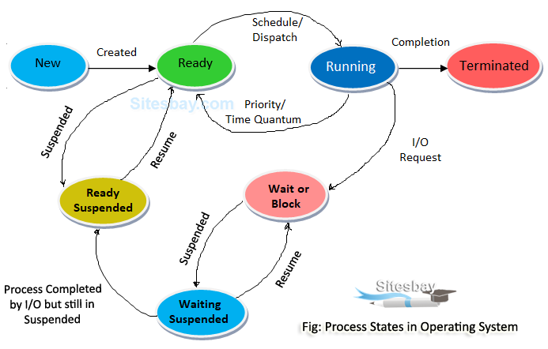

# Basics

## Goals of an Operating System
- Provide convenience to the user.
- Provide user-friendliness.
- Provide an interface to allow users to use applications to access & instruct the hardware.
- Hardware management
- Process management: Manage all currently running processes in the system. CPU Scheduling algorithms are used to determine which process will be executed by the CPU.
- Memory management: Manage volatile memory, dynamically allocate storage to ensure efficient utilization of the available volatile memory.
- Storage management: Manage non-volatile storage, using File System.
- Security:
    - Provide a certain level of security, so only authorized users can unlock and use the computer system.
    - Processes cannot access each other's data. Processes can only use the segment of CPU & RAM allocated to them.

## Types of Operating Systems

### Batch OS
- During 1960's, computers weren't so common. So we needed to go to a particular place, which provided computing services, to get the job done.
- The jobs were first loaded offline to a physical storage device like punch card, paper tape, magnetic tape, etc.
- They were then submitted to the operator.
- The Operator sorted jobs into batches.
- The first batch was provided to the CPU for execution. All jobs were executed by the CPU one by one.
- Since only 1 job was executed at a time, if the job needed I/O time, the CPU would remain idle in that time. This was a major disadvantage.
- When the CPU had finished executing the job and produced the result, it was loaded in the physical storage again, and given back to the user.
- Later on, IBM launched FORTRAN & IBSYS709X, which provided monitors where the user could directly punch the punch card.

### Multi-programming
- The objective is to bring as many processes to the volatile memory as possible.
- It's nature is **non-preemptive**, ie only 1 process is executed by the CPU at any time. If the process needs I/O, the processor will remain idle during that time.
- The CPU won't move to the next process unless the current process has either finished executing or until the process tells it to move on, by itself.

### Multitasking / Time Sharing
- It's nature is **pre-emptive**, ie each process is allocated a specific time interval to execute itself, regardless of how much time it needs. After the time-quantum expires, it has to leave the CPU to make room for another process.
- It ensures that no process has to wait for a very long amount of time to execute itself. All processes are executed within a reasonable amount of time, and no process is left out.
- It results in more responsiveness, compared to a Multi-programming OS.

## Process States



Image taken from [here](https://www.sitesbay.com/os/images/process-states-in-operating-system.png)

- There are **5 main states** & 2 suspend states: **New**, **Ready**, Suspend Ready, **Running**, **Wait/Block**, Suspend Wait, **Terminated**.
- New <-> **Long-Term Scheduler (LTS)** <-> Ready
- Ready <-> **Short-Term Scheduler (STS)** <-> Running
- Ready / Wait <-> **Medium-Term Scheduler (MTS)** <-> Suspend Ready / Suspend wait

- **New**: At first, a new process is created.
- **Ready**:
    - The process is allocated memory & other resources as per needs.
    - The **LTS (Long-Term Scheduler)** is responsible for bringing processes in from the `New` state.
    - At the end of this state, it is ready to be executed.
 - **Running, Wait**:
    - The Job Scheduler queues all the processes in the `Ready` state, and dispatches it to the CPU for executing.
    - The **STS (Short-Term Scheduler)** is responsible for moving processes back and forth the `Ready` & `Running` states.
    - During execution, sometimes the process is moved back to `Ready` queue:
        - if a higher priority Process `HP` arrives in the `Ready` queue, the currently running process `P` is moved to the `Ready` state to make room for process `P`.
        - If the `Ready` queue is already full, the MTS (Medium-Term Scheduler) moves some processes to the `Suspend Ready` queue to make room for Process `HP`.
        - when using time-quantum based algorithms like Round Robin. If the time-quantum is 2 seconds, it means that each running process will be given 2 seconds of CPU Time, after which it'll have to make room for another process.
        - CPU initiates this process.
    - During execution, sometimes the process requires some I/O operation. If that happens, it is moved to the `Wait/Block` state, where it can perform the operation it needs.
        - The secondary storage is usually much much slower than the CPU. This is done to reduce CPU idle time.
        - The process initiates this request.
        - After the I/O operation has finished, the CPU moves back to the `Ready` state.
    - If a lot of processes need to execute I/O operations at the same time, the I/O queue will get full. In such a case, some processes are swapped out to the secondary memory ie moved to the `suspend wait` queue.
        - The **MTS (Medium-Term Scheduler)** is responsible for swapping processes to and from `Wait/Block` state and `Suspend Wait` state.
        - After the I/O operation is complete and the process is in the `Suspend Wait` state, it tries to get back to the `Wait` state. If the `Wait` queue is full for a significant amount of time, it is moved to the `Ready` queue. This is called `Backing Store`.
- **Terminated**: After the execution of the process is complete, all resources are de-allocated, and the process moves to the `Terminated` state.

## System Calls
- By default, we use software/apps in **user-mode**.
- In user-mode, we don't have the rights to directly interact with the hardware. The kernel manages that part, as part of the operating system.
- When we want to communicate with or send information to hardware, we need to interact with the kernel, using `system calls`.
- So, a system call is used to invoke the kernel to perform operations on hardware, files, etc.

### Types of System Calls
- **File-related**: During execution, if the process needs access to a particular file, it requests the kernel to provide it access, using file-related system calls. Example: `open()`, `read()`, `write()`, `close()`, create file.
- **Device-related**: We obtain the rights to access and talk to hardware, using these system calls. Example: read, write, reposition, `ioctl`.
- **Information-related**: We use these system calls when we want to get information about something. Example: `getPid`, attributes, system-wide time & date.
- **Process control**: These are used for managing processes. Example: `load()`, `execute()`, `abort()`, `fork()`, `nbit`, `signal`, `allocate`. `wait` & `signal` are used for process synchronization.
- **Communication**: These are used by processes to communicate among themselves. Example: `pipe()`, create/delete connections, `shmget()` [get value of the shared memeory].
- **Security**: Here, we're mostly concerned with security & permissions. Examples: `chmod`, `chown`, `umask`.

### chmod (Change mode)
```bash
$ ls -lh  # Easiest way to display current permissions
total 12K
drwxr-xr-x 2 sayan sayan 4.0K Aug 13 20:39 dir1:
-          Directory?
 ---       Read, write, execute permissions for Owner / User who owns the file/directory (u)
    ---    Read, write, execute permissions for Group                                    (g)
       --- Read, write, execute permissions for Others (Everyone else)                   (o)
```

Changing permissions:
- Can be done in 2 ways:
    - Method 1:
        - Permissions can either be defined specifically for `u/g/o`, or they can be combined together.
        - `o-x` means we're stripping the `execute` permission off `others`.
        - `ug+w` means we're providing `user` & `group` with the `write` permission.
        - `a+x` means we're giving everyone (ie user, group & others) the `execute` permission.
        - Example:
            ```bash
            $ chmod o-x dir1  # Remove 'execute' permission for 'others'.
            $ chmod o+w dir1  # Add 'write' permission for 'others'.
            $ chmod a+x dir1  # Add 'write' permission for everyone (u,g as well as o).
            $ chmod -R o+w dir1  # Add 'write' permission for 'others' recursively.
            $ chown abcd dir1 # Transfer directory ownership to user 'abcd'.
            $ chown -R abcd dir1 # Transfer directory ownership to user 'abcd' recursively.
            ```
    - Method 2 (octal): `chmod <user><group><other> file`, or `chmod ugo file`.
        - Meaning of the numbers: $r=4,\ w=2,\ x=1$
        - Permissions are denoted by numbers like $1,2,4$ or a sum of any of the numbers, like $5,6,7$.
        - Permissions are defined in sequence, for `u`,`g` and `o`.
        - Example:
            ```bash
            chmod 111 abcd  # u=x | g=x | o=x
            chmod 666 abcd  # u=rw | g=rw | o=rw
            chmod 421 abcd  # u=r | g=w | o=x
            ```

### lseek()
- It is a system call that is used to change the location of the read/write pointer of the file descriptor.
- By default, pointer stays in the beginning, at index `0`.

- Syntax & example (input file = `1234567890abcdefghij`):
```bash
lseek(int file_descriptor,  offset, int whence)
lseek(n,10,SEEK_CUR) # It goes 10 bytes from character `1`, ie to `0`.
lseek(n,5,SEEK_SET)  # pointer is set at the location 5, ie at `5`.
```
- `file_descriptor`: The file descriptor of the pointer that is going to be moved.
- `offset`: The off-set of the pointer.
- `whence`: The method in which the offset will be interpreted. Possible values:
    - `SEEK_SET`: Set the off-set to the specified index.
    - `SEEK_CUR`: Off-set from current location of the pointer.
    - `SEEK_END`: Off-set from the end.


