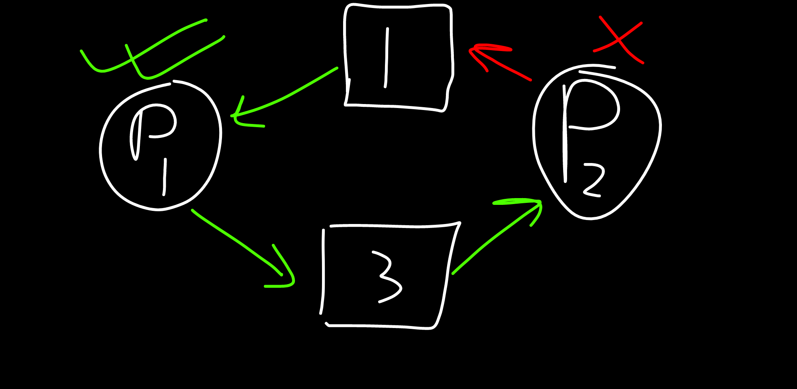
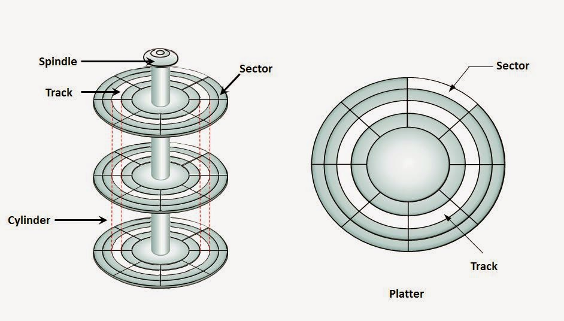

<!-- ID: 2 -->

# Formulae
## FRL-General
- If number of forks = $n$:
    > Total Number of processes created = $2^n$ <br>
    > Number of child processes = $2^n-1$
    ```c
    fork();
    fork();
    // ... n times
    printf("Hello!");
    ```
    ... will print("Hello!") $2^n$ times.

- Number of frames = Main memory size / frame size
- Number of pages = Process size / Page size

## FRL-Deadlock
- If a system has 3 processes each requiring 2 units of resources `R`.  The solution to finding the minimum number of units of `R` such that no deadlock will occur is:
    - Allocate 1 less than the amount of resources needed to each process (1+1+1 here). Then add 1 to it (4). This is **the minimum number of resources** we need to prevent Deadlock.
    - Consequently, when we allocate 1 less than the amount of resources needed to each process, it becomes **the maximum number of resources** needed for Deadlock to occur.
    n
    Number of child processes = 2n−12n−1

fork();
fork();
// ... n times
printf("Hello!");

… will print(“Hello!”) 2n2n times.

Number of frames = Main memory size / frame size

Number of pages = Process size / Page size
- If a system has 3 processes that share 4 instances of the same resource type, and each process can request `k` instances of that resource, then to find the maximum value of `k` (to avoid deadlock), the following equation must be true: $Processes + Resources > Total\ Demand$
    - $R+n \leq \sum (i=1\ to\ n)\ D_i$, for deadlock to occur
    - $R+n > \sum (i=1\ to\ n)\ D_i$, to prevent deadlock

# FRL Memory Management
- If each process consumes 4MB, and there is 8MB of primary memory available, we can accomodate 2 processes in the memory. If it does I/O operations for $K=0.7$ ie $70\%$ of it's time, CPU  Utilization: $1-K^2=1-0.49=0.51$ ie $51\%$.
- (TLB Paging Scheme) Effective Memory Access Time: (Hit Ratio) * (TLB+x) + (Miss Ratio) * (TLB+x+x) {x = Main Memory Access Time}


# Basics

## Goals of an Operating System
- Provide convenience to the user.
- Provide user-friendliness.
- Provide an interface to allow users to use applications to access & instruct the hardware.
- Hardware management
- Process management: Manage all currently running processes in the system. CPU Scheduling algorithms are used to determine which process will be executed by the CPU.
- Memory management: Manage volatile memory, dynamically allocate storage to ensure efficient utilization of the available volatile memory.
- Storage management: Manage non-volatile storage, using File System.
- Security:
    - Provide a certain level of security, so only authorized users can unlock and use the computer system.
    - Processes cannot access each other's data. Processes can only use the segment of CPU & RAM allocated to them.

## Types of Operating Systems

### Batch OS
- During 1960's, computers weren't so common. So we needed to go to a particular place, which provided computing services, to get the job done.
- The jobs were first loaded offline to a physical storage device like punch card, paper tape, magnetic tape, etc.
- They were then submitted to the operator.
- The Operator sorted jobs into batches.
- The first batch was provided to the CPU for execution. All jobs were executed by the CPU one by one.
- Since only 1 job was executed at a time, if the job needed I/O time, the CPU would remain idle in that time. This was a major disadvantage.
- When the CPU had finished executing the job and produced the result, it was loaded in the physical storage again, and given back to the user.
- Later on, IBM launched FORTRAN & IBSYS709X, which provided monitors where the user could directly punch the punch card.

### Multi-programming
- The objective is to bring as many processes to the volatile memory as possible.
- It's nature is **non-preemptive**, ie only 1 process is executed by the CPU at any time. If the process needs I/O, the processor will remain idle during that time.
- The CPU won't move to the next process unless the current process has either finished executing or until the process tells it to move on, by itself.

### Multitasking / Time Sharing
- It's nature is **pre-emptive**, ie each process is allocated a specific time interval to execute itself, regardless of how much time it needs. After the time-quantum expires, it has to leave the CPU to make room for another process.
- It ensures that no process has to wait for a very long amount of time to execute itself. All processes are executed within a reasonable amount of time, and no process is left out.
- It results in more responsiveness, compared to a Multi-programming OS.

## Process States


Image taken from [here](https://www.sitesbay.com/os/images/process-states-in-operating-system.png)

- There are **5 main states** & 2 suspend states: **New**, **Ready**, Suspend Ready, **Running**, **Wait/Block**, Suspend Wait, **Terminated**.
- New <-> **Long-Term Scheduler (LTS)** <-> Ready
- Ready <-> **Short-Term Scheduler (STS)** <-> Running
- Ready / Wait <-> **Medium-Term Scheduler (MTS)** <-> Suspend Ready / Suspend wait

- **New**: At first, a new process is created.
- **Ready**:
    - The process is allocated memory & other resources as per needs.
    - The **LTS (Long-Term Scheduler)** is responsible for bringing processes in from the `New` state.
    - At the end of this state, it is ready to be executed.
 - **Running, Wait**:
    - The Job Scheduler queues all the processes in the `Ready` state, and dispatches it to the CPU for executing.
    - The **STS (Short-Term Scheduler)** is responsible for moving processes back and forth the `Ready` & `Running` states.
    - During execution, sometimes the process is moved back to `Ready` queue:
        - if a higher priority Process `HP` arrives in the `Ready` queue, the currently running process `P` is moved to the `Ready` state to make room for process `P`.
        - If the `Ready` queue is already full, the MTS (Medium-Term Scheduler) moves some processes to the `Suspend Ready` queue to make room for Process `HP`.
        - when using time-quantum based algorithms like Round Robin. If the time-quantum is 2 seconds, it means that each running process will be given 2 seconds of CPU Time, after which it'll have to make room for another process.
        - CPU initiates this process.
    - During execution, sometimes the process requires some I/O operation. If that happens, it is moved to the `Wait/Block` state, where it can perform the operation it needs.
        - The secondary storage is usually much much slower than the CPU. This is done to reduce CPU idle time.
        - The process initiates this request.
        - After the I/O operation has finished, the CPU moves back to the `Ready` state.
    - If a lot of processes need to execute I/O operations at the same time, the I/O queue will get full. In such a case, some processes are swapped out to the secondary memory ie moved to the `suspend wait` queue.
        - The **MTS (Medium-Term Scheduler)** is responsible for swapping processes to and from `Wait/Block` state and `Suspend Wait` state.
        - After the I/O operation is complete and the process is in the `Suspend Wait` state, it tries to get back to the `Wait` state. If the `Wait` queue is full for a significant amount of time, it is moved to the `Ready` queue. This is called `Backing Store`.
- **Terminated**: After the execution of the process is complete, all resources are de-allocated, and the process moves to the `Terminated` state.

## User Mode & Kernel Mode
- By default, we use software/apps in **user-mode**.
- In user-mode, we don't have the rights to directly interact with the hardware. The kernel manages that part, as part of the operating system.
- When we want to communicate with or send information to hardware, we need to interact with the kernel, using `system calls`. We do that in **Kernel Mode**.
- A system call is used to invoke the kernel to perform operations on hardware, files, etc.
- **Mode bit**: 1 in user mode, 0 in kernel mode.

### Types of System Calls
- **File-related**: During execution, if the process needs access to a particular file, it requests the kernel to provide it access, using file-related system calls. Example: `open()`, `read()`, `write()`, `close()`, create file.
- **Device-related**: We obtain the rights to access and talk to hardware, using these system calls. Example: read, write, reposition, `ioctl`.
- **Information-related**: We use these system calls when we want to get information about something. Example: `getPid`, attributes, system-wide time & date.
- **Process control**: These are used for managing processes. Example: `load()`, `execute()`, `abort()`, `fork()`, `nbit`, `signal`, `allocate`. `wait` & `signal` are used for process synchronization.
- **Communication**: These are used by processes to communicate among themselves. Example: `pipe()`, create/delete connections, `shmget()` [get value of the shared memory].
- **Security**: Here, we're mostly concerned with security & permissions. Examples: `chmod`, `chown`, `umask`.

### chmod (Change mode)
```bash
$ ls -lh  # Easiest way to display current permissions
total 12K
drwxr-xr-x 2 sayan sayan 4.0K Aug 13 20:39 dir1:
-          Directory?
 ---       Read, write, execute permissions for Owner / User who owns the file/directory (u)
    ---    Read, write, execute permissions for Group                                    (g)
       --- Read, write, execute permissions for Others (Everyone else)                   (o)
```

Changing permissions:
- Can be done in 2 ways:
    - Method 1:
        - Permissions can either be defined specifically for `u/g/o`, or they can be combined together.
        - `o-x` means we're stripping the `execute` permission off `others`.
        - `ug+w` means we're providing `user` & `group` with the `write` permission.
        - `a+x` means we're giving everyone (ie user, group & others) the `execute` permission.
        - Example:
            ```bash
            $ chmod o-x dir1  # Remove 'execute' permission for 'others'.
            $ chmod o+w dir1  # Add 'write' permission for 'others'.
            $ chmod a+x dir1  # Add 'write' permission for everyone (u,g as well as o).
            $ chmod -R o+w dir1  # Add 'write' permission for 'others' recursively.
            $ chown abcd dir1 # Transfer directory ownership to user 'abcd'.
            $ chown -R abcd dir1 # Transfer directory ownership to user 'abcd' recursively.
            ```
    - Method 2 (octal): `chmod <user><group><other> file`, or `chmod ugo file`.
        - Meaning of the numbers: $r=4,\ w=2,\ x=1$
        - Permissions are denoted by numbers like $1,2,4$ or a sum of any of the numbers, like $5,6,7$.
        - Permissions are defined in sequence, for `u`,`g` and `o`.
        - Example:
            ```bash
            chmod 111 abcd  # u=x | g=x | o=x
            chmod 666 abcd  # u=rw | g=rw | o=rw
            chmod 421 abcd  # u=r | g=w | o=x
            ```

### lseek()
- It is a system call that is used to change the location of the read/write pointer of the file descriptor.
- By default, pointer stays in the beginning, at index `0`.

- Syntax & example (input file = `1234567890abcdefghij`):
```bash
lseek(int file_descriptor,  offset, int whence)
lseek(n,10,SEEK_CUR) # It goes 10 bytes from character `1`, ie to `a`.
lseek(n,5,SEEK_SET)  # pointer is set at the position 5, ie at `5`.
```
- `file_descriptor`: The file descriptor of the pointer that is going to be moved.
- `offset`: The off-set of the pointer.
- `whence`: The method in which the offset will be interpreted. Possible values:
    - `SEEK_SET`: Set the off-set to the specified index.
    - `SEEK_CUR`: Off-set from current location of the pointer.
    - `SEEK_END`: Off-set from the end.

### fork()
- It is used to create a child process, which is a clone of the parent process and has it's own PID.
- `fork()` returns different values depending on which process we're in:
    > 0, if we're in the child process <br>
    > +1/+ve number, ie the PID of the child process, if we're in the parent process. <br>
    > -1/-ve number, if the child process couldn't be created.

- If `fork()` is run $n$ times, it will create $2^n$ total processes, including $2^{n}-1$ child processes and $1$ parent process.
- Child process runs parallely with the parent process.
- Example 0:
    ```c
    main() {
        fork();
        printf("Hello");
    }
    ```
    ... will print "Hello" 2 times.
- Example 1:
    ```c
    #include<stdio.h>
    #include<unistd.h>
    int main() {
        if(fork() && fork()) {  // 0, 1
            fork();             // 2
        }
        printf("Hello");
        return 0;
    }
    ```

    

    - Here, at fork() `#0`, a child process $c_1$ is created.
        > In the child process, it returns 0. The loop condition becomes false, and it exits. <br>
        > In the parent process, it returns the PID of the child process. We proceed to fork() `#1`.
    - In fork() `#1`, child process $c_2$ is created, which also returns 0. The loop exits. In the parent process, we go ahead and execute fork() `#2`. This forks another child process $c_3$.
    - In total, there are 4 processes, and `Hello` is printed 4 times.
- Example 2:
    ```c
    #include<stdio.h>
    #include<unistd.h>
    int main() {
        if(fork() || fork()) {  // 0, 1
            fork();             // 2
        }
        printf("Hello");
        return 0;
    }
    ```
    

    - Here, at fork() `#0`:
        > In the child process, it returns 0. <br>
        > In the parent process, it returns the PID of the child process.
    - For the child process $c_1$, it will continue to check the 2nd sub-condition, which is fork() `#1`. That will fork another child process $c_4$.
    - For the parent process, since the 1st condition is true, it won't even check the 2nd condition. It'll directly enter the loop, and execute fork() `#2` in it. That will fork another child process, $c_2$.
    - Now, $c_1$ becomes the parent process. Since the condition is still true, it gets in the loop and executes `fork()` in it. This creates another child process, $c_4$.
    - In total, there are 5 processes, and `Hello` is printed 5 times.

## Processes & Threads
- Legend:
    - \[+\] Process
    - \[-\] User-level Thread

```diff
+ System call `fork()` is used to create a child process.
- No system calls involved.

+ OS treats different processes differently.
- All user-level threads are treated as a single process by the OS.

+ Forking multiple child processes creates a lot of overhead, since they all have their own independent copies of data & code.
- Creating multiple threads does not create much overhead since they all share code, data, memory, registers, etc with each other.

+ Context switching is slower. Whenever a process is swapped out of the CPU, it's data has to be saved in the PCB (Process Control Block), and the data of the newly running process has to be retrieved from it's PCB. This is slower in this case, since all processes have their own independent data, code, memory, registers, etc.
- Context switching is faster, since all threads share their stuff.

+ Blocking 1 child process does not affect the parent process or any other child processes.
- Blocking a thread will block the entire process, since the OS does not know that the process has been divided into threads, and treats it as a single process.

+ Processes are independent of each other.
- Threads are interdependent on each other.
```

## User-level vs Kernel-level Thread
- Legend:
    - \[+\] User-level Thread
    - \[-\] Kernel-level Thread

```diff
+ Managed by User-level library.
- Managed by OS System Calls.

+ Typically faster.
- Typically slower.

+ Context switching is faster.
- Context switching is slower.

+ If blocked, the process is also blocked.
- If blocked, the other threads continue to function.
```
- Nowadays, we use hybrid systems, where one or more user-level threads is mapped to one or more kernel-level threads. This resolves the blocking problem.

# Process Scheduling
- Used to move processes from the ready to running state.
- Important Terms:
    - Arrival Time: The time at which the process enters the **ready state**.
    - Burst Time: The total time duration needed to execute the process, from start to finish.
    - Completion time: The time at which the process completes execution.
    - Turn-around Time: {Completion Time - Arrival Time}
    - Waiting Time: {Turn-around Time - Burst Time}
    - Response Time: {Time at which process was first executed by the CPU - Arrival Time}
- Pre-emptive vs Non-preemptive:
    - [+] Pre-emptive
    - [-] Non-preemptive
    ```diff
    + Pre-emptive algorithms can interrupt the execution of a process to give CPU time to another process with higher priority.
    - Non-preemptive algorithms allow a process to complete its execution before another process can start executing, even if there are processes with higher priority waiting.
    + Are more responsive to changing priorities and can provide better system utilization.
    - May lead to longer response times for higher-priority processes if they are waiting for lower-priority processes to finish.
    + Require additional overhead to manage context switching and ensure fairness among processes.
    - Are simpler to implement and may be more suitable for real-time systems where predictability and determinism are crucial.
    ```
## Non Pre-emptive Scheduling Algorithms

### FCFS (First Come First Serve)
- **Criteria**: Arrival Time | **Mode**: Non-Preemptive
- Process which arrives first is executed first.
- `Response Time` is same as `Waiting Time`.
- Example 0:
    |Process No.|Arrival Time|Burst Time|Completion Time|Turn-around Time|Waiting Time|Response Time|
    |---|:---:|:---:|:---:|:---:|:---:|:---:|
    |$P_1$|0|2|2|2|0|0|
    |$P_2$|1|2|4|3|1|1|
    |$P_3$|5|3|8|3|0|0|
    |$P_4$|6|4|12|6|2|2|
    - Gantt Chart 
    <br>

### SJF (Shortest Job First)
- **Criteria**: Burst Time | **Mode**: Non-Preemptive
- Job with the shortest Burst Time is executed first.
- If Burst Time of 2 processes are same, the one that arrived earlier is executed first.
- Example 0:
    |Process No.|Arrival Time|Burst Time|Completion Time|Turn-around Time|Waiting Time|Response Time|
    |---|:---:|:---:|:---:|:---:|:---:|:---:|
    |$P_1$|1|3|6|5|2|2|
    |$P_2$|2|4|10|8|4|4|
    |$P_3$|1|2|3|2|0|0|
    |$P_4$|4|4|14|10|6|6|
    - Gantt Chart 
    <br>

## Pre-emptive Scheduling Algorithms

### SRTF (Shortest Remaining Time First)
- **Criteria**: Burst Time | **Mode**: Pre-emptive
- Job with the shortest Remaining Burst Time is executed first, pre-emptively.
- At every step (ie unit of time), it checks if there's a process without a shorter burst time, in the ready queue.
- If Remaining Burst Time of 2 processes are same, the one that arrived earlier is executed first.
- Example 0:
    |Process No.|Arrival Time|Burst Time|Completion Time|Turn-around Time|Waiting Time|Response Time|
    |---|:---:|:---:|:---:|:---:|:---:|:---:|
    |$P_1$|0|5|9|9|4|0|
    |$P_2$|1|3|4|3|0|0|
    |$P_3$|2|4|13|11|7|7|
    |$P_4$|4|1|5|1|0|0|
    - Gantt Chart 
    <br>
- Example 1:
    |Process No.|Arrival Time|Burst Time|Completion Time|Turn-around Time|Waiting Time|Response Time|
    |---|:---:|:---:|:---:|:---:|:---:|:---:|
    |$P_1$|0|7|11|11|4|0|
    |$P_2$|1|4|5|4|0|1|
    |$P_3$|2|8|19|17|9|9|
    - Gantt Chart 
    <br>
- Example 2: How many context switches will take place, excluding the start & end time?
    |Process No.|Arrival Time|Burst Time|
    |---|:---:|:---:|
    |$P_1$|0|10|
    |$P_2$|2|20|
    |$P_3$|6|30|
    - A total of 2 context switches will take place.
    <br> height="200px" alt="SRTF Example 2">

### Round Robin
- **Criteria**: Time Quantum | **Mode**: Pre-emptive
- Jobs are executed according to the defined time quantum.
- Processes, which have never been executed, are added to the ready queue based on their arrival time.
- Whenever a process is pre-empted, but has remaining burst time, it is added back **to the end of the ready queue**.
- We should move the first process in the ready queue from the left to the running queue.
- Example 0 (Time Quantum: 2):
    |Process No.|Arrival Time|Burst Time|Completion Time|Turn-around Time|Waiting Time|Response Time|
    |---|:---:|:---:|:---:|:---:|:---:|:---:|
    |$P_1$|0|5|12|12|7|0|
    |$P_2$|1|4|11|10|6|1|
    |$P_3$|2|2|6|4|2|2|
    |$P_4$|4|1|9|5|4|4|
    - Gantt Chart 
    <br>
    - Number of context switches: 6
        > Calculate from Gantt Chart, excluding the first & last line in the running queue)

### Priority
- **Criteria**: Priority | **Mode**: Pre-emptive
- Higher priority processes are executed first.
- Whenever a higher priority process arrives in the Ready queue, the currently running process is pre-empted in favour of that process.
- Example 0 (higher number = higher priority):
    |Priority|Process No.|Arrival Time|Burst Time|Completion Time|Turn-around Time|Waiting Time|Response Time|
    |---|:---:|:---:|:---:|:---:|:---:|:---:|:---:|
    |10|$P_1$|0|5|12|12|7|0|
    |20|$P_2$|1|4|8|7|3|0|
    |30|$P_3$|2|2|4|2|0|0|
    |40|$P_4$|4|1|5|1|0|0|
    - Gantt Chart: 
    <br>

- Example 1 (lower number = higher priority):
    |Priority|Process No.|Arrival Time|CPU|I/O|CPU|Completion Time|Turn-around Time|Waiting Time|Response Time|
    |---|:---:|:---:|:---:|:---:|:---:|:---:|:---:|:---:|:---:|
    |2|$P_1$|0|1|5|3|10|10|0|0|
    |3|$P_2$|2|3|3|1|15|13|0|0|
    |1|$P_3$|3|2|3|1|9|6|0|0|
    |4|$P_4$|3|2|4|1|18|15|8|8|
    - Total CPU Idle Time: $4$
    - Ratio of CPU Idle Time: $4:18 = 2:9$
    - Ratio of CPU Active Time: $14:18 = 7:9$
    - Gantt Chart:
    <br>

## Multi-level Queue
- If there are different types of processes, there must also be different ready/running queues in the system, for accomodating them.
- These different queues have their own scheduling algorithms.
- The queues themselves are prioritized according to the kind of processes they house.
- Queue Priority:
    - **System Process**: Highest Priority, Round Robin algorithm
        > System calls, interrupts, etc.
    - **Interactive Process**: Medium Priority, Shortest Job First (SJF) algorithm
        > Processes related to software we're currently interacting with.
    - **Batch Process**: Lowest Priority, First Come First Serve (FCFS) algorithm
        > Background processes.
- The algorithms used for the jobs can differ based on the use-cases.

- LJF (Longest Job First)
- HRRN (Highest Response Ratio Next)
- Multi-level Queue
- Priority (exists as both pre-emptive and non-preemptive)
- LRTF (Longest Remaining Time First)

## Multi-level Feedback Queue
- In a [Multi-level Queue](#multi-level-queue) system, If there are a lot of processes in a higher priority queue, the processes in the lower priority queues will have to wait for a very long time to get executed. The `Multi-level Feedback Queue` aims to solve this problem.
- Steps:
    - A process first arrives in it's designated queue (Example, $Q_1$).
    - After it is executed once (as per the queue's algorithm), it is moved to the next higher priority queue ($Q_2$).
    - After it is executed here, it is again upgraded to a higher priority queue ($Q_3$). This process repeats till it has finished executing.
    - **Each higher priority queue has a time quantum higher than the previous one.**
    - $T$: Time Quantum | $Q_n$: Queue ID
    <br>

## Process Synchronization
- **Co-operative process**: Processes whose execution affects other processes. Usually, this is because they share memory, code, variables, resources like scanner, printer, etc. with each other.
- **Independent processes**: Processes which run independently of each other.
- If co-operative processes are not synchronized properly, they can create conflicts or deadlock in the system.
- This problem is called `Race condition`.
- Example 0 (initially, $shared=5$):
    |Row|Process 1|Process 2|
    |---:|:---|:---|
    |1|int x=shared;|int y=shared;|
    |2|x++;|y--;|
    |3|sleep(1);|sleep(1);|
    |4|shared=x;|shared=y;|
    1. Instructions `1` & `2` of process `1` will be executed. $x=6$
    1. The CPU, upon receiving Instruction `3`, will pre-empt the process, and switch to process `2`.
    1. Instructions `1` & `2` of process `2` will be executed. $y=4$
    1. The CPU, upon receiving Instruction `3`, will pre-empt the process, and switch back to process `1`.
    1. Instruction `4` of process `1` will be executed. $shared=6$.
    1. Process `1` ends, so the CPU will switch to process `2`.
    1. Instruction `4` of process `2` will be executed. $shared=4$.
    1. So, the values of shared becomes `5`, then `6`, then finally `4`. But, it shoud've been `5`.
- Example 1 (Producer-Consumer problem):
    - $count=0$, shared variable, represents the number of items in the buffer.
    - $n=8$, stores the number of slots available in the buffer.
    - $in=1$, stores the address of the next memory location, where the item produced by the producer, is stored.
    - `Producer` code:
    ```cpp
    void producer() {
        int itemp; // Item count of producer
        while (true) {
            produceItem(itemp); // Produce the item
            while(count==n);    // If buffer is full, do nothing
            buffer[in]=itemp;   // Store the item. Also check `DESC_buffer` below
            in=(in+1)%n;        
            count=count+1;      // Check `DESC_count0` below
        }
    }
    ```
    - `DESC_buffer`: `in` 
    - `DESC_count0`: This is how CPU processes this line:
        - READ $R_p$, $m[count]$; // $R_p$ = Register
        - INCREMENT $R_p$;
        - STORE $m[count]$, $R_p$
    - $out=1$, stores the address of the next memory location, where the item to be retrieved by the consumer, is stored.
    - `Consumer` code:
    ```cpp
    void consumer() {
        int itemc;
        while(true) {
            while(count==0);    // If buffer is empty, do nothing
            itemc=buffer[out];  // Retrieve the item. Also check `DESC_buffer` above
            out=(out+1)%n;      
            count = count - 1; // Check `DESC_count1` below
        }
    }
    ```
    - `DESC_count1`: This is how CPU processes this line:
        - READ $R_c$, $m[count]$; // $R_c$ = Register
        - DECREMENT $R_c$;
        - STORE $m[count]$, $R_c$
    - **Case 1**: `Producer` & `Consumer` code run one after the other.
        1. At the end of `Producer` code, $count=1$ & $in=1$.
        1. At the end of `Consumer` code, $count=0$ & $out=1$.
        > This won't cause problems because count is 0, so the consumer won't try to consume more products.
    - **Case 2**: `Producer` code is pre-empted before it can increment the value of `count`. **Assume that producer has already produced `4` items.**
        1. `Producer` code starts running.
        1. Before being pre-empted, `Producer` code: $in=4$ & $count=3$. `count` could not be incremented.
        1. `Consumer` code runs from the start. Again, it is pre-empted before it could update the value of `count`. $out=1$ & $count=3$.
        1. Now, CPU goes back and executes `Consumer` code. $count=4$.
         1. CPU goes back and executes `Producer` code. $count=2$.
         > At this point, 3 items should be present in the buffer, but the `count` value says otherwise. This is a problem.
- Example 2 (Printer-Spooler problem):
    - The printer is a lot slower than the CPU, that's why there's a spooler directory in-between to store the print files and Instructions.
    - Whenever a process wants to print something, it puts it in the spooler directory. The printer takes the documents from the spooler directory, and prints them.
    - Code:
    ```
    LOAD $R_i$, $m[in]$
    STORE $SD[R_i]$, File-Name
    INCR $R_i$
    STORE $m[i]$, $R_i$
    ```
    - $m[in]$: Stores the next empty slot in the spooler directory.
    - **Case 1**: There is only 1 process $P_1$, trying to print file `f1.doc`
        1. Initially, $in = 0$. It is loaded onto the register.
        1. The file name is stored in position `in` ie `0`, in the spooler directory.
        1. Register $R_i$ is incremented from `0` to `1`
        1. $in$ is updated to `1`.
    - **Case 2**: **2 co-operative processes, $P_1$ & $P_2$**, want to print documents. The spooler directory already contains 3 documents to print.
        1. $P_1$ executes first. Initially, in = 3. It is loaded onto the register.
        1. The file name is stored in position `in` ie `3`, in the spooler directory.
        1. Register $R_i$ is incremented from `3` to `4`
        1. Before $in$ can be updated to `4`, the process $P_1$ is pre-empted from the CPU.
        1. $P_2$ executes next. Initially, $in = 3$. It is loaded onto the register.
        1. The file name is stored in position `in` ie `3`, in the spooler directory. **It replaces the file $P_1$ had stored, resulting in Data Loss.**
        1. Register $R_i$ is incremented from `3` to `4`
        1. Before $in$ can be updated to `4`, the process $P_2$ is pre-empted from the CPU.
        1. CPU goes back and executes the remainder of $P_1$. $in = 4$. Process Terminates.
        1. CPU goes back and executes the remainder of $P_2$. $in = 4$. Process Terminates.
        - In this case, only $P_2$'s document will be printed. Data loss occurs for $P_1$.

## Critical Section
- The portion of the program where shared resources are accessed by various co-operative processes.
- If 1 program is executing it's Critical Section, no other program cannot execute their Critical Sections.
- Code syntax:
    ```
    // Non-critical Section
    
    // Entry Section
    // Critical Section
    // Exit Section

    // Non-critical Section
    ```
    - We have an `Entry Section` before the Critical Section. A program has to clear this section to execute the Critical Section. If 1 program is executing it's Critical Section, we have to make sure that the others cannot clear their `Entry Sections`.
    - We also have an `Exit Section`, after the Critical Section. Once a code executed it's `Exit Section`, it means that it's finished executing it's Critical Section.
- These sections are used to achieve `Process Synchronization`.

### Conditions for achieving Process Synchronization
- To achieve Process Synchronization, the code must fulfill these conditions:
1. **Mutual Exclusion**: Only one process can access a critical section (a portion of code where shared resources are accessed) at a time. This ensures that conflicting operations do not occur simultaneously, preventing data inconsistency or corruption.
1. **Progress**: If no process is executing in its critical section and some processes wish to enter their critical sections, then the selection of the next process to enter the critical section cannot be postponed indefinitely. In other words, progress ensures that processes do not remain indefinitely blocked, allowing eventual entry into their critical sections. This happens when the `Entry Section` of a program contains code that prevents other co-operative processes from executing, even at a time when the process itself is not in it's `Critical Section`.
1. **Bounded Wait**: There exists a limit on the number of times that other processes are allowed to enter their critical sections after a process has made a request to enter its critical section and before that request is granted. This rule prevents a process from being indefinitely postponed in favor of other processes.
1. **No dependency on hardware, specifications, etc.**: The solution to the synchronization problem should be applicable to a wide range of hardware and system configurations. It should not rely on specific assumptions about the speed of execution, number of processes, or other hardware-related characteristics. This ensures portability and generality of the synchronization mechanism.

### Solutions for achieving Process Synchronization
#### LOCK variable
- Scope: `Multiple processes`
- `Mutual Exclusion`: Not guaranteed. See Case 2.
- It executes in User Mode.
- Code:
    ```cpp
    while(LOCK==1);
    LOCK=1;
    // Critical Section
    LOCK=0;
    ```
- **Case 1**: There are 2 processes in the system, each wanting to execute it's Critical Section.
    1. Initially, $LOCK=0$. $P_1$ starts.
    1. `while` condition is false.
    1. $LOCK$ is set as $1$. $P_1$ enters it's Critical Section.
    1. Now, $P_2$ starts.
    1. `while` condition is true, and $P_2$ gets stuck in an infinite loop.
     1. Until $P_1$ exits it's Critical Section and sets $LOCK=0$ again, $P_1$ cannot enter it's Critical Section.
- **Case 2**: There are 2 processes in the system, each wanting to execute it's Critical Section. $P_1$ has higher priority than $P_2$ and it is a pre-emptive system.
    1. Initially, $LOCK=0$. $P_1$ starts.
    1. `while` condition is false.
    1. Right before $P_1$ could set $LOCK=1$, it is pre-empted from the CPU.
    1. Now, $P_2$ starts.
    1. `while` condition is false, since $LOCK=0$. It goes ahead, sets $LOCK=1$, and enters it's Critical Section.
    1. Meanwhile, $P_1$ returns. Since it's a higher priority process, $P_2$ is pre-empted and $P_1$ resumes.
    1. $P_1$ sets $LOCK=1$ and enters it's Critical Section.
    1. So, now both $P_1$ and $P_2$ are in their Critical Section. So, **Mutual Exclusion is not obeyed**.

#### TEST and SET
- Scope: Multiple processes
- `Mutual Exclusion`: Guaranteed. 
- `Bounded Wait`: Guaranteed.
- `Progress`: Not Guaranteed.
- The problem with the [previous method](#lock-variable) is if a process gets pre-empted between the check and assignment statements, Mutual Exclusion does not happen. This method combines both the statements into 1.
- Code:
    ```cpp
    boolean test_and_set(boolean *target) {
        boolean r=*target;
        *target=TRUE;
        return r;
    }

    while(test_and_set(&LOCK));
    // Critical Section
    LOCK=FALSE;
    ```
- Initially, $LOCK=false$.
- When process $P_1$ executes the `while()` condition, the address of `LOCK` is taken as the input in `test_and_set()`.
- In `test_and_set()`, $r=false$. $*target=LOCK=true$. Finally, $r$ is returned.
- Process $P_1$ gets $false$ as the output, so it can enter it's Critical Section.
- Now, if another process executes it's code: in `test_and_set()`, $r=true$. $*target=LOCK=true$. Finally, $r$ is returned.
- Process $P_2$ gets $true$ as the output, so it has to wait.
- Here, the execution is same as the [previous method](#lock-variable), but there is no problem even if the process is pre-empted.

#### TURN variable
- Scope: 2 processes
- `Mutual Exclusion`: Guaranteed.
- `Progress`: Not Guaranteed. See point (1) below.
- `Bounded Wait`: Guaranteed. $P_1$ cannot execute multiple times in succession.
- Code:
    ```cpp
    // Process 1
    while(turn!=0);
    // Critical Section
    turn=1;

    // Process 2
    while(turn!=1);
    // Critical Section
    turn=0;
    ```
1. If $turn=0$ initially, $P_1$ can enter it's Critical Section. Then, it sets $turn=1$. Then, $P_2$ can enter it's Critical Section. However, in case $P_2$ wants to enter the Critical Section before $P_1$, it cannot, even if there are no processes in their Critical Sections. **$P_1$ has to execute before $P_2$.**
1. If $turn=1$ initially, $P_2$ can enter it's Critical Section. Then, it sets $turn=0$. Then, $P_1$ can enter it's Critical Section. However, in case $P_1$ wants to enter the Critical Section before $P_2$, it cannot.

#### Semaphore
- `Semaphore` is an integer variable used in a Mutually Exclusive manner by various concurrent co-operative processes in order to achieve process synchronization.
- Synonyms for function in `Entry Section`: P(), Down(), Wait()
- Synonyms for function in `Exit Section`: V(), Up(), Signal(), Post(), Release()
- **Counting Semaphore**
    - Integer value can be anything from $-∞$ to $+∞$
    - Multiple processes run in their Critical Sections consurrently.
    - Code:
        ```cpp
        // Entry Section
        Down(Semaphore S) {
            S.value = S.value-1;
            if(S.value<0) {
                // put process in suspended list
                sleep;
            } else {
                return;
            }
        }
    
        // Exit Section
        Up(Semaphore S) {
            S.value = S.value+1;
            if($S.value <= 0$) {
                // select process from suspended list
                wake-up;
            } else {
                return;
            }
        }
        ```
    - $S=10$: 10 processes can run their Critical Sections, before they begin to be blocked.
    - $S=0$: No process can enter their Critical Section, all subsequent processes will be blocked.
    - $S=-4$: 4 processes are currently blocked.
    - Example 0: Initially, $S=10$.
        - 6 P() & 4 V() operations are run
        - Final $S=10-6=4+4=8$

- **Binary Semaphore**: 
    - Integer value can be $0$ or $1$
    - $0$ means the resource is not available.
    - $1$ means the resource is available.
    - Code:
        ```cpp
        // Entry Section
        Down(Semaphore S) {
            if(S.value==1) {
                S.value=0;
                // Process enters Critical Section
            } else {
                // Block the process, place in suspend list
                sleep();
            }
        }
        // Exit Section
        Up(Semaphore S) {
            if(suspend list is empty) {
                S.value=1;
            } else {
                // select process from suspended list
                wake-up;
            }
        }
        ```
    - In the `Entry Section`, we're checking if $S=0$.
        - If it is, then process is allowed to enter it's Critical Section, and $S=1$.
        - Otherwise, process is blocked.
    - In the `Exit Section`, we're checking if there are any existing processes in the suspend list.
        - If there are, we will first wake up all those processes, and move them to the ready queue.
        - Otherwise, set $S=1$, regardless of the previous value of $S$.
    - Example 0: There are 10 co-operative processes. What is the maximum number of processes that can enter the `Critical Section` at any given time?
        ```cpp
        // For P1 through P9
        p(mutex)
        // Critical Section
        v(mutex)

        // For P10
        v(mutex)
        // Critical Section
        v(mutex)
        ```
        1. Initially, $S=1$. First, $P_1$ can enter. It sets $S=0$, then enters Critical Section. $P_2$ through $P_9$ cannot enter anymore.
        1. But $P_{10}$ can enter it's Critical Section. It sets $S=1$, then enters Critical Section. Now, another process amongst $P_2$ through $P_9$ can enter their Critical Section.
        1. $P_{10}$ exits it's Critical Section. $S=1$.
        1. $P_2$ sets $S=0$, then enters Critical Section. Now, $P_3$ through $P_9$ cannot enter anymore. However, $P_{10}$ can.
        1. $P_{10}$ sets $S=1$, then enters Critical Section. Now, another process amongst $P_3$ through $P_9$ can enter their Critical Section.
        1. So, at the end, assuming the cycle goes like this, all 10 processes can be in their Critical Sections. So, $result=10$.
    - Example 1: There are 10 co-operative processes. What is the maximum number of processes that can enter the `Critical Section` at any given time?
        ```cpp
        // For P1 through P9
        p(mutex)
        // Critical Section
        v(mutex)

        // For P10
        v(mutex)
        // Critical Section
        p(mutex)
        ```
        1. Initially, $S=1$. First, $P_1$ can enter. It sets $S=0$, then enters Critical Section. $P_2$ through $P_9$ cannot enter anymore.
        1. But $P_{10}$ can enter it's Critical Section. It sets $S=1$, then enters Critical Section. Now, another process amongst $P_2$ through $P_9$ can enter their Critical Section.
        1. $P_2$ sets $S=0$, then enters Critical Section. Now, $P_3$ through $P_9$ cannot enter anymore. However, $P_{10}$ can.
        1. $P_{10}$ exits it's critical section. $S=0$.
        1. $P_{10}$ cannot re-enter it's Critical Section repeatedly. The other 9 processes cannot enter either.
        1. So, a maximum of 3 processes can be in their Critical Sections at any point of time.
- Example 0 (Producer-Consumer):
    - $n=8$ (number of slots):
    - Producer code ($P_1$):
        ```cpp
        produceItem(item p) {
            // Entry section
            Down(EMPTY);
            Down(S);
            // Critical Section
            buffer[in] = item p;
            in=(in+1)%n;
            // Exit Section
            Up(S);
            Up(FULL);
        }
        ```
    - Consumer code ($P_2$):
        ```cpp
        consumeItem(item p) {
            // Entry section
            Down(FULL);
            Down(S);
            // Critical Section
            item p = buffer[out];
            out=(out+1)%n;
            // Exit Section
            Up(S);
            Up(EMPTY);
        }
        ```
    - Case 1:
        1. Initially, $S=1$, $EMPTY=5$, $FULL=3$. $P_1$ runs.
        1. $EMPTY=4$. $P_1$ gets pre-empted.
        1. Now, $S=1$, $EMPTY=4$, $FULL=3$. $P_2$ arrives.
        1. $FULL=2$, $S=0$. $P_2$ enters critical section.
        1. If, during execution of critical section, $P_2$ gets pre-empted, then $P_1$ will be switched back.
        1. $P_1$ cannot execute `Down(S);`, because $S=0$. It'll get blocked and pre-empted again. $P_2$ will be executed again.
        1. $S=1$, $EMPTY=5$, $FULL=2$. $P_2$ completes execution.
        1. $P_1$ comes back to get executed. $S=0$. $P_1$ enters it's critical section.
        1. $S=1$, $FULL=3$. $P_1$ finishes executing.
        1. $S=1$, $EMPTY=5$, $FULL=3$. $n=8$ is maintained.
        1. Once $S=0$ is executed by a process, the other process can no longer execute it's critical section, thus maintaining consistency.
- Example 1 (Reader-Writer):
    - Problems only occur if both operations are being done on the same data.
    - Can it cause problems?
        - Read-Write: yes
        - Write-Read: yes
        - Write-Write: yes
        - Read-Read: no
        - $P_1=R$, $P_2=W$
    - Code:
        ```cpp
        Semaphore mutex=1;
        Semaphore db=1;
        int rc=0;

        void Reader(void) {
            while(true) {
                down(mutex);
                rc=rc+1;        // Read count 
                if(rc==1) {
                    down(db);
                }
                up(mutex);
                // Critical Section
                UseDB();
                down(mutex);
                rc=rc-1;
                if(rc==0) {
                    up(db);
                }
            }
        }

        void Writer(void) {
            down(db);
            // Critical Section
            up(db);
            }   
        }
        ```
    - Case 1 (R-W):
        - $P_1=R$, $P_2=W$
        1. $rc=0$, $mutex=1$, $db=1$. $P_1$ executes.
        1. $rc=1$, $mutex=0$ then $mutex=1$, $db=0$. $P_1$ enters critical section.
        1. Now, if $P_2$ wants to enter, it cannot. The line $down(db)$ will return an error, since $d=0$. So, Mutual Exclusion is maintained.
     - Case 2 (W-R):
        - $P_1=R$, $P_2=W$
        1. $rc=0$, $mutex=1$, $db=1$. $P_2$ executes.
        1. $rc=0$, $mutex=1$, $db=0$. $P_2$ enters critical section.
        1. Now, if $P_1$ wants to enter, it cannot. The line $down(db)$ will return an error, since $rc=1$, but $d=0$. So, Mutual Exclusion is maintained.
     - Case 3 (W-W):
        - $P_1=R$, $P_2=W$, $P_3=W$
        1. $rc=0$, $mutex=1$, $db=1$. $P_2$ executes.
        1. $rc=0$, $mutex=1$, $db=0$. $P_2$ enters critical section.
        1. Now, if $P_3$ wants to enter, it cannot. The line $down(db)$ will return an error, since $d=0$. So, Mutual Exclusion is maintained.
    - Case 4 (R-R):
        - $P_1=R$, $P_2=W$, $P_3=R$
        1. $rc=0$, $mutex=1$, $db=1$. $P_1$ executes.
        1. $rc=1$, $mutex=0$ then $mutex=1$, $db=0$. $P_1$ enters critical section.
        1. Now, $P_3$ wants to enter. $rc=2$, $mutex=0$ then $mutex=1$, $db=0$. Since, $rc \neq 1$, $down(db)$ is not executed. $P_3$ can enter the critical section, too.
        1. So, in this case, all processes that want to read data can do so. It will not cause any problems. Mutual Exclusion doesn't need to be maintained.

## Deadlock
- This situation occurs when 2 processes are waiting for some event, which will never happen.
- Example: $P_1$ already has resource $R_1$, and needs $R_2$ to execute. $P_2$ already has resource $R_2$, and needs $R_1$ to execute. Both processes are in a deadlock situation.

- All these Conditions must be true for deadlock to occur:
    1. Mutual Exclusion: The resource being used must only be used in a mutually exclusive manner, ie one by one.
    1. No preemption: Processes cannot be forced to release the resource, and get pre-empted.
    1. Hold & Wait: $P_1$ is holding on-to $R_1$, and waiting for $R_2$. $P_2$ is holding on-to $R_2$, and waiting for $R_1$.
    1. Circular Wait: The Hold-Request graph forms a closed loop.
        <br>
        <br>

### Resource Allocation Graph
- Used to represent the state of processes in the system.
- Vertices: Process (1) & Resource: Single-Instance (2) & Multi-Instance (3).
- Edges: Assign Edge (5) & Request Edge (4).
- In a Single-Instance Resource system, if Circular Wait is true, deadlock will mandatorily occur, but not in Multi-Instance system.
<br>
- Example 0:
    <br>
    |Process|Allocate ($R_1$,$R_2$)|Request ($R_1$,$R_2$)|
    |---|---|---|
    |$P_1$|1,0|0,0|
    |$P_2$|0,1|0,0|
    |$P_3$|0,0|1,1|
    - Availability (0): (0,0). In this case, $P_1$ will get executed. After getting terminated, and the resources will be released.
    - Availability (1): (1,0). $P_2$ will get executed, and terminate.
    - Availability (2): (1,1). $P_3$ will get executed, and terminate.
    - Availability (3): (1,1).
    - So, all processes can get executed and deadlock will not occur.
- Example 1:
    <br>
    |Process|Allocate ($R_1$,$R_2$)|Request ($R_1$,$R_2$)|
    |---|---|---|
    |$P_1$|1,0|0,1|
    |$P_2$|0,1|1,0|
    |$P_3$|0,1|0,0|
   - Availability (0): (0,0). $P_3$ will get executed, and terminate.
    - Availability (1): (0,1). $P_1$ will get executed, and terminate.
    - Availability (2): (1,1). $P_2$ will get executed, and terminate.
    - Availability (3): (1,1).
    - So, all processes can get executed and deadlock will not occur.
- Example 2:
    <br>
    |Process|Allocate ($R_1$,$R_2$,$R_3$)|Request ($R_1$,$R_2$,$R_3$)|
    |---|---|---|
    |$P_0$|1,0,1|0,1,1|
    |$P_1$|1,1,0|1,0,0|
    |$P_2$|0,1,0|0,0,1|
    |$P_3$|0,1,0|1,2,0|
   - Availability (0): (0,0,1). $P_2$ will get executed, and terminate.
   - Availability (1): (0,1,1). $P_0$ will get executed, and terminate.
   - Availability (2): (1,1,2). $P_1$ will get executed, and terminate. 
   - Availability (3): (2,2,2). $P_3$ will get executed, and terminate.
   - Availability (4): (2,3,2).
   - So, all processes can get executed and deadlock will not occur.

### Deadlock Handling
- **Deadlock ignorance** (Ostrich method): Just ignore it. 
    - Because deadlock occurs very rarely, it isn't worth writing code for it, which solves the issue. If a deadlock occurs, the solution is to reboot the kernel.
    - Also, if we include the solution for deadlock, the system will get more functionality but performance will degrade.
    - This solution is widely used.
    - Ostrict method: Whenever a sandstorm occurs, an Ostrich just puts it's head in it's feathers, and *tries to ignore* the sandstorm.
- **Deadlock Prevention**: Preventing the deadlock before it can occur, ie preventing any or all 4 [deadlock](#deadlock) conditions from occuring.
    - Mutual Exclusion: Make all resources shareable.
        ```diff
        - Not all resources can be made shareable. Examples are printer, etc.
        ```
    - No pre-emption: Make preemption mandatory.
        ```diff
        + When a process is pre-empted, it will release it's resources, which can then be used by another process asking for it.
        ```
    - Hold & Wait: Before a process starts executing, allocate all resources it needs, so it doesn't have to request for anything later on.
        ```diff
        - Not practical.
        - Can lead to starvation of other processes, because of insufficient resources.
        ```
    - Circular Wait: Order/Prioritize resources. A process can only request for a resource of a priority lower than the one it has allocated to it. If it has $3$ assigned, it can only request for $>3$, not $<3$.
        <br>
- **Deadlock Avoidance**: We try to avoid the deadlock. This is done using **Banker's Algorithm**.
    - Safe Sequence: There is no possibility of deadlock if processes are executed in this order.
    - Unsafe Sequence: There is a possibility of deadlock if processes are executed in any other order.
    - Example 0: Banker's Algorithm
        |Process|Allocation|Max Need|Available|Remaining Need|
        |:---|:---:|:---:|:---:|:---:|
        |$P_1$| 0 \| 1 \| 0 | 7 \| 5 \| 3 | 3 \| 3 \| 2 | 7 \| 4 \| 3 |
        |$P_2$| 2 \| 0 \| 0 | 3 \| 2 \| 2 | 5 \| 3 \| 2 | 1 \| 2 \| 2 |
        |$P_3$| 3 \| 0 \| 2 | 9 \| 0 \| 2 | 7 \| 4 \| 3 | 6 \| 0 \| 0 |
        |$P_4$| 2 \| 1 \| 1 | 4 \| 2 \| 2 | 7 \| 4 \| 5 | 2 \| 1 \| 1 |
        |$P_5$| 0 \| 0 \| 2 | 5 \| 3 \| 3 | 7 \| 5 \| 5 | 5 \| 3 \| 1 |
        |null | null | null | 10 \| 5 \| 7 | null | 
        1. Calculate the `Available` amount of resources: `Total Allocation`: 7,2,5. `Available`: 10,5,7 - 7,2,5= 3,3,2.
        1. Calculate the `Remaining Need`, which is `Max Need`-`Allocation`.
        1. With the amount of resources we have available (based on difference between `Available` and `Remaining Need`), we can fulfill the request of $P_2$ & $P_4$. We will let $P_2$ execute.
        1. After $P_2$ terminates, `Available`, which is `Current Available` + `Allocation`, is 3,3,2 + 2,0,0 = 5,3,2
        1. Next, we can fulfill the request of $P_4$.
        1. After $P_4$ terminates, `Available`: 5,3,2 + 2,1,1 = 7,4,3
        1. Next, we fulfill the request of $P_5$.
        1. After $P_5$ terminates, `Available`: 7,4,3 + 0,0,2 = 7,4,5
        1. Next, we fulfill the request of $P_1$.
        1. After $P_1$ terminates, `Available`: 7,4,5 + 0,1,0 = 7,5,5
        1. Lastly, we fulfill the request of $P_3$.
        1. After $P_3$ terminates, `Available`: 7,5,5 + 3,0,2 = 10,5,7.
        1. Check for correctness: `Final Available` = `Initial Available` = 10,5,7
        1. Safe Sequence: $P_2 > P_4 > P_5 > P_1 > P_3$.
            > There is no possibility of deadlock if processes are executed in this order.
        - In real life, processes don't have static needs, rather their needs keep changing as they're running. Banker's Algorithm provides a base for solutions that can be implemented in practical scenarios.
    - Example 1: Banker's Algorithm
        |Process|Allocation|Max Need|Available|Remaining Need|
        |:---|:---:|:---:|:---:|:---:|
        |$P_0$| 1 \| 0 \| 1 | 4 \| 3 \| 1 | 3 \| 3 \| 0 | 3 \| 3 \| 0 |
        |$P_1$| 1 \| 1 \| 2 | 2 \| 1 \| 4 | 4 \| 3 \| 1 | 1 \| 0 \| 2 |
        |$P_2$| 1 \| 0 \| 3 | 1 \| 3 \| 3 | 5 \| 3 \| 4 | 0 \| 3 \| 0 |
        |$P_3$| 2 \| 0 \| 0 | 5 \| 4 \| 1 | 6 \| 4 \| 6 | 3 \| 4 \| 1 |
        |null | null | null | 8 \| 4 \| 6 | null | 
        1. Calculate the `Remaining Need`, which is `Max Need`-`Allocation`.
        1. With the amount of resources we have available (based on difference between `Available` and `Remaining Need`), we can fulfill the request of $P_0$ & $P_2$. We will let $P_0$ execute.
        1. After $P_2$ terminates, `Available`, which is `Current Available` + `Allocation`, is 3,3,0 + 1,0,0=4,3,1 
        1. Next, we can fulfill the request of $P_2$.
        1. After $P_2$ terminates, `Available`: 1,3,1 + 1,0,3 = 5,3,4
        1. Next, we can fulfill the request of $P_1$.
        1. After $P_2$ terminates, `Available`: 5,3,4 + 1,1,2 = 6,4,6
        1. Next, we can fulfill the request of $P_3$.
        1. After $P_3$ terminates, `Available`: 6,4,6 + 2,0,0 = 8,4,6
        1. Safe Sequence: $P_0 > P_2 > P_1 > P_3$
    - Example 2: Deadlock. A system is having 3 processes each requiring 2 units of resources `R`. The minimum number of units of `R` such that no deadlock will occur:
        - 3
        - 5
        - 6
        - 4
        1. Focus on the word '**minimum**'.
        1. If we have `6` resources, we can allow `2` each to all processes, and they'll be fine. But we need '**minimum**' here.
        1. If we have `3` resources, we can allocate `2` to $P_1$, then `2` to $P_2$, and so on. But we need to check for all cases.
        1. If we allocate `1` resource each to each process, then deadlock will occur.
        1. If we have `4` resources, then we can allocate `1` resource each to each process, and still have 1 left. So we can allocate the remaining resource to any of the processes, and let them execute. There will be no deadlock in any case.
        1. $Answer: 4$
        - Check [Formulae](#frl-deadlock).
    - Example 3: Deadlock. A system is having 3 processes. $P_1$ requires 3 instances of Resource $R$, $P_2$ requires 4 instances, $P_3$ requires 5 instances. What is the minimum number of units of `R` such that no deadlock will occur?
        - Processes need $\{3,4,5\}$ resources. Allocate $\{2,3,4\}$ resources. We need $1$ more instance to break the deadlock. $Answer: 10$.
        - Maximum number of resources needed for Deadlock to occur: $9$
    - Example 4: Deadlock. Consider a system with 3 processes that share 4 instances of the same resource type. Each process can request `k` instances of that resource. What can the maximum value of `k` be, to avoid deadlock?
        1. Assume that each process needs `1` instance of the resource ($k=1$). If we give `1` each to each process, we are left with `1` instance, and the processes execute successfully.
        1. Now, assume that each process needs `2` instances of the resource ($k=2$). If we give `1` instance to each process, we're left with `1` instance, which we can give to any of the processes, and deadlock will not occur.
        1. Now, $k=3$. Now, if we give `1` instance to each process, we're left with `1` instance, but we cannot execute any process with it.
        1. $Answer: k=2$
        - Check [Formulae](#frl-deadlock).
- **Deadlock Detection & Recovery**: Try to detect a deadlock, and then try to recover from it. Recovery method:
    - Kill the deadlocked processes: Kill 1 of the processes, check for deadlock, then kill another (if needed). Continue this till deadlock is no longer present.
    - Pre-empt the resources: Pre-empt all the resources a process is holding.

## Memory Management
- Check [Formulae](#frl-memory-management)
- Register, cache and primary memory (RAM) is directly connected to the CPU.
- Programs are stored in the secondary memory. Whenever a process needs to be executed, it is transferred to the primary memory.
- Degree of Multi-programming: Keep more and more processes in the System RAM.
- CPU Utilization increases with an increase in the size of the system memory.
- Example 0:
    - If each process consumes 4MB, and there is 4MB of primary memory available, we can only accomodate 1 process in the memory. If it does I/O operations for $K=70\%$ of it's time, CPU  Utilization: $1-K^1=1-0.7=0.3$ ie $30\%$.
    - If each process consumes 4MB, and there is 8MB of primary memory available, we can accomodate 2 processes in the memory. If it does I/O operations for $K=70\%$ of it's time, CPU  Utilization: $1-K^2=1-0.49=0.51$ ie $51\%$.
    - Similarly, if there is 16MB of primary memory available, we can accomodate 4 processes. I/O Operation time duration: $70\%$ ie $0.7$, so CPU Utilization: $1-k^4=1-0.7^4=1-0.2401=0.7599$ ie $76\%$.
- Techniques:
    - Contiguous: We allocate processes in continuous partitions in the memory. Example: Fixed & Dynamic Partition
    - Non-Contiguous: We allocate processes in random places in the memory.

### Fixed Partitioning
- Type: Contiguous
- Number of partitions: Fixed.
- Size of partitions: May not be Fixed.
- We have to fit the entire process within the same partition. Spanning between partitions is not allowed.
- Facts:
    ```diff
    - Internal Fragmentation: If partition size is 4MB and we want to accomodate a 2MB process in it, the remaining 2MB space cannot be used for anything else (in diagram) within the partition. This is called Internal Fragmentation.
    - External Fragmentation: Happens when free memory is split into small blocks and scattered throughout the memory. If total External Fragmentation size is 5MB, we cannot bring in a 5MB process, because memory is Contiguously allocated.
    - If maximum partition size is 8MB, we cannot bring in processes larger than 8MB in the memory.
    - If number of partitions is 4, we cannot bring in more than 4 processes to memory.
    + Easy to implement.
    ```
- Diagram:
    <br>

### Dynamic Partitioning
- Type: Contiguous
- Number of partitions: Not Fixed.
- Size of partitions: Not Fixed.
```diff
+ Partitions are allocated at runtime.
+ No limitation on process size.
+ No Internal Fragmentation: Since memory is allocated as processes arrive.
- External Fragmentation: After processes leave the memory, holes are created in it. There maybe a total of `K units` of space available, but we may still not be able to accomodate a process of size `K units`.
```
- **Compacting**: We may use this method to resolve External Fragmentation. We move all processes to one end of the memory, and all the free space to the other end. Then we can accomodate new processes in memory.
    - We have to stop processes before re-allocating memory.
    - It consumes a lot of time.
- Diagram:
    <br>
- How memory is allocated:
    - **First Fit**: Processes are allocated the first slot of memory that is sufficient for it.
        <br>
    - **Best Fit**: We allocate the memory in such a way that the remaining available space in the slot should be minimum.
        <br>
        - **Example 0**: Calculate the time at which $J_7$ will be completed.
            | Request No. | Request Size | Usage Time |
            |-------------|--------------|------------|
            | $J_1$       | 2K           | 4          |
            | $J_2$       | 14K          | 10         |
            | $J_3$       | 3K           | 2          |
            | $J_4$       | 6K           | 8          |
            | $J_5$       | 6K           | 4          |
            | $J_6$       | 10K          | 1          |
            | $J_7$       | 7K           | 8          |
            | $J_8$       | 20K          | 1          |

            <br>
            - $Result=19$, and $J_7$ will enter at $11$
    - **Worst Fit**: We allocate the memory in such a way that the remaining available space in the slot should be maximum.
        <br>

### Paging
- Also known as: non-Continguous memory allocation
- Processes are divided into pages, and then allocated space in the main memory so that they can take advantage of the scattered free spaces in the main memory.
- You don't have to allocate memory space individually.
- It's a time consuming process, because determining all free spaces that are available, checking for suitability, etc. takes time.
- Process is divided into pages, Memory is divided into frames.
- Each entry in the Page Table has frame number in it.
- Page size = Frame size.
- If frame size = $1KB$, memory size = $8KB$, number of frames = $8$
- Number of frames = Main memory size / frame size
- Number of pages = Process size / Page size
<br>
- CPU is not aware of any occurence of paging.
- **Logical Address**: The address CPU generates.
    - Format: Page Number | Page offset
    - Size: If a process has 2 pages of 2 bytes each, then: Page Number: $2^1=2$ ie $1$ byte. Page Off-set: $2^1=2$ ie $1$ byte.
        > Page Number: The number of the page we need to go to. <br>
        > Page offset: The bit we need to go to, within that page number.
- **Absolute Address**: The actual address of the data in memory.
    - Format: Frame Number | Frame offset
    - Size: If a memory has 8 frames of 2 bytes each, then: Frame Number: $2^3=8$ ie $3$ bytes. Frame Off-set: $2^1=2$ ie $1$ byte.
        > Frame Number: The number of the frame we need to go to. <br>
        > Frame offset: The bit we need to go to, within that frame number.

- **Memory Management Unit (MMU)** converts the logical address to it's absolute address.
    - MMU uses a paging table for this. Every process has it's own page table.
    - Page Table contains the frame number per page.
<br>

- Example 0: Logical Address Space: 4GB, Physical Address Space: 64MB, Page Size: 4KB. What is the: Number of pages, Number of frames, Number of entries in the Page Table, Size of Page Table?
    > $4GB = 2^2*2^{30}$ bytes, $2KB=2^1*2^{10}$ bytes
    1. Logical Address Space: $4GB=2^2*2^{30}=2^{32}$ bytes.
        > Total size of logical address: $32$ bytes.
    1. Page Size: $4KB=2^2*2^{10}=2^{12}$ bytes.
        > Size of page offset: $12$ bytes. So, $32-12=20$ bytes is the size of page number.
    1. Number of pages: $2^{20}=1048576$
    1. Physical Address Space: $64MB=2^6*2^{20}=2^{26}$ bytes.
        > Total size of logical address: $26$ bytes.
    1. Frame Size (= Page Size): $4KB=2^2*2^{10}=2^{12}$ bytes.
        > Size of frame offset: $12$ bytes. So, $26-12=14$ bytes is the size of frame number.
    1. Number of frames: $2^{14}=16384$
    1. Number of entries in the Page Table: Number of pages: $2^{20}=1048576$
    1. Size of Page Table: $2^{20}*14=14680064$ bytes.
        > Each entry in the Page Table has frame number in it. Each frame number is $14$ bytes, and there are a total of $2^{20}$ pages in the table.
        <br>
- **Page Table**: Format: | Frame Number | Valid/Invalid (0/1) | Protection (RWX) | Reference (0/1) | Caching | Dirty (0/1)?
    - Frame Number: **Mandatory**.
    - Valid/Invalid (1/0): Is the page present? Sometimes the page is swapped out to secondary memory, in which case it can be absent from main memory.
    - Protection (RWX): Permissions
    - Reference (0/1): If we had brought the page to main memory before.
    - Caching: Caching means putting the data to cache memory. If this is enabled, the data can be cached by the CPU.
    - Dirty?: If some value is modified, we will set this as 1.
- **Multi-level Paging**:
    - Example 0:Physical Address Space: $256MB$, Logical Address Space: $4GB$, Page Size = Frame Size = $4KB$
        1. Frame: $256MB=2^8*2^{20}=2^{28}$ | Physical address size: $28$
        1. Frame Size: $4KB=2^2*2^{10}=2^{12}$ | Frame Offset size: $12$
        1. Physical Address Format: $16+12=28$
        1. Number of frames: $2^{28}-2^{12}=2^{16}=65536$
        1. Page: $4GB=2^2*2^{30}=2^{32}$ | Logical address size: $32$
        1. Frame Size: $4KB=2^2*2^{10}=2^{12}$ | Frame Offset size: $12$
        1. Logical Address Format: $20+12=32$
        1. Number of pages: $2^{32}-2^{12}=2^{20}=1048576$
        - Page Table stores frames. Each partition mandatorily has the frame number.
        1. A frame has a size of 16 bits. There are $2^{20}$ pages in it. So, total size: $2^{20}*(16/8)=2MB$
        1. Obviously, we cannot store 2MB in the main memory partition of size 4KB. This is why we need **Multi-level Paging**.
        1. So, we divide the page table by the frame size: $2MB/4KB=2^{20}*2 \div 2^{10}*2^2=2^9=512$
        1. For the outer page table, there will be $512$ partitions, and each partition will have a size of $2B$ (because frame has a size of 16 bits). So, total size: $2*512=2*2^9=2^{10}=1KB$.
        1. We can easily store 1KB within a frame partition.
        1. **Addressing Scheme**: Whenever we're using a Multi-level Paging system, we also need to accomodate all the data we need in the logical address.
        1. Previous Logical Address Format: $20+12=32$. Now, the offset will remain the same, but the Page number will change.
        1. Outer page table accomodates $2^9$ elements.
        1. Each partition in the Inner page table is of size 4KB. The frame size is 2B. So, there are $4KB/2B=(2^2*2^{10})/(2^1)=2^{12}/2^1=2^{11}$ elements.
        1. So, Logical Address now: $(9+11)+12=32$
    - Logical address: $P_1,P_2,d$.
        - $P_1$ points to outer page table.
        - $P_2$ points to inner page table.
        - $d$ points to the main memory.
- **Inverted Paging**:
    - If there are $10$ processes whose pages are present in main memory, then their corresponding page tables must also be stored in main memory. So, we're using up the already limited main memory space to store multiple page tables.
    - Inverted Paging aims to solve this problem, by using a **global page table** for all processes, maintained by the operating system.
    - Difference:
        - Normal Page Table: Page Number || Frame |
        - Inverted Page Table: Frame Number || Page | Process ID |
    - Since we're storing data of multiple pages, we also need to store process ID in addition.
    - Example:
        | Frame No. |   Page   | Process ID |
        |-----------|----------|------------|
        | $f_0$     | $p_0$    | $P_1$      |
        | $f_1$     | $p_1$    | $P_2$      |
        | $f_2$     | $p_2$    | $P_1$      |
        | $f_3$     | $p_1$    | $P_3$      |
        | $f_4$     | $p_3$    | $P_2$      |
        | $f_5$     | $p_2$    | $P_3$      |
        - As we can see, Page Number 1 can easily be present for multiple processes.
        - Example: for last entry, we can see that Page $p_2$ of process $P_3$ is located at frame $f_5$. We go to frame 5, to get the data from main memory.
    - Much more Searching Time is required, since we have to check each and every entry individually.
- **Example 0**: Consider a virtual address space of 32 bits and page size of 4KB. The system has a RAM of 128KB. What will the ratio of Page Table and Inverted Page Table be, if frame size = page size = 4B?
    - For Virtual Address:
        - Total address size = Virtual Address Space = $32$ bits
        - $4KB=2^2*2^{10}=2^{12}$, Page offset: $12$ bits
        - So, Page Number size: $32-12=20$, Address size: $20+12=32$
    - For Physical Address:
        - Total address size = Physical Address Space = $128KB=2^7*2^{10}=2^{17}$
        - $4KB=2^2*2^{10}=2^{12}$, Frame offset: $12$ bits
        - So, Frame Number size: $17-12=5$, Address size: $5+12=17$
        - We have a total of $2^{20}$ elements in a page table, each of size $4B$. So, Page Table Size: $2^{20}*2^2$.
        - We have a total of $2^{5}$ elements in the Inverted Page Table, each of size $2B$. So, Inverted Page Table Size: $2^{5}*2^2$.
        - **Ratio**: $(2^{20}*2^2) \div (2^{5}*2^{2})=2^{15}/1$ ie $2^{15}:1$

### Thrashing
- It is the process of partially bringing in processes (as pages) in the main memory, instead of the full process, to increase the degree of Multi-programming.
- If we've brought page `p1` of Process $P_0$ to $P_n$, but the CPU asks for page `p2` of some processes, we have to spend extra time to bring in those processes. A **Page Fault** will occur, and the OS needs extra **Page Fault Service Time** to service them.
- Steps to resolve the problem:
    1. Increase main memory size (not always feasible or easy)
    1. Reduce the speed of Long-Term Scheduler, so that less processes arrive at the ready state (and less memory is allocated).

### Segmentation
- In **Paging**, a process is equally divided and stored in the main memory. If, there is a piece of code that needs > 1 page to fit, chances are that it will the code will be divided into 2 pages and put in 2 random locations in main memory. This will cause problems.
- In **Segmentation**, a process is divided into variable size segments, and stored in main memory. So, the same code from above can now fit in a single segment.
- Memory Management Unit (MMU) converts logical address to physical address.
- Segment Table has 2 columns: Base Address & Size.
    |Segment No.|Base Address|Size (d)|
    |-----------|------------|----|
    |0|3300|200|
    |1|1800|400|
    |2|2700|600|
    |3|2300|400|
    |4|2200|100|
    |5|1500|300|
- CPU generates a logical address: |Segment Number | Off-set|
- Example:
    - Logical address: |0001|100| = |1|400|
    1. Segment number is 1, and Base Address is $1800$.
    1. Check if the Off-set $\leq$ Size (d). $400 \leq 400 = TRUE$
    1. Calculate the range: $1800+400=2200$. So, CPU needs the whole segment in this case.
    1. If Off-set > Size (d), generate a trap/error.

### Overlay
- A process a process with a size larger than the size of the largest partition of the main memory, can be put into the main memory.
- Used in embedded systems. Here, a process is divided into independent functions. The independence of the functions is necessary. For example, if $f_1$ is put in main memory, and it depends on something that is in $f_2$ (or outside $f_1$), then CPU will not be able to fetch the data.
- It is not used in traditional computer systems.
- Example 0: Consider a 2 pass assembler, Pass 1: 80KB, Pass 2: 90KB. Symbol Table: 30KB, Common Routine: 20KB. At a time only 1 pass is in use, what is the minimum partition size required if overlay driver is 10KB?
    - Pass 1: 80KB
    - Pass 2: 90KB
    - Symbol Table: 30KB
    - Common Routine: 20KB
    - Overlay Driver: 10KB
    1. Maximum size required to accomodate everything: $80+90+30+20+10KB = 230KB$
    1. Both passes can be used independently.
    1. Size required to accomodate Pass 1: $80+30+20+10KB=140KB$
    1. Size required to accomodate Pass 2: $90+30+20+10KB=150KB$
    1. So, $150KB$ is the minimum amount of memory required.

### Virtual Memory
- Virtual Memory aims to provide the illusion to the programmer, that a process with a size larger than that of the main memory, can also be executed.
- Degree of Multi-programming is respected here. We can bring more and more processes in the main memory.
- How it works:
    1. Processes are divided into pages and stored in the Logical Address Space (LAS) ie secondary memory.
    1. When a page is needed, it is Swapped into the main memory. Pages around it may also get swapped in, based on the principle of locality of reference.
    1. Pages keep getting swapped in and out of the main memory.
        - Swap In: Secondary memory -> Main memory
        - Swap Out: Main memory -> Secondary memory
    1. Various Page Replacement Algorithms are used to regulate the page swapping process.
- Steps:
    1. CPU generates a virtual address.
    1. The Memory Management Unit (MMU) translates the virtual address to a physical address.
    1. If the required page is not present in physical memory (page fault), the operating system handles the page fault interrupt.
    1. The operating system determines the required page by consulting the page table.
    1. The operating system selects a page to evict from physical memory if there are no free frames available.
    1. If the selected page is dirty, it is written back to disk to update the corresponding page in virtual memory.
    1. The operating system loads the required page from disk into a free frame in physical memory.
    1. The page table is updated to reflect the mapping of the virtual page to the physical frame.
    1. Control is returned to the CPU, and the instruction that caused the page fault is restarted.
    1. The CPU retries the instruction, and the required data is now present in physical memory.
- Effective Memory Access Time: p(Page Fault Service Time) + (1-p)(Main Memory Access Time)
- Main Memory Access Time is usually in nano-seconds, because the CPU is directly connected to Main Memory, and it is very fast.
- Page Fault Service Time is usually in milli-seconds, because the CPU is not directly connected to Secondary Memory, and it is a lot slower.

### Translation Look-Aside Buffer
- Translation Look-Aside Buffer (TLB) aims to reduce the amount of time it takes to resolve the address.
- The TLB is stored in the cache memory, which is much faster than the main memory.
- The TLB stores Page Number to Frame Number mapping, just like the Page Table.
- Let Main Memory Access Time = `x`, and CPU generate a logical address.
    1. We check the Page Table, which is stored in the main memory. So, Time needed: `x`.
    1. We find the address in the Page Table, and search for the corresponding frame in the Main Memory. This requires `x` amount of time, again.
    1. So, in total, we need `2x` amount of time, since we're accessing the Main Memory 2 times.
    1. If a Multi-level Paging Technique was implemented, we would have to access the Main Memory even more amount of times.

- Steps:
    1. CPU generates a logical address.
    1. The address is first searched for in the TLB, which is in cache.
    1. If a `TLB hit` occurs, the corresponding main memory frame is accessed, and the data is returned to the CPU.
    1. If a `TLB miss` occurs, then the usual steps of looking for the address in the Page Table happens.
- Effective Memory Access Time: (Hit Ratio) * (TLB+x) + (Miss Ratio) * (TLB+x+x) {x = Main Memory Access Time}
    - This is assuming that a Page Fault does not occur.
- Example 0: A paging Scheme using TLB, TLB access time is `10ns` and main memory access time is `50ns`. What is the effective memory access time (in ns) if the TLB hit ratio is 90% and there is no Page Fault?
    - TLB Access Time: `10ns`
    - Main Memory Access Time: `50ns`
    - Hit Ratio: `90%` ie `0.9` | Miss Ratio: `0.1`
    - Effective Memory Access Time:
        - (Hit Ratio) * (TLB+x) + (Miss Ratio) * (TLB+x+x)
        - $0.9 (10+50) + 0.1 (10+50+50) = 65ns$

### Page Replacement Algorithm
- If the main memory is full, we have to swap out an existing page, to accomodate a new page whose data is needed by the CPU.
- Page Replacement Algorithms determine which page will be replaced by the new page.

#### <u>First In First Out</u>:
- Page that arrives first is replaced first.
- Example 0:
    - References: 7,0,1,2,0,3,0,4,2,3,0,3,1,2,0
    - Total number of References: $15$
    - Number of frames: 3. 0: Page Fault, 1: Page Hit:
        | 0 | 0 | 0 | 0 | 1 | 0 | 0 | 0 | 0 | 0 | 0 | 1 | 0 | 0 | 1 |
        |---|---|---|---|---|---|---|---|---|---|---|---|---|---|---|
        |7|7|7|2|2|2|2|4|4|4|0|0|0|0|0|
        |x|0|0|0|0|3|3|3|2|2|2|2|1|1|1|
        |x|x|1|1|1|1|0|0|0|3|3|3|3|2|2|

    - Hit Ratio: (Number of hits / Total number of References) * 100 = (3/15)*100 = 20%
    - Miss Ratio: 80%
- Example 1 (Belady's Anamoly):
    - References: 1,2,3,4,1,2,5,1,2,3,4,5 
    - Total number of References: $12$
    - Number of frames: 3. 0: Page Fault, 1: Page Hit:
        |0|0|0|0|0|0|0|1|1|0|0|1|
        |-|-|-|-|-|-|-|-|-|-|-|-|
        |1|1|1|4|4|4|5|5|5|5|5|5|
        |x|2|2|2|1|1|1|1|1|3|3|3|
        |x|x|3|3|3|2|2|2|2|2|4|4|
        - Number of Page Faults: $9$
    - Number of frames: 4. 0: Page Fault, 1: Page Hit:
        |0|0|0|0|1|1|0|0|0|0|0|0|
        |-|-|-|-|-|-|-|-|-|-|-|-|
        |1|1|1|1|1|1|5|5|5|5|4|4|
        |x|2|2|2|2|2|2|1|1|1|1|5|
        |x|x|3|3|3|3|3|3|2|2|2|2|
        |x|x|x|4|4|4|4|4|4|3|3|3|
        - Number of Page Faults: $10$
    - Logically, with the increase in the number of frames, the number of Page Faults should've decreased. But here, it increases. This is called **Belady's Anamoly**. It occurs only in FIFO.

#### <u>Optimal Page Replacement</u>:
- Page that will not be demanded by the CPU for the longest time in the future, is replaced first.
- Example: 2,7,0,1,2,3,4,5,7: Here, 7 is not being demanded by the CPU for the longest time, after it's first call at instruction 1.
- Example 0:
    - References: 7,0,1,2,0,3,0,4,2,3,0,3,2,1,2,0,1,7,0,1
    - Total number of References: $20$
    - Number of frames: 4. 0: Page Fault, 1: Page Hit:
        |0|0|0|0|1|0|1|0|1|1|1|1|1|0|1|1|1|0|1|1|
        |-|-|-|-|-|-|-|-|-|-|-|-|-|-|-|-|-|-|-|-|
        |7|7|7|7|7|3|3|3|3|3|3|3|3|1|1|1|1|1|1|1|
        |x|0|0|0|0|0|0|0|0|0|0|0|0|0|0|0|0|0|0|0|
        |x|x|1|1|1|1|1|4|4|4|4|4|4|4|4|4|4|7|7|7|
        |x|x|x|2|2|2|2|2|2|2|2|2|2|2|2|2|2|2|2|2|
    - Hit Ratio: (Number of hits / Total number of References) * 100 = (12/20)*100 = 60%
    - Miss Ratio: 40%

#### <u>Least Recently Used</u>:
- Page that was least recently used, ie has not been used for the longest amount of time in the past, is replaced.
- LRU is slower than FIFO because it has to traverse through past  pages everytime it has to replace a page.
- Example 0:
    - References: 7,0,1,2,0,3,0,4,2,3,0,3,2,1,2,0,1,7,0,1
    - Total number of References: $20$
    - Number of frames: 4. 0: Page Fault, 1: Page Hit:
        |0|0|0|0|1|0|1|0|1|1|1|1|1|0|1|1|1|0|1|1|
        |-|-|-|-|-|-|-|-|-|-|-|-|-|-|-|-|-|-|-|-|
        |7|7|7|7|7|3|3|3|3|3|3|3|3|3|3|3|3|7|7|7|
        |x|0|0|0|0|0|0|0|0|0|0|0|0|0|0|0|0|0|0|0|
        |x|x|1|1|1|1|1|4|4|4|4|4|4|1|1|1|1|1|1|1|
        |x|x|x|2|2|2|2|2|2|2|2|2|2|2|2|2|2|2|2|2|
    - Hit Ratio: (Number of hits / Total number of References) * 100 = (12/20)*100 = 60%
    - Miss Ratio: 40%

#### <u>Most Recently Used</u>:
- This algorithm assumes that the page that was used just now, will probably not be called again by the CPU. So it replaces that page.
- Example: 2,0,1,0,2,7: When trying to insert `7`, MRU assumes that since Frame `2` was just used most recently, it will not be called again. So, it replaces `2` with `7`.
- MRU is slower than FIFO because it has to traverse through past  pages everytime it has to replace a page.
- Example 0:
    - References: 7,0,1,2,0,3,0,4,2,3,0,3,2,1,2,0,1,7,0,1
    - Total number of References: $20$
    - Number of frames: 4. 0: Page Fault, 1: Page Hit:
        |0|0|0|0|1|0|1|0|1|1|1|1|1|0|1|1|1|0|1|1|
        |-|-|-|-|-|-|-|-|-|-|-|-|-|-|-|-|-|-|-|-|
        |7|7|7|7|7|7|7|7|7|7|7|7|7|7|7|7|7|7|7|7|
        |x|0|0|0|0|3|0|4|4|4|4|4|4|4|4|4|4|4|4|4|
        |x|x|1|1|1|1|1|1|1|1|1|1|1|1|1|1|1|1|1|1|
        |x|x|x|2|2|2|2|2|2|3|0|3|2|2|2|0|0|0|0|0|
    - Hit Ratio: (Number of hits / Total number of References) * 100 = (8/20)*100 = 40%
    - Miss Ratio: 60%

# Disk Architecture
<br>
<br> Image taken from [here](https://1.bp.blogspot.com/-cUGu-qY2_eI/VWRwrec7PlI/AAAAAAAAAtw/FI0OUV4mXWw/s1600/DiscStructure.JPG)

- Parts of a disk: Platter (0) -> Surface (1) -> Track (2) -> Sector (3) -> Data (4)
    - Relation: **On every** surface **there are a number of** platters, on every track there are a number of surfaces, etc.
    - Total Number of Surfaces: Number of Platters * Number of Surfaces
    - Total Number of Tracks: Number of Platters * Number of Surfaces * Number of Tracks
    - Total Number of Sectors: Number of Platters * Number of Surfaces * Number of Tracks * Number of Sectors
- The disk rotates in a clockwise or anti-clockwise direction.
- Example: If there are 8 platters, 2 surfaces in each platter (default), 256 tracks in each surface, 512 sectors in each track, and 512KB of data in each sector, find the disk size.
    - Disk Size: $8*2*256*512*512KB=2^3*2^1*2^8*2^9*2^9*2^{10}=2^{40}=1TB$
    - Number of bits needed to represent disk size: $40$

## Disk Access Time
- **Seek Time**: Time taken by R/W head to reach desired track.
- **Rotation Time**: Time taken for 1 full rotation.
- **Rotational Latency**: Time taken to reach desired sector (half of Rotation time)
- **Transfer Time**: Data to be transferred $\div$ Transfer Rate
- **Transfer Rate**: Number of surfaces * Capacity of 1 Track * Number of rotations in 1 second
- **Controller Time**: The time it takes for the controller to do it's thing.
- **Queue Time**: If there are too many disk requests, they are stored in a queue and need to wait for their turn..
- **Disk Access Time**: Seek Time + Rotation Time + Transfer Time + Controller Time (optional) + Queue Time (optional)

## Disk Scheduling Algorithms
- The goal of any Disk Scheduling algorithms is **to minimize seek time**.

### First Come First Serve (FCFS)
- Requests are serviced as they arrive.
- Advantage: There is no starvation in this algorithm. It does not have to wait for a long amount of time, since all requests are serviced as they arrive.
- Disadvantage: Requests are blindly serviced with no focus on reducing Seek Time.
- Example: Find the total Seek Time.
    - Request Queue: $82,170,43,140,24,16,190$
    - Current position of head: $50$
    - Total Seek Time: $(82-50)+(170-82)+(170-43)+(140-43)+(140-24)+(24-16)+(190-16)=642$
    <br>
    
### Shortest Seek Time First (SSTF)
- Requests, which are closest to the current Read-Write head position, are serviced first.
- It aims to provide an Optimal result, ie lowest Seek Time.
- Starvation can occur in this algorithm. A request may have to wait for a long amount of time, especially if it is opposite to the direction being serviced by the head.
- Additional overhead is required to check which request is closest to the current position of the R/W head.
- Example: Find the total Seek Time.
    - Request Queue: $82,170,43,140,24,16,190$
    - Current position of head: $50$
    - Total Seek Time: $(50-43)+(43-24)+(24-16)+(82-16)+(140-82)+(170-140)+(190-170)=208$
    <br>

### Elevator Algorithm (SCAN)
- The R/W head moves in a particular direction, and services all requests in that direction. It then switches direction and services the remaining requests.
- Before switching directions, we need to go till the end of that direction (till 199 in the below example).
- However, when all requests have been serviced, we do not need to go further. We can stop the R/W head at the last request.
- Example: Find the total Seek Time.
    - Request Queue: $82,170,43,140,24,16,190$
    - Current position of head: $50$
    - Initial Direction: Towards larger value.
    - Total Seek Time: $(82-50)+(140-82)+(170-140)+(190-170)+(199-190)+(199-43)+(43-24)+(24-16)=(199-50)+(199-16)=332$
    - Total time taken by the R/W head to move through all the tracks (if it takes 1ms to move from one track to the next): `332ns`
    <br>

### LOOK Algorithm
- The R/W head moves in a particular direction, and services all requests in that direction. It then switches direction and services the remaining requests.
- The difference versus the [SCAN algorithm](#elevator-algorithm-scan) is that before switching directions, **we do not need to go till the end of that direction**.
- Example: Find the total Seek Time.
    - Request Queue: $82,170,43,140,24,16,190$
    - Current position of head: $50$
    - Initial Direction: Towards larger value.
    - Total Seek Time: $(82-50)+(140-82)+(170-140)+(190-170)+(190-43)+(43-24)+(24-16)=(190-50)+(190-16)=314$
    - Total time taken by the R/W head to move through all the tracks (if it takes 1ms to move from one track to the next): `314ns`
    <br>

### Circular Elevator Algorithm (C-SCAN)
- The R/W head moves in a particular direction, and services all requests in that direction. It then switches direction and services the remaining requests.
- The difference versus the [SCAN algorithm](#elevator-algorithm-scan) is that the R/W head will only service requests in one direction. If direction: `->`, then, after switching directions, it will come back to the initial position on LHS, then start servicing requests in `->` direction again.
- Example: Find the total Seek Time.
    - Request Queue: $82,170,43,140,24,16,190$
    - Current position of head: $50$
    - Initial Direction: Towards larger value.
    - Total Seek Time: $(82-50)+(140-82)+(170-140)+(190-170)+(199-190)+(199-0)+(16-0)+(24-16)+(43-24)=(199-50)+(199-0)+(43-0)=391$   - Total time taken by the R/W head to move through all the tracks (if it takes 1ms to move from one track to the next): `391ns`
    <br>

- Example: Find the total Seek Time.
    - Request Queue: $95,180,34,119,11,123,62,64$
    - Current position of head: $50$
    - Initial Direction: Towards smaller value.
    - Time taken to move per track: 2ms
    - Time taken to move from one end to the other: 10ms
    1. First, we will service $34,11$.
    1. Next, the R/W head will move from left to right.
    1. Next, we will service $180,123,119,95,64,62$.
    1. Total Seek Time: $((50-0)*2)+10+((199-62)*2)=(50*2)+10+(137*2)=384$ms
    <br>


### C-LOOK Algorithm
- The R/W head moves in a particular direction, and services all requests in that direction. It then switches direction and services the remaining requests.
- This algorithm is like the [C-SCAN Algorithm](#circular-elevator-algorithm-cscan), except that it does not go till the extreme ends on both sides. It also scans in 1 direction only.
- Example: Find the total Seek Time.
    - Request Queue: $82,170,43,140,24,16,190$
    - Current position of head: $50$
    - Initial Direction: Towards larger value.
    - Total Seek Time: $(82-50)+(140-82)+(170-140)+(190-170)+(190-16)+(24-16)+(43-24)=(190-50)+(190-16)+(43-16)=341$
    - Total time taken by the R/W head to move through all the tracks (if it takes 1ms to move from one track to the next): `314ns`
    <br>

# File Systems
- Data is primarily seen by the user in the form of files.
- User -> Files -> Folders/Directories -> File System
- When we store data, it is:
    1. Logically divided into blocks.
    1. Blocks are stored in the sectors of the disk.
    1. The file system part of the operating system is responsible for mapping blocks to sectors.

## File
- A file is a collection of data.
- File Attributes:
    - Name
    - Extension (Type)
    - Identifier: An Unique ID assigned by the Operating System to identify the file.
    - Location
    - Size
    - Modified date, Creation date
    - Protection / Permissions
    - Encryption, Compression status
- Operations on files:
    - Create.
    - Read.
    - Write.
    - Delete: Delete File & it's attributes.
    - Truncate: Delete File only (attributes will remain).
    - Reposition: Reposition the pointer.


<!-- Last image: self/33.png | external/0.png -->
