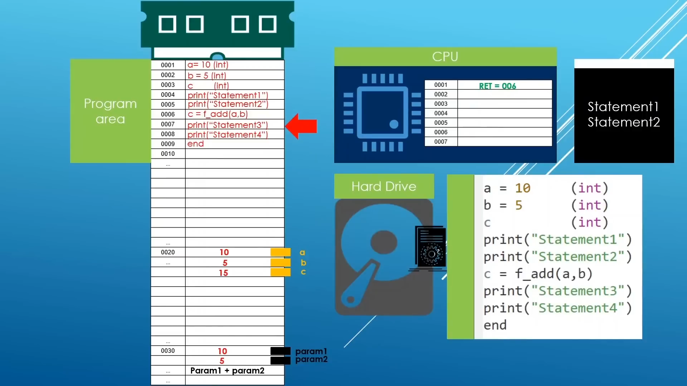

# Types of Languages

## Procedural
- Follows a top-down approach where tasks are executed one after another.
- Emphasizes on procedures or routines to accomplish tasks.
- Modifies the program's state using variables and statements.

## Functional
- Writing a program only in pure functions, ie never modify variables, only create new ones as an output.
- Emphasizes on functions as the primary building blocks.
- Avoids mutable state and favors immutable data structures.
- Supports higher-order functions and encourages declarative programming style.
- First-class functions: Using a function like a variable. Python implements First-class functions.


## Object-Oriented
- Organizes code into objects, which encapsulate data and behavior.
- Supports concepts such as inheritance, polymorphism, and encapsulation.
- Promotes code reusability, modularity, and maintainability.

## Static & Dynamic Languages

|Parameter     | Static Languages                        | Dynamic Languages                        |
|--------------|-----------------------------------------|------------------------------------------|
| Type Checking| Compile-time                            | Runtime                                  |
| Variables    | Explicit declaration of data types      | No explicit declaration of data types   |
| Memory Allocation | Determined at compile-time           | Determined at runtime                    |
| Control      | More control     | Less control         |
| Examples     | C, C++, Java                            | Python, JavaScript, Ruby                 |

# Types of Memory
- There are 2 types of memory, stack & heap.
- Example: $a = 10$
    - `a` is stored in stack.
    - `10` is stored in heap.
    - `a` points to the address of `10`.
    - `a`: Referenced variables
    - `10`: Object, referenced by `a`.
    - If we then write $a="string"$, then:
        - `string` gets stored in heap,
        - `a` now points to `string`.
        - Now, nothing points to `10`, ie `10` is not referenced by anything.
    - From time to time, non-referenced objects in heap are cleaned up.
- $>1$ reference variables can point to the same object.
- If one of those reference variables alter the object, it is changed for all of them.

# C++

## Notes
- \<iostream\> components:
    - std::cout :- Print data to the Terminal/Console
    - std::cin :- Read data from the Terminal (without spaces). Space is used as an escape character.
    - std::getline(std::cin,var) :- Read data with spaces, from the Terminal.
    - std::string :- String data type
    - std::cerr :- Print errors to the Terminal/Console
    - std::clog :- Print log messages to the Terminal/Console
        > Errors & Logs are printed regardless of the occurence of an error. They are just used to format the message according to it's type.

- Define variables:
    ```cpp
    int firstNumber {3};
    int secondNumber = 4;
    ```

## How a program runs
- Sample code:
```cpp
#include <iostream>

int addNumbers(int number1, int number2) {
    return (number1+number2);
}

int main() {
    int first_number {3};  // Variable 1
    int second_number {7}; // Variable 2
    int c;
    
    std::cout << "First number: " << first_number << std::endl;
    std::cout << "Second number: " << second_number << std::endl;
    c = addNumbers(a,b);
    std::cout << "Sum: " << sumFunc(first_number,second_number) << std::endl;

    return 0;
}
```
<br>
Image taken from [here](https://youtu.be/8jLOx1hD3_o)
- Steps:
    1. The program is converted to binary, after compilation.
    1. When the binary is executed, it is copied to RAM line-by-line.
    1. For the function `addNumbers(a,b)` and input variables, it assigns a separate memory location on RAM.
    1. For Variable 1, it assigns a memory location with value `3` and points `first_number` to it.
    1. Same goes for `second_number`.
    1. Since `c` doesn't have a value, the CPU fills the location with garbage data.
    1. It prints the 2 strings.
    1. Next, it has to run the function `addNumbers(a,b)`. Before going to the function, it stores the current memory address of the code binary, so it can return to it once it's done executing the function.
    1. It goes ahead and runs the function.
    1. It takes the output of the function and returns back to same location it left.
    1. It prints the rest of the strings.
    1. Program execution is over.

## Terms:
- **Core Features**: The features that govern the functionality C++ provices, and the rules that we need to follow when using them.
    > data types, function definition, etc.
- **Standard Library**: A set of specialized reusable components that are ready to use, and provide added functionality to the program.
    > iostream, string (imported using `#include`)
- **STL**: A part of Standard Library. It is a collection of container types.
    > iterators

## Number Systems
### Binary
- Base 2
- If we have `n` digits, we can represent a total of $2^{n-1}$ decimel numbers.
- Examples:
    - $100101=1*2^5+1*0^4+0*2^3+1*2^2+0*2^1+1*2^0=37$
    - $10010=1*2^4+0*2^3+0*2^2+1*2^1+0*2^0=18$
- We add `Ob` in front to specify that it is a octal number. Example: $0b00110101$

### Decimel
- Base 10
- Examples:
    - $2371=2*10^3+3*10^2+7*10^1+1*10^0$
    - $924=9*10^2+2*10^1+4*10^0$
### Hexadecimel
- Base 16
- A Binary number is grouped to groups of 4 from the right, and then converted to hexadecimel.
- Example: $0x6E30F13F$
- 1-9 is represented as usual, and 10-15 is represented by A-F.
- Padding: When grouping numbers, if there are some missing digits in the left-most group, we add `0` to the missing places.
- We add `Ox` in front to specify that it is a hexadecimel number.

### Octal
- Base 8
- A Binary number is grouped to groups of 3 from the right, and then converted to octal.
- Example: $015614170477$
- We add `O` in front to specify that it is a octal number.


